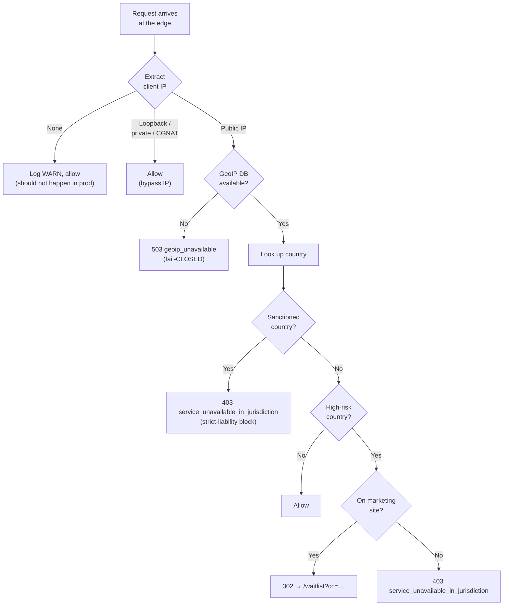

# Geographic restrictions

NullRun's edge gateway classifies every inbound request by source
country and applies one of three actions:

- **Allow** — request proceeds normally.
- **Hard block** — request is rejected with **403**
  (`service_unavailable_in_jurisdiction`) or **503** (`geoip_unavailable`).
- **Waitlist redirect** — a compliance-blocked visitor on the marketing
  site is 302-redirected to `/waitlist` so the lead is captured without
  exposing the API surface.

The classification happens before authentication and before
per-account quota checks, so blocked traffic never touches the database.

## Why this is needed

GDPR Art. 3 and the CJEU Planet49 ruling (C-673/17) turn on whether
the operator is "offering goods or services" to, or "monitoring", EU
data subjects. A Terms-of-Service clause alone is not enough — a
regulator will infer targeting from the fact that the API endpoint is
reachable from EU IP space. Hard-blocking at the edge is the only
reliable signal.

The same logic applies to the other comprehensive-sanctions regimes
(OFAC, EU, UK, UN) for the sanctioned-country blocklist. Those are
**strict-liability**: a single accepted signup or payment from one of
those jurisdictions is a criminal-law violation, not a civil one.

## Blocklist

The blocklist has two tiers.

### Tier 1 — Sanctioned (strict-liability block)

| Code | Country | Rationale |
| --- | --- | --- |
| `RU` | Russia | OFAC + EU + UK comprehensive |
| `IR` | Iran | OFAC comprehensive |
| `KP` | DPRK | OFAC + UN comprehensive |
| `SY` | Syria | OFAC + EU comprehensive |
| `CU` | Cuba | OFAC comprehensive |
| `BY` | Belarus | Post-2022 UK + EU sectoral |
| `VE` | Venezuela | Partial — block at signup, allow read-only API |
| `MM` | Myanmar | OFAC + EU restrictive measures |
| `AF` | Afghanistan | Post-2021 sanctions regime |
| `ZW` | Zimbabwe | OFAC selective sanctions |

Sanctioned requests are blocked with **403** even on the marketing
site — no waitlist, no email capture. Strict liability does not allow
the "we will email you when we do" bridge.

### Tier 2 — High-risk / no-service (compliance block)

| Code | Region | Rationale |
| --- | --- | --- |
| `AT BE BG HR CY CZ DK EE FI FR DE GR HU IE IT LV LT LU MT NL PL PT RO SK SI ES SE` | EU-27 | GDPR + active enforcement |
| `IS NO LI` | EEA / EFTA | Treated like EU for our purposes |
| `CH` | Switzerland | FADP — high compliance burden |
| `GB` | United Kingdom | UK GDPR + ICO + class actions |
| `US CA` | United States / Canada | CCPA + state patchwork |
| `CN` | China | PIPL + data localisation |
| `IN` | India | DPDPA 2023 + criminal penalties for officers |

For high-risk countries:

- **`/api/*` and `/ws/*`** → 403 `service_unavailable_in_jurisdiction`
- **Marketing site** (anything NOT under `/api/` or `/ws/`) → 302 to
  `/waitlist?cc=<ISO>`.

## Decision matrix



## Fail-CLOSED posture

The geo-block is **fail-CLOSED**: if the GeoIP database is missing,
unreadable, or returns an error, **all** ingress is rejected with
**503**. The rationale:

> If the GeoIP database is missing or unreadable, ALL ingress is
> rejected (503) so the operator notices the misconfiguration.

The error log line you should watch for is
`fortress: GeoIP database unavailable` — its appearance is the first
signal that the `.mmdb` file needs to be restored.

A previous version silently allowed traffic when the database was
missing, which caused a production 503-storm on 2026-06-30 until the
operator pin mounted the database into the container so it survives
redeploys.

## Operator overrides

!!! warning "These are escape hatches. Production must never set them."

| Env var | Effect | When to use |
| --- | --- | --- |
| `NULLRUN_GEOBLOCK_DISABLED=1` | Disables the geo-block entirely. One-shot WARN is logged on first request. | Local development only. Never set in production. |
| `NULLRUN_GEOIP_DB=/path/to/file.mmdb` | Override the path to the MaxMind database. Default: `data/GeoLite2-Country.mmdb` (relative to container CWD). | VPS / staging deployments where the operator supplies the file. |

The `NULLRUN_GEOBLOCK_DISABLED=1` flag is the most dangerous knob in
the gateway — it is a **fail-OPEN** setting on a regulatory control.
The middleware emits the WARN exactly once per process to surface the
misconfiguration without flooding the log.

## What is bypassed

The geo-block **never** blocks:

- **Localhost and private IPs** — `127.0.0.0/8`, `10/8`, `172.16/12`,
  `192.168/16`, `169.254/16`, `100.64.0.0/10` (CGNAT), IPv6
  `fc00::/7` (ULA), `fe80::/10` (link-local). These are pod-to-pod
  traffic, monitoring agents, or the operator's local-dev loopback;
  none of them can themselves trigger GDPR.
- **Health and metrics** — `/health`, `/healthz`, `/ready`, `/readyz`,
  `/metrics`, `/internal/*`. These are infrastructure-internal probes
  and must never be geo-blocked.
- **The waitlist endpoint** — `POST /api/v1/waitlist`. The marketing
  site redirects compliance-blocked visitors here; if the geo-block
  then 403'd the form POST, the lead-capture flow would be broken.
  The waitlist has its own rate limit of 5 submissions per hour per IP.

## Audit headers

Every blocked response carries two headers for observability and
debugging:

| Header | Meaning |
| --- | --- |
| `x-nullrun-fortress-block: sanctions` | Blocked by the Tier-1 sanctions list. |
| `x-nullrun-fortress-block: waitlist` | Marketing-site redirect to `/waitlist`. |
| `x-nullrun-fortress-country: <ISO>` | The resolved ISO 3166-1 alpha-2 country code. Absent when the GeoIP database is unavailable. |

These headers are **not** logged at INFO level (the country code is
PII under GDPR, ironically) — they appear at WARN.

## Runbook — VPS deploy

This is the operator recipe for keeping the GeoIP database live in
production.

1. **Download the database.** A free MaxMind license key is required:
   <https://www.maxmind.com/en/geolite2/signup>.

    ```bash
    curl -L "https://download.maxmind.com/app/geoip_download?\
edition_id=GeoLite2-Country&license_key=$MAXMIND_LICENSE_KEY&suffix=tar.gz" \
        -o /tmp/geolite2.tar.gz
    mkdir -p /opt/nullrun/backend/data
    tar -xzf /tmp/geolite2.tar.gz -C /tmp/
    mv /tmp/GeoLite2-Country_*/GeoLite2-Country.mmdb \
        /opt/nullrun/backend/data/
    rm -rf /tmp/GeoLite2-Country_*
    ```

2. **Pin the path.** The `docker-compose.yml` already declares:

    ```yaml
    environment:
      NULLRUN_GEOIP_DB: /tmp/geoip/GeoLite2-Country.mmdb
    volumes:
      - /opt/nullrun/backend/data:/tmp/geoip:ro
    ```

    The bind-mount is **read-only** and pins the path so the
    `data/GeoLite2-Country.mmdb` lookup resolves to the
    operator-supplied file.

3. **Restart the gateway.** Until in-process hot-reload lands, a
   fresh `docker compose up -d` is required to pick up a new `.mmdb`.

4. **Verify.** From a known EU IP: `curl -i https://api.nullrun.io/healthz`
   should be 200, and `curl -i https://api.nullrun.io/api/v1/auth/register`
   should be 403 with `x-nullrun-fortress-block: sanctions` or
   `service_unavailable_in_jurisdiction` in the body.

5. **Schedule weekly refresh.** A weekly cron is recommended. The
   GeoIP allocation drift is slow (weeks), but OFAC/EU/UK SDN lists
   move faster — see [Sanctions screening](sanctions-screening.md).