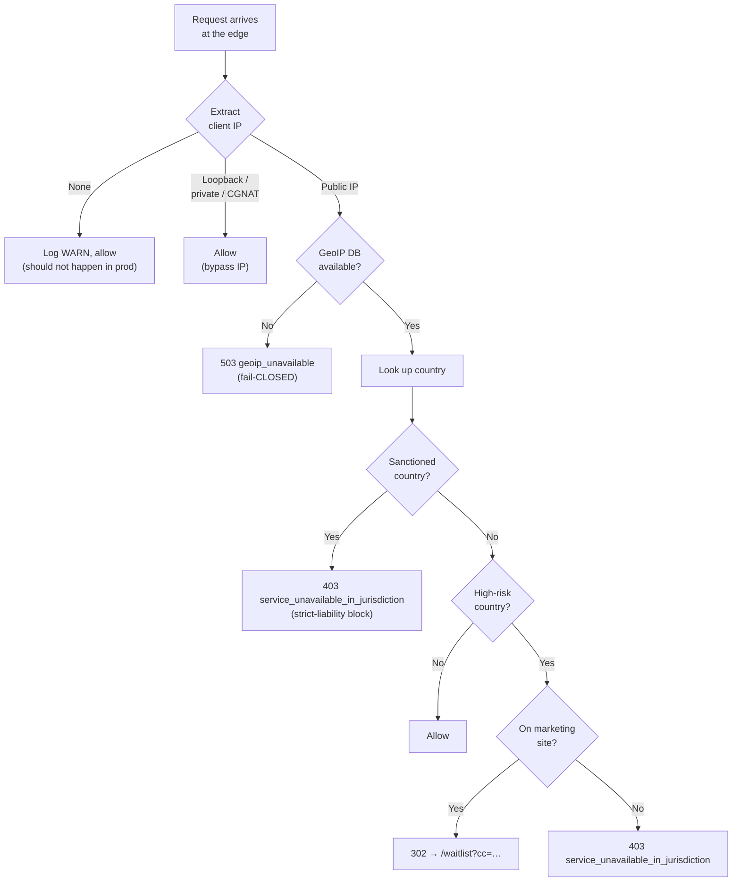

title: Geographic restrictions
maturity: stable
description: IP-level blocklists for sanctioned jurisdictions, with the runtime status codes a client sees when a request is geo-blocked.
# Geographic restrictions

NullRun's edge gateway classifies every inbound request by source
country and applies one of three actions:

- **Allow** — request proceeds normally.
- **Hard block** — request is rejected with **403**
  (`service_unavailable_in_jurisdiction`) or **503** (`geoip_unavailable`).
- **Waitlist redirect** — a compliance-blocked visitor on the marketing
  site is 302-redirected to `/waitlist` so the lead is captured without
  exposing the API surface.

The classification happens before authentication and before
per-account quota checks, so blocked traffic never touches the database.

## Why this is needed

Sanctions violations are strict-liability; see legal review for full
rationale. A Terms-of-Service clause alone is not enough — a regulator
will infer targeting from the fact that the API endpoint is reachable
from a sanctioned IP space. Hard-blocking at the edge is the only
reliable signal.

The same logic applies to the other comprehensive-sanctions regimes
(OFAC, EU, UK, UN) for the sanctioned-country blocklist. A single
accepted signup or payment from one of those jurisdictions is a
criminal-law violation, not a civil one.

## Blocklist

The blocklist has two tiers.

### Tier 1 — Sanctioned (strict-liability block)

| Code | Country | Rationale |
| --- | --- | --- |
| `RU` | Russia | OFAC + EU + UK comprehensive |
| `IR` | Iran | OFAC comprehensive |
| `KP` | DPRK | OFAC + UN comprehensive |
| `SY` | Syria | OFAC + EU comprehensive |
| `CU` | Cuba | OFAC comprehensive |
| `BY` | Belarus | Post-2022 UK + EU sectoral |
| `VE` | Venezuela | Partial — signups blocked; existing read-only API access preserved (write operations blocked) |
| `MM` | Myanmar | OFAC + EU restrictive measures |
| `AF` | Afghanistan | Post-2021 sanctions regime |
| `ZW` | Zimbabwe | OFAC selective sanctions |

Sanctioned requests are blocked with **403** even on the marketing
site — no waitlist, no email capture. Strict liability does not allow
the "we will email you when we do" bridge.

### Tier 2 — High-risk / no-service (compliance block)

| Code | Region | Rationale |
| --- | --- | --- |
| `AT BE BG HR CY CZ DK EE FI FR DE GR HU IE IT LV LT LU MT NL PL PT RO SK SI ES SE` | EU-27 | GDPR + active enforcement |
| `IS NO LI` | EEA / EFTA | Treated like EU for our purposes |
| `CH` | Switzerland | FADP — high compliance burden |
| `GB` | United Kingdom | UK GDPR + ICO + class actions |
| `US CA` | United States / Canada | CCPA + state patchwork |
| `CN` | China | PIPL + data localisation |
| `IN` | India | DPDPA 2023 + criminal penalties for officers |

For high-risk countries:

- **`/api/*` and `/ws/*`** → 403 `service_unavailable_in_jurisdiction`
- **Marketing site** (anything NOT under `/api/` or `/ws/`) → 302 to
  `/waitlist?cc=<ISO>`.

## Decision matrix

```mermaid
flowchart TD
    R["Request arrives<br/>at the edge"] --> E{"Extract<br/>client IP"}
    E -->|None| L["Log WARN, allow<br/>(should not happen in prod)"]
    E -->|Loopback /<br/>private / CGNAT| L2["Allow<br/>(bypass IP)"]
    E -->|Public IP| B{"GeoIP DB<br/>available?"}
    B -->|No| H["503 geoip_unavailable<br/>(fail-CLOSED)"]
    B -->|Yes| L3["Look up country"]
    L3 --> S{"Sanctioned<br/>country?"}
    S -->|Yes| H2["403 service_unavailable_in_jurisdiction<br/>(strict-liability block)"]
    S -->|No| H3{"High-risk<br/>country?"}
    H3 -->|No| A["Allow"]
    H3 -->|Yes| P{"On marketing<br/>site?"}
    P -->|Yes| W["302 → /waitlist?cc=…"]
    P -->|No| H4["403 service_unavailable_in_jurisdiction"]
```

## Fail-CLOSED posture

The geo-block is **fail-CLOSED**: if the GeoIP database is missing,
unreadable, or returns an error, **all** ingress is rejected with
**503**. The rationale:

> If the GeoIP database is missing or unreadable, ALL ingress is
> rejected (503) so the operator notices the misconfiguration.

## Operator overrides

Geo-block posture is operator-controlled at the platform level; users
cannot override it.

## What is bypassed

The geo-block **never** blocks:

- **Localhost and private IPs** — `127.0.0.0/8`, `10/8`, `172.16/12`,
  `192.168/16`, `169.254/16`, `100.64.0.0/10` (CGNAT), IPv6
  `fc00::/7` (ULA), `fe80::/10` (link-local). These are pod-to-pod
  traffic, monitoring agents, or the operator's local-dev loopback;
  none of them can themselves trigger GDPR.
- **Health and metrics** — `/health`, `/healthz`, `/ready`, `/readyz`.
  These are infrastructure-internal probes and must never be
  geo-blocked.
- **The waitlist endpoint** — `POST /api/v1/waitlist`. The marketing
  site redirects compliance-blocked visitors here; if the geo-block
  then 403'd the form POST, the lead-capture flow would be broken.
  The waitlist has its own rate limit of 5 submissions per hour per IP.

## Audit headers

Every blocked response carries two headers for observability and
debugging:

| Header | Meaning |
| --- | --- |
| `x-nullrun-fortress-block: sanctions` | Blocked by the Tier-1 sanctions list. |
| `x-nullrun-fortress-block: waitlist` | Marketing-site redirect to `/waitlist`. |
| `x-nullrun-fortress-country: <ISO>` | The resolved ISO 3166-1 alpha-2 country code. Absent when the GeoIP database is unavailable. |

These headers are **not** logged at INFO level (the country code is
PII under GDPR) — they appear at WARN.

## Runbook — keeping the GeoIP database live

The NullRun team maintains the GeoIP database; contact support if
geo-block seems misclassified.
