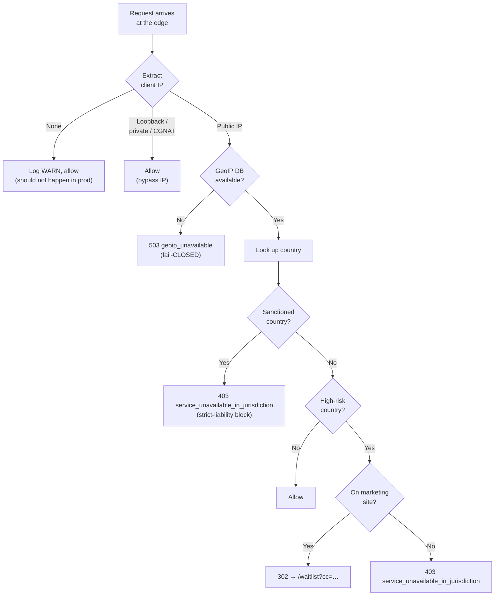

title: Geographic restrictions
maturity: stable
description: IP-level blocklists for sanctioned jurisdictions, with the runtime status codes a client sees when a request is geo-blocked.
# Geographic restrictions

NullRun's edge gateway classifies every inbound request by source
country and applies one of three actions:

- **Allow** — request proceeds normally.
- **Hard block** — request is rejected with **403**
  (`service_unavailable_in_jurisdiction`) or **503** (`geoip_unavailable`).
- **Waitlist redirect** — a compliance-blocked visitor on the marketing
  site is 302-redirected to `/waitlist` so the lead is captured without
  exposing the API surface.

The classification happens before authentication and before
per-account quota checks, so blocked traffic never touches the database.

## Why this is needed

Sanctions violations are strict-liability; see legal review for full
rationale. A Terms-of-Service clause alone is not enough — a regulator
will infer targeting from the fact that the API endpoint is reachable
from a sanctioned IP space. Hard-blocking at the edge is the only
reliable signal.

The same logic applies to the other comprehensive-sanctions regimes
(OFAC, EU, UK, UN) for the sanctioned-country blocklist. A single
accepted signup or payment from one of those jurisdictions is a
criminal-law violation, not a civil one.

## Blocklist

The blocklist has two tiers.

### Tier 1 — Sanctioned (strict-liability block)

| Code | Country | Rationale |
| --- | --- | --- |
| `RU` | Russia | OFAC + EU + UK comprehensive |
| `IR` | Iran | OFAC comprehensive |
| `KP` | DPRK | OFAC + UN comprehensive |
| `SY` | Syria | OFAC + EU comprehensive |
| `CU` | Cuba | OFAC comprehensive |
| `BY` | Belarus | Post-2022 UK + EU sectoral |
| `VE` | Venezuela | Partial — signups blocked; existing read-only API access preserved (write operations blocked) |
| `MM` | Myanmar | OFAC + EU restrictive measures |
| `AF` | Afghanistan | Post-2021 sanctions regime |

Sanctioned requests are blocked with **403** even on the marketing
site — no waitlist, no email capture. Strict liability does not allow
the "we will email you when we do" bridge.

### Tier 2 — High-risk / no-service (compliance block)

| Code | Region | Rationale |
| --- | --- | --- |
| `AT BE BG HR CY CZ DK EE FI FR DE GR HU IE IT LV LT LU MT NL PL PT RO SK SI ES SE` | EU-27 | GDPR + active enforcement |
| `IS NO LI` | EEA / EFTA | Treated like EU for our purposes |
| `CH` | Switzerland | FADP — high compliance burden |
| `GB` | United Kingdom | UK GDPR + ICO + class actions |
| `CN` | China | PIPL + data localisation |
| `IN` | India | DPDPA 2023 + criminal penalties for officers |

For high-risk countries:

- **`/api/*` and `/ws/*`** → 403 `service_unavailable_in_jurisdiction`
- **Marketing site** (anything NOT under `/api/` or `/ws/`) → 302 to
  `/waitlist?cc=<ISO>`.

## Decision matrix

```mermaid
flowchart TD
    R["Request arrives<br/>at the edge"] --> E{"Extract<br/>client IP"}
    E -->|None| L["Log WARN, allow<br/>(should not happen in prod)"]
    E -->|Loopback /<br/>private / CGNAT| L2["Allow<br/>(bypass IP)"]
    E -->|Public IP| B{"GeoIP DB<br/>available?"}
    B -->|No| H["503 geoip_unavailable<br/>(fail-CLOSED)"]
    B -->|Yes| L3["Look up country"]
    L3 --> S{"Sanctioned<br/>country?"}
    S -->|Yes| H2["403 service_unavailable_in_jurisdiction<br/>(strict-liability block)"]
    S -->|No| H3{"High-risk<br/>country?"}
    H3 -->|No| A["Allow"]
    H3 -->|Yes| P{"On marketing<br/>site?"}
    P -->|Yes| W["302 → /waitlist?cc=…"]
    P -->|No| H4["403 service_unavailable_in_jurisdiction"]
```

## Fail-CLOSED posture

The geo-block is **fail-CLOSED**: if the GeoIP database is missing,
unreadable, or returns an error, **all** ingress is rejected with
**503**. The rationale:

> If the GeoIP database is missing or unreadable, ALL ingress is
> rejected (503) so the operator notices the misconfiguration.

## Operator overrides

Geo-block posture is operator-controlled at the platform level; users
cannot override it.

## What is bypassed

The geo-block **never** blocks:

- **Localhost and private IPs** — `127.0.0.0/8`, `10/8`, `172.16/12`,
  `192.168/16`, `169.254/16`, `100.64.0.0/10` (CGNAT), IPv6
  `fc00::/7` (ULA), `fe80::/10` (link-local). These are pod-to-pod
  traffic, monitoring agents, or the operator's local-dev loopback;
  none of them can themselves trigger GDPR.
- **Health and metrics** — `/health`, `/healthz`, `/ready`, `/readyz`.
  These are infrastructure-internal probes and must never be
  geo-blocked.
- **The waitlist endpoint** — `POST /api/v1/waitlist`. The marketing
  site redirects compliance-blocked visitors here; if the geo-block
  then 403'd the form POST, the lead-capture flow would be broken.
  The waitlist has its own rate limit of 5 submissions per hour per IP.

## Audit headers

Every blocked response carries two headers for observability and
debugging:

| Header | Meaning |
| --- | --- |
| `x-nullrun-fortress-block: sanctions` | Blocked by the Tier-1 sanctions list. |
| `x-nullrun-fortress-block: waitlist` | Marketing-site redirect to `/waitlist`. |
| `x-nullrun-fortress-country: <ISO>` | The resolved ISO 3166-1 alpha-2 country code. Absent when the GeoIP database is unavailable. |

These headers are **not** logged at INFO level (the country code is
PII under GDPR) — they appear at WARN.

## Runbook — keeping the GeoIP database live

The NullRun team maintains the GeoIP database; contact support if
geo-block seems misclassified.

## Deep dive

### Mechanism
The geo-block middleware lives at `backend/src/proxy/middleware/geo_block.rs`. The constant `SANCTIONED` (lines 64-74) holds 9 comprehensive-sanctions codes (RU/IR/KP/SY/CU/BY/VE/MM/AF); `HIGH_RISK_NO_SERVICE` (lines 76-86) holds 30+ codes (EU-27 + EEA/EFTA + CH + GB + CN + IN). The middleware (`fortress_geo_block_middleware`, line 588) runs the request through five steps: (1) `geo_block_disabled()` env-var check (lines 457-462); (2) `is_bypass_path(path)` to allow health/webhook/etc. (lines 473-579); (3) `extract_client_ip` with the trust-proxy chain (lines 374-455) honouring `TRUSTED_PROXY_CIDRS`; (4) `GeoBlocker::lookup(ip)` via MaxMind GeoLite2 (lines 167-228) with 24h DashMap cache; (5) `Lookup::action()` mapping to `Allow | BlockSanctioned | BlockHighRisk | RedirectToWaitlist | AllowPrivate` (lines 277-298). On a blocked match, the response carries `x-nullrun-fortress-block: sanctions|waitlist|<code>` and `x-nullrun-fortress-country: <ISO>` headers (constants at lines 582-583). The path-aware redirect is order-dependent: SANCTIONED-tier visitors on the marketing surface get 302 → `/jurisdiction-blocked` (line 728-750) — no lead capture for strict-liability jurisdictions.

### Guarantees
- **Fail-CLOSED on missing GeoIP DB**: 503 `geoip_unavailable` when `MaxMindDBError` propagates from `lookup()` (`geo_block.rs`). The operator notices the misconfiguration because ALL ingress is rejected.
- **Fail-CLOSED on unparseable peer IP**: 403 `client_ip_unresolvable` — the post-NR-124 fix closes the 2026-07-08 sanctions bypass where private bridge IPs fell through to `AllowPrivate` (`geo_block.rs`). Per CLAUDE.md §4, enforcement paths fail-CLOSED by default.
- **Marketing-site bridge**: HIGH-RISK visitors on the WWW marketing site get 302 → `/waitlist?cc=<ISO>` (line 807-841); API/ws paths get 403 `service_unavailable_in_jurisdiction` (line 796). SANCTIONED-tier visitors on the marketing surface get 302 → `/jurisdiction-blocked` — no lead capture.
- **Trust-proxy chain**: `TRUSTED_PROXY_CIDRS` configures which peers can inject XFF; an XFF from an untrusted peer is treated as attacker-controlled and ignored. Single-binary deployment default is empty (no proxies trusted) — production `ENVPROD_FILE` must include the nginx bridge (`172.18.0.0/16` default per `infra/docker-compose.prod.yml`).
- **Headers carry country code at WARN only**: country code is PII under GDPR; logged at WARN level, never INFO (`geo_block.rs`).
- **Source-pin tests pin the bypass list**: `us_and_ca_not_in_high_risk_list` (after 2026-09-16 opening) and `high_risk_list_includes_eu_china_india_uk` (lines 879-895) prevent silent blocklist drift.

### Patterns
- **Two-tier blocklist**: Tier 1 `SANCTIONED` (comprehensive sanctions, 403 only — no waitlist even on marketing site); Tier 2 `HIGH_RISK_NO_SERVICE` (GDPR + CCPA + PIPL + DPDPA, 403 on /api/ws, 302→/waitlist on marketing).
- **Three-step request flow**: `extract_client_ip` (with XFF chain) → `GeoBlocker::lookup` (MaxMind, cached) → `Lookup::action` (blocklist match). Each step is independently testable; failures fail CLOSED.
- **24h MaxMind cache** (`geo_block.rs`): bounded DashMap keyed by `IpAddr`, leaked `&'static str` per ISO code — bounded to ~250 codes × ~3 bytes ≈ 750 bytes total. Avoids per-call `Box::leak` that accumulated GB-scale over a year at moderate load.
- **Fortress waitlist bypass**: `WAITLIST_PATH = "/api/v1/waitlist"` is the only carve-out for `BlockHighRisk` (`geo_block.rs`); SANCTIONED-tier IPs are NOT bypassed there. Order-dependent: the bypass arm runs AFTER `lookup.action()` so a code refactor that changes the order would re-open the bypass.

### Approaches
The decision to make sanctions strict-liability and HIGH_RISK compliance is encoded at the wire (403 vs 302). Strict-liability jurisdictions have no lead-capture bridge — a regulator's view of "we will email you when we do" is not enough for OFAC/EU/UK/UN comprehensive-sanctions regimes.

The trust-proxy model rejects XFF from non-trusted peers because the 2026-07-08 incident showed that a sanctioned-jurisdiction VPN signup reached `auth_register_handler` when the nginx container IP fell into `AllowPrivate`. The BFF→backend hop (single-entry XFF) is also handled (`geo_block.rs`) so the BFF container IP doesn't cause false classification on the docker bridge.

US/CA were removed from `HIGH_RISK_NO_SERVICE` on 2026-09-16 (`geo_block.rs` comment): CCPA thresholds (>$25.5M revenue, 100k+ consumers, 50%+ revenue from data sales) are not met at the current zero-customer stage. This is intentional but revisitable when revenue crosses the threshold.

### Limitations
- **US/CA opened 2026-09-16**: this is a posture choice for the zero-customer stage. The `us_and_ca_not_in_high_risk_list` source test catches a future regression but the negative assertion would need to be inverted when US/CA need to be re-added.
- **CGNAT bypass**: 100.64.0.0/10 is in the bypass list for CGNAT ranges. A sanctioned-jurisdiction residential CGNAT user could route through it; the secondary name/email screen is the catch for sanctioned jurisdictions.
- **OAuth callback bypass is provisional** (`geo_block.rs`): sanctioned-jurisdiction visitors can complete OAuth via the BFF until the BFF carries XFF. The durable fix is to have the BFF pass `X-Forwarded-For` carrying the user IP captured during OAuth init.
- **Waitlist endpoint bypass is order-dependent**: only runs AFTER `lookup.action()` classifies the country (`geo_block.rs`). A code refactor that changes the order would re-open the bypass.
- **GeoIP database downloaded separately** (`backend/data/README.md`): missing the file is a launch blocker; the middleware logs an ERROR but boots — `geo_block.rs`. Operators must monitor the startup log.
- **Polar / Slack / Telegram webhooks bypass geo-block**: HMAC-authenticated, not IP-authenticated. A blocked egress (Polar's egress is US, currently opened) would 403 every paid upgrade; signature verification is the authoritative identity gate (`geo_block.rs`).
