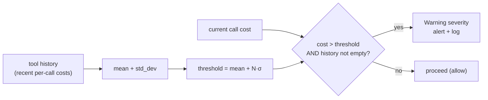
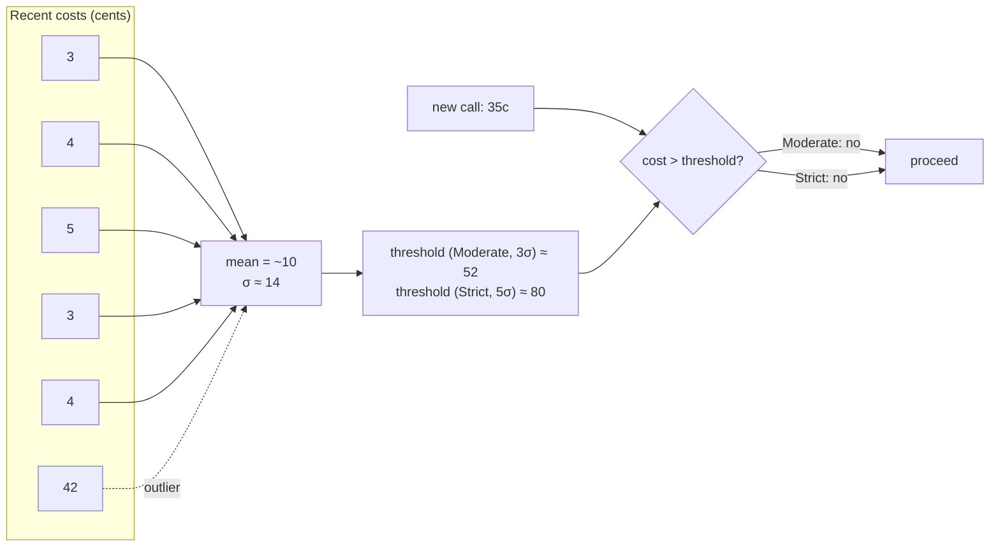
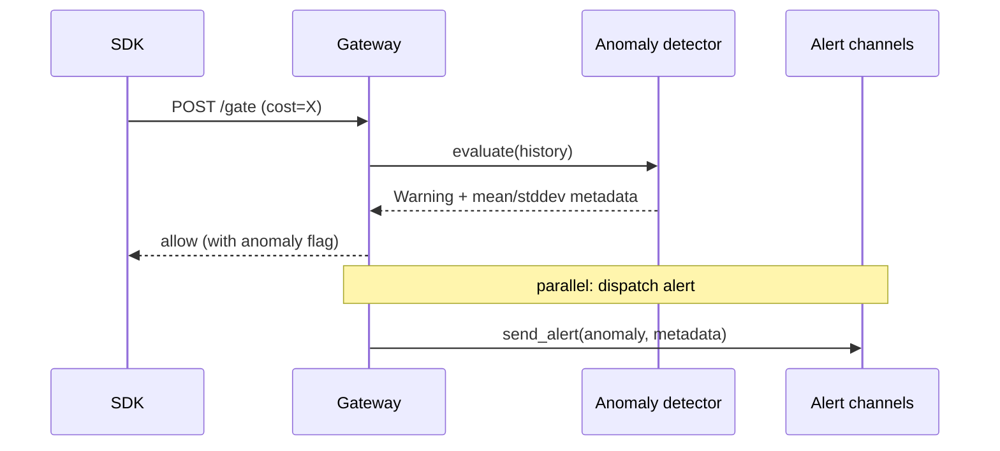

# Anomaly detection

The anomaly detector catches **cost outliers** within a workflow —
single calls that are wildly more expensive than the running mean,
even when total spend is still well under the budget cap.

## Why it's needed

A budget cap stops a runaway workflow. A rate limit stops a
flooding one. Neither stops an agent that suddenly issues a single
30,000-token LLM call when every prior call in the workflow used
3,000. The aggregate spend is fine; the individual event is
abnormal — and in most cases, that single event is a signal of
prompt injection, runaway recursion, or a misconfigured model
upgrade.

The anomaly detector fires on per-call **cost distribution shape**,
not on totals. It is the tripwire for "this one call doesn't look
like the others."

## How it works

For each gate / execute evaluation, the detector computes the
**mean** and **standard deviation** of recent per-call costs in
the workflow. It then checks whether the current call's cost
exceeds:

```
threshold = mean + (std_dev × multiplier)
```



The trigger fires only when there is a meaningful baseline
(`recent_costs.is_empty()` short-circuits to no-fire). On a brand-new workflow with one call, there is nothing to compare
against, so the first call never trips anomaly detection regardless
of mode.

### Cost distribution shape



In the example above, a 35c call after a history of 3–5c calls
might trip **Lite** (2σ ≈ 38) but not Moderate (3σ ≈ 52) or
Strict (5σ ≈ 80). The single 42c call (V6) only contributes to
the mean; it's not the trigger — the trigger is the *new* call
exceeding the threshold derived from the distribution.

## Modes

The σ multiplier is controlled by the policy's `anomaly_mode`
field. Three values are exposed:

| Mode | σ multiplier | Use when |
| --- | --- | --- |
| `Lite` | `2.0` | High call volume, expect natural variance (interactive agents, chat). |
| `Moderate` *(default)* | `3.0` | Mixed workloads. Balanced sensitivity. |
| `Strict` | `5.0` | High-stakes workflows; only fires on dramatic outliers. |

When `anomaly_mode = None`, the default applied is `Moderate`.

Legacy rows may store the raw σ as a number; the platform snaps it
back: `≤ 2.5 → Lite`, `2.5–4.0 → Moderate`, `> 4.0 → Strict`.

## What happens on detection

The detector returns a **Warning** severity. A Warning does **not**
pause or kill — it surfaces an alert through the configured
channels (Slack / Email / Webhook) and writes the event to the
workflow's audit log.



If you need anomaly detection to **block** rather than warn, pair
it with a `ToolBlock` policy that targets the specific tool name
— anomaly detection itself does not gate admission. See
[Tool policies](tool-policies.md) for the matching layer.

## Tuning

- Start with `Moderate` (3σ) on every workflow.
- If alerts fire too often on a chat-heavy workflow with high
  per-call variance, switch to `Strict` (5σ).
- If you suspect a real attack and want earlier warning, drop to
  `Lite` (2σ) — be ready for more false positives.
- Anomaly detection is per-workflow; org-wide anomalies are not
  detected today (a different detector for cross-workflow
  baselines is on the roadmap — see [index](../index.md)).

## See also

- [Loop detection](loop-detection.md) — companion detector for
  repetition patterns.
- [Policies](policies.md) — where `anomaly_mode` lives.
- [Budgets](budgets.md) — what anomaly detection does **not** do
  (cumulative spend).
- [Alert channels](../reference/http-api.md#alerts) — where the
  Warning surfaces.
