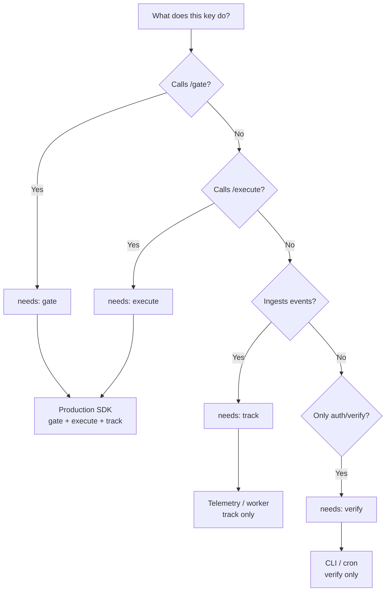
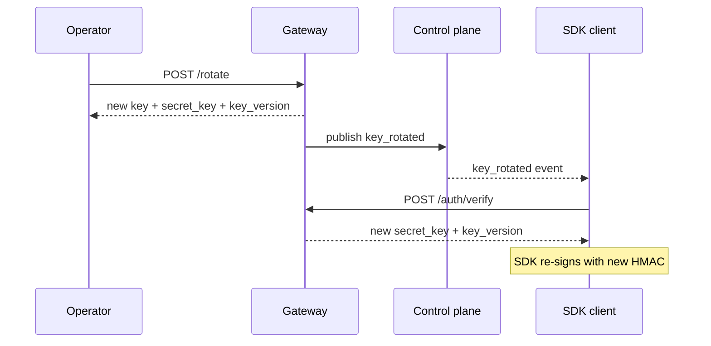

# API keys

An API key is how your code authenticates with the NullRun gateway.
It identifies a single workflow, defines which endpoints it can
call, and (optionally) expires on a date you choose.

Keys are workflow-scoped: every key belongs to exactly one
workflow, and the policy engine uses that binding to look up the
effective policy set on every gate / execute call. If a key's
workflow is deleted or paused, calls with that key fail closed.

## Creating a key

`POST /api/v1/orgs/:org_id/api-keys` — see
[HTTP API](../reference/http-api.md) for the full request / response
schema. The handler is `create_api_key_handler` in
`backend/src/proxy/http/api_keys.rs:243-549`.

| Field | Required | Notes |
| --- | --- | --- |
| `name` | optional | Default `"New API Key"`. Max 80 chars (`MAX_API_KEY_NAME`). Validated server-side (`validate_name_or_err` at `api_keys.rs:306-313`). |
| `workflow_id` | **required** | The workflow the key is bound to. Must belong to the same org. Missing → `400 workflow_id is required. Keys are workflow-scoped…`. |
| `scopes` | optional | Default `["track", "verify"]`. Restricted to `["gate", "execute", "track", "verify"]` — anything else → `400 invalid_scope`. Use `"*"` for the full set. |
| `expires_at` | optional | RFC 3339 timestamp. Must be in the future. `null` = never expires. |
| `test_key` | optional | Default `false`. `true` produces an `nr_test_…` prefix instead of `nr_live_…`. |

The response includes `key` (the raw `nr_live_…` / `nr_test_…`
string — shown **once**, store it now), `secret_key` (the HMAC
signing secret, also shown once), `key_prefix` (first 12 chars,
used in list views), `id`, and `workflow_id`. The raw values are
never returned again — losing them means rotating the key.

!!! warning "Plan quota"
    `plan_limits.api_keys_limit` caps how many keys an org can hold.
    Creating one over the cap returns `429 plan_limit_exceeded`. See
    the [Plans table](../index.md#plans) for per-plan numbers.

## Scopes

A scope is a permission grant for one of the four SDK endpoints.
Every call from your code goes to one of these — the key must hold
the matching scope or the gateway returns `403 missing_scope`.

```mermaid
flowchart LR
    K["API key<br/>scopes: gate, execute, track, verify"]
    G["POST /api/v1/gate<br/>(pre-flight probe)"]
    E["POST /api/v1/execute<br/>(budget reservation)"]
    T["POST /api/v1/track<br/>(cost / span events)"]
    V["POST /api/v1/auth/verify<br/>(rotation refresh)"]

    K --> G
    K --> E
    K --> T
    K --> V

    K -. "\"*\" wildcard" .-> G
    K -. "\"*\" wildcard" .-> E
    K -. "\"*\" wildcard" .-> T
    K -. "\"*\" wildcard" .-> V
```

| Scope | Endpoint | Purpose |
| --- | --- | --- |
| `gate` | `POST /api/v1/gate` | Pre-flight budget probe — returns `allow` / `block` / `approval_required` without reserving budget. |
| `execute` | `POST /api/v1/execute` | Full policy evaluation + budget reservation. Required for every `@protect`-decorated call. |
| `track` | `POST /api/v1/track`, `/api/v1/track/batch` | Async event ingestion (cost tokens, span lifecycle). |
| `verify` | `POST /api/v1/auth/verify` | SDK uses this on first start and after `key_rotated` events to obtain the HMAC `secret_key`. |

The `"*"` wildcard satisfies any scope check (`has_scope` in
`backend/src/auth/mod.rs:422-429`). The list endpoint shows each
key's effective scopes; an operator can narrow a key from `*` to
just `["execute", "track"]` without rotating it.

### Choosing scopes for a deployment



Production SDKs that wrap `@protect`-decorated calls almost always
want `["gate", "execute", "track"]`. A telemetry-only ingestor
needs `track`. `verify` is included in the default scope set so
the SDK can refresh its HMAC credential on rotation without an
extra round trip.

## Expiration and rotation

Keys do not expire automatically — the SDK and backend honour the
`expires_at` you set at create time. A key with `expires_at = null`
is valid until revoked.

To rotate:

1. `POST /api/v1/orgs/:org_id/api-keys/:id/rotate` returns a fresh
   `(key, secret_key)` pair and bumps `key_version`.
2. The gateway publishes a `key_rotated` event on the
   [control-plane WebSocket](control-plane.md).
3. Connected SDK clients call `/api/v1/auth/verify` to pick up the
   new credentials and re-sign subsequent requests.



A key with `expires_at` set will continue to be accepted up to and
including the timestamp; requests after that moment return
`401 api_key_expired`. Set `expires_at` for vendor credentials you
rotate on a fixed schedule (90 / 180 days is a common choice) and
let `rotate` carry the credential forward without code changes.

## Revocation

`DELETE /api/v1/orgs/:org_id/api-keys/:id` soft-deletes the key
row and invalidates the in-process policy cache
(`api_keys.rs:573-579`). The list endpoint then hides it from the
default view. Subsequent requests with that key return `401`
immediately.

Revocation is **immediate**: there is no grace period. If you need
zero-downtime rotation, use `rotate` instead — the old key stays
valid for a brief overlap window while the SDK picks up the new
one.

## Listing and searching

`GET /api/v1/orgs/:org_id/api-keys?search=substring` returns every
non-revoked key, filtered by case-insensitive substring match on
the `name` field. The response includes `key_prefix` (first 12
chars), `last_used_at`, `expires_at`, `workflow_id`, and the
masked row fields — never the raw key value.

`GET /api/v1/orgs/:org_id/workflows/:workflow_id/api-keys` returns
just the keys bound to a single workflow.

## Headers and HMAC

Keys travel as `X-API-Key: nr_live_…` (machine / SDK auth — see
`backend/src/proxy/middleware/auth.rs:82-85`). For request
integrity the SDK also computes an HMAC-SHA256 over
`timestamp + ":" + api_key + ":" + body_hash` using `secret_key`
as the key (verification at `handlers.rs:2604-2651`). `Bearer`
tokens are reserved for user (session) auth and are not used for
API keys.

## See also

- [Workflow context](workflow.md) — what the key's `workflow_id`
  binds to.
- [Policies](policies.md) — what scopes / keys gate.
- [Control plane](control-plane.md) — `key_rotated` event.
- [HTTP API](../reference/http-api.md) — full endpoint schemas.
- [Configuration](../getting-started/configuration.md) —
  `NULLRUN_SKIP_BUDGET_CHECK`, `NULLRUN_POLICY_FAIL_OPEN`.
