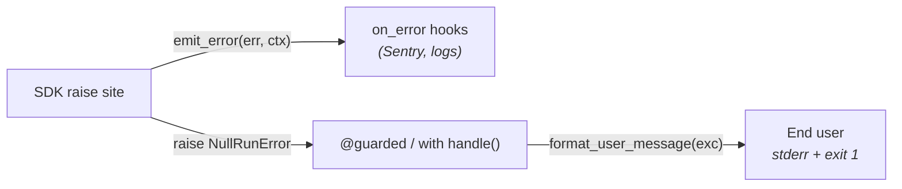

# Error handling

The SDK reports failures through a **three-layer model**. Each layer
answers a different question for a different audience, and the
boundary between "what NullRun tells the developer" and "what the
developer tells their end users" is explicit.

This page describes that model end-to-end. For the catalogue of
specific `error_code` values, see [Reference → Error codes](../reference/errors.md).

## The three layers



| Layer | Who consumes it | What it sees | Purpose |
|---|---|---|---|
| **1. Structured exception** | The developer's Python code | `error_code`, `user_action`, `retryable`, `docs_url`, plus per-class fields (`retry_after`, `workflow_id`, …) | Machine-readable signal: what failed and what to do. |
| **2. `on_error` hook** | Operator dashboards, Sentry, log aggregator | `(err, ctx)` — the same exception plus `ErrorContext(stage, workflow_id, tool_name, api_key_prefix, correlation_id, extra, timestamp)` | Observability: structured fields forwarded to your tooling **before** the exception propagates. |
| **3. `format_user_message` / `@guarded`** | The end user | One short, friendly sentence from the SDK catalog — no internal jargon, no URLs | What the user actually reads on stderr or in your UI. |

The same `NullRunError` passes through all three layers in order. The
developer chooses how much of each to wire up; the SDK does the rest.

## Layer 1 — structured exceptions (for the developer)

Every user-facing SDK exception inherits from `NullRunError` and
carries four structured fields:

```python
exc.error_code    # "NR-R001"            — stable identifier
exc.user_action   # "Wait 30s, then…"   — imperative hint
exc.retryable     # True                 — backoff-retry makes sense?
exc.docs_url      # "https://…"          — per-code docs page
```

Specialised subclasses add their own fields:

| Class | `error_code` | Extra fields |
|---|---|---|
| `RateLimitError` | `NR-R001` | `.retry_after` (s), `.upgrade_url`, `.body` |
| `NullRunBlockedException` (and subclasses) | `NR-X001` / `NR-B004` / `NR-T001` | `.workflow_id`, `.reason`, `.action`, `.tool_name` |
| `NullRunBackendError` | `NR-B002` | (inherits `.source`, `.endpoint`, `.details`) |
| `NullRunTransportError` | `NR-B001` | `.source` (`NETWORK_ERROR` / `GATEWAY_ERROR` / `BREAKER_OPEN` / `AUTH_ERROR`), `.endpoint`, `.details` |

These are **developer-facing**. The user does not see them unless the
developer decides to forward them.

## Layer 2 — the `on_error` hook (for observability)

`nullrun.on_error(hook)` registers a callback that fires for every
`NullRunError` **before** it propagates. The hook sees the structured
exception plus an `ErrorContext` describing where in the lifecycle the
failure happened.

```python title="on_error_example.py"
import logging
import nullrun

log = logging.getLogger(__name__)

@nullrun.on_error
def _to_log(err: nullrun.NullRunError, ctx: nullrun.ErrorContext) -> None:
    log.warning(
        "NullRun error",
        extra={
            "error_code": err.error_code,
            "retryable": err.retryable,
            "user_action": err.user_action,
            "stage": ctx.stage,
            "workflow_id": ctx.workflow_id,
            "tool_name": ctx.tool_name,
            "correlation_id": ctx.correlation_id,
        },
    )
```

What the hook does **not** fire for:

- `WorkflowKilledInterrupt` (`BaseException`) — kill is a signal, not
  an error. Catching kill in a global hook would defeat the kill
  contract.
- Non-`NullRunError` exceptions — those are SDK bugs or your bugs.
- Re-raises inside an `except` block — the hook fires exactly once
  per error.

Multiple hooks fire in registration order. Hook exceptions are caught
and logged at DEBUG (silent at INFO/CRITICAL) so a misbehaving hook
does not break production.

## Layer 3 — `format_user_message` and `@guarded` (for the end user)

The SDK owns a **catalog of friendly wording** for every `error_code`.
`nullrun.format_user_message(exc)` returns the end-user-safe string:

```python title="format_user_message_example.py"
import nullrun

@nullrun.protect
def my_agent(prompt):
    return call_llm(prompt)

try:
    reply = my_agent("hello")
except nullrun.NullRunError as exc:
    # One line, end-user-safe, no internal URLs, no jargon.
    return nullrun.format_user_message(exc)
```

For scripts that just want to run an agent and exit cleanly, the
default is **zero lines** of error handling:

```python title="minimal_boilerplate.py"
import nullrun
from nullrun import init_or_die, guarded, protect, shutdown
from openai import OpenAI

init_or_die(api_key="nr_live_...")     # exits cleanly if api_key missing
client = OpenAI()

@guarded                              # catches NullRunError, prints
@protect                              # format_user_message, sys.exit(1)
def my_agent(prompt):
    return client.chat.completions.create(
        model="gpt-4o-mini",
        messages=[{"role": "user", "content": prompt}],
    ).choices[0].message.content

if __name__ == "__main__":
    try:
        print(my_agent("hello"))
    finally:
        shutdown()
```

What this gives the user on a `RateLimitError`:

```text
$ python minimal_boilerplate.py
Too many requests. Please wait a moment and try again.
$ echo $?
1
```

No traceback. No internal URLs. One sentence in the catalog
(`messages.py`).

## The boundary: developer vs end user

```text
┌──────────────────────────────────────────────────────────────┐
│ SDK NullRun                                                  │
│                                                              │
│   raise RateLimitError(error_code="NR-R001",                 │
│                        retryable=True,                       │
│                        retry_after=30, …)                    │
│                                                              │
└──────────────────────┬───────────────────────────────────────┘
                       │ exception propagates
                       ▼
┌──────────────────────────────────────────────────────────────┐
│ @nullrun.on_error(hook)                                      │
│   → Sentry / logs / dashboards                               │
│   → sees error_code, retryable, user_action, docs_url,       │
│     stage, workflow_id, correlation_id                       │
│   → for the DEVELOPER                                        │
└──────────────────────┬───────────────────────────────────────┘
                       │ exception propagates
                       ▼
┌──────────────────────────────────────────────────────────────┐
│ @nullrun.guarded / with nullrun.handle()                     │
│   → print(format_user_message(exc), file=sys.stderr)         │
│   → sys.exit(1)                                              │
│   → for the END USER                                         │
└──────────────────────────────────────────────────────────────┘
```

- The SDK's job stops at producing a structured exception and an
  end-user-safe wording in its catalog.
- The developer's job is everything between "what NullRun said to me"
  and "what my end users see in my product".

## Minimal-boilerplate helpers (summary)

| Helper | Form | Catches | What it does |
|---|---|---|---|
| `nullrun.init_or_die(api_key=...)` | Function | `NullRunError` raised by `init()` (typically `NR-C001` "no api_key") | Prints catalog user-message, `sys.exit(1)`. Returns the runtime otherwise. |
| `@nullrun.guarded` | Decorator | Any `NullRunError` raised inside the wrapped function | Prints catalog user-message, `sys.exit(1)`. Returns the function's value otherwise. |
| `with nullrun.handle():` | Context manager | Any `NullRunError` raised inside the block | Same as `@guarded`, but for a region of code. |

All three propagate unchanged:

- `WorkflowKilledInterrupt` (`BaseException`) — kill signals must
  reach the top of the agent loop.
- `KeyboardInterrupt` / `SystemExit` (`BaseException`).
- Non-`NullRunError` exceptions — your bugs deserve an honest
  traceback.

## When `@guarded` is not enough

Reach for explicit handling when one of these is true:

1. **You build branded wording per `error_code`** — call
   `nullrun.set_user_message("NR-R001", "Custom end-user sentence")`
   at startup. `@guarded` then prints your wording for every NR-R001
   raise.
2. **You want per-code retry logic** — for example, retry
   `RateLimitError` after `.retry_after` seconds but never retry
   `NullRunBudgetError`:

    ```python title="per_code_retry.py"
    import time
    import nullrun
    from nullrun import NullRunError, RateLimitError

    @nullrun.protect
    def my_agent(prompt):
        for attempt in range(3):
            try:
                return call_llm(prompt)
            except RateLimitError as exc:
                if exc.retry_after is None or attempt == 2:
                    raise
                time.sleep(exc.retry_after)
    ```

3. **You build a server-framework integration** (FastAPI, Slack bot,
   Telegram handler) and need to map each category to an HTTP status.
   See [Reference → Error codes](../reference/errors.md#mapping-decision-subclasses-to-http)
   for the recommended mapping.

If none of those apply, stay on `@guarded` and let the catalog wording
do the work.

## See also

- [Reference → Error codes](../reference/errors.md) — full catalogue
- [Getting started → Quickstart](../getting-started/quickstart.md)
- [Troubleshooting](../troubleshooting.md) — what each policy
  outcome means in practice
- [How-to → Set a hard cost cap](../how-to/cost-cap.md)