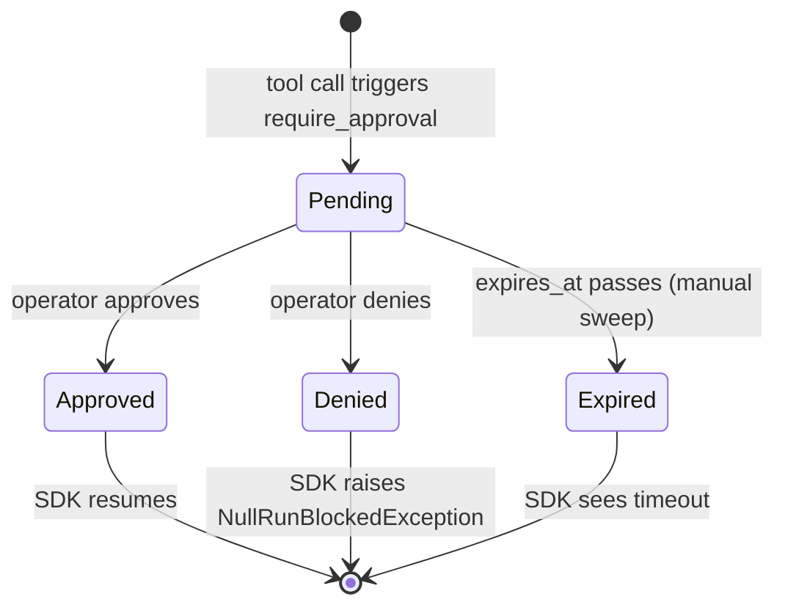
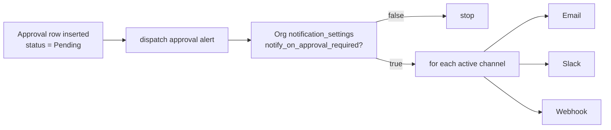
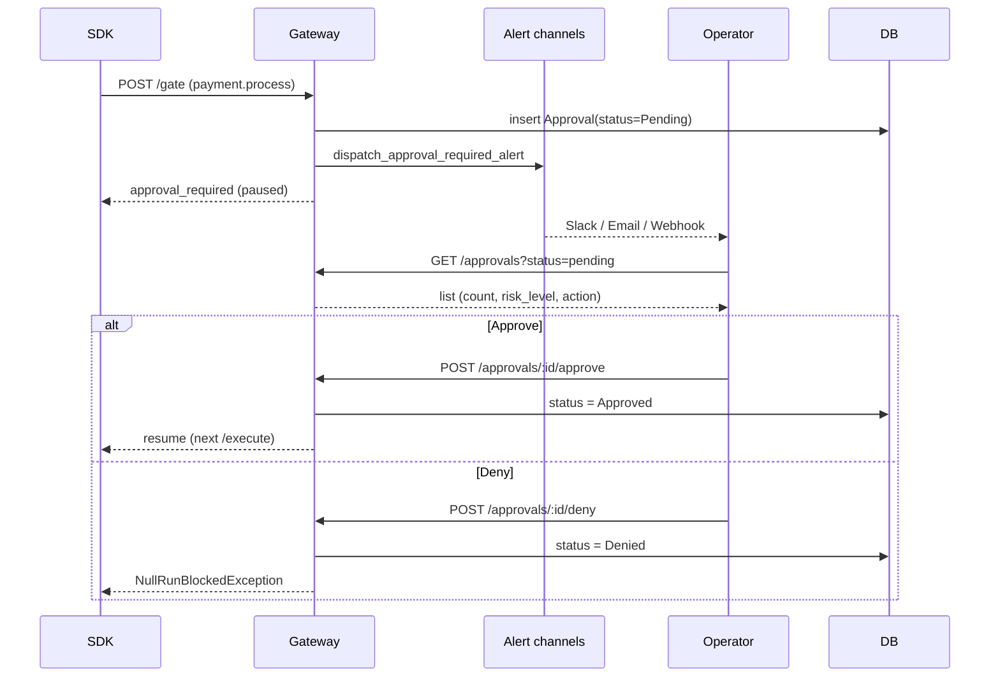

# Human approval

Some workflows need a human in the loop before a sensitive tool
runs. NullRun's approval flow **pauses** execution at the gate,
notifies an operator through your configured alert channels, and
resumes once an approve / deny decision is recorded.

## Enabling approvals per workflow

Approvals are a **workflow-level toggle**, not a policy type:

```
PATCH /api/v1/orgs/:org_id/workflows/:workflow_id
{ "human_approvals_enabled": true }
```

The toggle lives on the workflow record and is enforced on
update. Setting it to `true` requires `Feature::Approvals`
(Growth+) — flipping it on Lite or Starter returns
`403 plan_feature_missing`.

When enabled, every gate / execute evaluation can return one of:

| Decision | SDK behaviour |
| --- | --- |
| `allow` | Proceed. |
| `block` | Raise `NullRunBlockedException`. |
| `approval_required` | Pause, await operator decision. |
| `flag` | Proceed, decision logged for review. |

`approval_required` is produced when the merged policy set
contains a rule whose action is `RequireApproval` and that rule
wins the conflict resolution. The classic example: a `ToolBlock`
policy with `action = "require_approval"` for `payment.process`.

## Lifecycle



| Status | Set by |
| --- | --- |
| `Pending` | DB insert at the moment the gate returns `approval_required`. |
| `Approved` | `POST /api/v1/orgs/:org_id/approvals/:approval_id/approve`. |
| `Denied` | `POST /api/v1/orgs/:org_id/approvals/:approval_id/deny`. |
| `Expired` | **Manual only** today — there is no background expiry sweep. Operators set this via direct DB update or a future housekeeping job. The budget reservation held during `Pending` has its own TTL; if that TTL elapses, the reservation is released and the SDK surfaces the pause as `NullRunBudgetExhausted`. |

Each approval row carries a required `expires_at` — the operator
UI shows this as a countdown. The status transitions are
append-only in the audit log.

## Notification channels

On insert, the gateway dispatches an alert through every active
channel configured on the org:

- **Email** — SMTP relay.
- **Slack** — uses the org's installed Slack OAuth
  (`installation_id`); falls back to email if no Slack install.
- **Webhook** — generic HTTPS POST with HMAC signature.

Disable per-channel notifications via the
`notification_settings.notify_on_approval_required` toggle
(default `true`).



## Operator flow



The operator can list pending approvals
(`GET /api/v1/orgs/:org_id/approvals?status=pending`) — the
response is sorted by `risk_level` so the highest-stakes ones
surface first.

## Listing endpoints

| Endpoint | Purpose |
| --- | --- |
| `GET /approvals?status=pending` | Currently paused calls awaiting decision. |
| `GET /approvals?status=approved` | Past decisions for audit. |
| `GET /approvals?status=denied` | Past denials — feed into pattern review. |
| `GET /approvals/history` | All status transitions, oldest first. |

All endpoints require `Feature::Approvals`. Approve / deny is
idempotent on non-`Pending` rows — calling approve twice on an
already-approved approval returns `409 approval_already_decided`.

## When you don't need approvals

If a workflow runs only safe tools, leave `human_approvals_enabled`
off. Approvals add latency (pause → notify → wait → resume) and
require an operator to be on-call. Use them for:

- High-blast-radius tools (payments, production writes,
  external API mutations).
- Workflows where the agent's plan is hard to predict from the
  tool name alone.
- Regulated environments where every sensitive action needs a
  paper trail.

For everything else, prefer [sensitive tools](sensitive-tools.md)
+ [circuit breaker](circuit-breaker.md) — they enforce without
needing a human in the loop.

## See also

- [Sensitive tools](sensitive-tools.md) — built-in sensitive
  list the SDK blocks by default.
- [Policies](policies.md) — `ToolBlock` with `action =
  require_approval` produces `approval_required` decisions.
- [Tool policies](tool-policies.md) — glob match for the tool
  name that triggers approval.
- [Alert channels](../reference/http-api.md#alerts) — endpoint
  reference for channel configuration.
