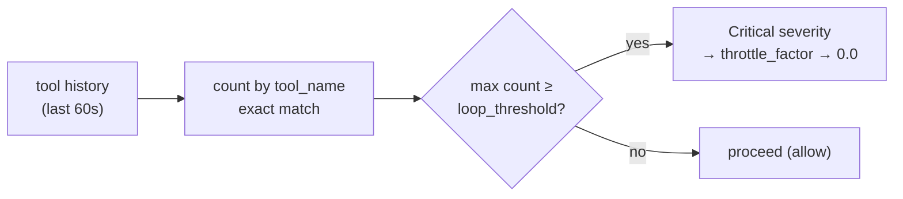
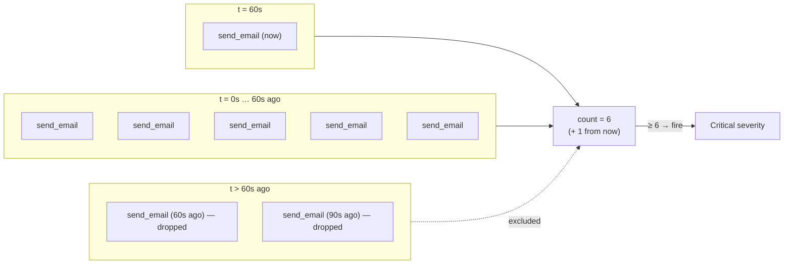
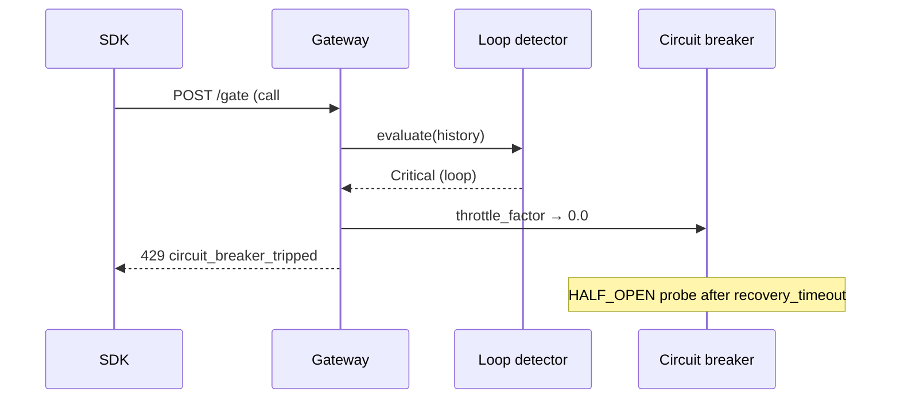

# Loop detection

The loop detector catches **repetition patterns** in tool calls —
the same tool being invoked N times within a sliding window. This
is the failure mode where an agent's retry logic, recursion bug,
or compromised prompt wedges itself on a tool and burns cost.

## Why it's needed

A budget cap stops a runaway workflow. A rate limit stops a
flooding one. Neither stops a workflow that legitimately stays
under both, but issues the **same tool call** in a tight loop —
each call cheap in isolation, the aggregate bleeds cost while
making zero progress. Loop detection is the tripwire for "the
agent is stuck."

## How it works

Loop detection is **window-based, exact-match on tool name**.
For every gate / execute evaluation, the detector counts how
often each `tool_name` appears in the workflow's recent call
history within the last `loop_window_secs` seconds. If any count
reaches `loop_threshold`, the detector fires at **Critical**
severity.

The trigger is exact-match — not glob, not semantic. The detector
matches `"send_email"` to `"send_email"` and nothing else. Glob
patterns are for [ToolBlock policies](tool-policies.md), not
loops.

## Configuration

Two per-policy fields control the detector (see
[Policies](policies.md) for where they live):

| Field | Default | Notes |
| --- | --- | --- |
| `loop_threshold` | `6` | Number of identical tool calls within the window before the detector fires. |
| `loop_window_secs` | `60` | Sliding window size, in seconds. Calls older than this are not counted. |

Both fields are aggregated across active policies via `min()`
([Policies — conflict resolution](policies.md#conflict-resolution))
— the tightest config wins.

### Sliding window in action

## What happens on detection

Loop detection returns **Critical** severity. A Critical finding
reduces the workflow's `throttle_factor`. Once `throttle_factor
< 0.1`, the next gate / execute is rejected with
`circuit_breaker_tripped`.

The breaker then transitions `OPEN → HALF_OPEN` per the recovery
contract in [Circuit breaker — when the gateway recovers](circuit-breaker.md#when-the-gateway-recovers)
— one trial call is allowed; success closes the breaker, failure
reopens it.

## Tuning

- The defaults (6 calls / 60s) catch clear loops without false-
  positives on legitimate retries.
- If you have a workflow that legitimately needs to retry the same
  tool > 6 times in a minute (e.g. polling an API), raise
  `loop_threshold` on that workflow's policy.
- For noisy pipelines that retry aggressively, raise the
  threshold or widen the window. Lowering either tightens the
  catch at the cost of more false-positives.

Loop detection is per-workflow; cross-workflow patterns (e.g. an
agent triggering the same tool across many concurrent workflows)
are not detected today.

## See also

- [Anomaly detection](anomaly-detection.md) — companion detector
  for cost outliers.
- [Circuit breaker](circuit-breaker.md) — how Critical findings
  trip the breaker.
- [Policies](policies.md) — where `loop_threshold` /
  `loop_window_secs` live.
