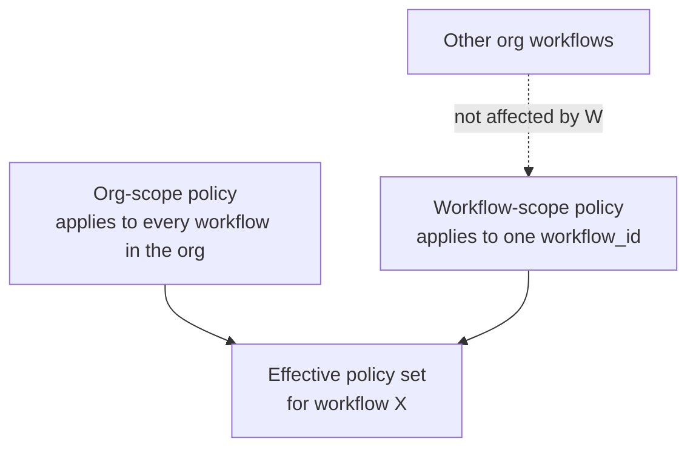
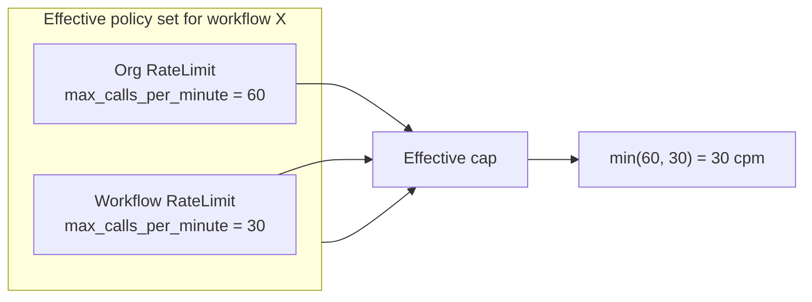
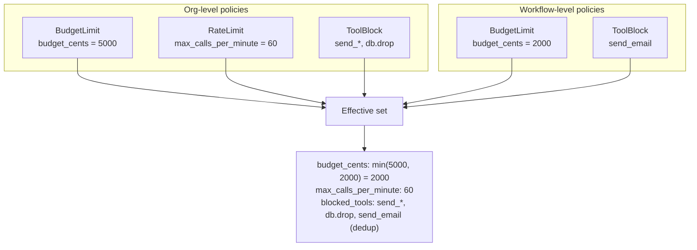

# Policies

A **policy** is a rule attached to your organization or a single
workflow. Every gate / execute call is evaluated against the merged
set of active policies for the key's workflow — the policy
engine returns `allow`, `block`, or `approval_required` from that
evaluation.

## Types

Three policy types exist (`PolicyType` enum in
`backend/src/proxy/domain/models.rs:156-162`). Each has a JSON
`config` payload whose shape is type-specific:

| Type | What it caps | `config` keys |
| --- | --- | --- |
| `RateLimit` | Calls per minute (per workflow + per org aggregate) | `max_calls_per_minute` (i64) |
| `BudgetLimit` | Cumulative cost in cents (per workflow) | `budget_cents` (i64) |
| `ToolBlock` | Glob match on tool names — blocks / requires approval | `tool_pattern`, `blocked_tools`, or `tools` (array of strings ≤ 4096 bytes) |

`RateLimit` and `BudgetLimit` are core controls available on every
plan. `ToolBlock` requires the `CustomPolicies` entitlement (Growth
and above).

### Per-policy fields outside `config`

Three fields look like policy fields but are consumed by the
**detector layer** (`backend/src/detectors/`), not by the gate
engine:

| Field | Default | Consumer |
| --- | --- | --- |
| `loop_threshold: i32` | `6` | Loop detector — see [Loop detection](loop-detection.md). |
| `loop_window_secs: i32` | `60` | Loop detector sliding window. |
| `anomaly_mode: AnomalyMode` | `Moderate` | Anomaly detector σ multiplier — see [Anomaly detection](anomaly-detection.md). |

## Scopes

Every policy has a `scope` of either `Org` or `Workflow`
(`PolicyScope` enum in `models.rs:148-153`).

Org-scope policies are **inherited** by every workflow in the
organization — they apply everywhere by default. Workflow-scope
policies apply only to the bound workflow.

Both scopes are merged at evaluation time
(`fetch_effective_policies()` in
`backend/src/proxy/http/workflows.rs:366-392`). There is no notion
of one scope "overriding" another — both apply simultaneously.

## Conflict resolution

When two policies in the merged set compete, the engine uses
**most-restrictive-wins** for numeric caps and **union** for tool
block patterns. The aggregation lives in `aggregate_policies()` at
`backend/src/proxy/http/workflows.rs:283-345`.

| Field | Aggregation across active policies |
| --- | --- |
| `budget_cents` | `min()` |
| `max_calls_per_minute` | `min()` |
| `loop_threshold` | `min()` |
| `loop_window_secs` | `min()` |
| `anomaly_mode` | Stored per policy; not aggregated |
| `blocked_tools` / `tool_pattern` / `tools` | Union, deduplicated |

`policy_type` is **immutable** per row — updating a `RateLimit`
into a `BudgetLimit` returns `400 policy_type_immutable`. Delete
and recreate instead.

### Concrete example

## Plan gating

| Resource | Gate |
| --- | --- |
| Total policy count per org | `plan_limits.policies_limit` (returns `429 plan_limit_exceeded`) |
| Sum of `max_calls_per_minute` across org | `plan_features.aggregate_rate_limit_per_min` (enforced on create at `policies.rs:445-478`) |
| `ToolBlock` policies | `Feature::CustomPolicies` (Growth+) |
| `human_approvals_enabled = true` on a workflow | `Feature::Approvals` (Growth+) |

## What's inherited, what's not

| Property | Inherited by workflow from org? |
| --- | --- |
| `budget_cents` | **Yes** — merged via `min()` across scopes |
| `max_calls_per_minute` | **Yes** — merged via `min()` |
| `loop_threshold`, `loop_window_secs` | **Yes** — merged via `min()` |
| `anomaly_mode` | **Yes** — read from any active policy |
| `tool_pattern` / `blocked_tools` / `tools` | **Yes** — union of all ToolBlock policies |
| `policy_type` | No — per-row attribute |
| `scope`, `workflow_id`, `name`, `template_id`, `version` | No — per-row attribute |
| `is_active` | No — a deactivated policy is excluded entirely |

A workflow cannot un-block a tool the org blocks. The merge is
union-only for tool patterns — there is no negative / allow rule.

## Templates

The gateway ships a curated set of policy templates
(`GET /policies/templates` → `enable_template`). Enabling a
template materialises a policy row in your org using the
template's `config` and `name`. Disable reverses it. Templates
are useful for common patterns ("Cap dev workflow at 100c/min",
"Block all write tools") without hand-authoring JSON.

## See also

- [Tool policies](tool-policies.md) — glob match semantics,
  validation.
- [API keys](api-keys.md) — what scopes / keys gate.
- [Loop detection](loop-detection.md) — `loop_threshold` /
  `loop_window_secs`.
- [Anomaly detection](anomaly-detection.md) — `anomaly_mode`.
- [Budgets](budgets.md) — how `budget_cents` interacts with
  `/gate` and `/execute`.
- [Circuit breaker](circuit-breaker.md) — how a tripped breaker
  reads the policy.
