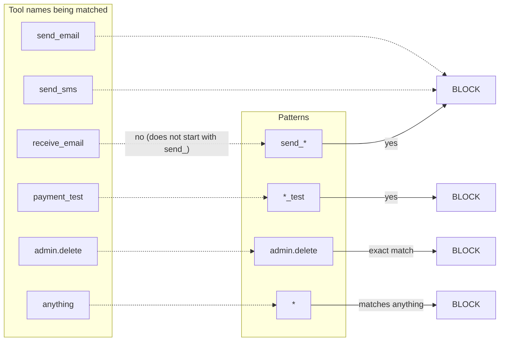
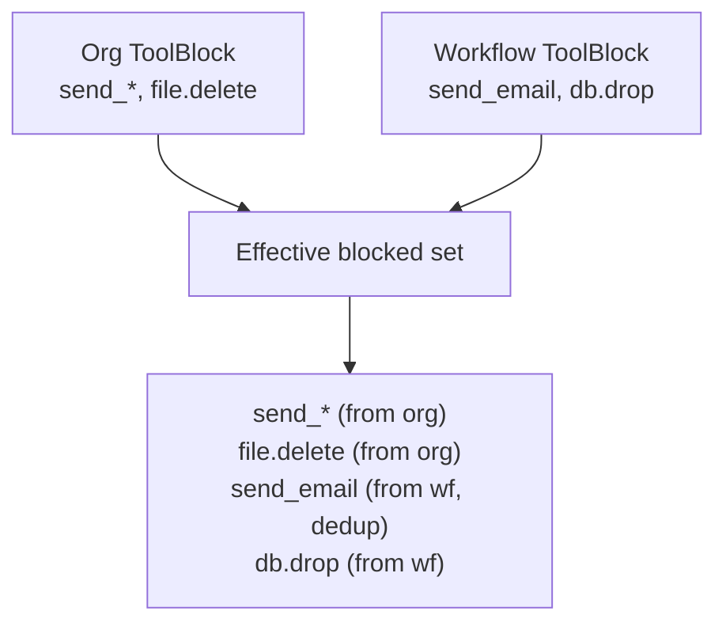

# Tool policies

A `ToolBlock` policy gates tool calls by **glob match** on the tool
name. The matching happens at the gate / execute layer (not at the
SDK), so the policy decision is enforced even if a client skips
the SDK's `@protect` path.

## Configuration shape

Three equivalent JSON keys are accepted (`validate_tool_block_config`
in `backend/src/proxy/http/validation.rs:409-483`):

```json title="tool_block_policy.json"
{
  "config": {
    "tool_pattern": ["send_*", "admin.*", "file.delete"],
    "blocked_tools": ["legacy_export"],
    "tools": ["payment.process"]
  }
}
```

All three are walked during evaluation; the merged set is the
**union** of every entry. You can use whichever you prefer — pick
`tool_pattern` for glob-heavy configs, `blocked_tools` for exact
lists, or `tools` for mixed intent. Putting entries in more than
one key is fine; duplicates are deduplicated.

!!! warning "Bare strings are rejected"
    A config like `"tool_pattern": "send_*"` (string, not array) is
    rejected with `400 bare_string_pattern`. The evaluator walks the
    field as an array — a bare string would silently match nothing
    and create a fail-OPEN trap. Use `["send_*"]`.

## Pattern syntax

The matcher is `glob_match` in
`backend/src/policy/graph.rs:469-483`. It supports:

- `*` — matches anything.
- `prefix*` — matches anything starting with `prefix`.
- `*suffix` — matches anything ending with `suffix`.
- `prefix*suffix` — matches anything starting with `prefix` **and**
  ending with `suffix`. Only one `*` is allowed; `a*b*c` is
  interpreted as `a*` prefix + `c` suffix.
- Exact string equality for everything else (no regex).



The matcher is single-star only — multi-star patterns (`a*b*c`)
match the prefix and suffix and ignore anything in between. If
you need richer matching, list the patterns explicitly rather than
chaining stars.

## Per-entry size cap

Every entry must be **≤ 4096 bytes** (`MAX_POLICY_PATTERN_BYTES`).
A 10 MB pattern would burn CPU per call (the matcher is O(n) over
each entry's glob on every gate / execute request), so the cap is
enforced at create and update time
(`backend/src/proxy/http/validation.rs:421-481`). Going over
returns `400 pattern_too_long`.

Control characters in entries are also rejected
(`validation.rs:473-479`).

## Union across scopes

The effective blocked-tool set is the union of all active
`ToolBlock` policies (org-scope + workflow-scope), deduplicated
(`workflows.rs:312-325`). A workflow inherits its org's blocks
and can add its own; you cannot un-block a tool the org blocks.



## Plan gate

`ToolBlock` policies require `Feature::CustomPolicies` — Growth+
plan and above. On Lite / Starter, the create handler returns
`403 plan_feature_missing` (`policies.rs:404-418`).

## Built-in sensitive list

Independently of `ToolBlock` policies, NullRun ships a built-in
list of high-risk tool patterns that the SDK blocks by default —
see [Sensitive tools](sensitive-tools.md). That list is matched
case-insensitively and is always enforced, regardless of policy
config. A `ToolBlock` policy is the right way to add **additional**
restrictions on top of the built-ins.

## See also

- [Policies](policies.md) — overall hierarchy and aggregation.
- [Sensitive tools](sensitive-tools.md) — built-in sensitive
  patterns the SDK blocks out of the box.
- [Human approval](human-approval.md) — pairing `ToolBlock` with
  `action = require_approval` for a pause-and-confirm flow.
