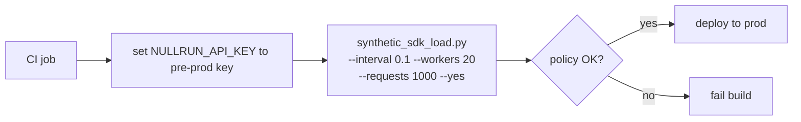

# CI / CD integration

Wire NullRun into your build pipeline so policy mistakes are caught
before they hit production. The pattern uses
[`synthetic_sdk_load.py`](https://github.com/nullrunio/nullrun-examples)
— a CLI tool from the official examples repo that drives the real
SDK against the real gateway with no LLM cost.

## Pre-prod validation pattern



`/gate` runs through the **same policy** your production key uses,
just with synthetic tokens. The exit code tells your CI whether the
policy misbehaved.

## GitHub Actions example

```yaml title=".github/workflows/pre-prod.yml"
name: pre-prod-validation

on:
  pull_request:
    branches: [master]

jobs:
  nullrun-smoke:
    runs-on: ubuntu-latest
    timeout-minutes: 5
    steps:
      - uses: actions/checkout@v4

      - name: Install load tool
        run: |
          git clone https://github.com/nullrunio/nullrun-examples.git
          pip install -e nullrun-examples

      - name: Run synthetic load
        env:
          NULLRUN_API_KEY: ${{ secrets.NULLRUN_PRE_PROD_KEY }}
          NULLRUN_API_URL: ${{ secrets.NULLRUN_PRE_PROD_URL }}
        run: |
          python -m synthetic_sdk_load \
            --interval 0.05 \
            --workers 10 \
            --requests 200 \
            --model gpt-4o-mini \
            --yes

      - name: Confirm at least N events succeeded
        run: |
          # synthetic_sdk_load exits non-zero on errors. The CI step
          # fails automatically if the load output indicates any
          # exception or HTTP failure.
          echo "load passed"
```

`synthetic_sdk_load.py` exits `1` on any exception (network error,
budget block, etc.) and `0` on a clean run. The exit code is your CI
gate.

## Common failure modes

| Failure | What it means | Fix |
|---|---|---|
| `NullRunBudgetError` on every request | Your pre-prod budget is too tight for synthetic traffic | Raise `budget_cents` on the pre-prod workflow, or use a higher-cap test key |
| `429 RATE_LIMIT_EXCEEDED` | `max_calls_per_minute` is too low for the synthetic load | Raise the rate limit on the pre-prod workflow |
| Connection refused / DNS error | `NULLRUN_API_URL` is wrong or the gateway is down in this environment | Verify the URL; add a `/health/live` check before the load step |
| HMAC 401 | `NULLRUN_SECRET_KEY` is not set in CI | Add the secret to the repo / org / environment secrets store |

## What this catches

- **Budget too tight** — if a developer sets `budget_cents: 100` on a
  workflow that needs `$50/day` to run, the pre-prod load surfaces
  it before prod.
- **Tool block too broad** — a `ToolBlock` pattern that
  accidentally matches every tool name surfaces as `TOOL_BLOCKED`
  on every call.
- **Workflow not bound to the right key** — if the pre-prod key was
  rotated but the workflow binding is stale, the load fails with a
  clean 401 instead of mysteriously going through.
- **Soft-mode misconfiguration** — if the policy says `Soft` but no
  `max_overdraft_cents` is set, every over-budget call hits a hard
  block. The smoke load exposes this.

## What this does **not** catch

- **Real LLM cost** — synthetic tokens are random, not actual spend.
  Run `synthetic_sdk_load.py` for policy shape; use a real staging
  workflow with a small `budget_cents` for cost projections.
- **Per-model pricing drift** — the gateway has a `model_pricing`
  table; verify your models are priced correctly by checking the
  dashboard **Cost** tab after one real call.
- **WS push timing** — synthetic load doesn't exercise kill/pause
  paths. Trigger them manually via the dashboard during the
  smoke-test pass.

## Pipeline integration checklist

Add these checks to your CI before merging anything that touches the
SDK, the gateway, or policy configuration:

```yaml title=".github/workflows/pre-prod.yml"
jobs:
  nullrun-smoke:
    steps:
      - name: 1. Health check
        run: |
          curl -fs "${NULLRUN_API_URL}/health/live" \
            || (echo "gateway down" && exit 1)

      - name: 2. Synthetic load
        env: { NULLRUN_API_KEY: ${{ secrets.NULLRUN_PRE_PROD_KEY }} }
        run: python -m synthetic_sdk_load --interval 0.05 --workers 10 --requests 200 --yes

      - name: 3. Capabilities probe
        run: |
          # Verify v3 contract is live before promoting to prod
          curl -fs "${NULLRUN_API_URL}/api/v1/capabilities" \
            | python -c "import json,sys; c=json.load(sys.stdin); \
              assert c['capabilities']['server_minted_execution_id'], 'v3 not ready'; \
              assert c['capabilities']['per_execution_reservations'], 'v3 not ready'"

      - name: 4. Approval pause/resume (manual)
        # Trigger an approval-required call, click approve in the
        # dashboard, confirm the SDK resumes without throwing.
        run: echo "manual step — see docs/how-to/human-approval.md"
```

Step 4 is manual by design — the approval pause/resume flow requires
a human to click Approve in the dashboard, which a CI job can't
do. Run it on every release candidate as part of the release
checklist.

## See also

- [`synthetic_sdk_load.py`](https://github.com/nullrunio/nullrun-examples)
- [Troubleshooting](../troubleshooting.md) — common failure modes
  and how to read SDK logs
- [Configuration → env vars](../getting-started/configuration.md)
- [Reference → HTTP API → Capabilities](../reference/http-api.md#capabilities)
