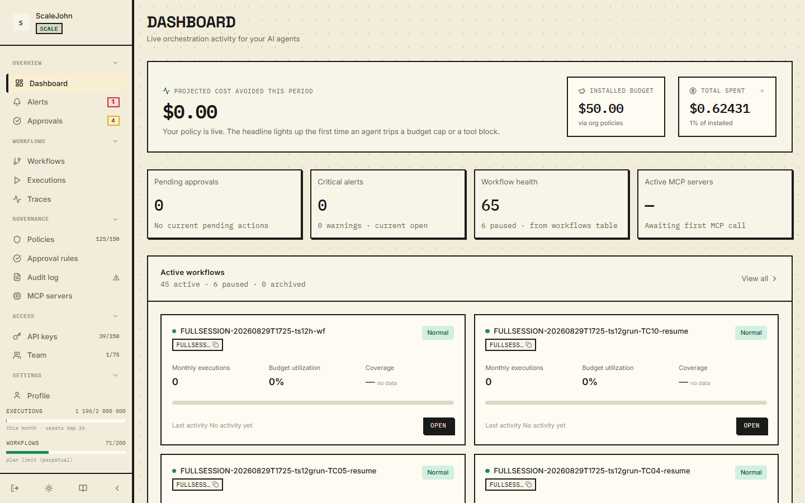
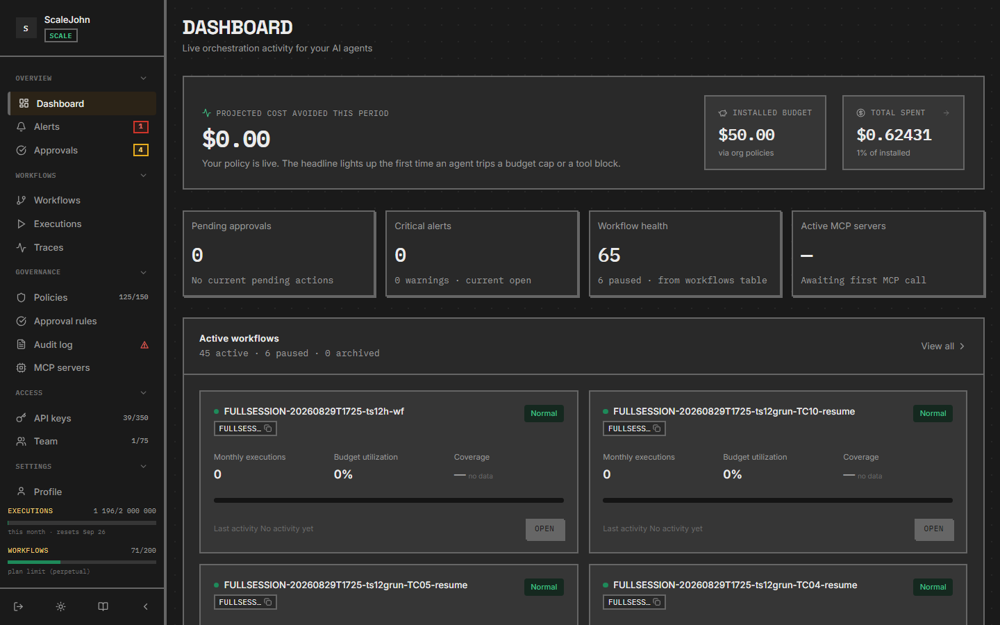
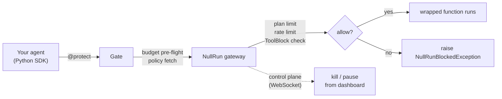
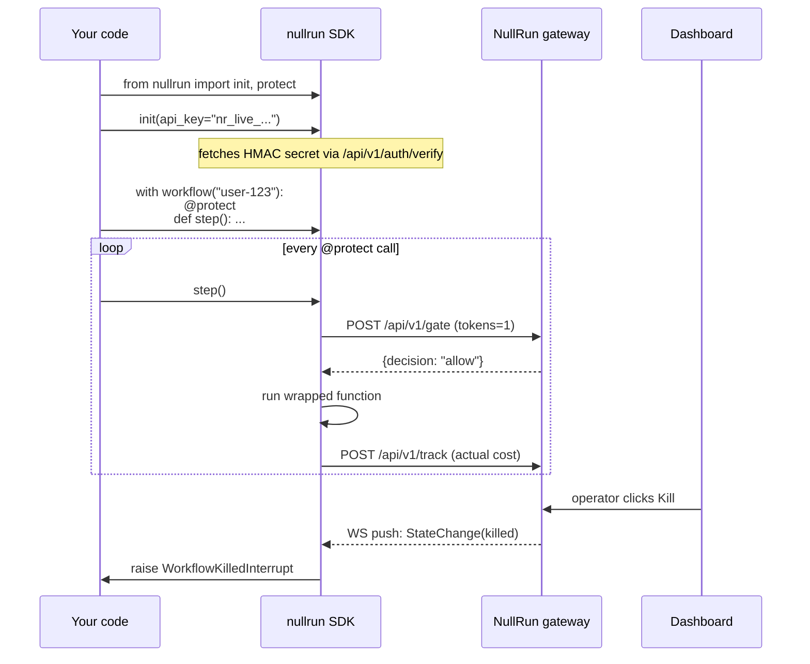

<!-- Brand hero — title, subtitle, screenshot, CTA buttons.
     All hero/sections/feature classes live in extra.css
     (.nr-hero, .nr-section, .nr-features, .nr-feature, etc.). -->
<section class="nr-hero md-grid md-typeset">
  

    <h1 class="nr-hero__title">Runtime decision layer for tool-using AI agents</h1>
    

      Before your agent executes a supported tool or model call, the
      SDK asks the gate. <code>allow</code>, <code>block</code>, or
      <code>require_approval</code> — backed by tool patterns,
      budgets, rate limits, and human approvals.
    

    

      <a class="primary" href="getting-started/quickstart/">Get started →</a>
      <a class="secondary" href="https://nullrun.io">Get an API key</a>
      <a class="secondary" href="concepts/circuit-breaker/">How the gate works</a>
    

  

  

    <figure class="nr-shot">
      
      
    </figure>
  

</section>

<section class="nr-section md-grid md-typeset">
  <h2 class="nr-section__title">How it fits together</h2>

</section>

<section class="nr-section md-grid md-typeset">
  <h2 class="nr-section__title">What you get out of the box</h2>
  

    

      

        <svg xmlns="http://www.w3.org/2000/svg" viewBox="0 0 24 24" fill="none" stroke="currentColor" aria-hidden="true">
          <circle cx="12" cy="12" r="10"/>
          <polyline points="12 6 12 12 16 14"/>
        </svg>
      

      
Budget gate

      

        Set a per-workflow cap in cents. The SDK asks the gateway
        "any budget left?" before every <code>@protect</code>
        call — no round-trip cost when the answer is "yes". Hard
        blocks on overrun; soft mode allows a bounded overrun
        when an active chain is present.
      

    

    

      

        <svg xmlns="http://www.w3.org/2000/svg" viewBox="0 0 24 24" fill="none" stroke="currentColor" aria-hidden="true">
          <path d="M20 13c0 5-3.5 7.5-7.66 8.95a1 1 0 0 1-.67-.01C7.5 20.5 4 18 4 13V6a1 1 0 0 1 1-1c2 0 4.5-1.2 6.24-2.72a1.17 1.17 0 0 1 1.52 0C14.51 3.81 17 5 19 5a1 1 0 0 1 1 1z"/>
          <path d="m9 12 2 2 4-4"/>
        </svg>
      

      
Action-bound approvals

      

        Operator approves sensitive calls via typed predicates
        (<code>money_amount</code> / <code>tool_parameters</code>).
        Every approval is bound to the exact action payload via a
        SHA-256 <code>action_digest</code> — the grant is refused
        if the SDK then executes a different amount or
        different arguments.
      

    

    

      

        <svg xmlns="http://www.w3.org/2000/svg" viewBox="0 0 24 24" fill="none" stroke="currentColor" aria-hidden="true">
          <path d="M4.9 19.1C1 15.2 1 8.8 4.9 4.9"/>
          <path d="M7.8 16.2c-2.3-2.3-2.3-6.1 0-8.5"/>
          <circle cx="12" cy="12" r="2"/>
          <path d="M16.2 7.8c2.3 2.3 2.3 6.1 0 8.5"/>
          <path d="M19.1 4.9C23 8.8 23 15.1 19.1 19"/>
        </svg>
      

      
Real-time kill / pause

      

        A WebSocket control plane pushes <code>killed</code> /
        <code>paused</code> to every connected SDK. <code>WorkflowKilledInterrupt</code>
        is a <code>BaseException</code> so it reaches the top of
        the agent loop, not a swallowed <code>except Exception</code>.
      

    

    

      

        <svg xmlns="http://www.w3.org/2000/svg" viewBox="0 0 24 24" fill="none" stroke="currentColor" aria-hidden="true">
          <rect x="3" y="11" width="18" height="11" rx="2" ry="2"/>
          <path d="M7 11V7a5 5 0 0 1 10 0v4"/>
        </svg>
      

      
ToolBlock policy

      

        Server-side glob-pattern rules (<code>mcp://payments/refund*</code>,
        <code>bash</code>, <code>db.drop</code>) decide which
        canonical tool names are allowed. <strong>Always Hard</strong>:
        fails closed on transport error, regardless of the budget's
        <code>enforcement_mode</code>.
      

    

    

      

        <svg xmlns="http://www.w3.org/2000/svg" viewBox="0 0 24 24" fill="none" stroke="currentColor" aria-hidden="true">
          <path d="M12.22 2h-.44a2 2 0 0 0-2 2v.18a2 2 0 0 1-1 1.73l-.43.25a2 2 0 0 1-2 0l-.15-.08a2 2 0 0 0-2.73.73l-.22.38a2 2 0 0 0 .73 2.73l.15.1a2 2 0 0 1 1 1.72v.51a2 2 0 0 1-1 1.74l-.15.09a2 2 0 0 0-.73 2.73l.22.38a2 2 0 0 0 2.73.73l.15-.08a2 2 0 0 1 2 0l.43.25a2 2 0 0 1 1 1.73V20a2 2 0 0 0 2 2h.44a2 2 0 0 0 2-2v-.18a2 2 0 0 1 1-1.73l.43-.25a2 2 0 0 1 2 0l.15.08a2 2 0 0 0 2.73-.73l.22-.39a2 2 0 0 0-.73-2.73l-.15-.08a2 2 0 0 1-1-1.74v-.5a2 2 0 0 1 1-1.74l.15-.09a2 2 0 0 0 .73-2.73l-.22-.38a2 2 0 0 0-2.73-.73l-.15.08a2 2 0 0 1-2 0l-.43-.25a2 2 0 0 1-1-1.73V4a2 2 0 0 0-2-2z"/>
          <circle cx="12" cy="12" r="3"/>
        </svg>
      

      
Auto-instrumentation

      

        <code>nullrun.init()</code> patches OpenAI, Anthropic,
        LangGraph, OpenAI Agents, Mistral, Gemini, Cohere, Bedrock,
        LlamaIndex, CrewAI, and AutoGen — cost tracking without
        <code>@protect</code>.
      

    

    

      

        <svg xmlns="http://www.w3.org/2000/svg" viewBox="0 0 24 24" fill="none" stroke="currentColor" aria-hidden="true">
          <path d="M15 12h-5"/>
          <path d="M15 8h-5"/>
          <path d="M19 17V5a2 2 0 0 0-2-2H4"/>
          <path d="M8 21h12a2 2 0 0 0 2-2v-1a1 1 0 0 0-1-1H11a1 1 0 0 0-1 1v1a2 2 0 1 1-4 0V5a2 2 0 1 0-4 0v2a1 1 0 0 0 1 1h3"/>
        </svg>
      

      
Decision history + audit chain

      

        Every gate decision (allow / block / require_approval) is
        recorded in <code>audit_events</code> with hash-chained
        <code>content_hash</code> + <code>previous_hash</code>. The
        chain is recompute-verifiable on demand via <code>GET
        /api/v1/orgs/{org_id}/audit-log/verify</code>.
      

    

  

</section>

<section class="nr-section md-grid md-typeset">
  <h2 class="nr-section__title">Wire it up in 30 lines</h2>

</section>

<section class="nr-section md-grid md-typeset">
  <h2 class="nr-section__title">Managed runtime, not a self-hosted deployment</h2>
  

    NullRun runs as a managed control plane at <a href="https://nullrun.io">nullrun.io</a>.
    There is no self-hosted deployment option today. The Python
    SDK runs inside your process and talks to the hosted gateway
    over HTTPS; the dashboard at <code>nullrun.io</code> hosts the
    control plane. See
    <a href="https://docs.nullrun.io/">the docs</a> for the SDK
    surface and <a href="https://nullrun.io/about">/about</a> for
    the runtime contract.
  

</section>