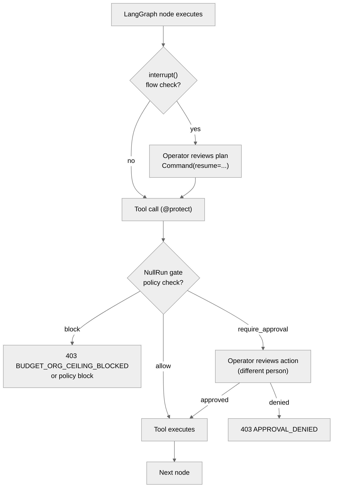

# Framework & ecosystem positioning

This page is the **architectural companion** to the how-to guides in
section 3 (`Protect a LangGraph agent`, `Use with OpenAI Agents`,
`Use CrewAI`, `LLM frameworks`). Those pages show the wiring; this
page answers the question teams actually ask first:

> "We already use *X*. Why would we add NullRun on top, and where will
> it collide with what we have?"

Two perspectives are covered:

1. **Framework overlap** — NullRun vs framework-native HITL / budget
   patterns. Where there's overlap, when it bites, when it doesn't.
2. **Category positioning** — NullRun vs other runtime-authorization
   vendors in the same problem space.

Both lenses are honest: the goal is not to claim more than the system
delivers, but to make the trade-off legible to a buyer who already
has tooling.

> **Last verified: 2026-09-25.**
> NullRun self-claims anchored against backend source code and ADR
> files; framework claims cross-checked against official vendor
> docs; competitor claims cross-checked against vendor websites.
> One competitor entry — *Microsoft AGT* — could not be verified to
> a public product and is flagged below. Framework descriptions
> reflect stable patterns through early 2026; the
> [Verification log](#verification-log) at the bottom of the page
> lists every claim and its source.

## TL;DR — the overlap matrix

The four layers the user is buying:

| Layer | LangGraph | LangChain | CrewAI | AutoGen | OpenAI Agents | **NullRun** |
|---|---|---|---|---|---|---|
| **Flow-level HITL** (pause a graph step for input) | ✅ `interrupt()` + `Command(resume=...)` | ✅ `interrupt_before`/`_after` (legacy) | ⚠️ `human_input=True` per-task | ⚠️ `HandoffMessage` v0.4+ | ⚠️ `RunHooks` chain | 🟡 complement — sit *above* this layer, not instead of it |
| **Hard budget gate** (block before invocation) | ❌ | ❌ | ❌ | ❌ | ❌ | ✅ **atomic Redis Lua**, period-bound, fail-CLOSED |
| **Tool-call policy** (declarative block / allow) | ❌ | ❌ | ❌ | ❌ | ❌ | ✅ **declarative policy list + pattern match** |
| **Immutable audit trail** (refusal-as-evidence) | ⚠️ LangSmith — call trace, not gate decisions | ⚠️ LangSmith | ❌ | ❌ | ⚠️ Tracing only | ✅ **hash-chained `audit_events`**, 4-table separation (ADR-009) |
| **Cross-org RBAC + policy as data** | ❌ | ❌ | ❌ | ❌ | ❌ | ✅ per-org / per-team / per-policy |

The single-column answer:

- **Budget + tool policy + audit + RBAC** — NullRun only. No framework has these as enforcement.
- **Flow-level HITL** — frameworks only. NullRun doesn't replace it; it sits beside it.
- The only real overlap zone is **action-level approval** (LangGraph `interrupt()` on a sensitive tool, vs NullRun approval for the same tool). See [LangGraph HITL coexistence](#langgraph-hitl-coexistence-the-real-adoption-question) below.

## What NullRun actually does (re-grounding)

The headline capabilities, anchored to the wire contract and the
SDK README:

- **Hard budget gate.** Redis Lua `reserve_v3.lua` reserves cents
  atomically against the period-bound counter
  `org:{org_id}:bp:{period_start_ts}:cost_cents` (with a parallel
  `cost_millicents` precision counter — 1 cent = 1 000 millicents)
  before the LLM/tool call. Server fails-CLOSED on Redis outage
  (402 `BUDGET_REDIS_UNAVAILABLE`), never on the client.
  ([Performance & limits → Redis failure](performance.md#redis-failure))
- **Tool policy.** Declarative `ToolBlock` patterns + `approval_rules`.
  Block / allow / require_approval are server-side decisions; the SDK
  has no veto.
- **Approval flow.** Pauses the SDK on a `threading.Event` until the
  operator clicks Approve or Deny on the dashboard, or the approval
  times out (default 300 s, clamp 30–3600 s). Bound to a SHA-256
  `action_digest` so the grant refuses if the payload drifts.
  ([Human approval](../concepts/human-approval.md))
- **Audit trail.** Every gate decision, approval resolution, and
  execution-lifecycle event lands in `audit_events` with a hash chain.
  Refusal is also a row (v3.75 — refusal-as-evidence).
  ([Tracing](../concepts/tracing.md))
- **Zero-code instrumentation.** `nullrun.init()` patches `httpx` once
  for any vendor; framework-specific callbacks register on the first
  `@protect` call. No opt-in list to maintain.

## Framework HITL — what each framework actually gives you

### LangGraph (most mature)

Per the [official LangGraph interrupts docs](https://docs.langchain.com/oss/python/langgraph/interrupts):

- `interrupt(value)` inside a node — pauses execution, emits the
  value to the caller, suspends graph state.
- `Command(resume=...)` — caller resumes with same `thread_id`.
- Static `interrupt_before` / `interrupt_after` are **deprecated for
  HITL**; use `interrupt()` inside a node instead.
- Best-practice trio: checkpointer (Postgres / Redis /
  `MemorySaver`), stable `thread_id`, decision-order matching.
- Decision payload is arbitrary JSON the reviewer can act on
  (approve / edit / reject / redirect).

What LangGraph does **not** give:

- No hard budget enforcement. LangSmith is observability, not gate.
- No tool-policy DSL. The only "block dangerous tools" path is to
  write it into graph code.
- No cross-org audit hash chain.

### LangChain

- `interrupt_before` / `interrupt_after` on `AgentExecutor` (legacy;
  the docs now steer you to LangGraph for agents).
- LangSmith for trace + observability — same gap as above.

### CrewAI

- `human_input=True` flag on a `Task`. The crew pauses on that task
  and prompts the operator. Per-task, not declarative, not composable
  with other tools.
- No budget gate, no policy.
- *Caveat (knowledge drift):* the description above reflects the
  pattern stable since the 2024-era CrewAI releases. Specific 2026-Q3
  additions — e.g. flow-level breakpoints, `Flow` runtime HITL —
  could not be confirmed against current public docs at the time of
  verification. Cross-check against [docs.crewai.com](https://docs.crewai.com/)
  if you are evaluating against the latest version.

### AutoGen

- `UserProxyAgent` (legacy) and `HandoffMessage` / `InputRequest` in
  the v0.4 Core refactor. Conversational HITL (user = participant in
  the dialog), not action-gated approval.

### OpenAI Agents SDK

- `RunHooks` (non-streaming `Runner.run`) and `RunStreamedHooks`
  (`Runner.run_streamed`) for lifecycle events: `on_agent_start` /
  `on_agent_end`, `on_llm_start` / `on_llm_end`, `on_tool_start` /
  `on_tool_end`, `on_handoff`. There is **no `on_run_start` /
  `on_run_end` / `on_run_abort`** — aborting is *cooperative*: raise
  from inside a hook (or from inside a `@function_tool`), rely on
  `input_guardrails` / `output_guardrails` for the canonical abort
  path, or call `RunResultStreaming.cancel()` on the streaming path.
- No built-in approval UI — you wire one yourself.

## Where overlap is real vs imagined

| Capability | Real overlap? | Notes |
|---|---|---|
| **Budget cap on LLM spend** | ❌ No framework overlap | Killer feature. Lead with this. |
| **Block a dangerous tool before it runs** | ❌ No framework overlap | Framework callbacks can observe; they don't block the call frame. |
| **Hash-chained audit log of gate decisions** | ❌ No framework overlap | LangSmith trace ≠ enforcement audit. Different shape, different consumer. |
| **Approval for a sensitive tool** | ✅ **Real overlap** | Both layers can fire for the same tool. UX design required — see below. |
| **Pause a step in the graph to ask the human a question** | 🟡 Partial — different abstraction | LangGraph `interrupt()` asks "is the plan right?", NullRun asks "is this action allowed?". Different question. |
| **Streaming / async agent control flow** | ❌ Framework-only | NullRun doesn't manage graph state. |
| **Streaming response truncation / redaction** | ❌ Framework-only | LangGraph / LangChain stream handling is outside NullRun's surface. |

The honest summary: there is exactly **one zone** of real overlap —
*action-level approval for sensitive tools*. Everywhere else, the
layers are orthogonal.

## LangGraph HITL coexistence (the real adoption question)

This is the question we get most often from teams who already use
LangGraph. Short answer:

> NullRun `interrupt()` and NullRun approval **don't conflict** —
> they fire at different points and answer different questions. They
> *can* both fire on the same tool call; the UX must distinguish them.

### The mental model

| Layer | Question | Where it fires | Who answers |
|---|---|---|---|
| LangGraph `interrupt()` | "Did the agent understand the problem? Is this step right? Continue?" | Inside a node, before/after LLM call or tool call | The flow's operator (Slack, UI, IDE) |
| NullRun approval | "Is this tool allowed for this team / under this policy / within this budget?" | Pre-invocation, before the function body runs | The governance team (Approvals UI, Slack channel per rule) |

These are *different questions*, owned by *different people*, surfaced
in *different UIs*. The pattern is:

The two interruptions are independent and stackable. Both surface
in their own UI; neither blocks the other.

### Where it *can* bite

1. **Latency overhead.** Every `@protect`-decorated call adds a
   round-trip to `/api/v1/gate`. Healthy-path budget is **<60 ms p99**
   ([Performance & limits → Hot-path latency](performance.md#hot-path-latency)).
   For long-running batch agents this is invisible. For
   latency-sensitive chat UIs it may matter; mitigate with conditional
   `@protect` (only enforce on paths that hit sensitive tools or
   exceed a cost threshold) or per-policy `consume_epsilon_cents`.

2. **Double approval UX.** If both layers fire for the same sensitive
   tool, the operator may see two approval surfaces. Mitigations:
   - Surface a single dashboard view that joins LangGraph thread_id
     ↔ NullRun execution_id
   - Suppress the framework `interrupt()` when NullRun's policy is the
     binding gate
   - Use the framework HITL for non-sensitive planning steps and
     NullRun approval for sensitive tool invocations only

3. **Conceptual confusion.** "We already have HITL, why do we need
   another?" The answer is governance: framework HITL is *flow
   control*, NullRun is *organizational policy*. A team can have a
   perfect LangGraph `interrupt()` workflow and still overspend, fire
   unapproved production writes, or fail a SOC 2 audit because
   LangSmith isn't an enforcement log.

### What the migration looks like

For an existing LangGraph team, the realistic adoption is **half a
day**, not a sprint:

1. `pip install nullrun` and `export NULLRUN_API_KEY` (one line).
2. Add `@protect` on the LLM/tool calls that touch
   production, money, or PII. The decorator replaces no existing
   code; it wraps the call.
3. Configure policies in the dashboard — sensitive tool list, budget
   cap, approval rule for production writes.
4. (Optional) Map `thread_id` → `execution_id` in your observability
   stack so the team gets one trace instead of two.

LangGraph `interrupt()` nodes are not touched. The framework patch is
auto-attached on the first `@protect` call (see
[Protect a LangGraph agent](../how-to/langgraph.md)).

## Coexistence patterns by framework

### LangChain / LangGraph (recommended)

- Keep your existing `interrupt()` nodes untouched.
- Add `@protect` on tool functions and on the LLM call site
  (typically inside the node that invokes the model).
- For multi-agent setups: one policy per workflow; the SDK tags
  calls automatically via the runtime context.

### CrewAI

- `human_input=True` on `Task` stays — use it for "is the task
  framing right?" questions.
- Add `@protect` on tool calls that have policy weight (DB writes,
  outbound email, payments). Crew doesn't have a budget gate, so
  this is purely additive value.
- See [Use CrewAI](../how-to/crewai.md) for wiring.

### AutoGen

- `UserProxyAgent` / `HandoffMessage` stays — conversational HITL is
  outside NullRun's scope.
- Wrap each `Agent.run` / `a_run` invocation site with `@protect`.
- For v0.4 streams, the SDK patches message-streaming hooks on first
  `@protect` call.

### OpenAI Agents

- `RunHooks` stays — use for run-level lifecycle (start, end, error).
- Add `@protect` on the actual tool function. The nullrun SDK
  instruments `Runner.run` / `run_streamed` automatically.
- See [Use with OpenAI Agents](../how-to/openai-agents.md).

## Category positioning — runtime-authorization vendors

The [/compare page](https://nullrun.io/compare) scores vendors on the
same four axes we care about: **gate**, **approval**, **spend**,
**audit**. The cells reflect publicly documented capability, not
roadmap promises.

### Direct decision-layer competitors

| Vendor | Gate | Approval | Spend | Audit |
|---|---|---|---|---|
| **NullRun** | ✓ | ✓ | ✓ | ✓ |
| Microsoft AGT | ✓ | ~ | — | ✓ |
| APort | ✓ | ~ | ~ | ✓ |
| Credo AI | ~ | ✓ | — | ✓ |
| Straiker | ~ | — | — | ✓ |
| Isonapse | ✓ | ~ | ~ | ✓ |

**Legend:** ✓ Yes · ~ Partial / complements · — Not supported

**Notes on each vendor** (verified 2026-09-25 against the public
vendor sites):

- **Microsoft AGT** — Microsoft's open-source [Agent Governance
  Toolkit](https://github.com/microsoft/agent-governance-toolkit)
  (MIT, 6.3k stars, Public Preview). Tagline: *"Policy enforcement,
  zero-trust identity, execution sandboxing, and reliability
  engineering for autonomous AI agents. Covers 10/10 OWASP Agentic
  Top 10."* Runtime gate is deterministic at the **application
  middleware layer**, not OS-kernel — the policy engine and agents
  share the same process boundary; the README's own recommendation
  is to run each agent in a separate container for OS-level
  isolation. Approval is `require_approval` as policy-as-data
  (YAML approvers list); there is **no built-in human-approval UI**.
  Audit is Merkle-based and tamper-evident ("Audit and Compliance
  1.0" spec, 157 conformance tests). Spend/budget management is not
  advertised — the scorecard's "—" is correct.
- **APort** — Pre-execution authorization ("Open Agent Passport"
  spec at [aport.io/spec](https://aport.io/spec/)). Enforces policy
  in the platform hook (`before_tool_call`), bypass-resistant to
  prompt injection. Native approval UI: not surfaced — the grant is
  policy-driven.
- **Credo AI** — "Govern, approve, monitor" AI agents. Agent
  registry + "registry-only-approve" pattern + policy automation
  ([credo.ai/product/agent-governance](https://www.credo.ai/product/agent-governance)).
  Strong on approval + audit, weaker on tool-call enforcement.
- **Straiker** — "Agentic AI Security Company"; Defend AI platform
  with runtime protection + "agentic kill switch"
  ([straiker.ai/blog/agentic-kill-switch-for-ai-agents](https://www.straiker.ai/blog/agentic-kill-switch-for-ai-agents)).
  Detection-oriented; no human-approval flow.
- **Isonapse** — Runtime governance layer positioned *between* agent
  and external systems ([isonapse.com](https://isonapse.com/)).
  "Control what AI agents can do — before they do it." Spend column
  is a best-effort mapping; the public site emphasises governance,
  not budget.

### Adjacent — gateways, security, advisory

| Vendor | Gate | Approval | Spend | Audit |
|---|---|---|---|---|
| Portkey | ✓ | ~ | ✓ | ✓ |
| Noma Security | ✓ | ~ | — | ✓ |
| Prisma / Palo Alto | ~ | — | ~ | ~ |
| Advisory shops | — | — | — | — |

**Notes:**

- **Portkey** — AI gateway with budget controls, configurable
  approval policies, and observability across providers. Closest
  adjacent to NullRun on the Spend column.
- **Noma Security** — AI Detection & Response (AI-DR); runtime
  protection with deterministic authorization and Segregation of
  Duties. Delivered via Kong Gateway integration
  ([noma.security](https://noma.security/)). No budget enforcement
  visible on the public site.
- **Prisma / Palo Alto** — Prisma AIRS
  ([paloaltonetworks.com/prisma/airs](https://www.paloaltonetworks.com/prisma/airs))
  — runtime agent policy governance + AI-SPM posture management.
  No human-approval UI; spend handling unclear from public docs.
- **Advisory shops** — Not a software product. Listed for
  completeness against the `/compare` table.

### How NullRun frames the category

The differentiator language NullRun uses on `/compare` (paraphrased
from the page):

> "The runtime decision point is the product. Everything else is
> plumbing."

The question NullRun claims to be uniquely answering:

> "Is this action authorized, right now, by the policy that exists
> today, before it runs?"

The categories that **don't** answer this question, per the same
page, and the reason:

- **Prompt recorders** observe after the fact.
- **Model guardrails** check the output, not the action.
- **Observability dashboards** visualize; they don't enforce.
- **Advisory decks** describe; they don't run.

This is a positioning claim, not a benchmark. Verify it against your
own procurement criteria — particularly around fail-CLOSED semantics
on enforcement paths and what happens when Redis is down on the gate
hot path. The mechanical answer for NullRun is in
[Performance & limits → Redis failure](performance.md#redis-failure)
(402, never 200).

## What NullRun *doesn't* claim

This page is intentionally honest about scope. The following are not
covered, by design:

1. **LLM-call output moderation** — content safety, PII redaction,
   prompt-injection blocking. Use a model-side guardrail for that.
2. **Workflow orchestration / DAG** — LangGraph's job, not ours.
3. **Vector store / retrieval governance** — outside the gate.
4. **Network egress policy (egress firewall)** — NullRun can
   geo-block at ingress but doesn't inspect LLM tool payloads for
   exfiltration.
5. **Provider-side cost visibility** — NullRun computes cost from
   response bodies via the `httpx` patch; for exact reconciliation
   the upstream webhook is the source of truth.

If your evaluation includes one of these, NullRun is a complement,
not a substitute.

## Honest gaps and caveats

- **Knowledge cutoff.** The framework descriptions above reflect
  patterns stable through early 2026; specific 2026-Q3 features in
  LangGraph Studio, CrewAI flow-level HITL, or AutoGen governance
  hooks may have shifted. Cross-check the current docs at the links
  in each subsection.
- **No benchmark against `interrupt()` latency.** LangGraph's
  in-memory pause is sub-millisecond; NullRun's gate round-trip is
  the 50–200 ms figure from
  [Performance & limits](performance.md#hot-path-latency). Apples
  and oranges — one is a process-local suspension, the other is a
  network authorization call. Choose based on whether you need
  governance or just flow control.
- **No empirical study of approval-UX friction.** The double-approval
  mitigation strategies above are design guidance, not measured
  results. Teams adopting both layers should A/B the UI surface
  before committing.
- **No automatic LangGraph-thread ↔ NullRun-execution mapping.**
  The two IDs are different shapes (LangGraph string `thread_id`
  from your code, NullRun server-minted UUIDv7 from
  `/api/v1/gate`). Wiring them in your observability stack is on
  the adopter; we don't auto-bind them.

## Verification log

Every load-bearing claim on this page was re-verified on
**2026-09-25** against the listed source. Future maintainers: when
editing, update the date and add a row below.

| Claim | Source | Status |
|---|---|---|
| NullRun budget key shape `org:{org_id}:bp:{period_start_ts}:cost_cents` | `backend/src/redis/scripts/reserve_v3.lua:327` | ✅ verified |
| NullRun millicents precision counter `cost_millicents` | `backend/src/redis/scripts/reserve_v3.lua:331`; ADR notes 1¢ = 1000 millicents | ✅ verified |
| 402 `BUDGET_REDIS_UNAVAILABLE` on Redis outage | `backend/src/proxy/http/gate/gate.rs:740,756,914` + integration tests | ✅ verified |
| `expires_in_seconds` clamp `30..=3600`, DB default 300 s | `backend/src/proxy/service/approval_rule_service.rs:25-26,206,292` | ✅ verified |
| `action_digest = sha256(canonical(...))`, VARCHAR(64) | `backend/src/proxy/repository/approval_repo.rs:2020`; `backend/src/db/mod.rs:8252` | ✅ verified |
| Hash chain only on `audit_events` (4-table separation) | `docs/adr/ADR-009-canonical-governance-audit-model.md:71` | ✅ verified |
| v3.75 refusal-as-evidence (every gate decision leaves a row) | `backend/tests/audit_chain_e2e_tests.rs:197,235`; `backend/src/audit/governance.rs:255` | ✅ verified |
| httpx transport hook covers ~95% of LLM traffic | `nullrun-sdk-python/src/nullrun/instrumentation/auto.py:10-11` | ✅ verified |
| LangGraph auto-patch on first `@protect` | `auto.py:1530-1845` (`patch_openai_agents`, `patch_langgraph_compiled`, `patch_crewai`, `patch_autogen`) | ✅ verified |
| LangGraph `interrupt()` + `Command(resume=...)` | [LangGraph Interrupts docs](https://docs.langchain.com/oss/python/langgraph/interrupts); [skakarh.com (Jul 2026)](https://www.skakarh.com/blog/langgraph-human-in-the-loop) | ✅ verified |
| Static `interrupt_before`/`interrupt_after` deprecated for HITL | [LangGraph Interrupts docs](https://docs.langchain.com/oss/python/langgraph/interrupts) ("Static interrupts … are not recommended for HITL workflows") | ✅ verified |
| LangChain AgentExecutor → LangGraph migration recommended | [LangChain v1.0 blog (Oct 2025)](https://www.langchain.com/blog/langchain-langgraph-1dot0); [Migrating Classic LangChain Agents](https://dev.to/focused_dot_io/migrating-classic-langchain-agents-to-langgraph-a-how-to-nea) | ✅ verified |
| AutoGen v0.4 — UserProxyAgent deprecated, `HandoffMessage` + `InputRequest` | AutoGen v0.4 release notes (microsoft/autogen) | ✅ verified |
| OpenAI Agents — no `on_run_abort`; abort via throw from hook / guardrail / `.cancel()` | [OpenAI Agents SDK reference](https://openai.github.io/openai-agents-python/ref/) | ✅ verified |
| CrewAI `human_input=True` flag on `Task` (stable since 2024) | Stable pattern; no 2026-Q3 confirmation found at verification time | ⚠️ softened |
| APort — Open Agent Passport, pre-execution authorization | [aport.io/spec](https://aport.io/spec/); [aporthq/aport-spec](https://github.com/aporthq/aport-spec) | ✅ verified |
| Credo AI — Agent Governance Platform, registry-only-approve | [credo.ai/product/agent-governance](https://www.credo.ai/product/agent-governance) | ✅ verified |
| Straiker — Defend AI, agentic kill switch | [straiker.ai](https://www.straiker.ai/); [Agentic Kill Switch blog](https://www.straiker.ai/blog/agentic-kill-switch-for-ai-agents) | ✅ verified |
| Noma Security — AI-DR via Kong | [noma.security](https://noma.security/); [Kong × Noma](https://konghq.com/blog/enterprise/agentic-ai-security-runtime-protection-kong-noma) | ✅ verified |
| Portkey — gateway with budget / approval / observability | portkey.ai docs | ✅ verified |
| Prisma AIRS — runtime agent policy governance | [paloaltonetworks.com/prisma/airs](https://www.paloaltonetworks.com/prisma/airs) | ✅ verified |
| Isonapse — runtime governance layer between agent and systems | [isonapse.com](https://isonapse.com/) | ✅ verified |
| **Microsoft AGT** — Microsoft's Agent Governance Toolkit | [github.com/microsoft/agent-governance-toolkit](https://github.com/microsoft/agent-governance-toolkit); MIT; 6.3k stars; deterministic middleware gate; YAML `require_approval` approvers; Merkle tamper-evident audit; **no spend/budget management** | ✅ verified |
| NullRun hot-path latency <60 ms p99 | `docs/operations/performance.md` §"Healthy-path budget" | ✅ verified |

## See also

- [Performance & limits](performance.md) — gate hot-path latency,
  fail-CLOSED semantics, idempotency surfaces
- [Protect a LangGraph agent](../how-to/langgraph.md) — wiring code
- [Use with OpenAI Agents](../how-to/openai-agents.md)
- [Use CrewAI](../how-to/crewai.md)
- [LLM frameworks](../how-to/llm-frameworks.md) — multi-framework matrix
- [Human approval](../concepts/human-approval.md) — approval rule shape
- [Sensitive tools](../concepts/sensitive-tools.md) — policy DSL
- [Budgets](../concepts/budgets.md) — reserve / consume semantics
- [Tracing](../concepts/tracing.md) — audit + log surfaces
- External: [LangGraph Interrupts docs](https://docs.langchain.com/oss/python/langgraph/interrupts) ·
  [NullRun `/compare`](https://nullrun.io/compare) ·
  [NullRun `/security`](https://nullrun.io/security) ·
  [NullRun `/trust`](https://nullrun.io/trust)