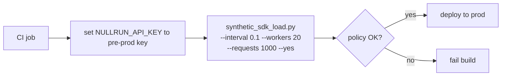
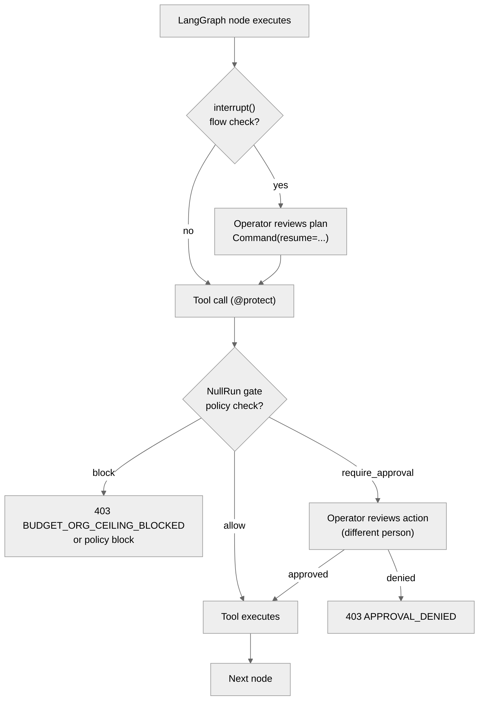

# NullRun documentation

> **To print this page:** press **Ctrl + P** (Windows / Linux) or **⌘ + P** (macOS), or use the button below.
>
> <button class="nr-print-btn" type="button" onclick="window.print()" aria-label="Print this page">🖨 Print this page</button>
>
> **To save as PDF:** in the print dialog, choose *Save as PDF* (Chrome / Edge) or *Save as PostScript* → *PDF* (Safari) as the destination.

This single-page edition contains the full NullRun documentation
flattened for printing. Use it as an offline reference — the
source-of-truth remains [docs.nullrun.io](https://docs.nullrun.io).

---

## Table of contents

1. [Getting started](#1-getting-started)
    - [1.1 First agent in 15 minutes](#11-first-agent-in-15-minutes)
    - [1.2 5-minute tour](#12-5-minute-tour)
    - [1.3 Installation](#13-installation)
    - [1.4 Quickstart](#14-quickstart)
    - [1.5 Configuration](#15-configuration)
2. [Decision model](#2-decision-model)
    - [2.1 Circuit breaker](#21-circuit-breaker)
    - [2.2 Policies](#22-policies)
    - [2.3 Tool policies](#23-tool-policies)
    - [2.4 Sensitive tools](#24-sensitive-tools)
    - [2.5 API keys](#25-api-keys)
3. [Cost & safety](#3-cost-safety)
    - [3.1 Budgets](#31-budgets)
    - [3.2 Human approval](#32-human-approval)
4. [Runtime](#4-runtime)
    - [4.1 Workflow context](#41-workflow-context)
    - [4.2 Tracing](#42-tracing)
    - [4.3 Error handling](#43-error-handling)
    - [4.4 Control plane (WebSocket)](#44-control-plane-websocket)
    - [4.5 MCP servers (Action sources)](#45-mcp-servers-action-sources)
5. [Organization](#5-organization)
    - [5.1 Approvals (UI surface)](#51-approvals-ui-surface)
    - [5.2 Notifications](#52-notifications)
    - [5.3 Alerts](#53-alerts)
    - [5.4 Team](#54-team)
    - [5.5 Billing & Plan](#55-billing-plan)
    - [5.6 Organization](#56-organization)
    - [5.7 Profile settings](#57-profile-settings)
6. [How-to](#6-how-to)
    - [6.1 Protect a LangGraph agent](#61-protect-a-langgraph-agent)
    - [6.2 Use with OpenAI Agents](#62-use-with-openai-agents)
    - [6.3 Use CrewAI](#63-use-crewai)
    - [6.4 Use with FastAPI](#64-use-with-fastapi)
    - [6.5 LLM frameworks](#65-llm-frameworks)
    - [6.6 Set a hard cost cap](#66-set-a-hard-cost-cap)
    - [6.7 Run multiple agents](#67-run-multiple-agents)
    - [6.8 Multi-agent orchestration](#68-multi-agent-orchestration)
    - [6.9 Stream responses](#69-stream-responses)
    - [6.10 Manual cost / event tracking](#610-manual-cost-event-tracking)
    - [6.11 CI / CD integration](#611-ci-cd-integration)
7. [Reference](#7-reference)
    - [7.1 SDK API](#71-sdk-api)
    - [7.2 Decorators & extractors](#72-decorators-extractors)
    - [7.3 HTTP API](#73-http-api)
    - [7.4 Error codes](#74-error-codes)
    - [7.5 Tool catalog](#75-tool-catalog)
    - [7.6 Glossary](#76-glossary)
8. [Compliance](#8-compliance)
    - [8.1 Overview](#81-overview)
    - [8.2 Data handling & vendor review](#82-data-handling-vendor-review)
9. [Operations](#9-operations)
    - [9.1 Troubleshooting](#91-troubleshooting)
    - [9.2 Performance & limits](#92-performance-limits)
    - [9.3 Framework & ecosystem positioning](#93-framework-ecosystem-positioning)
    - [9.4 Changelog](#94-changelog)

---

# 1. Getting started


## 1.1 First agent in 15 minutes

This is the recommended path from "I have an LLM app" to "NullRun is
gating my spend and tools".  Each step links out to deeper docs only
when you need them.

### 1. Sign up and create an API key

1. Go to [nullrun.io](https://nullrun.io) and sign in.
2. In the sidebar, under **Access**, open **API keys**, then click
   **New API key** in the top right.
3. Pick a name (e.g. `"my-first-agent"`) and the workflow you want the
   key bound to. Each key is **workflow-scoped** — it represents one
   agent run, not one workspace.
4. Copy the key (`nr_live_…`) shown once and store it somewhere safe
   (env var, secret manager). You'll need it in step 3.

<figure class="nr-shot">
  
  
  <figcaption class="nr-shot__caption">API keys · New key</figcaption>
</figure>

### 2. Install the SDK

```bash title="shell"
pip install nullrun
```

The plain `nullrun` package covers the full HTTP-level instrumentation
(httpx hook for OpenAI, Azure, Anthropic, Mistral, Gemini, Cohere,
Bedrock) and the auto-patch path for LangGraph, LangChain, OpenAI
Agents, LlamaIndex, CrewAI, and AutoGen. **No vendor extra is required**
— the SDK uses URL-keyed extractors, not vendor-package imports, for
all of the LLM providers above. See [Install](#13-installation)
for the full list of extras and when you would still need one.

### 3. Wire NullRun into your code

Pick the pattern that matches what you have today:

#### A. You already call `client.chat.completions.create(...)`

```python title="my_agent.py"
from openai import OpenAI
from nullrun import protect

client = OpenAI()

# @protect gates every call through NullRun before it runs.
# The runtime is created lazily on the first protected execution
# from NULLRUN_API_KEY, the HTTP instrumentation is installed,
# and tracking starts.
@protect
def answer(prompt: str) -> str:
    response = client.chat.completions.create(
        model="gpt-4o-mini",
        messages=[{"role": "user", "content": prompt}],
    )
    return response.choices[0].message.content


# `init()` auto-registers `shutdown()` via `atexit`, so a clean WS
# close happens on process exit without any explicit call. For a
# CLI script that wants fail-fast on missing config, call
# `nullrun.init(fail_on_exit=True)` instead.
if __name__ == "__main__":
    with nullrun.guard():
        print(answer("What does NullRun do?"))
        # guard() prints the structured 4-line developer report
        # on any NullRunError, then sys.exit(1).
```

Every call inside `answer()` is cost-attributed. `@protect` is the
**gate** (budget pre-flight + kill check + sensitive-tool decision),
not the tracking mechanism — tracking is handled automatically by
auto-instrumentation.

#### B. You use a framework (LangGraph / CrewAI / OpenAI Agents / AutoGen / LlamaIndex)

Auto-instrumentation does the same thing — see
[Use with LangGraph](#61-protect-a-langgraph-agent) or any of the other
[framework how-tos](#65-llm-frameworks).
The framework hook subscribes itself on the first `@protect` call.

### 4. Set a budget

In the dashboard, open the workflow your key is bound to and set a
`budget_cents`. A reasonable starter budget:

| Use case | Suggestion |
|---|---|
| Personal / dev experiment | `500` ($5) per period |
| Single-tenant internal tool | `2000` ($20) per period |
| Customer-facing AI feature | `10000` ($100) per period with alerts |

Periods are either calendar-month UTC (Lite) or your billing cycle
(paid plans via Polar). See [Budgets → Period rollover](#31-budgets)
for the detail.

### 5. Run and observe

```bash title="shell"
python my_agent.py
```

Then open the dashboard → **Workflows** → your workflow → **Executions**.
You'll see every `/gate` call (one per `@protect`-wrapped invocation),
the policy verdict (`allow` / `block` / `rate_limit`), and the cost.

For real-time spend, hit
[`GET /api/v1/orgs/{org_id}/status`](#73-http-api)
— it returns `current_spend_cents`, `budget_cents`, `time_to_exhaustion`,
and your plan caps in a single call (see the **Single-call status**
example under "Common request patterns").

### 6. Tighten or loosen

Common next steps, in rough order of how often they're needed:

1. **Block a tool** the agent shouldn't touch — see
   [Tool policies](#23-tool-policies) and the
   recommended ToolBlock starter list in the
   [Tool catalog](#75-tool-catalog).
2. **Allow over-budget for long agents** — see
   [Chain context → soft mode](#41-workflow-context).
3. **Forward every error to Sentry** — see
   [Error handling → on_error hook](#43-error-handling).
4. **Pre-flight keys before risky calls** — see
   [Human approval](#32-human-approval).

### What this walk-through didn't cover

- **Multi-process / multi-key** patterns — see
  [Run multiple agents](#67-run-multiple-agents).
- **Streaming responses** — see
  [Stream with chain heartbeat](#69-stream-responses).

### Where to read next

- [Concepts → Circuit breaker](#21-circuit-breaker) —
  the mental model behind `@protect`.
- [Concepts → Error handling](#43-error-handling) — the
  three-layer error model and the structured four-line developer report.
- [Concepts → Workflow context](#41-workflow-context) — what the
  `with nullrun.workflow(...)` block does.


title: 5-minute tour
maturity: stable
description: Five-minute walkthrough of the NullRun dashboard, policies, and SDK — enough to evaluate the platform end-to-end.
## 1.2 5-minute tour

This is the shortest path from "I have never used NullRun" to
"I shipped an agent to production and it tripped a budget cap." It
mirrors the dashboard tour at `nullrun.io/onboarding` — same five
screens, same five CLI commands.

> **If you want to install first**, jump to [Install](#13-installation) and
> come back. This tour assumes `nullrun` is already installed and an
> API key is exported as `NULLRUN_API_KEY`.

### What you will build

A LangGraph agent that:

1. Calls `gpt-4o-mini` through the NullRun gate
2. Has a hard $0.50 budget per workflow
3. Trips the circuit breaker when it tries to call `send_email`
4. Recovers cleanly after you raise the budget

You will see each step land in the dashboard as a real audit row.

### Step 1 — Create an organization

If you do not already have one, open `nullrun.io/onboarding`,
pick a name ("Acme AI"), and click **Create**. The dashboard
provisions an `organization_id` and a default `policy_id` that
allows everything except destructive tools.

!!! note "What you see"
    On the dashboard home, a single card shows: organization name,
    default policy name (`Permissive`), and an "API keys" tile that
    is empty until step 2.

### Step 2 — Create an API key

In the dashboard:

1. In the left sidebar, under **Access**, click **API keys**.
2. Click **New API key** in the top right.
3. In the dialog, pick the **Workflow** the key belongs to (the
   tour-agent workflow you just created) and name the key
   `tour-agent`. Pick an expiration — **Never**, **24 hours**,
   **7 days**, **30 days**, or **90 days**.
4. Click **Create**.
5. Copy the `nr_live_…` public identifier and the HMAC secret.
   The secret is shown **once** — store it in your secrets manager
   immediately.

<figure class="nr-shot">
  
  
  <figcaption class="nr-shot__caption">API keys · New key</figcaption>
</figure>

Export both in your shell:

```bash title="shell"
export NULLRUN_API_KEY="nr_live_xxxxxxxxxxxxxxxx"
export NULLRUN_SECRET_KEY="hmac_xxxxxxxxxxxxxxxxxxxx"
```

!!! warning "Where the HMAC secret lives"
    The SDK pulls the HMAC secret via `POST /api/v1/auth/verify` on
    first use, then caches it in memory. Re-exporting the env var
    does NOT invalidate an existing cached secret — restart your
    process to pick up a new one.

### Step 3 — Wire up the agent

Create a file `tour_agent.py`:

```python title="tour_agent.py"
import nullrun
from nullrun import protect, NullRunBudgetError
from langchain_openai import ChatOpenAI

llm = ChatOpenAI(model="gpt-4o-mini")

@protect
def ask(question: str) -> str:
    return llm.invoke(question).content

if __name__ == "__main__":
    for i in range(20):
        try:
            print(f"[{i}]", ask("Tell me a one-sentence joke."))
        except NullRunBudgetError as exc:
            print(f"[{i}] BLOCKED:", nullrun.format_user_message(exc))
            break
```

The first `@protect` call creates the runtime from `NULLRUN_API_KEY`.

Run it:

```bash title="shell"
pip install nullrun langgraph langchain-openai
python tour_agent.py
```

You will see ~7–10 successful LLM calls, then
`BLOCKED: You've used all your support credits. Upgrade to keep chatting.`
(or whatever your catalog wording is).

### Step 4 — Watch the decisions

Open `nullrun.io/control-center/audit` (the dashboard **Audit log**
page, under **Governance** in the sidebar). You will see:

- One row per `@protect` call across four columns: **Time**,
  **Decision**, **Rule**, **Actor**.
- `decision = allow` for the first ~7–10 rows. The **FilterBar**
  above the table has period preset chips (1h / 24h / Today /
  7d / 30d / 90d / All), decision chips, and an event-type selector.
- `decision = block` on the last row with `error_code = NR-B004`,
  `wire = BUDGET_HARD_BLOCKED` — click the row to open the
  **DetailPanel** and see the budget snapshot at the time of the
  block.

<figure class="nr-shot">
  
  
  <figcaption class="nr-shot__caption">Governance · Audit log</figcaption>
</figure>

Each row is recorded by the gateway's audit pipeline and surfaces
in your own customer's audit trail identically.

### Step 5 — Trip a ToolBlock

Edit `tour_agent.py` and add a second protected function:

```python title="tour_agent.py"
@protect
def send_email(to: str, body: str) -> None:
    # Pretend SMTP call.
    print(f"SMTP → {to}: {body}")
```

Then call it from `__main__`:

```python title="tour_agent.py"
# After the loop:
try:
    send_email("test@example.com", "hi from the tour")
except nullrun.NullRunToolBlockedError as exc:
    print(f"BLOCKED:", nullrun.format_user_message(exc))
```

Run it again. The dashboard shows a `decision = block` row with
`error_code = NR-T001`, `wire = TOOL_BLOCKED`. New organizations
ship with a permissive default policy; if your admin has added a
stricter default, you may see additional blocks.

To allow `send_email`, open **Policies** in the sidebar, find the
tool-block rule that matches `send_email`, and either narrow the
pattern or scope it to a different workflow.

### Step 6 — Raise the budget and try again

Back in the dashboard:

1. Open the tour-agent workflow and stay on the **Overview** tab.
2. In the budget card, raise the cap to `$5.00` (500 cents).
3. Save.

Re-run `tour_agent.py`. The loop now completes all 20 calls. The
**Overview** tab's spend bar shows ~$0.40 used (depending on token
counts), and the progress bar sits at ~8%.

### What next?

| You want to… | Open |
| --- | --- |
| Understand the gate in depth | [Concepts → Circuit breaker](#21-circuit-breaker) |
| Wire up multiple agents | [How-to → Run multiple agents](#67-run-multiple-agents) |
| Add an approval flow for sensitive tools | [Concepts → Human approval](#32-human-approval) |
| Stream responses | [How-to → Stream responses](#69-stream-responses) |
| Deploy to production behind your gateway | [Configuration → Behaviour](#15-configuration) |

!!! tip "Where to send feedback"
    Email `support@nullrun.io` with the dashboard's
    **Help → Send feedback** form filled in. Include the workflow ID
    (top-right of any dashboard page) and the failing row's
    `decision_id`.


## 1.3 Installation

### Python SDK

```bash title="shell"
pip install nullrun
```

Verify:

```bash title="shell"
python -c "from nullrun import protect; print('ok')"
```

> **First `@protect` call builds the runtime.** Initialization is
> lazy, process-wide, and triggered by the first `@protect` call —
> see the mental-model diagram in [Quickstart](#14-quickstart).

> **No local mode.** If `NULLRUN_API_KEY` is missing when the first
> `@protect` call hits the runtime, the SDK raises
> `NullRunConfigError` (NR-C001) at the gate. Every gate decision
> is server-side — a silent local fallback would bypass the backend
> gate.

### API key

Sign in at [nullrun.io](https://nullrun.io), open **API keys**, and create a key. Each key is minted with a public
identifier (`nr_live_...`) plus a server-side HMAC secret. The SDK
transparently obtains the HMAC secret via:
```http
POST /api/v1/auth/verify
```

on first use, so you only need to export the key as an environment
variable:

```bash title="shell"
export NULLRUN_API_KEY=nr_live_...
```

The SDK reads `NULLRUN_API_KEY` on the first `@protect` call. The HMAC
secret is **not** a constructor argument — it is read from
`NULLRUN_SECRET_KEY` or returned by `/api/v1/auth/verify`.

> **Explicit `init()`.** The first `@protect` call creates the
> runtime lazily from `NULLRUN_API_KEY`. Call `init()` directly when
> you want fail-fast on a missing key before the first gate call
> (CI / smoke tests), or to bind an API key from a non-env source.
> CLI scripts that want a clean `sys.exit(1)` on missing config can
> pass `init(fail_on_exit=True)`. See
> [Reference → init](#71-sdk-api)
> for the contract.

For env-var setup (`NULLRUN_API_KEY`, `NULLRUN_SECRET_KEY`, and other
runtime flags), see [Configuration](#15-configuration).

### Auto-instrumentation

The SDK's auto-instrumentation runs **lazily on the first protected
execution path**, not at import time or in any pre-`@protect` hook.
The lazy trigger creates the runtime, reads `NULLRUN_API_KEY`, installs
the HTTP instrumentation, and attaches every framework / transport
hook it can detect in `sys.modules` in a single process-wide
idempotent step.

| Detected | Coverage |
| --- | --- |
| `openai` ≥ 1.0 | HTTP transport hook (httpx) |
| `openai-agents` | Agent framework hook (`Runner.run` / `run_streamed`) |
| `anthropic` | HTTP transport hook (httpx) |
| `langgraph` | Graph runtime hook (`Pregel.invoke` / `stream` / `ainvoke` / `astream`) |
| `langchain` | Callback manager hook (`BaseCallbackManager`) |
| `llama-index` | LlamaIndex tool/agent hook |
| `crewai` | CrewAI EventBus bridge (1.15+) |
| `autogen` | AutoGen agent runtime hook |
| `mistralai`, `google-genai`, `cohere`, `boto3` (bedrock) | per-vendor URL-keyed extractors |

The Gemini vendor extra is `google-genai` (the actively maintained
package, ≥ 1.0); the older `google.generativeai` package is **not**
supported.

In every case the call is cost-tracked automatically — `@protect` is
not required for tracking. `@protect` is the **gate** layer (budget
pre-flight + kill/pause + sensitive-tool decision).

#### Zero-activity diagnostic

If `@protect` fires 50+ times without the runtime observing a single
`track_llm` event (i.e. your code path never reaches an LLM call, or
auto-instrumentation never attached), the SDK logs **one WARNING**
naming the three most likely root causes — no spam, warn-once.

### Optional extras

The plain `pip install nullrun` package covers every LLM provider
(OpenAI, Anthropic, Mistral, Gemini, Cohere, Bedrock) via URL-keyed
httpx extractors — those vendor SDKs are **never imported** by
NullRun. Framework hooks for LangGraph / CrewAI / OpenAI Agents /
LangChain / LlamaIndex / AutoGen auto-attach at runtime when the
framework package is installed in the same environment as `nullrun`;
no install extra is needed.

| Extra | Installs | When you need it |
| --- | --- | --- |
| `nullrun[opentelemetry]` | `opentelemetry-api`, `opentelemetry-sdk` | OTel span export |
| `nullrun[dev]` | `pytest`, `pytest-asyncio`, `respx`, `mypy`, `ruff`, `coverage` | Local development and CI |

To pair NullRun with a framework hook, install the framework
alongside `nullrun`:

```bash title="shell"
pip install nullrun langgraph langchain-openai
pip install nullrun crewai
pip install nullrun openai-agents
```


## 1.4 Quickstart

Wrap any function with **`@nullrun.protect`** to track its cost, tools, and
behaviour, and let NullRun halt it when it goes off the rails.

```python title="app.py"
from openai import OpenAI
from nullrun import protect, workflow

client = OpenAI()

with workflow("my-first-agent"):       # scopes the gate to a workflow
    @protect                           # gates every call via /check;
    def answer(prompt: str) -> str:    # lazy-creates the runtime on first call
        response = client.chat.completions.create(
            model="gpt-4o-mini",
            messages=[{"role": "user", "content": prompt}],
        )
        return response.choices[0].message.content

if __name__ == "__main__":
    with nullrun.guard():         # catches NullRunError, prints the
        print(answer("What does NullRun do?"))
        # structured 4-line developer report on failure, then sys.exit(1)
```

> **First `@protect` call builds the runtime.** It reads
> `NULLRUN_API_KEY`, installs the HTTP instrumentation hook, and attaches
> every importable framework hook in a single idempotent step. If the
> API key is missing at that point, the SDK raises `NullRunConfigError`
> (NR-C001) at the first gate call.

> **`@protect` is the entry point.** For early fail-fast (CI / smoke
> tests) before the first `@protect` call, see [Reference → init](#71-sdk-api).

> The `with workflow("..."):` block binds every `@protect` call inside
> to a named workflow — required, otherwise the SDK falls back to an
> ad-hoc workflow_id with no budget policy attached. For production,
> the workflow name should match the dashboard workflow your API key
> is bound to.

Every call inside `answer()` is cost-attributed and governed by your
workspace policy. On any policy outcome (budget cap, tool block, rate
limit, transport outage), `with nullrun.guard():` prints the structured
four-line developer report (`error_code` + what + where + why +
how to fix) and exits `1`.

### What gets tracked

- LLM tokens in and out
- Cost in cents (per-call and aggregate)
- Latency
- Tool calls (if you use a framework integration)

### What can go wrong

See [Troubleshooting](#91-troubleshooting) for the full table of
expected behaviours (budget cap, loop, sensitive-tool, gateway down,
kill/pause, etc.) and recovery steps. For the three-layer error model,
see [Concepts → Error handling](#43-error-handling).

### Next

- [Concepts → Circuit breaker](#21-circuit-breaker)
- [Concepts → Control plane](#44-control-plane-websocket)
- [Concepts → Error handling](#43-error-handling)
- [How-to → Set a hard cost cap](#66-set-a-hard-cost-cap)
- [How-to → Use with LangGraph](#61-protect-a-langgraph-agent)


## 1.5 Configuration

NullRun reads configuration from environment variables. The runtime
is created lazily on the first protected execution. Only
`NULLRUN_API_KEY` is required; everything else has sensible defaults.

Variables are read by the Python SDK process on the first `@protect`
call. The gateway is operated by the NullRun team and exposes no
user-facing runtime flags.

### SDK env vars

Read by the SDK transport when the runtime is created on the first
`@protect` call. None of these affect the gateway.

| Variable | Default | Description |
| --- | --- | --- |
| `NULLRUN_API_KEY` | unset (required) | API key from the NullRun dashboard (`nr_live_...`). Missing at the first `@protect` call raises `NullRunConfigError`. |
| `NULLRUN_SECRET_KEY` | unset | HMAC-SHA256 signing secret returned by `POST /auth/verify`. The SDK signs every request automatically when this is set. |
| `NULLRUN_API_URL` | `https://api.nullrun.io` | Gateway REST base URL — only override this when pointing at a regional or staging cluster. |

### Developer and CI overrides

!!! danger "Production-safe default: do NOT set these in production traffic"
    The variables below override the gate's safety defaults. They
    exist for local SDK development and CI only. Exporting them in
    a production environment silently disables protection — your
    agent will run un-gated.

| Variable | Effect | When to use |
| --- | --- | --- |
| `NULLRUN_SKIP_BUDGET_CHECK=1` | Fully bypasses the gate on every `@protect` call in the process. **For local SDK development and CI only** — do not export in production environments. Production with this flag set silently skips every policy check. | Local SDK experiments, integration tests where you want to verify business logic without gate noise. |
| `NULLRUN_SENSITIVE_FAIL_OPEN=1` | Returns a permissive result instead of failing-CLOSED when a sensitive-tool transport error blocks the gate call. | Environments without a working transport for sensitive-tool lookups — modern installs should leave this unset. |

If a CI test "passes only with `NULLRUN_SKIP_BUDGET_CHECK=1`" that's a
signal the gate is blocking what it should not — fix the gate, not
the bypass.

### Server-side configuration

NullRun runs as a managed service; the gateway is operated by the
NullRun team and exposes no user-facing runtime flags.

### Behaviour

The control-plane transport is WebSocket push with an HTTP polling
fallback that takes over when the WS connection drops repeatedly.

### See also

- [HTTP API](#73-http-api)
- [Control plane](#44-control-plane-websocket)
- [Circuit breaker](#21-circuit-breaker)


# 2. Decision model


title: Circuit breaker
maturity: stable
description: How NullRun's circuit breaker trips on a budget overrun, recovers after a cooldown, and propagates a kill signal across in-flight calls.
## 2.1 Circuit breaker

The circuit breaker stops your agent when something goes wrong. When
the agent is hitting the budget cap, calling a tool your policies
forbid, or being asked by an operator to stop — the gate returns
`block` and the SDK raises an exception, even if the agent's code
doesn't know to stop.

The underlying mechanism is a single `/api/v1/gate` evaluation per
`@protect`-wrapped call that returns `allow` / `block` /
`require_approval`.

In the dashboard, a tripped breaker shows up as the workflow's status
flipping from **Active** to **Killed** or as a flood of **block**
decisions in the **Audit log**.

### When does it trip?

The gate reacts to three categories of situation. Each is a separate
decision path inside `/gate`, but to you it all looks the same: the
next call rejects.

| Situation | What you see | Where in the dashboard |
|---|---|---|
| **Budget exceeded** (Hard mode) | Every call returns `block`; SDK raises `NullRunBudgetError` with `error_code = "NR-B004"` | Audit log, then the spend bar hits 100% |
| **Tool blocked** by policy | `block`; SDK raises `NullRunToolBlockedError` with `error_code = "NR-T001"` | Audit log |
| **Operator kill** | `WorkflowKilledInterrupt` (alias `NullRunWorkflowKilledError`) raised mid-call | Workflow status flips to **Killed** |

Rate limiting (429) and budget soft-mode blocks are returned by the
same gate but with different codes. SDK surfaces them as `error_code = "NR-R001"` and `error_code = "NR-B004"`. See [Budgets](#31-budgets) and [Policies](#22-policies).

The first two are automatic — the gate enforces them on every call.
The third needs you to click **Kill** in the dashboard or call
`POST /api/v1/workflows/{id}/kill`.

### What the agent sees

When the breaker trips, the SDK raises an exception. The exact
exception depends on what tripped it:

| Trip cause | Exception | Class |
|---|---|---|
| Budget exceeded | `NullRunBudgetError` (`error_code = "NR-B004"`) | `NullRunError` (Exception) |
| Tool blocked | `NullRunBlockedException` (`error_code = "NR-T001"`) | `NullRunError` (Exception) |
| Operator kill | `WorkflowKilledInterrupt` (alias `NullRunWorkflowKilledError`) | `NullRunError` (Exception) |

The kill signal inherits from `NullRunError`, so `try/except Exception:`
catches it like every other SDK error. To handle kill specifically
— checkpoint state, notify a supervisor, exit cleanly — catch
`NullRunWorkflowKilledError` (preferred) or `WorkflowKilledInterrupt`
explicitly. See [Error handling → Kill signal](#43-error-handling)
for the recommended handler shape.

If you use the zero-boilerplate helpers from the SDK, you don't have
to write any of this — `with nullrun.guard():` catches the standard
`NullRunError` exceptions, prints the structured four-line developer
report, and exits 1. The kill signal is the one exception:
`guard()` re-raises it so kill always reaches the top of the agent
loop. To handle kill distinctly, use bare `@protect` with an
explicit `except NullRunWorkflowKilledError:` arm.

### When the gateway is unreachable

Sometimes the gateway itself is down — DNS, network, an outage.
The mental model: critical paths (budget reservation, ToolBlock,
aggregate rate limit) refuse to run when the gateway can't be reached;
secondary signals (per-key rate limit) may let calls through. When the
gateway rejects because of an infrastructure failure, you'll see a
clear HTTP error from the SDK.

If you're seeing persistent infrastructure failures, contact support.

### When the breaker recovers

After the gateway comes back, the gate transitions automatically to
normal mode. No operator action needed — the next `/gate` call
succeeds if the policy allows it.

If the gate is blocking too often (every call rejects), look at:

1. The **Audit log** for the workflow. The reason column tells you
   why each call was blocked.
2. The workflow's **Overview** tab — the spend vs. cap bar shows
   whether you're consistently hitting the budget. Raise the cap or
   switch to a cheaper model if so.
3. **Effective policy** (on the **Policies** tab). A policy you added
   recently may be too strict — try narrowing patterns or scoping to
   one workflow before rolling out org-wide.

### Common scenarios

#### "My agent suddenly stopped responding"

Open the workflow in the dashboard. Check the state:

| Status | What happened |
|---|---|
| **Active** | The agent is fine — check the application logs for the actual error |
| **Paused** | You paused it (or an operator did). Click **Resume** to restart. See [Control plane](#44-control-plane-websocket). |
| **Killed** | You killed it (or an operator did). Create a new workflow or re-activate. |

If the status is Active but every call rejects, open the
**Audit log** and filter by `decision = block`. The reason column
shows the pattern that matched.

#### "My agent was working yesterday and is blocked today"

Look at the workflow's **Overview** tab — the spend bar. The budget
probably rolled over (new month or billing cycle renewal) and the new
period started with an empty counter. Raise the cap or wait for the
next reset.

#### "I want to test my agent without the breaker tripping"

Use a **separate workflow** with its own (low or zero) budget. Don't
disable the gate — bypassing it is a dev/test opt-out.

### See also

- [Budgets](#31-budgets) — the most common trip cause
- [Tool policies](#23-tool-policies) — your own blocking rules
- [Human approval](#32-human-approval) — the alternative to blocking
  for sensitive operations you actually want to allow
- [Troubleshooting](#91-troubleshooting) — common "why is my
  agent blocked?" questions

!!! info "Deep dive"

    A single gate evaluation can trip on three independent paths,
    and the budget and tool-block paths are fail-closed. Budget
    enforcement runs as one atomic reservation: the org-level
    ceiling applies first, then the workflow ceiling, then the
    current period's counter. Nothing is committed unless all three
    pass, so a caller can never observe a partially applied
    reservation. On overflow the reservation flips to a blocked
    state and the gate reports the spent, budget, and projected
    totals, so the rejection can be reconstructed from the error
    alone.

    Tool blocking resolves one canonical tool list from the request
    and matches it against the patterns on the effective policy.
    Names containing control characters are rejected. Pattern
    matching is glob-based: `*` alone matches everything,
    `prefix.*` matches both `prefix` and `prefix.anything`, and a
    pattern with several stars splits on each star and requires the
    literal segments to appear in order — so `*.drop_*` matches
    `s3.drop_table`. A request that supplies no tool list while
    patterns are configured is blocked, not allowed.

    Checks run in a fixed order — workflow active, parent
    ownership, cycle depth, tool block, business-impact validation,
    rate limit, then budget reservation — and evaluation
    short-circuits on the first decision that is not `allow`.
    Precedence runs `block` above `require_approval` above `allow`,
    so a blocked call is reported before any budget envelope is
    minted.

    Retrying a gate call is safe: an idempotent retry returns the
    stored response rather than minting a fresh reservation. The
    execution identifier is minted server-side and bound to the
    organization and API key, and that binding is the only source of
    truth for the reserve-then-consume pair. An organization-level
    budget is a single shared counter, so exhausting it through one
    workflow also blocks every other workflow under the same
    organization.

    The aggregate per-organization rate limit fails closed; the
    per-key limit fails open, with the budget gate as the backstop.
    A storage partition surfaces as a fast rejection rather than a
    hung request, and reservations in flight at the moment of a trip
    are cleaned up when their envelope expires, which bounds the
    cleanup window but does not remove it. Kill delivery falls back
    to heartbeat polling when the push channel is unavailable, so
    the worst-case latency of a kill is bounded by the heartbeat
    interval rather than being immediate.


title: Policies
maturity: stable
description: How BudgetLimit, RateLimit, ToolBlock, and LoopDetection policies are aggregated — most-restrictive-wins semantics across scopes.
## 2.2 Policies

A **policy** is a rule attached to your organization or a single
workflow. In the dashboard they live under **Governance → Policies**.
Each policy answers one question:

- "Is this call allowed, blocked, or does it need a human to approve?"

### What you see in the dashboard

The **Policies** page lists every policy in your org. Each row
shows:

- **Name** — you set this when you created the policy
- **Type** — what the policy caps (see the table below)
- **Scope** — applies to the whole org, or only one workflow
- **Active** toggle — on/off without deleting
- **Effective from** — when the policy was last edited

Click a policy to edit it. Changes apply to the next gate call —
there's no need to redeploy your agent.

### The three policy types

| Type | What it controls | Example value |
|---|---|---|
| **BudgetLimit** | Maximum spend per workflow per period | `5000` ($50.00) |
| **RateLimit** | Maximum calls per minute | `60` (one call per second sustained) |
| **ToolBlock** | Tools the agent must not call | `["send_*", "db.drop", "stripe.charge"]` |

Each type has a JSON config payload — see the [Tool policies](#23-tool-policies)
page for the glob-match syntax inside `ToolBlock`.

### BudgetLimit — extra fields

A `BudgetLimit` policy can carry these optional fields:

| Field | Default | What it does |
|---|---|---|
| `enforcement_mode` | `"Hard"` | `Hard` blocks on budget exceeded. `Soft` allows a bounded overdraft when an active chain is present. |
| `max_overdraft_cents` | `0` | Maximum overdraft in cents (per-org aggregate). Both `cents` and `percent` apply — the lower cap wins. |
| `max_overdraft_percent` | `0` | Maximum overdraft as percent of the budget. |
| `max_chain_duration_seconds` | `3600` | Maximum duration of a chain started under this policy before the gate refuses. |

The gate reads these fields from every applicable `BudgetLimit` and
uses **most-restrictive-wins**: `enforcement_mode` (Hard > Soft),
`max_overdraft_cents` (min), `max_overdraft_percent` (min).

#### Soft mode requirements

Soft mode requires **all three**:

1. The policy uses `enforcement_mode = Soft` (not Hard)
2. An **active `chain_id`** exists (declared via `with chain(...)`)
3. The projected cost stays within `max_overdraft_cents` and
   `max_overdraft_percent`

If any of the three is missing, soft mode is unavailable and the
gate behaves as Hard. Multiple parallel chains on the same org share
one overdraft counter — N concurrent chains do **not** multiply the
overdraft cap.

A chain dies on the first of: `op="end"`, 5 minutes of `/gate`
inactivity (idle TTL), or exceeding `max_chain_duration_seconds`.
Chain time is read server-side, eliminating clock skew between
backend nodes.

### Aggregation

When two policies in the merged set compete, the engine picks the
**most restrictive** one for numeric caps and the **union** for tool
patterns.

| Field | If two policies disagree |
|---|---|
| `budget_cents` | The smaller number wins |
| `max_calls_per_minute` | The smaller number wins |
| `enforcement_mode` | `Hard` beats `Soft` |
| `max_overdraft_cents` | The smaller number wins |
| `max_overdraft_percent` | The smaller number wins |
| `tool_pattern` / `blocked_tools` / `tools` | Both lists are merged (a tool blocked anywhere is blocked everywhere) |

You can't accidentally un-block a tool the org blocks. There is no
"allow" rule that overrides a "block" — the system is conservative
on purpose.

### Org-level vs workflow-level

A policy has one of two scopes:

- **Org** — applies to every workflow in your organization. Useful
  for "all our agents must block `db.drop`" or "everyone gets 60
  calls/min".
- **Workflow** — applies to one workflow only. Useful for "this
  specific agent gets $500/month" or "this one agent can call
  `send_email`".

Both scopes apply at the same time. There's no "overrides" — both
sets of rules run together. The dashboard's **Effective policy** tab
on a workflow page shows the merged set.

### Templates

The dashboard ships with **templates** — pre-built policies for
common patterns. To enable one:

1. On the **Policies** page, click **Templates**.
2. Pick a template (e.g. "Cap dev workflow at 100c/min" or "Block
   all write tools").
3. Click **Enable**.

The template materialises as a real policy in your org using its
config and name. Disable reverses it. Templates save you from
hand-authoring JSON.

### Plan gating

Some policy features are plan-restricted:

| Feature | Available on |
|---|---|
| `BudgetLimit` policies | All plans |
| `RateLimit` policies | All plans |
| `ToolBlock` policies | Growth+ |
| Approval rules with typed predicates | Growth+ |

If you try to create a feature your plan doesn't include, the
dashboard shows the feature greyed out with an "Upgrade" link.

### Approval rules — separate from ToolBlock

Approval rules are **not** a `ToolBlock` policy with an `action =
require_approval` field. They are a separate rule object with
`tool_patterns`, a projected-cost threshold, a typed `BusinessImpact`
predicate, and operational metadata.

When a rule fires, the gate returns `decision = "require_approval"`
and the SDK parks until the operator clicks Approve / Deny. See
[Human approval](#32-human-approval) for the full flow, the typed
`action_digest` binding, and the WebSocket push resume path.

### How to create one

1. **Governance → Policies → New policy**.
2. Pick the type (BudgetLimit / RateLimit / ToolBlock).
3. Pick the scope (Org or specific workflow).
4. Fill in the config. The dashboard validates the JSON in real
   time and shows errors before you save.
5. Save. The policy is active immediately.

<figure class="nr-shot">
  
  
  <figcaption class="nr-shot__caption">Governance · Policies · New policy</figcaption>
</figure>

To test a new policy before rolling it out broadly, scope it to
one workflow. The dashboard's **Effective policy** tab on that
workflow's detail page shows the merged result so you can see exactly
what your agent will see.

### What gets logged

Every policy decision is recorded in **Governance → Audit log**.
You can filter by:

- Workflow
- Decision type (`allow` / `block` / `require_approval`)
- Time window
- Tool name (for `ToolBlock` matches)

The audit log is the source of truth for "why did my agent stop
working at 14:32 yesterday?". Pair it with [Traces](#42-tracing) to
see the exact request that triggered the decision.

### See also

- [Tool policies](#23-tool-policies) — the `ToolBlock` matching rules
- [Budgets](#31-budgets) — how `BudgetLimit` interacts with the
  period rollover
- [Human approval](#32-human-approval) — typed `BusinessImpact` rules
  that produce `require_approval`
- [Workflows](#41-workflow-context) — where the merged policy is applied

!!! info "Deep dive"

    The merged view is computed once per policy refresh and is
    the same value the gate reads on every call, so the set an
    operator sees on a workflow's effective-policy view is not a
    second, independent computation that can drift from the one
    actually enforced. Numeric caps reduce to the smallest value
    found across every applicable policy, and tool patterns
    reduce to the union of every applicable list. A tool blocked
    at one scope cannot be unblocked at another: the merge has no
    allow arm for a block to lose.

    Decisions resolve in a fixed order, and the first outcome
    other than allow short-circuits the rest. Tool blocking is
    evaluated ahead of any budget reservation, so a call refused
    for its tool name never has a budget envelope minted for it.
    A tool block is unconditional: whatever `enforcement_mode` a
    budget policy carries, a matching pattern blocks. Rate
    limiting at the organization level is authoritative and
    refuses the call when it cannot be evaluated; the per-key
    rate limit is a secondary signal that defers to the budget
    gate rather than refusing a call on its own.

    A per-workflow budget cap is tri-state. No applicable policy
    means the per-workflow check is skipped entirely, which is a
    different thing from a cap of zero, which rejects every call.
    Collapsing the two would let an organization that meant to
    forbid spending fall through to the organization-wide cap
    instead.

    Soft enforcement belongs to budgets alone and needs three
    things at once: the policy set to soft, an active chain, and
    a projected cost inside both the cent and the percentage
    overdraft limits. If any is missing the budget behaves as
    hard. Concurrent chains on one organization share a single
    overdraft counter, so parallelism does not multiply the
    allowance. Tool-block policies and approval rules are gated
    to Growth and above; on plans without the feature the server
    refuses the mutation, and rules inherited from a higher tier
    are retained for audit while no new one can be created.


title: Tool policies
maturity: stable
description: Glob patterns for tool names with a 4 KB cap per pattern, union semantics across applicable scopes, and validation traps to avoid.
## 2.3 Tool policies

A `ToolBlock` policy decides which tools the agent is allowed to call
and which it can't. In the dashboard these rules live under a policy
of type **ToolBlock** — see [Policies](#22-policies) for the general
overview. This page covers how to write the patterns inside the
policy.

### Where you see it in the dashboard

When you create or edit a policy and pick **ToolBlock** as the
type, the dashboard shows a JSON editor for the `tool_pattern`,
`blocked_tools`, or `tools` array. The "Test pattern" preview at the
bottom lets you paste a tool name and see whether any pattern
matches — useful for debugging.

<figure class="nr-shot">
  
  
  <figcaption class="nr-shot__caption">Governance · Policies · New policy</figcaption>
</figure>

### What a tool name looks like

The agent calls tools by name. The canonical tool name format:

| Type | Format | Example |
|---|---|---|
| Built-in tool | lowercase string | `bash`, `file_write`, `execute_code` |
| MCP tool | `mcp://{server}/{tool}` | `mcp://filesystem/read` |
| Custom tool | `custom:{name}` | `custom:my_tool` |

The policy matcher is name-based. The SDK sends the tool name to the
gate, the gate checks it against every active ToolBlock policy, and
the verdict comes back as `allow`, `block`, or `require_approval`.

### How to write the patterns

Each entry in a ToolBlock policy is one of:

- **Exact name** — `"stripe.charge"` blocks only that one tool.
- **Glob** — `"send_*"` blocks anything starting with `send_`.
- **`*` alone** — blocks everything.

Each entry is capped at **4096 bytes**. The cap exists because the
matcher scans every pattern on every gate call — a 10 MB pattern
would burn CPU on each call.

The matcher runs case-insensitively against the canonical tool name.

### What a ToolBlock policy does

A ToolBlock policy **blocks** tool calls whose name matches one of
its patterns. There is no `action = require_approval` field on a
ToolBlock — for "I want a human to approve before this tool runs",
create an **approval rule** instead (see
[Human approval](#32-human-approval)). The two are separate rule
objects; ToolBlock and approval rules don't share a configuration
schema.

ToolBlock is **always Hard**: it never lets through, regardless of
the budget's `enforcement_mode`. See
[Reliability matrix](#21-circuit-breaker).
If the gate cannot evaluate the ToolBlock check (Redis or policy
cache unavailable), it fails closed — `403 TOOL_BLOCKED` (SDK
`error_code = "NR-T001"`). The agent never runs an unverified
sensitive operation.

ToolBlock and approval rules are distinct rule objects — they don't
share a configuration schema. A ToolBlock policy always *blocks*; to
require human review first, use an approval rule instead.

### A worked example

Suppose your agent has these tools: `tavily_search`, `send_email`,
`db.write`, `db.drop`, `stripe.charge`, `read_file`.

You want to:

- Allow read-only operations (`tavily_search`, `read_file`)
- Block destructive operations (`db.drop`, `stripe.charge`)
- Require approval for any outbound communication (`send_email`)
- Allow normal DB writes (`db.write`) but block `db.drop`

Two ToolBlock policies and one approval rule:

!!! info "The example below shows the request payload shape — what you POST to the dashboard / API. It's not the storage schema, just the public input format."

```json title="tool_block_policy.json"
{
  "policies": [
    {
      "name": "Block destructive",
      "type": "ToolBlock",
      "scope": "Org",
      "config": {
        "tool_pattern": ["db.drop", "stripe.*"]
      }
    }
  ],
  "approval_rules": [
    {
      "name": "Outbound needs approval",
      "tool_patterns": ["send_email"],
      "action_label": "send email to customer",
      "expires_in_seconds": 300
    }
  ]
}
```

`send_email` now triggers the approval flow (a human clicks
**Approve** in the dashboard before the call goes through). `db.drop`
and `stripe.charge` are blocked outright. The two policies do not
interact — ToolBlock checks and approval-rule checks are independent
paths in the gate.

### Validation at policy creation

The dashboard rejects invalid patterns at save time:

| Error | Cause | Fix |
|---|---|---|
| `400 bare_string_pattern` | `"pattern": "send_*"` instead of `"pattern": ["send_*"]` | Always use an array, even for one entry |
| `400 pattern_too_long` | An entry longer than the per-pattern byte cap | Split into multiple patterns |
| `400 invalid_glob` | Contains control characters | Remove `\n`, `\r`, `\t` |

### Plan gating

`ToolBlock` policies require the Custom Policies feature, which is
on **Growth+** plans. Lite and Starter can have `BudgetLimit` and
`RateLimit` policies, but not ToolBlock.

**Approval rules** (separate from ToolBlock) are gated by the
`approvals` plan feature. The per-tier cap matches:

| Plan | Approval rules allowed | Why |
|---|---|---|
| Lite | 0 | `approvals` feature disabled |
| Starter | 0 | `approvals` feature disabled (server-side invariant: `approval_rules > 0 ⇒ approvals == true`) |
| Growth | 20 | `approvals` enabled |
| Scale | unlimited | `approvals` enabled, no cap |
| Enterprise | unlimited | `approvals` enabled, no cap |

The gate enforces `approval_rules = 0` server-side on Lite and
Starter — even if you mint a key on a higher tier and downgrade,
existing rules are kept (for audit) but no new rule can be created
until the plan is upgraded back.

On Lite / Starter, the dashboard shows ToolBlock policy creation
greyed out with an "Upgrade" link.

### How to debug a block you didn't expect

If your agent reports `error_code = "NR-T001"` (wire `TOOL_BLOCKED`) on
a call you think should be allowed:

1. Open the workflow in the dashboard.
2. Click **Effective policy**. The merged set shows every ToolBlock
   pattern that could match.
3. Open the **Audit log** and filter by `decision = block` and
   the tool name. The log shows which pattern matched.
4. If a pattern is too broad (`*` matches everything), narrow it
   in the policy editor.
5. If the pattern is wrong entirely, deactivate the policy and
   re-create it with the correct list.

### See also

- [Policies](#22-policies) — the dashboard view, aggregation rules,
  and most-restrictive-wins semantics
- [Sensitive tools](#24-sensitive-tools) — the policy-driven way to
  express "this tool needs review" (not a built-in SDK list)
- [Tool catalog](#75-tool-catalog) — common tool
  names with risk ratings
- [Human approval](#32-human-approval) — the approval-rule path,
  distinct from ToolBlock

!!! info "Deep dive"

    A ToolBlock check operates on the canonical tool name and nothing
    else. The gate resolves the effective tool list from the request
    before evaluating anything, so a call carrying one tool and a call
    carrying a list are treated alike. Patterns are collected from the
    `tool_pattern`, `blocked_tools` and `tools` keys, trimmed and
    de-duplicated, so `"bash"` and `"bash "` collapse into one entry.
    Matching runs case-insensitively against the canonical name, and
    control characters in either the incoming tool name or a pattern
    are rejected before the check runs.

    The pattern language is small. `*` is the only metacharacter: it
    matches any run of characters, so `send_*` matches anything
    starting with `send_` and `bash.*` matches the bare name `bash`
    as well as dotted continuations like `bash.foo` and `bash.foo.bar`.
    A pattern with several stars, such as `*.drop_*`, matches when
    every literal segment appears in order, which is why `*.drop_*`
    matches `s3.drop_table` but not `s3.execute_drop`. `|` collapses
    several alternatives into a single entry. Neither `?` nor `**`
    is supported — both are matched as ordinary characters — and a
    bare literal matches only itself, never a substring. Each entry is
    capped at 4096 bytes, bounding the work the matcher does on every
    gate call.

    ToolBlock is always hard, independent of a budget's enforcement
    mode, and it is evaluated ahead of rate-limit and budget
    accounting, so a blocked call never receives a budget envelope. If
    the check cannot be evaluated at all, the gate fails closed. A
    block reports the pattern that fired, which is what the audit log
    records, so an unexpected block can always be traced to one entry.

    Validation at creation time rejects the configurations that would
    otherwise mean "block nothing": an empty string, an empty array,
    an empty config object, and the plural `tool_patterns` key. A typo
    such as `block_tools` or `blocked_tool` is an error rather than a
    silently ignored rule. Because `*` on its own blocks everything,
    narrowing a policy is the operator's responsibility, and the
    merged effective set is what the dashboard shows before a change
    ships. Matching never inspects tool arguments: a rule is about
    which tool runs, not what it is called with.


title: Sensitive tools
maturity: stable
description: How `@protect` plus the server-side ToolBlock policy enforce "this tool needs review" without any SDK-side sensitive list.
## 2.4 Sensitive tools

A **sensitive tool** is one that should never run without a human
paying attention. Sending an email, moving money, deleting a record —
all of these have consequences the agent can't easily undo.

The way to express "this tool needs review" in NullRun is a
**[ToolBlock policy](#23-tool-policies)** — a glob pattern that fails
the gate at `/gate` evaluation time, regardless of the SDK's local
context. This page covers the *recommended* patterns and how to wire
them.

!!! info "The canonical entry point is `@protect`"
    Every protected tool is automatically eligible for ToolParameters
    Approval Rules — `@protect` ships `tool_name + args + kwargs` on
    the wire, and the backend reads argument values out of `kwargs`
    by `param_name`. No SDK-side extractor or extra decorator is
    required.

!!! info "ToolBlock vs typed predicates"
    Two complementary mechanisms, often confused:

    - **`ToolBlock` (server-side)** — a policy rule evaluated by
      the gate on every `/gate` call. The gate fails-CLOSED if it
      cannot reach Redis or the policy cache to evaluate. This is
      the canonical "this tool is forbidden" mechanism.
    - **Typed predicates (`money_amount`, `tool_parameters`)** —
      built into approval rules in the dashboard. The gate
      evaluates a DNF over argument values, bound to the
      SHA-256 `action_digest` for tamper-proof approval. Use these
      for finer-grained rules ("refunds over $500 need
      approval", "sends to non-internal recipients need review").

    Use `ToolBlock` for hard rules ("never call `bash`"). Use typed
    predicates when the rule depends on the call's arguments.

### What a sensitive tool is, in policy terms

There is no built-in tool catalogue shipped by the SDK — every
enforcement decision is evaluated by the gate on every `/gate` call,
so you can't accidentally miss a tool you didn't register locally.
You express "sensitive" with one of two complementary mechanisms:

- **`@protect` (SDK-side, canonical)** — wraps a function and
  ships `tool_name + args + kwargs` on the wire. The backend
  reads argument values out of `kwargs` by `param_name` for
  ToolParameters approval rules. No SDK-side extractor is needed.
- **`ToolBlock` (server-side)** — a policy rule evaluated by the
  gate. The gate fails-CLOSED if it cannot reach Redis or the policy
  cache to evaluate. Use this for hard rules — "never call `bash`".
- **Approval rules with typed predicates (server-side)** — for
  finer-grained control, an approval rule references `param_name`
  and the gate evaluates a DNF of up to 5 named parameters against
  Equals / OneOf / NumericRange / Regex / Exists matchers. The
  grant is bound to the SHA-256 `action_digest` of the live
  payload; the post-approval `/execute` re-check refuses on
  drift.

For the typed-predicate wiring, see
[Human approval → typed predicates](#32-human-approval).

Recommended starter patterns (see
[Tool catalog → Recommended ToolBlock starter list](#75-tool-catalog)
for the maintained list):

| Category | Pattern examples |
|---|---|
| Money | `mcp://payments/refund*`, `mcp://stripe/charge`, `mcp://stripe/refund` |
| Email & messaging | `mcp://gmail/send`, `mcp://slack/post`, `send_email` |
| Database destructive | `mcp://postgres/drop_table`, `mcp://postgres/delete_row`, `execute_sql` |
| External API writes | `mcp://*/post`, `mcp://*/put`, `mcp://*/delete` |
| Files & storage | `mcp://s3/delete`, `file_delete`, `bash` |
| Admin | `mcp://admin/delete_user`, `mcp://admin/disable_user` |

These are the canonical tool names a policy matches against. The
**exact name** comes from your MCP server / framework integration —
see the tool catalog for the curated list with risk ratings.

### Why the SDK does not ship a built-in list

A built-in "sensitive tools" SDK list would force every framework to
register its tools against NullRun's expectations — and would be
silently wrong for any tool not on the list. The current model
inverts this:

- You write a ToolBlock policy that names the tools you care about.
- The policy is evaluated server-side on every `/gate` call.
- The decision is returned to the SDK as `TOOL_BLOCKED` (403); the SDK
  raises `NullRunToolBlockedError` with `error_code = "NR-T001"`.

The gate **does not inspect tool arguments** — it cannot distinguish
two calls to the same tool by payload. If you want a narrower rule
(e.g. "block refunds over $500"), use a typed `tool_parameters`
predicate: the SDK ships `kwargs` on the wire and the gate evaluates
a DNF of up to 5 named parameters against Equals / OneOf /
NumericRange / Regex / Exists matchers. See
[Human approval → typed predicates](#32-human-approval).

### Why ToolBlock is enforced at the gate

ToolBlock is enforced at the gate: sensitive operations never run
when the policy engine is unreachable. If the gate returns
`403 TOOL_BLOCKED` (SDK `error_code = "NR-T001"`), the SDK raises
before your function body executes. ToolBlock is **always Hard**,
regardless of the budget's `enforcement_mode`.

### What's NOT in a ToolBlock policy

A ToolBlock policy matches **tool name only** — not:

- prompt content or semantic intent
- the recipient of a payment (use a typed predicate instead)
- tool arguments beyond the `kwargs` the SDK ships on the wire
- the tool's runtime sandbox (that's your infrastructure concern)

Read operations are never sensitive regardless of the tool. The
canonical name alone decides.

### Where the sensitive list lives

You write the policy in the dashboard under **Policies** (sidebar
under **Governance**). Click **New policy**, pick **Tool block** as
the policy type, and the modal shows the **Tool pattern** field
where you enter the glob(s). The dashboard shows you the canonical
tool name for every framework integration. Your policy applies to:

- All workflows under the org (default)
- A specific workflow (scope to `workflow_id`)
- A specific API key (scope to `api_key_id`)

Per the [aggregation rules](#22-policies):
ToolBlock patterns **union** across applicable policies — every
pattern that matches fires.

### Audit trail

When a sensitive tool is blocked, the **audit log** records the
block with reason `TOOL_BLOCKED` (SDK `error_code = "NR-T001"`),
the pattern that matched, and the workflow + api_key + tool_name.
The audit log is hash-chained — see
[Audit records](#43-error-handling).

This gives you a complete audit trail of every blocked attempt,
regardless of whether the block came from your policy or from the
default `TOOL_BLOCKED` rejection of an unknown tool name.

For sensitive tools you want to allow after explicit human review,
pair them with an **approval rule** instead of removing them from
the blocking surface. The approval row in the dashboard gives you
the audit trail, and the SHA-256 `action_digest` ensures the grant
is bound to the exact action payload the SDK sent on `/gate`. See
[Human approval](#32-human-approval).

### See also

- [Tool policies](#23-tool-policies) — the actual rule structure
- [Tool catalog](#75-tool-catalog) — recommended
  patterns with risk ratings
- [Human approval](#32-human-approval) — the safer
  alternative to disabling a ToolBlock rule
- [Decorators & context managers](#72-decorators-extractors) —
  `@protect` wire payload and how the gate receives `kwargs`
- [Circuit breaker → fail-CLOSED matrix](#21-circuit-breaker)

!!! info "Deep dive"

    A pattern is not a regular expression. Alternatives are
    separated by a pipe, and a pattern with a single wildcard
    matches both the bare name and any dotted continuation past
    it, which is what lets one pattern cover a whole server's
    namespace. A pattern with several wildcards splits on each one
    and requires the literal segments between them to appear in
    order. Matching sees the tool name and nothing else, so two
    calls to the same tool are indistinguishable at this step
    whatever their payloads.

    Patterns union across every applicable policy at both org and
    workflow scope. The most-restrictive-wins rule applies within
    a single policy type, not across types; across types the gate
    takes the first outcome other than allow in its fixed order,
    and tool blocking is evaluated ahead of budget reservation, so
    a blocked call never receives a spending envelope.

    The block is unconditional. A policy's enforcement mode does
    not soften it, and when the policy set for a key cannot be
    read, the call is treated as blocked rather than allowed —
    the trade-off is a refusal that has to be retried over a
    silent pass that goes unnoticed. Enforcement also applies on
    the cost-tracking path, so an SDK that does not declare its
    tools in the request still has the same rules applied before
    the call's cost is recorded.

    Rules that depend on arguments are a different mechanism. A
    tool block cannot inspect a refund amount or a recipient;
    that needs an approval rule with typed predicates, where the
    grant is bound to a digest of the exact payload and a later
    change to that payload invalidates the grant.


title: API keys
maturity: stable
description: Scopes, two-phase rotation, revocation, and the binding between an API key, its workflow, and its policy cache.
## 2.5 API keys

An **API key** is how your code authenticates with the NullRun
gateway. The key identifies a single workflow, gives the agent the
permissions it needs, and (optionally) expires on a date you choose.

### Where you see it in the dashboard

API keys live under **Access → API keys** in the left sidebar. The
counter at the top of the page (`N / <plan-cap>`) tells you how many
keys your org has versus your plan's cap. The page shows every key
with its name, workflow, last-used timestamp, and expiration date.

Per-plan key cap: Lite = 10, Starter = 15, Growth = 100,
Scale = 350, Enterprise = unlimited (see
[Billing & Plan → Per-tier caps](#55-billing-plan)). The
cap is enforced server-side — the create handler rejects with
`plan_limit_exceeded` once you hit it.

### The mental model

Each workflow needs at least one API key to run. The key is what the
SDK uses to identify itself when it talks to the gateway. The gateway
uses the key to look up:

- Which workflow is calling (so it can apply the right policies)
- Which permissions the key has (`gate` / `execute` / `track` / `verify`)
- Whether the key is still valid (not revoked, not expired)

You mint keys through the dashboard, paste them into your
application's environment, and the SDK takes care of the rest.

### How to create a key

1. **Access → API keys → New API key**.
2. Pick a workflow to bind the key to. The dropdown lists every
   workflow in your org. (Each key is **workflow-scoped** — one key
   represents one agent run, not one workspace.)
3. Pick an **Expires** window: **Never** (default), **24 hours**,
   **7 days**, **30 days**, or **90 days**. Keys without an
   expiration are valid until revoked.
4. Click **Create**.

Scopes (`gate` / `execute` / `track` / `verify`) are auto-assigned
to every new key and are not user-customizable in the dialog — the
gateway needs all four to do its job.

The dashboard shows the new key value **once** — a string starting
with `nr_live_...`. Copy it into your secret manager **immediately**.
The dashboard will never show it again.

<figure class="nr-shot">
  
  
  <figcaption class="nr-shot__caption">API keys · New key</figcaption>
</figure>

<figure class="nr-shot">
  
  
  <figcaption class="nr-shot__caption">API keys · New key dialog</figcaption>
</figure>

### What's in the response

When you create a key, the dashboard shows:

- **Key** — the public value (`nr_live_xxx...`). Use this in your SDK.
- **HMAC secret key** — a second 32-byte hex string for request
  signing. Treat it like a password; never commit it to source
  control. The SDK stores it under `NULLRUN_SECRET_KEY`.
- **Key prefix** — the first 12 characters, used in list views.
- **Workflow** — the bound workflow (you picked this on creation).
- **Scopes** — the permissions you granted.

The dashboard shows the full key and secret **exactly once**. After
you close the modal, the values are gone forever. If you lose them,
you must rotate the key (see below).

### How the SDK uses the key

The SDK needs two values from you:

```bash title="env"
export NULLRUN_API_KEY=nr_live_xxx...
export NULLRUN_SECRET_KEY=...
```

The `api_key` is the public value the SDK sends on every request.
The `hmac_secret` is used for HMAC-SHA256 request signing — the
gateway verifies every request came from a holder of the secret.

In production deployments, HMAC is required. Without it, every SDK
request returns 401.

The runtime is created lazily on the first `@protect` call from
`NULLRUN_API_KEY`. Set `NULLRUN_API_KEY` (and `NULLRUN_SECRET_KEY`
for HMAC) in the environment before the first protected call runs:

```bash title="env"
export NULLRUN_API_KEY=nr_live_xxx...
python my_agent.py
```

The HMAC secret is read from `NULLRUN_SECRET_KEY` in the
environment. It is set once per process.

### Scopes

Each key has a list of permissions — what it can do. Only the four
values below are accepted; any other value is rejected at the API
key creation step.

| Scope | What it allows |
|---|---|
| `gate` | Call `/api/v1/gate` (the policy decision endpoint). Required for any `@protect`-wrapped call. |
| `execute` | Call `/api/v1/execute` (the post-approval re-check after a `require_approval` decision). |
| `track` | Call `/api/v1/track` (the spend tracking endpoint). Required for any LLM call. |
| `verify` | Call `/api/v1/auth/verify` (the auth handshake on first use). Almost always needed. |
| `*` | Wildcard — all of the above. The default if you don't specify. |

For most agents, the defaults work. A telemetry-only ingestor needs
just `track`. A read-only CI checker needs just `verify`.

### How to rotate a key

Rotating creates a new key and invalidates the old one. In-flight
calls finish normally.

### How to revoke a key

Revoking means deleting the key. Useful when:

- The key was leaked publicly
- The agent is decommissioned
- The workflow is being deleted

Use `POST /api/v1/orgs/{org_id}/api-keys/{key_id}/rotate` first to
generate a replacement, then `DELETE` the old one.

The key stops working immediately — no grace period.

### Listing and searching

The **API keys** page lists every key in your org. You can search
by name (substring match), filter by workflow, or filter by status
(active / revoked).

Each row shows:

- **Name** — what you set when creating
- **Workflow** — the bound workflow
- **Prefix** — first 12 characters of the key (`nr_live_abc...`)
- **Last used** — when the SDK last made a request with this key
- **Expires** — when the key stops working (or "Never")
- **Status** — active / revoked

Click a row to see full details. The full key value is never shown
again — only the prefix.

### Common questions

#### "How many keys do I need?"

One per workflow, minimum. For production:

- **One key per environment** — separate keys for production,
  staging, dev. Makes it easy to revoke staging without affecting
  production.
- **One key per service** — if your agent runs in three
  containers, give each its own key. Makes it easy to rotate one
  without restarting the others.

Do not disable the gate in production — you'll lose enforcement.

#### "Can I share a key between two workflows?"

No. Each key is bound to exactly one workflow at creation time.
If you need the same agent logic against two workflows (for example,
A/B testing), create two keys and switch between them based on your
A/B routing.

#### "What happens when my key expires?"

The key stops working at the expiration timestamp. Calls return
`401 api_key_expired`. Rotate the key (which generates a new secret
but keeps the same key value) or create a new key entirely.

#### "Can I see who used a key?"

The **Last used** column shows the most recent activity. The audit
log shows every individual call. The audit log records the
key prefix, not the full key — so you can correlate usage without
exposing the secret.

### See also

- [Workflows](#41-workflow-context) — what the key is bound to
- [Troubleshooting](#91-troubleshooting) — "why am I getting 401?"
- [Configuration](#15-configuration) — env vars
  for keys

!!! info "Deep dive"

    A key is two independent secrets minted together at creation: the
    raw key that the SDK sends on every request, and a separate signing
    secret used for HMAC request signing. The two are generated
    independently and neither is derived from the other. A signature
    covers the timestamp, the key, and a hash of the request body, and
    the gateway compares it in constant time. Because the timestamp is
    part of the signed material, replay protection is an age check
    against a sliding freshness window rather than stored nonces.

    Both secrets are shown exactly once. Losing the raw key forces a
    rotation; losing the signing secret forces regeneration even when
    the raw key is intact. Signing secrets are multi-version: several
    versions remain valid at the same time, so an SDK still signing
    with the previous secret keeps working while everything else has
    already moved to the new one. Rotation has no downtime window.

    Revocation is two-phase. The key first enters a rotating state,
    requests already in flight are allowed to finish, and only then
    does the key become terminal, so a long-running check cannot lose
    its reservation partway through. If in-flight accounting is
    unavailable, the request is rejected rather than admitted: the
    drain guarantee cannot be made, so the call fails closed.

    Key identifiers are minted server-side and bound to the owning
    organization; caller-supplied identifiers are rejected. A key is
    bound to exactly one workflow at creation, and the full set of
    scopes is assigned automatically rather than chosen. Last-used
    timestamps are refreshed on every authenticated request.


# 3. Cost & safety


title: Budgets
maturity: stable
description: Hard and soft budget enforcement, billing-period rollover, and the reserve / consume invariant that protects against implicit re-reservation.
## 3.1 Budgets

A **budget** is the most important number on the dashboard. It's the
maximum amount of money a workflow is allowed to spend in a billing
period. Set it too low and your agent stops working. Set it too high
and a runaway agent burns through real money before you notice.

This page covers what the budget controls, how the dashboard shows
it, and what happens at each boundary.

### Where you see it

On the **Workflows** detail page, the budget appears as a progress
bar near the top:

```
Spend this period         $47.30 of $50.00  (95%)
████████████████████████░░
Time to exhaustion         ~16 hours at current rate
```

Three numbers:

- **Spend this period** — total cents spent since the last period
  rollover. Resets automatically.
- **Budget** — the cap. Set this in workflow settings.
- **Time to exhaustion** — at the current rate of spend, when the
  budget will run out. Useful for "should I raise the cap?".

### What the budget covers

The budget covers **spend**, not calls. Calls are rate-limited
separately — see [Policies](#22-policies).

"Spend" is calculated from token counts reported by your LLM
provider. The dashboard knows the per-model pricing for every model
the SDK tracks:

- **Input tokens** × input rate
- **Output tokens** × output rate
- **Cache read** / **cache write** tokens (if your provider exposes
  them) at their respective rates
- **Reasoning tokens** for o1/o3-style models at the reasoning rate

The total spend is the sum across all `@protect` calls inside the
workflow, across the current period.

### Periods

A "period" is the window after which the spend counter resets.
NullRun has two period sources:

| Plan | Period source | When it resets |
|---|---|---|
| **Lite** (free) | Rolling 1-month window anchored at `organizations.created_at` | One month after signup (e.g. signed up Jun 15 → resets Jul 15, Aug 15, …) |
| **Paid** (Starter / Growth / Scale) | Your billing cycle (Polar subscription) | Set when you subscribed; on renewal |

The dashboard shows the period start and end dates next to the
spend bar. When the period rolls over, the spend counter resets to
zero and the budget applies fresh.

### What happens at the boundary

Three scenarios, depending on the workflow's [enforcement
mode](#22-policies):

#### Hard mode (default)

```
Spending → $49.95 of $50.00
Next @protect call:        #2.00 projected
gate decision:             block
SDK raises:                 NullRunBudgetError (NR-B004)
with nullrun.guard():     prints the 4-line dev report, sys.exit(1)
```
<figcaption>Hard mode — the projected cost of the next call exceeds the remaining budget. The gate returns `block` before the model runs.</figcaption>

The agent stops cleanly at the boundary. No partial charge — the
projected cost is reserved when the gate approves, and the actual
cost is reported after the LLM returns. If the call is denied, no
charge happens.

#### Soft mode

Soft mode lets the agent run past its budget when an active chain is
present, up to the configured overdraft cap
(`max_overdraft_cents` or `max_overdraft_percent`, whichever is
lower). The chain returns to standard Hard mode once the cap is
exhausted. See [Policies → BudgetLimit extra fields](#22-policies)
for the full configuration contract.

### How to set the budget

The first time you create a workflow, no budget cap is configured.
`max_budget_cents == 0` means **"no per-key budget configured"** —
the gate passes through to the org-level plan cap, not "block
everything" — so the agent runs against the org's default policy
until you raise the per-key cap.

To set the budget:

1. Open the workflow.
2. Click **Settings**.
3. Find **Budget** and enter cents (`$50` = `5000`).
4. Save.

<figure class="nr-shot">
  
  
  <figcaption class="nr-shot__caption">Workflows · Budget card</figcaption>
</figure>

Reasonable starting budgets:

| Use case | Suggested budget |
|---|---|
| Personal / dev experiment | $5 (500 cents) per period |
| Single-tenant internal tool | $20 (2000 cents) per period |
| Customer-facing AI feature | $100 (10000 cents) per period, plus an alert at 80% |

The dashboard warns you when spend crosses 80% of the cap and again
at 100%. Configure alert destinations under **Notifications** in
the sidebar (Channels + Alert rules + Event subscriptions matrix).

### What happens when you change the budget mid-period

- **Raise**: the new cap takes effect immediately. The next gate
  call uses the new cap.
- **Lower below current spend**: the agent doesn't get retroactive
  refunds, but every call from this point onward rejects until the
  spend drops (which only happens at period rollover, since the
  counter is monotonic within a period).

### Why cents, not dollars

The dashboard stores everything in cents to avoid floating-point
rounding in pricing math. The `budget_cents` field in the API is
always an integer. If you set `budget_cents: 5000`, your cap is
exactly $50.00, no rounding errors.

### Reservation and consumption

The gate reserves your projected cost before the model runs and
reconciles the actual cost after. If the LLM call returns a cost
that meaningfully exceeds the reservation, the `/track` commit
rejects with `CONSUME_OVERBUDGET` (HTTP **422**, `error_code = "NR-O001"`) — no implicit re-reserve, ever. The tolerance is a
fixed cents value (`policies.consume_epsilon_cents`, default **1¢**);
no percentage-based epsilon is supported.

### Approximate budget endpoint

If you want to show "you've used X of Y" in a custom dashboard or
notification without enrolling in the full NullRun dashboard, the
gateway exposes an approximate-spend endpoint:

```bash title="shell"
curl "https://api.nullrun.io/api/v1/budget/approximate" \
  -H "Authorization: Bearer ***"
```

The response carries `current_spend_cents_estimate`, an
`is_approximate: true` flag, a `source` field, a `confidence` level
(`High` / `Medium` / `Low`), and `last_updated_at`. **Use this for
display only** — never for enforcement, rate-limit logic, or
agent-side gating. When the source is unavailable the endpoint
returns `503 BUDGET_DATA_UNAVAILABLE`; render that as "data
unavailable", never as `≈ $0 spent`.

### See also

- [Workflows](#41-workflow-context) — where the budget lives
- [Policies](#22-policies) — rate limits (separate from budget) and soft-mode fields
- [Troubleshooting](#91-troubleshooting)

!!! info "Deep dive"

    Spend is counted per organization per billing period. The period
    start is computed once, server-side, and bound into every
    reservation made for an execution, so the gate decision and the
    later commit for the same call always land in the same period even
    when a rollover happens in between. Spend within a period is
    monotonic: it returns to zero only when the period ends.

    Enforcement uses the lower of the organization ceiling and the
    workflow budget, and the organization ceiling is always strict. In
    soft mode an active chain may overdraw by the lower of the
    configured cent and percentage allowances, and concurrent chains
    share that one allowance rather than each earning their own. The
    gate reserves the projected cost before the model runs; the actual
    cost is reported afterwards and must fit inside the reserved amount
    plus a fixed tolerance, one cent by default and configurable per
    policy. A cost above that tolerance is never silently re-reserved:
    the commit is rejected with `CONSUME_OVERBUDGET` while the period
    counter still reflects the real spend. The tolerance is a fixed
    number of cents rather than a percentage, so the drift a bad
    projection can absorb does not grow with the size of the budget.

    Reservation and commit are both idempotent. A retry that arrives
    between a successful reservation and the recording of its result
    finds the reservation already in place and is told so, rather than
    reserving twice. A repeated commit for the same reservation either
    replays the original outcome or repeats the same rejection. The
    authorized amount is sealed when the gate decides, so a commit
    cannot re-check it against a cap tightened afterwards; the new cap
    governs the next call, not the one already in flight.

    The approximate-spend endpoint resolves its answer from the
    fast-path counter, the durable record, and the last known value, in
    that order, and reports a confidence level so the caller can
    qualify the number. It is advisory. When every source is
    unavailable it returns 503 rather than zero, because a missing
    figure and an empty one are different claims. A reservation that is
    never committed expires after a bounded window; a commit arriving
    after that is reported as a missing reservation, and the caller
    must gate again to obtain a fresh one.


title: Human approval
maturity: beta
description: Bind approvals to a typed BusinessImpact predicate and a SHA-256 action_digest so the grant refuses if the action payload drifts.
## 3.2 Human approval

Some operations need a human to click **Approve** before they run.
Sending an email to a customer, moving money, deleting a record —
operations where you want a paper trail and a conscious decision.

In the dashboard, pending approvals live under **Approvals** in the
sidebar. When the agent hits an approval rule, the call pauses. The
agent stays paused until a human clicks **Approve** or **Deny**, or
the approval times out.

### Approval rules — separate from ToolBlock

Approval rules are **not** `ToolBlock` policies with an `action =
require_approval` field. They are a separate concept with these
fields:

| Field | Purpose |
|---|---|
| `name` | Display name for the rule |
| `tool_patterns` | Glob patterns matching the tool name |
| `per_call_threshold_cents` | Projected-cost threshold (estimated tokens × model rate) |
| `action_predicate` | Typed `BusinessImpact` predicate |
| `priority` | Ordering for tied rules |
| `expires_in_seconds` | How long the operator has to decide |
| `action_label` | Display label shown in the dashboard |

When an SDK calls a tool that matches an approval rule, the gate
returns `decision = "require_approval"` and parks the SDK on a
`threading.Event` until the operator clicks Approve / Deny.

### Predicate kinds

Two predicate fields can fire the same approval rule:

- **`per_call_threshold_cents`** — projected execution cost in
  cents, evaluated against the SDK-reported `estimated_tokens`.
- **`action_predicate`** — a typed condition over a structured
  `BusinessImpact` extracted from the live function call.

When both are set, the rule fires only when **both** pass. Either
may be `None`, in which case it does not contribute. A rule with
both `None` matches every call.

#### Typed predicates

Two predicate kinds are supported on `action_predicate`:

1. **`money_amount`** — per-call monetary threshold.
   ```json
   {
     "kind": "money_amount",
     "direction": "outflow",
     "operator": "gt",
     "threshold_minor": 5000,
     "currency": "USD"
   }
   ```

2. **`tool_parameters`** — DNF over up to 5 named
   parameters with Equals / OneOf / NumericRange / Regex / Exists
   matchers.

   ```json
   {
     "kind": "tool_parameters",
     "trigger_logic": "any",
     "conditions": [
       {"param_name": "refund_amount", "matcher": {"kind": "numeric_range", "min": 500, "max": null}},
       {"param_name": "recipient", "matcher": {"kind": "regex", "pattern": "^(?!internal@).*"}}
     ]
   }
   ```

The `tool_parameters` predicate reads values out of `kwargs` the
SDK ships on `/execute`. Every `@protect`-decorated function ships
`tool_name + args + kwargs` on the wire — the predicate references
the value by `param_name` in the dashboard rule editor and the
gate evaluates it directly. Positional args are dropped; `float` /
`set` / custom objects are filtered; PII-masked sentinels like
`"***"` for `password` / `token` / `api_key` keys are stripped
before wire. No second decorator is needed to make a tool
eligible for `tool_parameters` rules.

### `action_digest` — tamper-evident binding

When the gate fires an approval rule with a typed `BusinessImpact`,
it computes a SHA-256 digest of the canonical-JSON
`{"kind":"money_amount", direction, operator, threshold_minor,
currency, extractor_id, extractor_version}` (Money variant) or the
`ToolCallParams` envelope (ToolCall variant). The digest is stored
on the approval row.

After the operator clicks Approve, the SDK's post-approval `/execute`
re-check sends the live `business_impact` and `action_digest` back
to the gate. The grant consume is atomic — concurrent re-checks are
serialized, and the gate surfaces `Allow` / `DigestMismatch` /
`NotFound` / `Expired` / `ReplayRejected` outcomes.

### Approval resume flow

The complete flow, end-to-end:

1. SDK sends `/api/v1/gate` with the live `BusinessImpact`. Gate
   evaluates rules. Match fires.
2. Gate creates a pending approval record with the `business_impact`,
   `action_digest`, and an `expires_at` set server-side
   (clamped `[1, 3600]` s from `expires_in_seconds`). The gateway
   then emits an `approval_required` alert to configured channels.
3. Gate returns `decision = "require_approval"` plus `approval_id`,
   `approval_timeout_seconds`, `approval_expires_at`.
4. SDK parks on `threading.Event.wait(timeout=approval_timeout_seconds)`.
5. Operator clicks Approve / Deny in the dashboard (or auto-deny
   timer fires).
6. Backend publishes `ApprovalResolved` event on the WS push
   channel.
7. SDK wakes the parked thread; agent resumes with the operator's
   outcome.
8. SDK auto-consumes the approval row via
   `POST /api/v1/approvals/{approval_id}/consume` so the row
   closes on the success path (the prior behaviour left
   `mode="inline"` rows at `status=APPROVED` past `expires_at`
   because the consume SQL was only reachable from the
   `/execute` orchestrator Step 6, which `inline` tools bypass).
   On the operator-cancel path the row closes via the spawned
   cancel step instead.

If the WS push is silent for `approval_timeout_seconds`, the SDK
**fails CLOSED**: `WorkflowKilledInterrupt` (alias `NullRunWorkflowKilledError`)
is raised and the agent dies. A silent network must not silently
approve a privileged action. There is no `/status` HTTP-poll
fallback for approvals — deliberate, the operator's word is final.

### What you see in the dashboard

The **Approvals** page lists every pending, approved, denied, and
expired request. Each row shows:

- The tool the agent wanted to call (e.g. `send_email`)
- The workflow that requested it
- The action digest (first 16 hex chars — full digest in tooltip)
- For typed predicates: the rendered impact summary
  - `Money`: `Spend $499.00 USD · 4.99× above the $100.00 limit`
  - `ToolCall`: `tool:stripe.charge` + raw `params` key/value block
- How long ago it was created
- How long until `expires_at`

<figure class="nr-shot">
  
  
  <figcaption class="nr-shot__caption">Approvals</figcaption>
</figure>

Click an approval to see the full context — what the agent was
trying to do, the tool's arguments, and any notes you attached.

### How to approve or deny

In the **Approvals** page, click an open request. You see:

1. The agent's goal (what it was trying to accomplish)
2. The tool it wants to call (e.g. `send_email`)
3. The typed impact summary or the projected cost
4. The action digest (the SHA-256 binding)
5. How long the approval has been pending

Two buttons:

- **Approve** — the gate releases the reservation, the agent's
  call resumes. On `/execute`, the gate re-checks the
  `action_digest` against the live payload and refuses on mismatch
  (returns `DigestMismatch`).
- **Deny** — the gate rejects, the agent sees `WorkflowKilledInterrupt`
  (alias `NullRunWorkflowKilledError`). The agent can catch it and
  clean up; most agents don't.

If you don't click either within the approval's `expires_at` window,
the request expires. The SDK raises `WorkflowKilledInterrupt`
(alias `NullRunWorkflowKilledError`) after `approval_timeout_seconds`
(server-clamped `[1, 3600]` s). The agent can retry or give up.

### Notification channels

When an approval is created, the gateway notifies every active
channel configured on your org:

- **Slack** — uses your org's installed Slack OAuth.
- **Webhook** — generic HTTPS POST with HMAC-SHA256 signature
  (`X-NullRun-Signature`, 5-minute clock-skew tolerance, 10-minute
  nonce replay defence).

Disable a channel per-user or per-channel under
**Notifications** in the sidebar (the page has Channels, Alert rules,
and an Event subscriptions matrix).

<figure class="nr-shot">
  
  
  <figcaption class="nr-shot__caption">Governance · Approval rules · New rule</figcaption>
</figure>

### Programmatic approval (for automations)

The dashboard is for humans. If you want a CI bot or on-call rotation
to approve requests programmatically, the same endpoints are
exposed via REST:

```bash title="approve_via_api.sh"
curl -X POST "https://api.nullrun.io/api/v1/orgs/$ORG_ID/approvals/$APPROVAL_ID/approve" \
  -H "Authorization: Bearer ***"

# Or deny explicitly
curl -X POST "https://api.nullrun.io/api/v1/orgs/$ORG_ID/approvals/$APPROVAL_ID/deny" \
  -H "Authorization: Bearer ***"
```

Both endpoints are idempotent — calling approve on an already-approved
request returns `409 approval_already_decided`; calling deny twice on
the same request is a no-op. Use these in your incident-response
automation: an approval surfaces in Slack, your bot detects the
`risk_level = high`, and approves or denies based on your runbook.

### When to use approval instead of blocking

Approval makes sense when:

- The operation is sensitive but **you want the agent to be able to
  do it** under human review (sending customer emails, creating
  invoices, deploying builds).
- The blast radius is bounded (a single email vs. an entire
  database drop).
- You have someone on-call who can review within minutes.

Blocking (not approval) makes more sense when:

- The operation is never legitimate (`db.drop` in a read-only
  workflow).
- The blast radius is unbounded (admin operations, mass deletes).
- No one is on-call to review approvals in time.

Approval is a feature, not a default. Most teams should default to
blocking and switch specific patterns to approval as the need
arises.

### What's logged

Every approval decision is in **Governance → Audit log**. You can
filter by:

- Approver (which user clicked Approve/Deny)
- Workflow
- Tool name
- Time window
- Outcome (approved / denied / expired)

The audit log is the source of truth for "who approved this?" —
both for compliance and for incident review. The action digest is the
immutable anchor that proves the operator approved the exact payload
the SDK sent on `/gate` (not "any refund" — the exact amount and
arguments).

### SDK-side envelope

The `action_digest` is **produced** by the SDK on every `@protect`
call. The envelope is the canonical NoImpact payload
(`BusinessImpact.no_impact()` — `{"kind": "none"}`); the SDK
canonicalises it (compact JSON, `nullrun/v1/business_impact:`
prefix) and SHA-256-hashes it. The digest flows onto the wire on
both `/gate` and `/execute`, and the backend re-computes the
digest from the live payload to verify the grant.

The NoImpact envelope is the same for every `@protect` call — the
SDK is policy-blind and ships only `tool_name + args + kwargs`.
Approval rules reference `param_name` in the dashboard to read
argument values for typed predicates (`money_amount` /
`tool_parameters`). No SDK-side extractor or factory is needed.

A drift between SDK and backend canonicalisation is a P0 security
regression covered by the SDK's source-pin tests.

### See also

- [Tool policies](#23-tool-policies) — `ToolBlock` rules (no
  `require_approval` action; that's a separate entity)
- [Sensitive tools](#24-sensitive-tools) — when blocking is
  enough
- [Workflows → operator controls](#41-workflow-context) —
  Pause / Kill work the same way as approval
- [API keys](#25-api-keys) — how to mint a key bound to a workflow


# 4. Runtime


title: Workflows
maturity: stable
description: Group agent calls into a named workflow, propagate parent_trace_id, and bind cost to a logical unit instead of a single session.
## 4.1 Workflow context

A **workflow** is one agent you run. In the dashboard it shows up
under **Workflows** in the left sidebar. Each workflow has its own
budget and its own list of API keys.

### What you see in the dashboard

The **Workflows** page lists every workflow you've created. Each
row shows:

- The workflow's name (you picked this when you created it)
- Whether it's **Active**, **Paused**, or **Killed**
- Total spend for the current billing period
- How many API keys are bound to it
- When it last saw traffic

Click a workflow to open its detail page. The detail page has six
tabs:

| Tab | What it shows |
|---|---|
| **Overview** | Name, status (Active / Paused / Killed), current spend vs. the installed budget cap, applied policies, and the **Pause** / **Resume** / **Kill** / **Delete** controls. This is where you change the budget cap. |
| **Policies** | The policies scoped to this workflow. Rate limit, budget limit, and tool block entries — same primitives as the org-level Policies page, filtered to this workflow. |
| **Executions** | Every gate call your agent made — allowed, blocked, rate-limited. The raw list the gate uses to decide what your agent can do. |
| **Traces** | Hierarchical view of one agent run — each LLM call, each tool call, with timing and cost. |
| **API keys** | The API keys bound to this workflow. Use **Generate API key** in the top-right to mint one; the raw key value is shown only once at creation. |
| **Coverage** | MCP servers and tools observed on this workflow in the last 30 days, with the "discovered but not registered" panel for un-enrolled servers. |

### How to create one

1. In the dashboard sidebar, click **Workflows**.
2. Click **New workflow** in the top right.
3. Give it a name (e.g. `"production-support-bot"`). The name shows
   up everywhere — keep it short. Names are 1–255 characters:
   letters, digits, space, and `_ . , - & ( )` are allowed.
4. Optionally set an **External ID** — alphanumeric with `-` and
   `_`, up to 64 characters — for integrations that need to look up
   the workflow from your own systems (e.g. a GitHub repo name or a
   customer account id).
5. Click **Create**. The budget cap is configured on the
   **Overview** tab after creation via a budget-limit policy or the
   installed budget control — there is no starting budget on the
   dialog itself.

<figure class="nr-shot">
  
  
  <figcaption class="nr-shot__caption">Workflows · New workflow</figcaption>
</figure>

<figure class="nr-shot">
  
  
  <figcaption class="nr-shot__caption">Workflows · Create dialog</figcaption>
</figure>

<figure class="nr-shot">
  
  
  <figcaption class="nr-shot__caption">Workflows · Workflow detail</figcaption>
</figure>

You'll land on the new workflow's detail page. From there:

- **Mint an API key** under the **API keys** tab. The key value
  (`nr_live_...`) is shown **once** — copy it into your secret
  manager immediately.
- **Point your SDK at it**: export `NULLRUN_API_KEY` and the workflow
  binding happens server-side.

### How to control one

Each workflow has three states that you control from the dashboard
or via the API: **Active**, **Paused**, and **Killed**. Both Pause
and Kill reach your running SDK over a WebSocket push; the agent
doesn't have to wait for the next call to learn. See
[Control plane](#44-control-plane-websocket) for the full contract, the
exceptions each state raises, and how the signal travels over the
WebSocket.

### The workflow's settings

Five things you control per workflow:

- **Budget** — the per-period cap in cents. Set this first. The
  dashboard shows a horizontal bar of how much you've spent vs. the
  cap.
- **Enforcement mode** — `Hard` (block on budget exceeded) or
  `Soft` (allow over-budget up to an overdraft cap, when there's an
  active chain). Full configuration in
  [Policies → BudgetLimit extra fields](#22-policies).
- **Human approvals** — turn on to require operator approval for
  dangerous tools (payments, deletes, external API mutations).
  Available on Growth+ plans.
- **Tool block list** — the patterns the agent must not call. See
  [Tool policies](#23-tool-policies).
- **Trace retention** — how long to keep detailed per-call traces
  (default 30 days, plan-gated up to 90).

### Chain context

A **chain** is a logical grouping across multiple `@protect` calls
inside one user request, declared via `with chain(...)`. Chains are
auto-registered on the first `/gate` call: the chain transitions
from `null → ACTIVE` atomically.

#### When chains end

A chain dies on the **first** of:

- `op="end"` is reached in the context manager
- 5 minutes of `/gate` inactivity (idle TTL)
- `max_chain_duration_seconds` exceeded (default 3600)

For long streams, send a `POST /heartbeat` every 30 seconds — see
[Heartbeat → how-to](#69-stream-responses).

#### Why chains exist

Chains exist primarily to enable **soft-mode budget gating**: with
an active chain, the gate allows the agent to run past its budget
up to an overdraft cap (`max_overdraft_cents` or
`max_overdraft_percent`, whichever is lower). Full soft-mode
contract in
[Policies → BudgetLimit extra fields](#22-policies).

### How the workflow ends

A workflow doesn't have an explicit "end" state in the sense of a
final commit. Instead:

- The workflow stays **Active** across many agent runs. Each run is
  a sequence of `@protect` calls.
- A run is **logically ended** when the agent's loop returns or
  throws.
- A workflow is **paused** or **killed** when you decide, or when
  plan limits (max workflows per plan) cause auto-pause.

There is no "clean up the workflow when done" step. Active workflows
keep their policy, budget, and key bindings. Re-run the agent next
week and the same workflow handles it.

### See also

- [Budgets](#31-budgets) — the budget cap and how rollover works
- [Policies](#22-policies) — what rules attach to a workflow
- [Control plane](#44-control-plane-websocket) — how Kill / Pause reach your agent
- [API keys](#25-api-keys) — how to mint a key bound to this workflow

!!! info "Deep dive"

    A workflow combines a durable record with a runtime state that
    the control plane can move between Active, Paused and Killed.
    Transitions are validated rather than free-form: Killed is
    terminal, and there is no path out of it, so a workflow that has
    been killed has to be created again to be used again. Every
    transition an operator triggers writes an audit entry and is
    pushed to the agents attached to that workflow, so a manual kill
    is visible both in the audit log and in the dashboard.

    Delivery is a WebSocket push to connected agents, and it is
    authenticated per organisation: frames are signed, an upgrade that
    tries to carry a credential in the query string is refused, and
    an envelope belonging to a different organisation is dropped
    rather than forwarded. An agent that cannot hold a WebSocket open
    falls back to polling, and that path is bounded by a short
    server-side cache window, so a workflow observed only by polling
    reflects the new state at most about a minute late. If both
    channels are unavailable, the agent learns of the kill on its next
    gate call, which makes the worst case roughly one LLM call.

    A chain is a separate, opt-in construct. It is created on the
    first gate call inside the context manager and ends on whichever
    comes first: the context manager closing, a five-minute idle
    window, or the configured maximum chain duration. The idle window
    is fixed rather than configurable, so an agent doing long work
    between calls has to send a heartbeat roughly every thirty
    seconds or the chain lapses mid-run. Chains exist to give
    soft-mode budget gating something to reason about — with an active
    chain the gate can let an agent run past its budget up to an
    overdraft cap. Nothing else depends on them, and there is no
    background sweeper: expiry of the idle window is what reaps a
    chain that was never closed.

    A single state change fans out to several consumers — connected
    agents, alerting, the dashboard, and policy cache invalidation —
    so a pause takes effect consistently across enforcement and
    reporting rather than in one of them.


title: Tracing
maturity: stable
description: OpenTelemetry-style spans for every gate decision, with parent_trace_id propagation so the dashboard renders a true waterfall.
## 4.2 Tracing

A **trace** is everything that happened during one run of your agent.
In the dashboard they live under **Executions** and **Traces** in the
sidebar. Each execution is one agent run; the trace view shows the
nested structure of every LLM call, every tool call, and how long
each took.

If a user reports "the agent did something weird at 14:30", the
tracing tab is where you go to see exactly what happened.

### What you see in the dashboard

The **Executions** page lists every agent run. Each row shows:

- **Workflow** — which workflow ran this
- **Started at** — timestamp
- **Duration** — total run time
- **Status** — completed / failed / killed
- **Cost** — total cost for this run
- **LLM calls** — how many LLM invocations

<figure class="nr-shot">
  
  
  <figcaption class="nr-shot__caption">Executions</figcaption>
</figure>

<figure class="nr-shot">
  
  
  <figcaption class="nr-shot__caption">Traces · Waterfall</figcaption>
</figure>

Click an execution to open the **Trace** view. The trace is a
hierarchical tree:

```
Run "user-123-research"     2m 14s   $0.42
├─ Step 1: plan             0.3s    $0.01
│  └─ llm.call (claude-sonnet-4-5)    0.3s    $0.01
├─ Step 2: research         45s     $0.18
│  ├─ llm.call (claude-sonnet-4-5)    12s     $0.06
│  ├─ tool.call (tavily_search)       8s      —
│  └─ llm.call (claude-sonnet-4-5)    22s     $0.12
├─ Step 3: write             30s     $0.12
│  └─ llm.call (claude-sonnet-4-5)    30s     $0.12
└─ Step 4: review            17s     $0.11
   └─ llm.call (claude-sonnet-4-5)    17s     $0.11
```

Three things you can read off this tree at a glance:

- **Where the time went** — the longest step is where to optimise.
- **Where the money went** — same, but for cost.
- **What the agent did** — each tool call and LLM call is
  clickable, showing the full request/response.

### How a trace is built

When you use the SDK's `@protect` decorator or `with workflow(...)`
context manager, the SDK automatically creates spans:

| Action | What gets a span |
|---|---|
| `@protect` decorator | One span per gate call |
| `with workflow("name"):` | One span for the whole workflow run |
| `with chain("id"):` | One span for the chain |
| `with span("phase"):` | One span for the named phase |

You don't have to add tracing manually — it comes from the
decorators and context managers you already use. The SDK sends
trace metadata alongside every `/gate` and `/track` call.

For nested agent orchestrations (a supervisor calling sub-agents),
each sub-agent's spans are nested under the supervisor's. The trace
view shows the tree; the **Cost** column rolls up automatically.

### What each span contains

Click any span in the trace tree to see:

- **Span ID** — unique identifier (UUID)
- **Parent span ID** — for nesting
- **Started at** / **Duration** — timing
- **Status** — completed / failed / killed
- **Inputs** — the prompt metadata sent to the LLM (truncated if
  huge). **Prompt content is NOT stored** — NullRun never persists
  raw prompt text or LLM response bodies. See
  [Audit records → What is NOT stored](#43-error-handling).
- **Outputs** — the LLM's response metadata (token counts, model,
  finish reason). **Raw completions are NOT stored.**
- **Cost** — input + output tokens × model rate
- **Tool calls** — every tool the span invoked (with arguments)
- **Decision** — the gate verdict (`allow` / `block` /
  `require_approval`) and which policy triggered it

For blocked calls, the **Decision** row is the most useful — it
links to the policy that matched and shows the rule.

### How long traces are kept

Trace retention follows your plan's `history_days` window:

| Plan | Trace retention |
|---|---|
| Lite | 3 days |
| Starter | 7 days |
| Growth | 30 days |
| Scale | 90 days |
| Enterprise | unlimited |

After the retention window expires, the trace is removed from the
dashboard; the aggregated cost information stays (it's summarised
per workflow per period).

The retention window is independent of the trace *generation* caps
— Lite also throttles to **10 000 tokens/hour** and **75 000
executions/month** (see [Billing & Plan → Per-tier caps](#55-billing-plan)),
so a Lite workflow's traces stop accumulating well before the 3-day
window applies.

If you need longer retention for compliance, you can export traces
from the dashboard as JSON via the **Export** button on the
Executions page. The exported shape matches the wire format.

### Span identifiers and correlation

Each span has three identifiers:

| Field | Purpose |
|---|---|
| `trace_id` | The whole agent run — same across every span in one execution |
| `span_id` | One call — unique per `@protect` invocation |
| `parent_trace_id` | For sub-agents — the orchestration trace they belong to |

You can search the dashboard by any of these. If a customer reports
a problem with `trace_id = abc-123`, you can pull the full trace and
every decision tied to it from the audit log.

### How to use tracing during development

When you're building a new agent, traces tell you:

- **Is the agent slow?** — sort by duration, see which LLM call
  takes the most time.
- **Is the agent hitting the budget?** — look for spans with
  `decision = block / NR-B004`.
- **Is the agent calling tools you didn't expect?** — the trace
  shows every tool call with arguments.

When you're debugging a production issue, traces answer:

- **What did the agent do at 14:30 yesterday?** — filter by time
  range, click each execution, walk the trace.
- **Why did the call to `send_email` fail?** — the trace shows
  the call's status and decision. If it was blocked, the linked
  policy explains why.
- **How much did this single run cost?** — the top of the trace
  shows the total; the leaves show the per-call breakdown.

### Common questions

#### "My trace shows nothing"

If the runtime was never created (the first `@protect` call never
fired) or the API key is missing, the SDK runs in error mode and no
spans are recorded. Check the SDK logs for
`NullRunAuthenticationError`.

#### "My trace is incomplete — only some spans show up"

The SDK buffers events and flushes on a timer. If your process
crashes before the flush, the in-flight spans are lost. `init()`
auto-registers `nullrun.shutdown(flush=True)` via `atexit`, so a
clean process exit always reaches the gateway; the explicit call
only matters when you need an early teardown or a
`shutdown(flush=False)` flush cancel between tests.

#### "Why are some spans duplicated?"

The SDK's auto-instrumentation emits one span per LLM call. If you
also call `track_llm` manually for the same call, you'll see two
spans. Pick one or the other — the auto-instrumentation is enough for
the standard OpenAI / Anthropic / Gemini / Cohere clients.

### See also

- [Workflow context](#41-workflow-context) — how `workflow()` scopes spans
- [Error handling](#43-error-handling) — errors that span blocks
- [Reference → SDK API → track_*](#71-sdk-api) — manual
  span creation

!!! info "Deep dive"

    Every inbound request is inspected for a W3C `traceparent` header
    in the usual
    `version-trace_id-span_id-flags` shape. Extraction is best-effort:
    a missing or malformed header never blocks ingest, it simply
    leaves the trace without an external identifier. The
    SDK-minted identifier remains the canonical identity of a trace
    and of its audit chain in every case, so a client that does not
    propagate W3C context is fully supported and still queryable by
    the id the SDK reports.

    Spans arrive in batches rather than one request at a time. A trace
    is read as a summary plus a span batch, and a per-trace span cap
    applies; when a trace exceeds it the response marks the trace as
    truncated so the dashboard can show that more spans exist. The
    same cap means a run that emits a very large number of spans
    displays only the leading part of the tree. Because ingest is
    buffered, back-pressure during heavy traffic can drop spans
    rather than slow ingest down, and spans still in flight when a
    process dies without a clean shutdown are lost.

    Span context nests structurally. The context managers emit the
    parent span and each protected call emits a child under it, so a
    supervisor that calls sub-agents shows one tree rather than
    several. Redaction is applied at the read boundary, before
    anything is returned: identifier fields needed to reconstruct the
    tree pass through intact, while names, metadata and error text are
    filtered. Each span carries a single typed decision drawn from
    `allow`, `flag`, `block` and `chain`, and that value is what the
    dashboard and the audit log both display.

    Retention is per plan and independent of the caps that limit how
    much traffic a plan may generate — a workflow that is throttled
    stops producing traces well before its retention window elapses.
    When a trace does expire, the aggregated cost figures survive,
    summarised per workflow per period, so spend stays reportable after
    the detail is gone. Exporting before expiry produces JSON in the
    same shape as the wire format.


title: Error handling
maturity: stable
description: The full NullRun exception hierarchy, kill-signal semantics, and the multi-layer fail-CLOSED contract that protects production traffic.
## 4.3 Error handling

Errors in NullRun come in three layers, designed for three audiences:
your code, your monitoring, and your end users. The SDK does most of
the work — you pick how much of each layer to use.

!!! tip "Quick reference"
    | Audience | Hook / Class | Catches |
    |---|---|---|
    | Your code | `except NullRunDecision` | Expected policy outcomes (budget, tool block, pause) |
    | Your code | `except NullRunInfrastructureError` | Transport / 5xx / auth / config failures |
    | Your code | `except NullRunWorkflowKilledError` (or `WorkflowKilledInterrupt`) | Operator kill — terminal; caught by `except Exception:`, handle explicitly if you need to checkpoint before exit |
    | Your monitoring | `@nullrun.on_error` hook | Every `NullRunError`, fired before propagation |
    | Your end user | `with nullrun.guard():` / `format_user_message` | Friendly text from the catalog |

### Where errors appear in the dashboard

Every error the SDK raises lands in **Governance → Audit log** —
every decision ever recorded, hash-chained and filterable by
workflow, time range, decision type, and tool name. The reason
column shows `BUDGET_HARD_BLOCKED`, `TOOL_BLOCKED`,
`RATE_LIMIT_EXCEEDED`, etc. Useful both for "what just happened?"
and for compliance review / incident forensics.

<figure class="nr-shot">
  
  
  <figcaption class="nr-shot__caption">Governance · Audit log</figcaption>
</figure>

The audit log is the source of truth for "did the agent call the
right thing?". Pair it with [Traces](#42-tracing) for full context.

### The three layers

| Layer | Who consumes it | What they see | Purpose |
|---|---|---|---|
| **1. Structured exception** | Your Python code | Exception type, error code, what to do next | Your code decides: retry, fail, surface to UI |
| **2. `on_error` hook** | Sentry / Datadog / logs | Same exception + context (workflow, tool, stage) | Observability: you see every error in your existing dashboards |
| **3. `with nullrun.guard():` / `format_user_message`** | End user | One friendly sentence from a catalog | The user gets a clean message, not a stack trace |

The SDK ships all three. You decide how much to use.

### Layer 1 — the structured exception

Every NullRun exception carries four fields your code can branch on:

| Field | What it is | Example |
|---|---|---|
| `error_code` | Stable machine-readable identifier | `NR-B004`, `NR-R001`, `NR-T001` |
| `user_action` | What to do next | `Wait 30s, then retry` |
| `retryable` | True if retry-after-backoff makes sense | True for rate limit, False for budget |
| `docs_url` | URL to the per-code docs page | `https://docs.nullrun.io/reference/errors#sdk-exception-hierarchy-python` |

The full catalog lives in that reference page; the standard set is:

- `NR-B004` — workflow budget exhausted
- `NR-B002` — gateway 5xx
- `NR-B006` — post-approval budget re-check failed on the same envelope as the original `/gate`. The SDK raises `NullRunBudgetRecheckFailedError`. Operator must re-approve or the workflow can no longer run.
- `NR-R001` — per-workflow rate limit
- `NR-R002` — rate-limit Redis unavailable
- `NR-T001` — tool block list hit
- `NR-CH001` — chain context invalid
- `NR-W004` — workflow soft-deleted or killed
- `NR-A003` — API key rejected
- `NR-A010` — approval row exists, status `PENDING` — operator has not decided yet
- `NR-A011` — operator explicitly denied the approval — terminal, request a fresh grant
- `NR-A012` — approval expired (`expires_at` is in the past)
- `NR-A013` — business-impact digest drifted since operator approval — re-approval required
- `NR-A014` — capability digest drifted (silent capability-gain attack surface) — re-approval required
- `NR-A015` — grant already consumed by a prior `/execute` (replay rejected)
- `NR-P001` — wire-protocol version mismatch
- `NR-O001` — actual cost > reservation + ε (HTTP 422)
- `NR-X001` — generic catch-all raised when a policy block matches a code the SDK does not have a dedicated class for. Match on `NullRunBlockedException` and read `.error_code` if you want specific handling.

For the exception classes used to surface these codes, see
[Reference → Errors → SDK exception hierarchy](#74-error-codes).

The wire code is still available via the response body or `.status_code`
when you need it for metrics / dashboards.

You catch a specific exception type and inspect the fields:

```python
from nullrun.breaker.exceptions import RateLimitError

@nullrun.protect
def my_agent(prompt):
    try:
        return call_llm(prompt)
    except RateLimitError as exc:
        # exc.error_code = "NR-R001"
        # exc.retryable = True
        # exc.retry_after = 30  (seconds)
        # exc.upgrade_url = "..."  (link to upgrade plan)
        time.sleep(exc.retry_after)
        return call_llm(prompt)
```

For most cases you don't need to import specific types — catching
the parent `NullRunError` and reading `error_code` is enough.

### Layer 2 — the `on_error` hook

For Sentry / Datadog / your log aggregator, register a hook that fires
for every `NullRunError` **before** it propagates:

```python
import nullrun
import sentry_sdk

@nullrun.on_error
def _to_sentry(err, ctx):
    sentry_sdk.capture_exception(err, extra={
        "code": err.error_code,
        "retryable": err.retryable,
        "stage": ctx.stage,
        "workflow_id": ctx.workflow_id,
        "tool_name": ctx.tool_name,
    })
```

The hook fires **once per error**, in registration order. Hook
exceptions are caught and logged at DEBUG — a misbehaving Sentry
can't break your agent.

The context object (`ctx`) carries: `stage` (init / transport /
track / gate), `workflow_id`, `tool_name`, `api_key_prefix` (first
12 chars of the API key, never the full value), `correlation_id`
(per-request UUID), `timestamp`, `extra` (vendor-specific dict).

Multiple hooks are supported:

```python
@nullrun.on_error
def _to_sentry(err, ctx): ...

@nullrun.on_error
def _to_log(err, ctx):
    log.warning("NullRun error", extra={"code": err.error_code})
```

The hook fires for every `NullRunError` subclass — **including the
kill signal** (`WorkflowKilledInterrupt` and its typed alias
`NullRunWorkflowKilledError`). If you want to skip kill inside the
hook, filter on `error_code` (`"NR-W002"`).

### Layer 3 — `with nullrun.guard():` and `format_user_message`

For scripts that just want "run the agent and print a friendly
message on failure", use the no-boilerplate helpers. The first
`@protect` call lazily creates the runtime:

```python
from nullrun import protect

@protect
def my_agent(prompt):
    return call_llm(prompt)


if __name__ == "__main__":
    with nullrun.guard():
        print(my_agent("What does NullRun do?"))
```

What your terminal looks like on a rate-limit hit. `guard()` prints
the structured four-line developer report (catalog headline +
`[error_code]` + `what` + `where` + `why` + `how to fix`):

```
$ python my_agent.py
Too many requests. Please wait a moment and try again.
  [NR-R001] what: rate limit (retryable)
           where: endpoint=gate status=429 source=GATEWAY_ERROR
           why: Per-workflow rate limit exceeded; retry after 30s.
           how to fix: Wait 30s, then retry the call.
$ echo $?
1
```

`with nullrun.guard():` catches every `NullRunError` raised inside
the block, prints the structured report to stderr, and exits with
code 1. The kill signal (`WorkflowKilledInterrupt` /
`NullRunWorkflowKilledError`) is the one exception — `guard()`
re-raises it unchanged so kill always reaches the top of the
agent loop. To handle kill distinctly (for example, checkpoint
state before exit), use the un-`guard()` form and add your own
`except NullRunWorkflowKilledError:` arm.

`guard()` is the recommended form: it gives a clearer scope,
accepts an `exit_code` argument, and the four-line report is what it
always renders.

`guard()` is for scripts and one-shots. For
long-running services you want explicit handling — see
[Server frameworks](#server-frameworks) below.

#### Branded wording

If you want your own error messages (e.g. "You've used all your
support credits" instead of the default wording), call
`set_user_message` once at the top of your entry point:

```python
import nullrun

nullrun.set_user_message(
    "NR-B004",
    "You've used all your support credits. Upgrade to keep chatting.",
)
```

Overrides live in a per-process dict. They don't persist across
processes and aren't synced to the gateway — they're presentation
sugar on top of the catalog.

### Server frameworks

For FastAPI / aiohttp / Flask / Django, you don't want `guard()`
(it exits the process). Instead,
catch the exception in your request handler and return an appropriate
HTTP status:

```python
from nullrun import NullRunError

@app.post("/chat")
async def chat(req: ChatRequest):
    try:
        return await run_agent(req.message)
    except NullRunError as exc:
        # Return the catalog wording as the user-facing message,
        # log the structured fields server-side.
        raise HTTPException(
            status_code=exc.status_code or 503,
            detail={"message": nullrun.format_user_message(exc), "code": exc.error_code}
        )
```

The mapping from exception to HTTP status is documented in
[Reference → Errors → Decision subclasses to HTTP](#74-error-codes).

### Audit trail

Every decision is recorded in the audit log; you can fetch the full
log via the API. The audit log is the source of truth for "did the
agent call the right thing?". Pair it with [Traces](#42-tracing) for
full context.

### What is NOT stored

NullRun never persists:

- **Prompt content** or **LLM response payloads**. The gate
  receives only `model`, `tool`, `tools`, `estimated_tokens`, and
  optional `business_impact` typed payload.
- **Tool arguments** beyond the typed `BusinessImpact` extraction.
  Operators do not write JSONPath rules over tool payloads.
- **MCP interaction payloads** — only the canonical tool name is
  logged.
- **Card numbers, CVC, expiry month/year** — Polar is the
  merchant of record. Subscriptions carry only `payment_method_brand`
  and `payment_method_last4`.
- **OAuth refresh tokens** — the IdP owns session lifetime.

Email addresses and prompts are hashed or redacted at the log and
trace-span boundary so plaintext does not reach the structured log
store. Uppercase `KEY=VALUE` pairs are rewritten to `KEY=[REDACTED]`
before bytes reach stdout.

### Kill signal

The operator kill signal arrives as `WorkflowKilledInterrupt` or its
typed alias `NullRunWorkflowKilledError` (recommended). Both inherit
from `NullRunError`, so a bare `except Exception:` arm catches the
kill alongside every other SDK error:

```python
try:
    my_agent(prompt)
except Exception:
    log.error("agent failed", exc_info=True)
# WorkflowKilledInterrupt IS caught here.
```

If you want kill-specific handling — checkpointing state, notifying
a supervisor, exiting with a clean reason — catch the typed alias
**explicitly** and re-raise it after handling (the kill contract is
"operator's word is final"):

```python
from nullrun import NullRunWorkflowKilledError

try:
    my_agent(prompt)
except NullRunWorkflowKilledError:
    persist_state()
    raise
except NullRunError:
    log.error("agent failed", exc_info=True)
```

`guard()` re-raises the kill signal — kill is a control-plane
action, not an SDK failure, and must reach the top of the agent
loop. `with nullrun.guard():` catches every other `NullRunError`
and exits 1, but the kill signal passes straight through. To keep
the process alive on kill (checkpoint, notify a supervisor, then
exit), use bare `@protect` with your own `except NullRunWorkflowKilledError:`
arm above.

### See also

- [Reference → Errors](#74-error-codes) — full catalog
- [Troubleshooting](#91-troubleshooting) — common questions and
  their fixes
- [Use with FastAPI](#64-use-with-fastapi) — exception handling
  inside ASGI handlers
- [Tracing](#42-tracing) — how errors map to spans

!!! info "Deep dive"

    Error codes come from a single catalog, and the wire string is a
    stable contract: the SDK branches on the code, so adding a code
    is a minor change while renaming one breaks clients. HTTP status
    is assigned per code — money-math answers 402, ownership and
    security answer 403, a lookup miss is 404, a rate limit is 429,
    and semantic validation is 422. The response envelope carries
    the code, a human-readable message, details, and the retry delay
    in milliseconds. The gate is a pre-flight probe that returns a
    normal status with the decision in the body, while the execute
    endpoint returns the same block body with a 4xx status, so a
    client that branches on status first still sees the block.

    Codes group into three families: decisions, which describe an
    `allow`, `block`, or `require_approval` outcome; infrastructure,
    which reports a dependency being unreachable; and transport,
    which reports a malformed request. The `error_code` field is the
    stable machine-readable identifier, and the `retryable` flag and
    retry delay drive the SDK's backoff loop. Approval-flow codes
    share the 403 and 404 buckets with other ownership and
    authentication failures, so match on the code rather than the
    status when you need to tell them apart.

    Every gate rejection is fail-closed. Checks short-circuit on the
    first non-allow decision, so a blocked call never mints a budget
    envelope, and a storage partition surfaces as a fast rejection
    rather than a hang. Idempotency is handled on the gate and
    tracking endpoints: a network retry returns the stored response
    instead of a fresh reservation. When budget data is
    unavailable, the API says so rather than reporting a zero
    spend — a zero would be a false statement about money the agent
    may already have spent.

    The kill signal inherits from `NullRunError`, so a bare
    `except Exception:` arm catches it, and `guard()` re-raises it
    so kill always reaches the top of the agent loop. The
    `@nullrun.on_error` hook fires for every `NullRunError`,
    including kill; filter on the kill error code if you would
    rather not see it in your error tracker.


title: Control plane (real-time control)
maturity: stable
description: Real-time WebSocket channel for kill, pause, and approval_resolved — the operator's runtime control surface for live agents.
## 4.4 Control plane (WebSocket)

The **control plane** is the live channel between the dashboard and
your running agent. When you click **Pause**, **Resume**, or **Kill**
in the dashboard, the signal reaches your SDK through the WebSocket
push channel. Without the control plane, the dashboard would only
tell the agent something happened on its next `/gate` call. With it,
the agent learns in real time.

### What the dashboard can do

From the workflow detail page (or the top-level **Workflows** list):

| Action | Effect on the agent |
|---|---|
| **Pause** | Every call starts raising `WorkflowPausedException` (a `NullRunError` subclass). Resume to undo. |
| **Resume** | Unpause — calls resume normally. |
| **Kill** | Every call raises `WorkflowKilledInterrupt` (alias `NullRunWorkflowKilledError`). The agent loop dies. |

For the agent, the difference between Pause and Kill:

- **Pause** — recoverable. The agent can catch `WorkflowPausedException`,
  do clean-up, and either retry or wait.
- **Kill** — terminal. The exception inherits from `NullRunError` and
  is caught by `except Exception:` like every other SDK error — handle
  it explicitly if you need to checkpoint state before the process exits.

The agent doesn't have to wait for the next `@protect` call to learn.
If it's mid-LLM-call when you click Kill, the SDK raises the
exception at the next yield boundary inside the agent's loop.

### How the signal reaches your SDK

The dashboard pushes signals over a WebSocket connection that the SDK
opens automatically on the first `@protect` call. The connection is
authenticated with the same API key the SDK uses for `/gate` and
`/track`, plus HMAC signature verification.

The SDK keeps the connection alive with background heartbeats. If
the WebSocket disconnects (network blip, firewall, gateway restart),
the SDK falls back to polling `GET /api/v1/status/:workflow_id` once
per second until the WebSocket comes back. From the agent's
perspective, the control plane still applies — kill/pause still
arrive on the next gate or yield boundary.

The control-plane transport is auto-negotiated by the SDK — WS push
in production traffic with HTTP-polling fallback when the WS
connection drops repeatedly. You don't need to opt in or pass any
flag; the SDK handles both transports internally. For most agents
this is invisible: the first `@protect` call opens the WS, and the
gateway's Pause / Kill / `approval_resolved` signals arrive in
real time without any further setup.

### What your agent sees {#how-the-sdk-reacts}

The two exceptions your agent code will encounter:

```python
from nullrun import WorkflowKilledInterrupt

@nullrun.protect
def my_agent_step(prompt):
    # ... agent logic ...
    return result

try:
    my_agent_step("do something")
except NullRunWorkflowKilledError:
    # Operator killed the workflow. Re-raise, or checkpoint then re-raise.
    raise
except WorkflowPausedException:
    # Operator paused the workflow. Wait or exit cleanly.
    raise
```

Both signals inherit from `NullRunError`. `with nullrun.guard():`
catches `WorkflowPausedException` (prints the structured four-line
developer report, exits 1) and re-raises `WorkflowKilledInterrupt`
— kill is a control-plane action, not an SDK failure, and must reach
the top of the agent loop. To handle kill distinctly — checkpoint
state, notify a supervisor, then exit — wrap the un-`guard()` call
in your own try/except. See
[Error handling → Kill signal](#43-error-handling)
for the recommended handler shape.

For Pause, you have more flexibility. Most production agents catch
`WorkflowPausedException`, save their state to durable storage,
wait a few seconds, and resume. Some simply exit and let a
supervisor process restart them when the workflow is unpaused.

### Approval events

The same WebSocket push channel carries the second event type the SDK
needs: **`approval_resolved`**. When the gate returns
`decision = require_approval` on a `/gate` call, the parked SDK
agent's thread waits on a `threading.Event` until the operator
clicks Approve or Deny on the dashboard. The `approval_resolved` WS
push wakes the event; the SDK resumes the agent with the operator's
outcome.

The complete approval flow is documented in
[Human approval → Approval resume flow](#32-human-approval).
If the approval timeout expires, the SDK raises
`WorkflowKilledInterrupt`. There is no silent approval — operators
must decide explicitly.

### What if the SDK is disconnected?

If the WebSocket is down and polling is also blocked, the SDK can't
learn about a kill until the next `/gate` call. In practice this
window is at most one LLM-call duration — typically seconds, never
minutes.

The dashboard records the kill timestamp. When the SDK reconnects,
it queries the workflow's state and acts on the most recent kill —
even if the kill happened during the disconnection. The agent picks
up the kill on the next call, with the original timestamp preserved
in the audit log.

### Common operations

#### Pause a runaway agent

1. Open **Workflows** in the sidebar.
2. Find the row whose status is **Active** but whose spend is
   suspiciously climbing.
3. Click the row, then click **Pause**.
4. The dashboard shows "Pause sent" with the timestamp.
5. Within ~1 second, the agent stops calling LLM.

#### Resume after a pause

1. Same workflow page.
2. Click **Resume**.
3. The agent's next call succeeds.

#### Kill an agent that won't stop

1. **Workflows** → workflow row → **Kill**.
2. The agent receives `WorkflowKilledInterrupt` (or its typed alias
   `NullRunWorkflowKilledError`) on the next yield point inside its
   loop. See [Error handling](#43-error-handling).
3. The signal inherits from `NullRunError`, so a bare `except Exception:`
   arm catches it. If you want a clean shutdown on kill, catch the
   typed exception **explicitly** and re-raise it — the kill contract
   is "operator's word is final".

#### Verify the signal arrived

After clicking Pause / Kill, the workflow's status flips
immediately in the dashboard. If the agent doesn't respond, check
the SDK logs — the WebSocket connection state is logged at startup
and on every reconnect.

### See also

- [Workflows → how to control one](#41-workflow-context)
- [Human approval](#32-human-approval) — similar flow for tool
  approvals
- [Troubleshooting](#91-troubleshooting) — "why did my workflow
  pause without me doing anything?"

!!! info "Deep dive"

    The control plane is a WebSocket connection authenticated with
    the same credentials the SDK uses for gate and tracking calls.
    API keys are never accepted in the query string, because query
    parameters are routinely captured in access logs and referrer
    headers. The connection subscribes to the organization's event
    channel, and every frame is signed per organization. A frame
    older than the maximum accepted age is rejected, so a receiver
    whose clock drifts by more than that window will drop
    otherwise-valid signals. Frames sent before the handshake
    completes, along with keepalive replies, are unsigned by design.

    Each frame carries a sequence number, which lets a reconnecting
    SDK notice that it missed events and ask for a full resync.
    State-change frames for pause and kill also carry a message
    identifier the SDK can acknowledge, so a lost kill frame is not
    silently lost. Every envelope is checked against the connecting
    organization before it is converted for the wire; an envelope
    naming a different organization is dropped rather than
    delivered.

    State transitions are validated at the source, and the killed
    state is terminal — no transition leads out of it, and a killed
    workflow cannot be reactivated. Kill and pause follow the same
    route: the transition is recorded, the state change is
    published, the push channel carries it, and the SDK raises the
    matching exception at its next yield point. The polling
    fallback re-reports the current state on every call, so a
    reconnecting SDK picks up a kill that happened while it was
    disconnected, with the original timestamp preserved in the audit
    log.

    Push delivery is the fast path, in the sub-100ms range, while
    the fallback polls once per second. A workflow observed only by
    polling can reflect a new state as much as a minute late,
    because the poll reads through a cached workflow-activity
    value. If both transports are blocked, the SDK learns of a kill
    on the next gate call, so the worst case is one LLM-call
    duration. Approval resolution rides the same channel and is
    requested by the SDK when an agent parks on `require_approval`;
    fan-out of that event to other replicas is best-effort, and a
    publish that does not land is recovered by the next
    reconciliation pass.


## 4.5 MCP servers (Action sources)

The **MCP servers** page in the dashboard is the operator's view of
the Model Context Protocol servers your agents actually call. Each
row in the page is one **action source** — the gateway's canonical
name for "one MCP server (or built-in provider) that the SDK has
talked to". The page lives under **Governance → Action Sources** in the
sidebar.

This page covers:

- What an Action Source is and where it comes from.
- How the dashboard splits **verification** (operator-registered,
  probe-driven) from **observation** (SDK-driven, last 30 days).
- What **drift** means, the four states that qualify, and the one
  state that looks like drift but isn't.
- How to **enroll** a discovered source and how to **write an
  approval rule** straight from a catalog action.

For the canonical tool-name format (`mcp://server/tool`) used in
policies and approvals, see [Tool policies](#23-tool-policies). For
how tool patterns and approval rules differ, see
[Human approval](#32-human-approval).

### What an Action Source is

An Action Source is one entry in the unified table the dashboard
renders for "every MCP-style server we know about". A row appears
either because:

- **You registered it** with a probe URL (`Add action source`),
  and the scheduler polled it and got a tool catalog back.
- **The SDK called it** in the last 30 days. The observation
  helper fires on every `/check` call and adds the source
  automatically.

A row from the first path has a `verification` block; a row from
the second path has only an `observation` block and sits in the
"Discovered but not registered" panel below the main list with an
explicit **Enroll** CTA.

### Page layout

The page header reads **Action sources** and shows the count of
distinct sources in the observation window:

- **N action sources in the last 30 days**, or
- **No MCP action sources yet** when the org is brand new.

The right-side action button is **Add action source** — clicking it
opens a dialog where you paste the MCP probe URL and (optionally)
a label. The scheduler polls new sources every 60 seconds until
the first successful probe lands.

<figure class="nr-shot">
  
  
  <figcaption class="nr-shot__caption">MCP servers · Add action source</figcaption>
</figure>

#### Metric strip

Four cards above the list give the operator a glance at the
state of the org's tool surface:

| Card | What it counts |
|---|---|
| **Action sources** | Total registered or observed in the window. |
| **Verified** | Sources whose last probe returned a catalog matching observation. Sub-label shows `N unverified — verify now` (a deep link to `?filter=unverified`) or `all sources verified`. |
| **Tool calls** | Total SDK-driven calls across every source in the last 30 days. |
| **Drift** | Real drift only — see below. Sub-label distinguishes `N verification pending — not drift` from `Tools match the upstream catalog`. |

While the page is loading, every card shows `—` rather than `0` —
the dashboard never confuses "I don't know yet" with "the answer is
zero".

#### Filter bar

Two controls above the list:

- **Search source or action** — substring match against the
  source URL or any catalog action name.
- **Status chips** — `All` / `Unverified` / `Stale` / `Drift`. Deep
  links via `?filter=<id>` so e.g. the dashboard's "verify now"
  affordance drops the operator on the right view.

### What each row contains

Each row is a hairline-divided tile with three blocks side by side
or stacked:

#### Verification block

The left block answers "did the probe succeed?":

- **Verified** — the last probe returned a catalog and it matches
  observation. Sub-line shows `Last verified <timestamp> ·
  re-polls every <interval>`.
- **Stale** — the last probe succeeded but is older than the
  re-poll interval. The next scheduled probe will refresh.
- **Failed** — the last probe errored. The first 200 chars of the
  error body are shown inline (errors are usually JSON Schema
  validation payloads, multi-line HTML, or stack traces); a
  `Show full body` toggle reveals the rest.
- **Never polled** — source was just added; first poll is pending.
- **No probe URL registered** — the source exists only because
  the SDK called it. An inline **Enroll** CTA opens the same
  dialog used by `Add action source`.

#### Observation block

The middle block answers "did the SDK actually use this?":

- **N distinct actions called** plus **M total calls in the last
  30 days** when the SDK is active.
- "The SDK hasn't called any action from this source yet" when
  the source is registered but unused.

#### Catalog drilldown

A `<details>` toggle below the row, labelled `Actions known (N)`,
expands the catalog. Every row in the catalog shows:

- The action name (`mcp://server/tool`).
- An **Origin** badge: `Probe` (came from a successful probe),
  `Observed` (came from an SDK call), or `Probe + observed` (both).
- A **Create approval rule** deep link to
  `/control-center/policies/approval-rules?prefill_source=…&prefill_action=…`
  so the operator can write a typed-predicate rule for one
  specific action without typing the path.

### Drift — and what isn't drift

The Drift card counts **real drift only**. There are three states
that qualify as drift:

1. **`unannounced` mismatch** — the SDK called actions the last
   probe never listed. Either the upstream catalog moved or
   someone added tools without re-probing. Write approval rules
   for any destructive verb before they are used.
2. **`disappeared` mismatch with prior SDK activity** — the
   probe succeeded at least once AND the SDK has called this
   source before, but the calls have stopped in the last 30
   days. Usually means an upstream server upgrade. Review to
   confirm it isn't the agent silently failing over to a
   different server.
3. **`schema_drift === true`** — an action's input schema (keys
   and types of its argument bag) changed within the window. Pin
   the new schema before allowing the action.

A **`disappeared` source with no prior SDK activity** is NOT
drift — it is verification-pending. The probe never landed and
the SDK never called anything, so we have no baseline to compare
against. The Drift card surfaces these as `N verification pending
— not drift`; the `Unverified` filter is the right view to work
through them.

A row that meets any of the three drift criteria renders a
red-bordered **Drift callout** above the catalog drilldown, with
a per-cause title and one-sentence body explaining what changed
and what to do.

### Discovered but not registered

Below the main list, sources the SDK called but you have not
enrolled show up in a separate panel with the heading **Discovered
but not registered**. Each row has an **Enroll** button that opens
the add-source dialog pre-filled with the URL the SDK last used.
Enrolling moves the source into the main list and starts the
probe scheduler on it.

### Where to read next

- [Tool policies](#23-tool-policies) — the `mcp://server/tool`
  canonical-name format and the `ToolBlock` matching rules.
- [Human approval](#32-human-approval) — how to write a typed
  approval rule for one action (the deep link in the catalog
  drilldown lands here).
- [Sensitive tools](#24-sensitive-tools) — recommended starter
  patterns for destructive actions.

!!! info "Deep dive"

    Each row on the page is one action source with two independent
    halves: a verification half for a source the operator registered
    with a probe URL, and an observation half for what the SDK has
    actually called in the last 30 days. The two halves are always
    evaluated separately, so a source can be verified and unused, or
    observed and never successfully probed.

    Probing is a synchronous JSON-RPC exchange over the MCP
    Streamable HTTP transport: an initialize request followed by a
    tool listing, with a 10-second wall-clock budget. A sweep runs
    every 60 seconds and re-probes any source whose own interval has
    elapsed. The interval stored per source governs that source's
    cadence; the sweep interval governs only how often sources are
    considered. Only `http://` and `https://` probe URLs are
    accepted. When upstream is slow the probe gives up rather than
    blocking, so a slow server surfaces as a probe timeout instead
    of a stalled request. Observation recording is fire-and-forget
    and adds no latency to a gate call.

    Drift is computed from hashes. The schema hash covers the shape
    of an action's argument bag — keys sorted, with type tags but
    not values — so an argument typed as an integer and the same
    argument typed as a string are different schemas, while two
    argument bags that differ only in key order collapse to the same
    digest. The description hash is a literal hash of the text, so
    whitespace matters and a trailing space counts as drift. That
    asymmetry is deliberate: a value that flips while the shape holds
    is not a contract change, but a key that appears or disappears
    is.

    The 30-day observation window is fixed, and the drift check
    reads every source belonging to the organization rather than one
    page of them, so a large tenant pays proportionally more sweep
    work while its own footprint stays bounded.


# 5. Organization


## 5.1 Approvals (UI surface)

The **Approvals** page is where a human reviews and decides every
`require_approval` decision the gate returns. It lives at
`/control-center/approvals` (sidebar badge counts pending requests)
and is gated by the `approvals` plan feature — Growth and above.

This page covers the **UI surface** — terminal-feed rows, the
friction-level approve flow, the click-to-Dialog detail panel, and
the history tab. The wire contract (action_digest, typed
predicates, plan-tier gating) lives in [Human approval](#32-human-approval).
Programmatic decision-making (REST endpoints, idempotency, retry
semantics) is at the bottom of this page; the API reference is in
[HTTP API → approvals](#73-http-api).

### Page layout — terminal feed

The pending queue renders as a **terminal feed**: hairline-divided
rows in the spirit of the audit log + terminal-window vocabulary,
not bordered cards. Each row reads as a continuous log line; the
operator's eye locks onto the icon-prefix marker before parsing the
rest of the row.

#### Status prefix markers

The first character of every row is a marker that encodes status
and tone:

| Marker | Tone | Status |
|---|---|---|
| `●` | state-block | `pending` |
| `✓` | state-allow | `approved` (history tab) |
| `✗` | state-flag | `denied` (history tab) |
| `⌧` | fg-muted | `expired` / `consumed` (history tab) |

#### Row anatomy

From left to right:

1. **Prefix marker + workflow name + actor label** ("requested by X").
2. **Hero amount** — for money-kind approvals, the spend line is
   on the row with the ▲ N× above $X limit relationship encoder
   so the operator sees both the value and why it's over the
   limit in one glance. Tabular-nums at 28px semibold.
3. **Why this needs approval** — the rule label, deep-linkable to
   the rule's config page.
4. **Inline live countdown** — a colour-shifting bar + pipe +
   tabular `mm:ss` label that shrinks as the review window runs
   out. Colour flips green → amber → coral at 40% / 15% of the
   remaining window.
5. **Action button(s)** — see below.

For **tool-call approvals** (money kind = `tool_call`), the hero
amount is replaced by the operator-approved tool name + the raw
parameter bag, so the operator sees exactly what the SDK is about
to run. The `action_digest` is the tamper-evident binding, not a
display artefact — the dashboard shows the bag verbatim, never
reconstructed from the digest.

When the SDK forwarded `tool_class="mcp"` annotations, the row
also renders a class badge (`MCP tool` / `builtin` / `custom` /
`unknown`) plus a chip row for `destructive`, `read-only`,
`open-world` (each chip shows `yes` / `no` / `unknown`).

### Friction-level approve flow

The action button label encodes the friction level — operators
never fire an action without seeing the value they are approving:

- **Low risk** → single-click `[ approve ]`.
- **Medium risk** → `[ approve ]` → `[ type 499.00 to confirm ]`.
- **High risk** → `[ approve ]` → `[ type 1,000.00 ]` →
  `[ type refund_customer to confirm ]`.

The amount being approved is surfaced inside the button label
itself, not only in the confirmation step. The deny path is a
single click on every risk level — see the human-approval page for
why deny is unconditional.

### Click-to-Dialog

Clicking anywhere on a row (outside the action button) opens a
Dialog with the full detail panel:

- Hero summary (amount / tool name + parameter bag).
- **Why this needs approval** — the matched rule's human-readable
  predicate (`amount ≥ $50 USD`, `ANY(amount ≥ 5000, region IN [EU,US])`).
- **Technical details** accordion — open by default. Rows:
  Action fingerprint, Execution ID, Rule + rule label, Tool
  patterns, Per-call threshold, Rule priority (lower = higher),
  Review window, Trust level chip (`typed impact` /
  `LLM-cost only`), Rule created, and the rendered Action
  predicate.

The Dialog intentionally has **no Approve / Deny controls** — the
friction-level flow lives on the row, and the Dialog is for
review, not decision.

### History tab

The history view is the same page at `?tab=history` — a tab strip
in the page header switches between **Pending** (default) and
**History**.

History rows are filtered to the last 30 days by default and
support the same search / status filters as the pending feed.
Resolved rows are grouped by outcome (`approved`, `denied`,
`expired`, `consumed`) with the same prefix-marker vocabulary
(✓ / ✗ / ⌧) so an operator can scan a week of decisions in one
glance.

#### Bulk toolbar

A hairline-divided toolbar above the feed exposes **Approve all**
and **Deny all** when more than one row is selected. Both bulk
actions require the same friction-level confirmations as the
single-row flow.

### Page chrome

- **Plan gate** — the page itself renders a `TierGate` upgrade
  prompt for plans without the `approvals` feature. The sidebar
  link is also hidden for those plans.
- **SSE live update** — every new approval request lands in the
  feed within a few seconds without refresh; the badge count in
  the sidebar updates in lockstep.
- **Audit trail** — every approve / deny decision is recorded in
  the audit log (`Audit log` under **Governance**) with the
  decided_by UUID, decided_at timestamp, and the operator label
  (or `System` for server-side expiry).

### Programmatic approval

For CI bots and on-call rotations, the same endpoints are exposed
via REST and the page chrome has no opinion:

```bash title="approve_via_api.sh"
curl -X POST "https://api.nullrun.io/api/v1/orgs/$ORG_ID/approvals/$APPROVAL_ID/approve" \
  -H "Authorization: Bearer ***"

# Or deny explicitly
curl -X POST "https://api.nullrun.io/api/v1/orgs/$ORG_ID/approvals/$APPROVAL_ID/deny" \
  -H "Authorization: Bearer ***"
```

The full endpoint catalog — idempotency rules (`409
approval_already_decided`), the post-approval `/execute`
binding, and digest-mismatch drift cases — is in
[HTTP API → approvals](#73-http-api).

### Where to read next

- [Human approval](#32-human-approval) — wire contract, action
  digest, typed predicates, plan-tier gating.
- [HTTP API → approvals](#73-http-api) —
  REST endpoints for programmatic decision-making.
- [Audit log](#43-error-handling) — every decision
  lands in the hash-chained audit log; the operator + `decided_by`
  UUID + `decided_at` are searchable.

!!! info "Deep dive"

    The approval flow is two-phase. The gate returns
    `require_approval`, the operator decides, and the waiting SDK is
    resumed by a push once the decision lands. Each approval row is
    bound to a digest of the action payload it was raised for, and the
    post-approval execute re-check recomputes that digest and refuses
    any call that does not match. An approved grant therefore cannot be
    redirected at a different action before it is spent.

    A decision is applied atomically: the outcome and the consumption
    stamp move together, so no reader can observe a half-decided row.
    Approving releases the pending reservation and decrements the
    outstanding-approval count as part of the same operation. Rows are
    scoped to the organization when they are read, so an identifier
    belonging to another organization reads as absent rather than
    forbidden, and the response gives away nothing about whether it
    exists.

    Expiry runs on a sweep rather than on the reader clock. Pending
    rows past their window become expired and are attributed to the
    system; approved rows that are no longer usable are closed
    separately, and closing them preserves the original decider and
    timestamp so a later automated transition cannot overwrite an
    explicit human decision.

    The push to the waiting SDK is best-effort, and a missed push is
    recovered by a periodic reconciliation pass. Audit emission is
    also best-effort: a transient failure there never blocks the
    decision itself. The stored decision is a typed value rather than
    free text, and the friction level the operator had to clear is
    recorded alongside it. Denial is terminal, and the SDK raises
    `WorkflowKilledInterrupt`. The auto-consume path reports consumed,
    already-consumed, and not-approved distinctly, and the SDK treats
    all three as success.


## 5.2 Notifications

The **Notifications** page is the configure surface for every
outbound signal NullRun sends. It lives at
`/control-center/notifications` in the sidebar and is gated by the
Starter plan and above.

The page has three sections in this order:

1. **Channels** — where signals can land (Slack / Email / Webhook).
2. **Alert rules** — threshold rules that fire when a value crosses.
3. **Event subscriptions** — which events reach which channels.

It is the **configure** surface for [Alerts](#53-alerts) (the read
surface); channels created here appear in the Alert rules editor,
and alerts dismissed on the Alerts page keep their wire-side
notification enabled.

### Channels

The top section is a 2-up grid of channel cards. Each card carries:

- **Icon tile** + **Channel name**.
- **Masked URL** in mono for webhook channels; Slack channels show
  the channel name. See the Email variant note below.
- **Status dot** — neutral for idle, faint for `last_sent` (so
  the operator can see at a glance whether the channel has fired
  recently).
- **Edit link** + **Send test** icon-btn + **On / off** switch row.

#### Adding a channel

Click **+ Add channel** in the section header. The dialog supports:

- **Slack** — OAuth-branded setup with Slack-specific help text.
  Pre-pivot rows that store `installation_id` / `channel_id` in
  config are preserved on edit so the existing connection
  doesn't break.
- **Webhook** — generic HTTPS POST. The signing secret is
  optional; if set, the receiver verifies `X-NullRun-Signature`
  (HMAC-SHA256, 5-minute clock-skew tolerance, 10-minute nonce
  replay defence).

Both Slack and generic webhook store on the backend as
`channel_type: "webhook"` with `config: { type: "webhook", url: ... }`
— Slack incoming webhooks accept POST JSON out of the box, so no
Block Kit transform is needed for MVP.

!!! note "Email variant"
    The Email channel type is not available in the dialog. The
    channel list may contain read-only rows from prior installs;
    new channels use Slack or Webhook.

#### Send test

The **Send test** button on each card posts a synthetic payload
to the channel; the toast reports success or surfaces the
backend's error message. Use this after creating or editing a
channel to confirm your URL / OAuth installation actually
delivers before relying on it for production signals.

### Alert rules

The middle section is a list of threshold rules. Each rule
renders as a card with:

- **Left-border accent by severity** — info / warning / critical.
- **Inline gauge bar** showing `last_observed_value / threshold_cents`
  live from the wire.
- **Last-fired timestamp** + **enabled toggle** + **delete link** on
  the right.

Rule editing is a form inside an `AlertRulesSection` dialog. The
form shape mirrors the wire contract — name, severity, threshold in
cents, and which channels the rule routes to.

### Event subscriptions matrix

The bottom section is the matrix that decides which event reaches
which channel. Events are grouped by area:

- **Workflow activity** — `workflow.killed`, `workflow.paused`,
  `workflow.resumed`, `workflow.created`.
- **Governance & access** — `approval.created`, `approval.decided`,
  `policy.changed`, `key.created`, `key.revoked`.
- **Team** — `member.invited`, `member.joined`, `member.removed`.
- **Digest** — weekly spend digest, monthly quota report.

Each event is a row; each channel is a column. A cell shows a
chip-dot when the event is enabled for that channel; no chip means
the event is disabled for that channel. The right edge of each row
has a master on/off toggle that flips every channel at once.

A footer legend explains the chip-dot semantics (`●` = enabled, no
chip = disabled).

### Plan gating

The Notifications page itself renders a `TierGate` upgrade prompt
for plans without Starter; the sidebar link is also hidden. The
upgrade card links to **Billing & Plan** (`/control-center/billing`)
and to the public pricing page (which hosts the comparison table)
so operators can inspect feature deltas before committing.

The plan-tier gate is enforced server-side on every
`/api/alert_channels` and `/api/alert_rules` handler — a Lite user
cannot POST to the API directly even if the page itself doesn't
render.

### API hooks

For automations, the same actions are exposed via REST:

- `GET /api/alert_channels` / `POST` / `PATCH /{id}` / `DELETE /{id}`.
- `POST /api/alert_channels/{id}/test` — fire a synthetic payload.
- `GET /api/alert_rules` / `POST` / `PATCH /{id}` / `DELETE /{id}`.

The full endpoint catalog is in
[HTTP API → alert channels](#73-http-api) (and the
alert-rules section, when split out).

### Where to read next

- [Alerts](#53-alerts) — the read surface for what fired.
- [Audit log](#43-error-handling) — every channel and
  rule mutation is recorded as an audit row.

!!! info "Deep dive"

    Two channel types carry signals: Slack, and a generic webhook
    that posts JSON to any HTTPS receiver. Both receive the same
    body, so a Slack channel needs no transformation. A channel
    marked test-only is partitioned away before delivery, so
    synthetic test payloads never reach a production destination.

    A webhook channel with a signing secret gets three headers:
    `X-NullRun-Signature`, `X-NullRun-Timestamp`, and
    `X-NullRun-Nonce`. The signature is an HMAC-SHA256 over the
    timestamp, the nonce, and the body joined in that order, and it
    is compared in constant time. A receiver should reject a
    timestamp that differs from its own clock by more than five
    minutes, and should remember a nonce for ten minutes. The
    nonce ledger expires on the same horizon as the accepted
    timestamp window, so it can never outlive a timestamp it exists
    to defend.

    Delivery is throttled per organization and per detector, at one
    alert per fifteen minutes per bucket, which means a burst of
    different alerts sharing a detector collapses into one. Each
    organization can also opt out of individual event classes; the
    default is on, and a failure to read that setting is treated as
    opt-out rather than as a reason to amplify delivery during a
    dependency blip. A dispatch failure never blocks the producer
    that raised the alert, and a fan-out that does not land is
    picked up by a later pass.

    Every alert is recorded for the Alerts page before delivery is
    attempted and before the channel list is consulted, so an
    organization with no channels configured still sees the full
    history of what fired.


## 5.3 Alerts

The **Alerts** page surfaces every operational signal the gateway
fires that the operator should look at — blocked incidents,
threshold breaches, system events. It lives at
`/control-center/alerts` and is gated by the `alerts` plan feature
(Starter and above). On Lite plans the sidebar link is hidden and
direct URLs render an upgrade prompt.

The page reads from the same `alerts` feed that drives the
sidebar bell badge (count next to **Alerts**), so dismissing or
snoozing on the page brings the badge in line immediately.

### Page header

The header reads **Alerts** with a running subtitle that breaks
down the live state:

```
12 active · 5 resolved · 3 critical · 6 warning · 2 info
```

Zero-count tiers collapse out of the subtitle so a clean org
shows just `0 active · 0 resolved` with no visual noise. The
counts cover every severity tier, so the **info** tier is
counted alongside critical and warning — all three severities
surface to operators.

The header action is **Dismiss all (N)** when at least one active
alert exists; clicking it opens a confirmation Dialog
("Dismiss N active alerts? This action cannot be undone.") with
Cancel and the destructive confirm button.

<figure class="nr-shot">
  
  
  <figcaption class="nr-shot__caption">Alerts · Set up alerts</figcaption>
</figure>

### Metric strip — not a row of four cards

The four tiles above the filter chips are:

| Tile | Sub-line example |
|---|---|
| **Action sources** | `Add one to begin` / `registered or observed` |
| **Verified** | `3 unverified — verify now` (deep link to `?filter=unverified`) / `all sources verified` |
| **Tool calls** | `Last 30 days across all sources` |
| **Drift** | `Tools match the upstream catalog` / `4 verification pending — not drift` |

If the list is still loading, every tile shows `—` rather than
`0`, so the operator never confuses "I don't know yet" with "the
answer is zero".

### Filter chips — two orthogonal dimensions

Two filter dimensions run side by side above the list:

- **Severity** — `All` / `Critical` / `Warning` / `Info`.
- **Category** — `All` / `Prevented` / `System`.

Severity is applied client-side (small enum, response shape
unchanged); Category is also pushed to the server via
`useAlerts({ category })` so the wire doesn't even ship the
filtered-out rows. The combination of the two narrows the list
independently — `Critical + Prevented` is the typical "what
incidents did the breaker actually stop today" view.

### Alert row anatomy

Each row is an `AlertCard` rendered as a hairline-divided block.
The components from top to bottom:

- **Severity left-border** — critical/warning/info accent.
- **Icon-avatar** — incident type (Wallet for budget_block,
  ShieldAlert for tool_block, Gauge for spend thresholds).
- **Title + body** — structured for `budget_block` rows:
  "Projected vs budget" stats + a horizontal threshold bar
  (current spend over threshold_cents, live from the wire).
- **Timestamp + workflow name** — when the alert is workflow-
  scoped; system alerts omit the workflow chip.
- **Snooze dropdown** — `1h` / `4h` / `24h` / `3d` / `7d`. The
  snoozed row is hidden from the active list until the snooze
  expires; a "Snoozed until …" footer line plus a live countdown
  appears on the row while the snooze is active.
- **Dismiss** — single click, the row collapses into the
  Resolved section.

### Resolved section

Beneath the active list, a **Resolved today** section shows
dismissed alerts from the current calendar day. Each row renders
the same `AlertCard` with a `resolved` flag — icon, title, body,
but no Snooze / Dismiss actions. The resolved section is
collapsed automatically when there are no resolved alerts.

### How to wire up alerts

The **Set up alerts** button in the top-right of the header takes
the operator to **Notifications** (`/control-center/notifications`)
where they can:

- Add Slack, Email, or Webhook channels.
- Configure threshold rules (e.g. "spend reaches 80% of cap").
- Subscribe the org's events to the enabled channels.

The Alerts page is the **read** surface; Notifications is the
**configure** surface. They share the same wire, so a channel
that fires lands both in the page and in the channel that the
operator subscribed to.

### API hooks

For automations, the same actions are exposed via REST and are
mirrored in the audit log:

- `POST /api/orgs/alerts/{id}/snooze` — `{ hours: number }` body.
- `POST /api/orgs/alerts/dismiss-all` — dismiss every active
  alert for the org in one call. Use sparingly; the gateway
  still writes one audit row per dismissal.

The plan-tier gate (`alerts` feature) is enforced server-side on
every handler — a Lite user cannot dismiss alerts by hitting the
API directly even if the page itself doesn't render.

### Where to read next

- [Notifications](#52-notifications) — how to add channels and
  subscribe events.
- [Audit log](#43-error-handling) — every dismiss /
  snooze is recorded as an audit row.

!!! info "Deep dive"

    Severity and category answer different questions, and the two
    dimensions are orthogonal. Severity is urgency: three tiers exist,
    critical, warning, and info, with nothing in between, so the colour
    ladder is the only in-band signal available. Category is ownership:
    a prevented incident can be critical, and a system event can be
    purely informational. Spend-threshold alerts follow a fixed ladder
    where 80% and 95% of the cap are warnings and 100% is critical;
    key revocation is a warning. System-scope alerts are never bound to
    a workflow, and that invariant is enforced before the record is
    written rather than checked at read time.

    The header counts and the listed rows are produced by the same
    query under the same category filter, so a count can never disagree
    with what is on screen. An alert counts as active when it is not
    dismissed and either carries no snooze or its snooze has expired;
    that one predicate drives both the list and every per-severity
    count. A category filter value that is not recognised is rejected
    with a 400 that names the supported set instead of being ignored.

    Dismissal is idempotent: dismissing an already-dismissed alert
    changes nothing, and every dismissal writes exactly one audit row.
    Dismiss-all is organization-wide, and there is no per-workflow bulk
    path, so an operator cleaning up a single workflow dismisses row by
    row. A burst of system events of the same kind collapses rather
    than flooding the feed, so rapid repeated emissions are dropped at
    the channel layer. The per-row snooze actor is not surfaced on the
    alerts view; who snoozed and when is recorded in the audit log.


## 5.4 Team

The **Team** page is the org-membership surface. It lists every
member and every pending invite, surfaces the per-role capability
matrix, and lets owners + admins invite or remove people. It lives
at `/control-center/team` in the sidebar under **Access** and is
gated by the `team` plan feature (Growth and above).

### Roles and what each can do

There are four roles, ranked from most to least permissive:

| Role | Capabilities |
|---|---|
| **Owner** | Everything an admin can do, plus transfer org ownership, delete the org, manage billing. There is always at least one owner; the last owner cannot be demoted. |
| **Admin** | Invite / remove members, change roles for non-owner members, edit all policies, manage API keys, configure notifications. Cannot delete the org or change billing. |
| **Operator** | Use the dashboard read/write — view workflows, executions, traces, audit log; approve / deny pending requests; create / edit policies and API keys. Cannot change team membership or billing. |
| **Viewer** | Read-only — view workflows, executions, audit log, MCP servers, but cannot mutate anything (including approve / deny). |

The full capability matrix is also rendered as a section inside
the page (so an admin can confirm what they're granting before
sending an invite).

### Members table

The members table is sortable by role (asc / desc) and shows:

- **Avatar** (initials in colour tile, or OAuth avatar for
  GitHub / Google users).
- **Name + email** (masked via `maskEmail` for non-self rows to
  prevent screen-shoulder disclosure).
- **Role** (select dropdown for owner / admin; non-owners show a
  select for the other three roles).
- **Joined at** (RFC-3339 timestamp; older rows predating the
  migration render `—`).
- **Remove** button (with confirmation dialog; the last owner
  cannot be removed).

Owners and the current user are pinned near the top of the list
regardless of sort order, so an admin never accidentally scrolls
past themselves.

<figure class="nr-shot">
  
  
  <figcaption class="nr-shot__caption">Team · Send invite</figcaption>
</figure>

### Invites

Above the members table is the **Invite** panel with an email
field + role selector. The dialog rejects:

- **Self-invites** — `You cannot invite yourself`.
- **Existing members** — `This person is already a member`.
- **Duplicate pending invites** — `Invite already sent to this
  email`.

Only owners and admins see the invite panel; operators and
viewers see a read-only members list.

After sending, the invite appears in a separate **Pending
invites** section below the members table. Each pending row
shows:

- **Email + role** + **Token** (copyable deep link).
- **Last send status** — `pending` / `sent` / `failed` (with
  SMTP error text on `failed`).
- **Last successful delivery** timestamp.
- **Resend** and **Revoke** buttons.

The invite link is `<APP_URL>/invite?token=<token>`; the deep
link is stable until the invite is revoked or accepted.

### Seat quota

The page header shows `N / <plan-cap> seats used`. The seat count
includes both active members and pending invites, so an admin
sees the quota cost of every outstanding invite in real time.

When the org hits the seat cap, the invite panel disables the
send button and surfaces an upgrade prompt — `Team seat limit
reached — N of N seats used` — that links to **Billing & Plan**
(`?tab=plan`).

### Plan gating

The Team page itself renders a `TierGate` upgrade prompt for
plans without the `team` feature; the sidebar link is also hidden.
Lite users cannot view the page, and the backend rejects every
member / invite mutation with `403 seat_feature_disabled`.

### Audit trail

Every invite send, resend, revoke, role change, and removal is
recorded in the audit log with the actor's `decided_by` UUID.
Admins can search the audit log by `action = team.*` to reconstruct
who did what to whom.

### Where to read next

- [Organization](#56-organization) — for changing the org name,
  contact email, and DPA acceptance.
- [Billing & Plan](#55-billing-plan) — the Plan tab is where seat
  upgrades are purchased.
- [Audit log](#43-error-handling) — every team
  mutation leaves a row.

!!! info "Deep dive"

    Roles are ranked rather than a flat set: viewer sits below
    operator, operator below admin, admin below owner, and a
    capability check compares tiers instead of matching names.
    Operator is a tier in its own right — allowed to approve,
    not allowed to change membership — and where a role crosses
    into organization storage it is recorded as an ordinary
    member rather than passed along as a tier comparison.

    Owner authority is granted when the organization is created
    and does not depend on the plan, so a downgrade leaves the
    owner in place. Admin authority does depend on the plan. If
    the plan cannot be resolved the check refuses with a retry
    hint rather than returning a permissive answer, and a member
    row claiming admin on a plan that does not carry the
    capability grants nothing.

    Seats count active members and pending invites together, so
    an outstanding invite shows its cost before it is accepted.
    An invite that would cross the cap is refused with a distinct
    error that the page renders as an upgrade prompt.
    Self-invites, duplicate pending invites, and invitations to
    existing members are each rejected outright rather than
    folded into an existing row. The last owner cannot be demoted
    or removed, and removing anyone ends their sessions for that
    organization so a live session cannot outlive the membership.

    A membership belongs to exactly one organization, and an
    invite token binds its recipient to that organization only.
    Seat limits are carried by the plan, and an active trial is
    measured against the trial's own cap; a trial past its term
    resolves to the standard cap.


## 5.5 Billing & Plan

The **Billing & Plan** page combines subscription / payment /
invoice history with quota / plan-comparison / feature-gate
information under one URL. It lives at
`/control-center/billing` in the sidebar.

The two questions a plan change raises — "can I afford the next
tier" and "how do I pay for it" — share one fetch and one loading
state, so the operator never waits on two round-trips to answer
them.

The active tab is encoded in the URL via `?tab=billing|plan` so the
view is shareable + reload-safe. `?tab=plan` is the common inbound
from upgrade prompts (the at-risk banner, the `TierGate`, and the
`/control-center/plan` URL, which redirects here). Anything
else — and the default — is the **Billing** tab.

### The Billing tab

Default landing. The header reads **Billing** with the subtitle
"Subscription, payment method and invoice history."

The hero card surfaces:

- **Plan name + price** (e.g. `Starter · $29/mo · Renews Sep 30`).
- **Status pill** — `Active` / `Past due` / `Cancelled` / `Expired`
  (4-state machine; `Trialing` is not a state — paid plans go
  straight to `Active` after Polar checkout; Lite is free forever
  with no trial).
- **Manage subscription** button (see the customer-portal note
  below).
- **Update payment method** button.

Below the hero:

- **Current period end** — RFC-3339 timestamp.
- **Payment method** — `Brand · last4` (Visa, Mastercard, Amex).
  Full PAN and CVC are never persisted; Polar is the merchant of
  record.
- **Invoice history** — table of `Date / Invoice number / Amount /
  Status / Download`. Each PDF download wraps the blob in
  `URL.createObjectURL` and opens it; `window.open` can't attach
  the bearer token.

!!! note "Customer portal"
    NullRun does not operate a self-service customer portal. Both
    **Manage subscription** and **Update payment method** controls
    render a `mailto:support@nullrun.io` deep-link with a pre-filled
    subject + body. Auto-checkout on first mount (when
    `pending_checkout_plan` is set in sessionStorage) is preserved.

#### Lite orgs

Lite is the free tier — there is no active `billing_subscriptions`
row (a row in `Cancelled` or `Expired` status is also treated as
Lite: no Polar anchor, no live payment method). The hero reads
`$0/mo · Free tier` and the payment-method / invoices sections
collapse.

### The Plan tab

Default landing when `?tab=plan` is set. The header reads **Plan**
with the subtitle "Quota usage, plan comparison and feature
availability."

The tab surfaces:

- **Quota usage cards** — every plan cap (workflows, policies,
  api_keys, seats, executions, tokens/hour, requests/second,
  approval rules) with `used / limit` and a percentage. The
  executions card surfaces `executions_period_kind` so the operator
  knows whether the reset is the **Lite rolling 1-month window**
  anchored at `organizations.created_at` (Lite) or the **Polar
  billing-cycle anchor** (paid plans). `calendar_month` only
  appears as a Postgres-failure fallback when the org-row lookup
  fails.
- **At-risk banner** — when `quota.at_risk` is true, the page
  renders a callout with the projected hit date
  (`projected_hit_in_days`) and a CTA to upgrade.
- **Plan comparison table** — every public plan catalog row, with
  the per-tier feature column (Approval rules, Audit log, MCP
  servers, Notifications, …). The current plan row is highlighted
  and disabled.
- **Per-tier feature-gate panel** — a tighter view of which
  features are on/off at the current plan, with upgrade CTAs.

#### Per-tier caps

Canonical cap values per plan (from the `plans` table — single
source of truth, surfaced via `GET /api/v1/plans`):

| Cap | Lite | Starter | Growth | Scale | Enterprise |
|---|---|---|---|---|---|
| Workflows | 3 | 8 | 50 | 200 | unlimited |
| API keys | 10 | 15 | 100 | 350 | unlimited |
| Seats | 1 | 3 | 10 | 75 | unlimited |
| Policies | 3 | 10 | 25 | 150 | unlimited |
| Approval rules | 0 | 0 | 20 | unlimited | unlimited |
| Tokens / hour | 10 000 | 25 000 | 300 000 | unlimited | unlimited |
| Executions / month | 75 000 | 100 000 | 750 000 | 2 000 000 | unlimited |
| Requests / second | 5 | 10 | 50 | 300 | 1 000 |

Lite has the `team`, `approvals`, and `audit log` features
disabled; Starter unlocks team workspaces and alerts; Growth
unlocks approvals, audit log, custom policies, and command
palette; Scale adds saved-cost-share and unlimited workflows;
Enterprise removes every cap.

The catalog comes from `GET /api/v1/plans`, which is
unauthenticated and lives outside the `createApiClient` factory,
so the page shell fetches it once and threads it through both
tabs.

#### Billing period toggle

Above the comparison table, a `BillingPeriodToggle` switches
between **Monthly** and **Yearly** price columns. The yearly
column is computed via `computeYearlyPriceCents` so the discount
matches the public pricing page. The wire string for the yearly
period is `"year"` (not `"yearly"`) — `BillingPeriod::Yearly.as_str()`
returns the short form to match the frontend
`BillingData.billing_cycle: "monthly" | "year"` type.

!!! note "Plan IDs on the wire"
    The canonical id for Enterprise is `"enterprise_unlimited"`.
    The id `"enterprise"` carries Scale content. `GET /api/v1/plans`
    returns the canonical id; the dashboard renders it as the
    **Enterprise** plan name. If you query the catalog by id, use
    `enterprise_unlimited`.

### Auto-checkout (post-signup)

When a user lands on `/control-center/billing` directly with a
`pending_checkout_plan` in sessionStorage (post-signup flow), the
Billing tab is the right destination — it shows the
**Manage subscription** portal button after a successful checkout
returns. The Plan tab doesn't get this side effect because the Plan
tab is a comparison, not a payment surface.

### Upgrading from anywhere

The same Billing & Plan page is where every upgrade prompt in the
dashboard lands. The redirect contract is:

- TierGate on a gated page → `?tab=plan`.
- At-risk banner (any page) → `?tab=plan`.
- `Upgrade plan` button in a feature empty-state → `?tab=plan`.

All three deep links land on the Plan tab so the user sees the
comparison table before being asked to pay.

### Where to read next

- [Pricing page](https://nullrun.io/pricing) — public plan
  catalog (the Billing page reads from the same endpoint).
- [Workspace & Org](#56-organization) — for changing the org
  name / contact email / DPA acceptance.

!!! info "Deep dive"

    Plan identity and subscription state are both small state machines.
    A subscription is always in one of four states — active, past due,
    cancelled, or expired — and only a few moves between them are
    valid: active may go to past due, cancelled, or expired, and past
    due may go back to active or onwards to cancelled or expired.
    Anything else is rejected rather than coerced, so status never
    rewinds implicitly and a failed renewal cannot silently restore a
    cancelled plan. A free org has no subscription row at all, and that
    absence is what marks the free tier; a subscription sitting in
    cancelled or expired status counts as free too.

    Prices and capabilities are read from the plan catalog rather than
    embedded in the page, so the dashboard, the public pricing page,
    and any direct query against the catalog agree by construction. The
    catalog is readable without authentication and is cacheable, which
    is what lets the page shell fetch it once and share the result
    across both tabs. Yearly pricing is derived from the same monthly
    figure by a single computation, so the discount shown in the
    comparison table matches the public pricing page exactly.

    The Enterprise plan carries the wire identifier
    `enterprise_unlimited`. Query the catalog by that identifier; the
    shorter `enterprise` identifier does not name the Enterprise tier.
    Paid plans have no trial state — checkout moves a plan straight to
    active — and the free tier stays free indefinitely.

    There is no self-service customer portal and no self-service
    cancellation: both subscription management and payment-method
    updates resolve to a support contact, and an invoice is downloaded
    through a credentialed request rather than handed to a new window.
    Every upgrade entry point in the product — the prompt on a gated
    page, the at-risk banner, and the upgrade action in a feature empty
    state — deep-links to the Plan tab, so a comparison is always shown
    before a payment is requested. The Plan tab stays
    comparison-only; payment actions live on the Billing tab.


## 5.6 Organization

The **Organization** page is the workspace-level config surface —
the org's display name, slug, billing contact email, DPA
acceptance, and the irreversible delete flow. It lives at
`/control-center/organization` in the sidebar (no plan gate; every
plan can edit).

This page is **not** the billing surface — that lives at
[Billing & Plan](#55-billing-plan). This page covers org identity and
legal/compliance metadata only.

### Identity

The top section is the org identity form:

- **Name** — the display name shown in the dashboard header,
  email headers, and audit rows. Editable by owners; takes effect
  immediately on save.
- **Slug** — the URL-safe identifier; immutable post-creation.
  Used in deep links, invite URLs, and webhook URLs.
- **Contact email** — the address Polar and our support team
  contact for billing and security notifications. Owners can edit;
  the change triggers a confirmation re-auth (password or 2FA).

The Save button is disabled when the form is unchanged or when
the current user lacks the `owner` role. The success toast shows
the new name; the page does not navigate.

### DPA / Compliance

A dedicated section surfaces the org's Data Processing Agreement
acceptance status. The section reads:

- `accepted v2026-06-25 on 2026-08-15` (the **latest** acceptance),
  or
- `not yet accepted` (when the org has never accepted).

Below the latest line, a history of every prior acceptance —
`version · accepted_at · accepted_method`. Acceptance methods on
the wire are `in_product` (clicked through the dashboard) or
`signed_pdf` (an offline acceptance that ops imported).

When the latest version is unaccepted, the section renders an
inline **Accept DPA** button. Acceptance is idempotent on
`(org_id, dpa_version)` so a re-click is harmless — the backend
returns the existing row with `created: false`. The
`accepted_method` for the dashboard button is `in_product`.

DPA fetch + acceptance failures do not block the page render —
the section shows an inline retryable error and the rest of the
page stays interactive.

### Members (linked from here)

The page does not host the members table itself — the link in
the team section takes the operator to the **Team** page
(`/control-center/team`) under **Access**. Plan-gated to
Growth+.

### Delete organization (irreversible)

At the bottom of the page, the **Danger zone** section exposes
the irreversible delete flow. The button is **Delete
organization** and is only rendered when the current user has
the `owner` role AND is the only remaining owner; otherwise the
button is hidden and a one-line explainer tells the operator
which precondition is missing.

The confirmation dialog requires the operator to type the org
name verbatim into a confirm field — `Type "acme-ai" to confirm`.
Submitting fires a single `DELETE /api/v1/orgs/{org_id}` that
cascades:

- All workflows, executions, traces.
- All policies, approval rules, alerts, audit rows.
- All API keys (server-minted; the org loses access immediately).
- All team memberships + invites.

The dashboard then signs the operator out and redirects to
`nullrun.io`.

There is no undo. The 30-day audit-log retention still applies —
audit rows are tombstoned rather than destroyed, so a
post-delete forensic query through support is still possible
within the retention window. After 30 days, the audit rows are
purged.

### Audit trail

Every identity change (name, contact email) and every DPA
acceptance is recorded in the audit log with the actor's
`decided_by` UUID. The irreversible delete-org flow writes a
single audit row before cascade, marked `action = org.delete`,
which is retained for the full retention window regardless of
subsequent tombstones.

### Where to read next

- [Team](#54-team) — invites, role matrix, seat quota.
- [Billing & Plan](#55-billing-plan) — for changing the plan or seat
  count.
- [Audit log](#43-error-handling) — every identity
  change leaves a row.

!!! info "Deep dive"

    Organization identity is read as a single aggregate: the org
    record, the caller's effective plan including any trial
    entitlements, the member count, and the count of active
    workflows. Only active workflows count toward the plan cap,
    so archived and deleted ones cannot inflate the apparent
    load an org is carrying.

    Updates require at least one of the name or the contact
    email; an empty submission is rejected rather than silently
    bumping the modification timestamp. Changing the contact
    email requires a confirmation re-auth, by password or
    two-factor. A caller who is not an owner receives the same
    not-found answer as a caller naming an organization that
    does not exist, so a guessed identifier cannot be used to
    probe for the existence of other orgs.

    Deletion is permitted only when the caller is an owner and
    the organization has no other members; anything else is
    refused with a remediation hint pointing at ownership
    transfer, and no automated path bypasses that transfer.
    Deletion cascades to workflows, executions, traces,
    policies, approval rules, alerts, API keys, memberships, and
    invites. The organization then sits in a grace period during
    which it remains addressable and can be deleted for good or
    restored; when the grace period ends the data is purged. The
    audit rows it wrote are tombstoned rather than destroyed and
    survive to the end of the retention window, so a forensic
    query through support is still answerable afterwards.

    Deleting an organization deliberately leaves the caller's
    session intact, because the account deletion step may follow
    immediately in the same flow; other members lose access at
    the data layer. Acceptance of a Data Processing Agreement is
    keyed on the organization and the agreement version, so
    re-submitting the same version returns the existing record
    instead of a second one. Versions increase over time, which
    is why every earlier acceptance remains visible as history
    alongside the method that produced it — acceptance in the
    product or an offline signature. A failure to fetch or record
    acceptance is reported inline and leaves the rest of the page
    interactive.


## 5.7 Profile settings

The **Profile settings** page is the per-user surface: personal
info, two-factor auth, password, sessions, and the
delete-account flow. It lives at `/control-center/profile` in the
sidebar (no plan gate).

This page is **not** the org-level **Organization** page — that
one edits org identity, slug, billing email, and DPA acceptance.
Profile is the *person* who is currently signed in.

### Profile hero

The hero card shows:

- **Avatar** — initials on a colour tile (chosen server-side via
  `avatar_color`), OR the OAuth avatar (populated for GitHub /
  Google users, null for email-registered users). The OAuth
  image takes precedence over the initials fallback when both
  exist.
- **Display name + email** + **Member since** timestamp.

### Personal info

A two-column form with:

- **Display name** — editable; saves on submit.
- **Email** — editable, but the change triggers a confirmation
  re-auth (password or 2FA) and a verification email to the new
  address. Until the operator clicks the verification link, the
  email chip reads `Verification pending`.
- **Resend verification email** — visible when the email is
  unverified. Disabled for 60 seconds after each click.

A **Saved** indicator next to the Save button acknowledges the
last write without taking up screen space.

### Security

A two-column security section covers:

- **Password** — visible when the user has a password (email-
  registered users). OAuth-only users (no `has_password` flag)
  see a one-line explainer + a **Set password** button that
  links to the password-set flow.

  The password change form requires the **current** password and
  validates the **new** password server-side. The dialog does not
  unmount on success — the user can change another field without
  re-entering the password.

- **Two-factor auth (TOTP)** — three states:
  - **Not configured** — `Enable 2FA` opens a modal that
    generates a TOTP secret, renders a QR code, and asks for the
    first 6-digit code to confirm. The current password is
    required (`requireCurrentPassword`) before the secret is
    shown.
  - **Enabled** — `Disable 2FA` and `Regenerate backup codes`
    (and `Regenerate secret`, depending on the build). Both
    require the current password and a fresh TOTP code.
  - **Pending recovery** — for users who lost their device;
    the `Regenerate` flow can also be used to rotate secrets.

  The 2FA status object (`{ enabled: boolean, backup_codes_remaining: number, last_used_at: string | null }`) drives the chip
  in the section header.

### Sessions

The **Session section** is a read-only card showing the
information security needs to know:

- **Last login** timestamp and IP.
- **Active session count** (the current browser + every other
  logged-in device the user has).
- **Sign out of all other devices** — single click, immediately
  invalidates every other session but keeps the current browser
  signed in. The action is logged in the audit log under
  `action = session.terminate_all`.
- **Log out** — single click, signs out the current browser only.

### Display preferences

The Display preferences section is reserved for per-user view
options. Backend billing is always USD-cents; every cost surface
carries a `USD` suffix to make that explicit.

### Danger zone

The **Delete account** button at the bottom of the page opens a
modal that:

- Requires typing the user's display name verbatim
  (`Type "Anatolii" to confirm`).
- Requires entering the current TOTP code **if 2FA is enabled**
  (otherwise just the password).
- Calls `DELETE /api/v1/me`, which tombstones the user, removes
  every session, and invalidates every API key the user
  personally minted. Org-level data (workflows, policies, audit
  rows) is untouched — that is the **Organization → Delete
  organization** flow, not this one.
- Signs the operator out and redirects to `nullrun.io`.

There is no undo. Audit rows authored by the deleted user
remain in the org's audit log (`decided_by` UUID preserved) so a
post-delete forensic query still works within the retention
window.

### Where to read next

- [Organization](#56-organization) — the org-level identity page
  (different from this per-user page).
- [Audit log](#43-error-handling) — every profile
  change (password / 2FA / email / sessions) leaves a row.

!!! info "Deep dive"

    This surface acts on the person identified by the current
    session, and a change of credential, address, or device list
    applies to that person alone and never reaches organization
    records. Every such mutation is written to the audit log
    through the same typed path, so a profile change is as
    visible there as a governance change.

    Two-factor enrolment requires the current password before a
    secret is issued, and the account stays in a pending state
    until a first code confirms it. Recovery codes are shown once
    at that point and are not retrievable afterwards; only their
    remaining count and the time of last use stay visible. A
    challenge issued partway through a sign-in is honoured by the
    next request, so an interrupted login does not force the user
    to start over.

    Account deletion requires the display name typed verbatim,
    plus the current TOTP code when two-factor is on or the
    password when it is not. For every organization the user
    owns alongside others, an explicit decision is required:
    transfer ownership to a named member, or delete the
    organization and notify its members. Omitting one is
    rejected, with the member roster supplied so the decision can
    be made in place. Each owned organization is decided and acted
    on in a single pass, so there is no window in which a transfer
    succeeds and the deletion does not. If any session revocation
    in the cascade fails, the whole operation aborts and nothing
    is deleted, since the alternative leaves live sessions
    pointing at an owner who no longer exists.

    Deletion tombstones the account, ends every session it holds,
    and invalidates the API keys the user minted personally;
    organization data is untouched. A tombstoned account cannot
    sign in again. Audit rows the user authored remain in the
    organization's log with the actor identifier intact, so
    forensic questions stay answerable for the retention window.
    Two-factor secrets are encrypted at rest, and rotating the
    encryption key requires an operator runbook because it
    invalidates both enrolled secrets and signed webhooks.


# 6. How-to


## 6.1 Protect a LangGraph agent

The SDK auto-patches LangGraph on the **first `@protect` call** —
no manual wrapper needed for the common case.

```bash title="shell"
pip install nullrun langgraph langchain-openai
```

```python title="langgraph_agent.py"
from langchain_openai import ChatOpenAI
from langgraph.graph import END, MessagesState, StateGraph

from nullrun import protect

# The runtime + LangGraph Pregel hook are attached lazily on
# the first @protect call.
llm = ChatOpenAI(model="gpt-4o-mini")

@protect
def chat(state: MessagesState):
    return {"messages": [llm.invoke(state["messages"])]}

graph = StateGraph(MessagesState)
graph.add_node("chat", chat)
graph.add_edge("chat", END)
graph.set_entry_point("chat")
app = graph.compile()

result = app.invoke({"messages": [{"role": "user", "content": "Hi"}]})
```

Every LLM call inside the graph is now cost-attributed and gated by
your workspace policy. The same auto-instrumentation path works for
any LangChain `Runnable` and most LangGraph node types.

### Manual wrapper

If you need to attach the callback manually — e.g. inside a library
that re-compiles graphs after the runtime was created — the explicit
form is:

```python title="langgraph_manual_wrapper.py"
from nullrun.instrumentation.auto import patch_langgraph_compiled

patch_langgraph_compiled()  # idempotent — safe to call repeatedly
app = graph.compile()
```

`patch_langgraph_compiled` wraps every compiled app's `.invoke` and
`.stream` methods to inject the NullRun callback into the LangChain
`config["callbacks"]` list per call. The control-plane kill/pause
subscription is **independent** — it starts on the first `@protect`
call and works for every protected call in the process regardless of
whether you used the manual patch or the auto-instrumentation path.

### See also

- [Quickstart](#14-quickstart)
- [Examples → LangGraph](https://github.com/nullrunio/nullrun-examples/blob/master/examples/langgraph_basic.py)


## 6.2 Use with OpenAI Agents

Install (the OpenAI Agents framework hook is the only one that
needs a vendor package — `openai-agents`):

```bash title="shell"
pip install nullrun openai-agents
```

Wrap the `Runner.run_sync` call (or any sync / async runner) with
`@protect`. The runtime + `openai-agents` `RunHooks` /
`RunStreamedHooks` patch are attached lazily on the first `@protect`
call:

```python title="openai_agents_protect.py"
from agents import Agent, Runner

from nullrun import protect


@protect
def ask(prompt: str) -> str:
    agent = Agent(
        name="assistant",
        instructions="Answer in one sentence.",
    )
    result = Runner.run_sync(agent, prompt)
    return result.final_output


print(ask("What is the capital of France?"))
```

`@protect` tracks every tool call the agent makes and halts the run
if the workflow exceeds budget, hits a sensitive tool, or is
rate-limited by the policy.

### See also

- [Examples → OpenAI Agents](https://github.com/nullrunio/nullrun-examples/blob/master/examples/openai_agents_basic.py)


## 6.3 Use CrewAI

Install (the SDK declares `crewai>=0.80,<2.0`; the guide targets
**CrewAI 1.15+**, which exposes the EventBus subsystem used for
lifecycle event tracking):

```bash title="shell"
pip install nullrun crewai
```

The patch subscribes to the crewai `EventBus` and translates each
lifecycle event into a `nullrun.get_runtime().track(...)` call. The
runtime and the crewai EventBus hook are attached lazily on the
first `@protect` call:

```python title="crewai_crew.py"
import nullrun
from crewai import Agent, Crew, Task
from nullrun import protect

researcher = Agent(
    role="Researcher",
    goal="Answer the question",
    backstory="Concise and accurate.",
)

task = Task(
    description="What does NullRun do?",
    agent=researcher,
    expected_output="Two sentences.",
)

crew = Crew(agents=[researcher], tasks=[task])


@protect
def run_crew() -> str:
    return str(crew.kickoff())


print(run_crew())
```

The CrewAI integration automatically tracks crew / agent / task /
tool lifecycle events. Token totals still come from the crew's usage
metrics after kickoff — the SDK reports the canonical
`(model, prompt_tokens, completion_tokens)` tuple on every billable
row.

When crewai's events module is not importable (a stripped-down
third-party build), only the per-event span bridge is
skipped; the post-run cost attribution still works.

### See also

- [LLM frameworks](#65-llm-frameworks)
- [Quickstart](#14-quickstart)


## 6.4 Use with FastAPI

Install FastAPI alongside `nullrun`:

```bash title="shell"
pip install nullrun fastapi uvicorn
```

`nullrun.integrations.fastapi.install(app)` is a one-line setup that
turns every NullRun exception in your agent API into a clean JSON
response. Kill signals, budget caps, transport outages, and tool
blocks all render as proper HTTP responses with end-user-safe text
in the body.

```python title="fastapi_app.py"
from fastapi import FastAPI
import nullrun
from nullrun.integrations.fastapi import install

nullrun.init(api_key="nr_live_...")
app = FastAPI()
install(app)

@app.post("/chat")
@nullrun.protect
def chat(message: str) -> dict:
    return {"reply": agent.run(message)}
```

### What `install()` registers

`install(app)` wires the SDK exceptions to FastAPI's handler
chain: every `NullRunError` subclass — including `WorkflowKilledInterrupt`
/ `NullRunWorkflowKilledError` — is routed to the appropriate
`app.add_exception_handler` based on its category.

| Exception | Mechanism | HTTP | Body |
| --- | --- | --- | --- |
| `NullRunError` (budget, tool block, rate limit, soft block, etc.) | `app.add_exception_handler` | per `error_code` | `user_message`, `category: "decision"`, `retryable` |
| Infrastructure errors (transport, 5xx, auth, config) | `app.add_exception_handler` | `503` | `user_message`, `category: "infrastructure"`, `retryable` |
| `WorkflowKilledInterrupt` (alias `NullRunWorkflowKilledError`) | `NullRunMiddleware` (ASGI) | `503` | `user_message`, `category: "killed"` |

`Retry-After` is set on the response whenever the exception carries a
`retry_after` (gateway 429) or `resume_after` (workflow pause)
attribute.

### HTTP status mapping

The status codes below come from `_DECISION_STATUS` and
`_DEFAULT_DECISION_STATUS = 429` / `_DEFAULT_INFRASTRUCTURE_STATUS = 503`
in `nullrun.integrations.fastapi`. SDK exception classes (`exceptions.py`)
carry an `error_code` attribute; the integration maps it to HTTP at
install time.

| `error_code` | Category | HTTP | Notes |
| --- | --- | --- | --- |
| `NR-B004` | decision | `429` | `retryable: false`. Covers all budget-exhausted outcomes. |
| `NR-R001` | infrastructure | `503` | `Retry-After` from `.retry_after`. Rate-limit window hit. |
| `NR-R002` | infrastructure | `503` | `retryable: true` — rate-limit aggregate unavailable (fail-CLOSED). |
| `NR-T001` | decision | `403` | The action itself is forbidden |
| `NR-W004` | decision | `429` | Workflow soft-deleted or killed. |
| `NR-W003` | decision | `503` | Workflow paused — override default to signal server-driven resume |
| `NR-CH001` | decision | `429` | Chain context invalid. |
| `NR-X001` | decision | `403` | Generic block (catch-all decision) |

`WorkflowKilledInterrupt` always maps to `503` (caught by the ASGI
middleware, not the exception-handler chain — kill can fire from
control-plane WebSocket pushes and background tasks that aren't part
of the active request lifecycle). See
[Reference → Errors](#74-error-codes) for the full catalog.

### Custom exception mapping

If you want to override `install()`'s defaults for a single endpoint
(rare), wrap the agent call and map the exception yourself:

```python title="custom_mapping.py"
from fastapi import HTTPException
from nullrun import WorkflowKilledInterrupt, format_user_message
from nullrun.breaker.exceptions import (
    NullRunDecision,
    NullRunInfrastructureError,
    WorkflowPausedException,
)

@app.post("/chat")
@nullrun.protect
def chat(message: str) -> dict:
    try:
        return {"reply": agent.run(message)}
    except WorkflowPausedException as exc:
        # Not a NullRunDecision status — it carries .resume_after
        # rather than .status_code.
        raise HTTPException(
            status_code=503,
            detail={"message": format_user_message(exc),
                    "code": exc.error_code},
            headers={"Retry-After": str(int(exc.resume_after or 0))},
        )
    except NullRunDecision as exc:
        # Expected policy outcome — pass it to the client as-is.
        # .status_code is absent on some decision classes, hence
        # the getattr fallback.
        raise HTTPException(
            status_code=getattr(exc, "status_code", None) or 403,
            detail={
                "message": format_user_message(exc),
                "code": exc.error_code,
                "retryable": exc.retryable,
            },
        )
    except NullRunInfrastructureError as exc:
        # System failure — log to Sentry, return generic 503
        sentry_sdk.capture_exception(exc)
        raise HTTPException(
            status_code=getattr(exc, "status_code", None) or 503,
            detail={"message": format_user_message(exc), "code": exc.error_code},
        )
```

`WorkflowKilledInterrupt` is caught by the `NullRunError` handler
chain and surfaced as a `503` with `category: "killed"`. Catch it
explicitly in your endpoint if you need to checkpoint before the
response is returned.

### Response body shape

```json
{
  "error_code": "NR-B004",
  "user_message": "You've reached the usage limit for this conversation. Please try again later.",
  "category": "decision",
  "retryable": false
}
```

| Field | Type | Notes |
| --- | --- | --- |
| `error_code` | `string` | Stable machine-readable identifier |
| `user_message` | `string` | End-user-safe text. Safe to render verbatim in a UI |
| `category` | `"decision"` \| `"infrastructure"` \| `"killed"` | Coarse classification for client-side branching |
| `retryable` | `bool` | Mirrors the SDK exception's `.retryable` |

### Per-deployment wording overrides

To brand the wording for a single deployment, call
`nullrun.set_user_message(...)` once at the top of your entry point:

```python
nullrun.set_user_message(
    "NR-B004",
    "You've used all your support credits. Upgrade to keep chatting.",
)
```

### Limitations

- `app.add_exception_handler` is last-wins — if you already register
  a `NullRunError` handler, `install()` overwrites it. Re-order
  your `install()` call to last if you need custom precedence.
- Kill middleware is process-global state. The kill middleware
  binding is stored at module level; if you serve multiple FastAPI
  apps from one process with different kill policies, the last
  `install()` call wins. Per-app middleware
  (`app.add_middleware(NullRunMiddleware, ...)`) is the supported
  escape hatch.

### See also

- [Quickstart](#14-quickstart)
- [Errors](#74-error-codes)


## 6.5 LLM frameworks

The SDK's auto-instrumentation runs **lazily on the first `@protect`
call**. The lazy trigger creates the runtime and walks `sys.modules`
looking for known framework packages, applying each detected patch
in a single process-wide idempotent step.

In every case, the LLM call gets `track_llm` events automatically —
**no `@protect` required for cost tracking**. `@protect` is the
**gate** layer (budget pre-flight + kill / pause / sensitive-tool
decision).

> **HTTP-level coverage is the foundation.** OpenAI, Anthropic,
> Mistral, Gemini, Cohere, and Bedrock are covered by URL-keyed httpx
> extractors — the SDK never imports those vendor packages, so no
> extra is required. The extras below are only needed when NullRun
> has to call into the vendor package directly (framework hooks, not
> HTTP hooks).

> The Gemini vendor extra is `google-genai` (the actively maintained
> package, ≥ 1.0); the older `google.generativeai` package is **not**
> supported.

### Coverage matrix

| Provider | Auto-instrumented | Tested end-to-end | Patcher |
| --- | --- | --- | --- |
| OpenAI (`openai`) | ✅ | ✅ | `httpx` transport hook |
| Anthropic (`anthropic`) | ✅ | ✅ | `httpx` transport hook |
| OpenAI Agents (`openai-agents`) | ✅ | ✅ | `patch_openai_agents` (auto on first `@protect` call) |
| Mistral (`mistralai`) | ✅ | ⚠️ extractor only | per-vendor extractor |
| Gemini (`google-genai`) | ✅ | ⚠️ extractor only | per-vendor extractor |
| Cohere (`cohere`) | ✅ | ⚠️ extractor only | per-vendor extractor |
| AWS Bedrock (`boto3`) | ✅ | ⚠️ extractor only | `httpx` extractor on `bedrock-runtime.amazonaws.com` |
| LangChain (`langchain`) | ✅ | ✅ | `patch_langchain_callback` (auto on first `@protect` call) |
| LangGraph (`langgraph`) | ✅ | ✅ | `patch_langgraph_compiled` (auto on first `@protect` call) |
| LlamaIndex (`llama-index`) | ✅ | ⚠️ extractor only | `instrumentation.llama_index` (auto on first `@protect` call) |
| CrewAI (`crewai`) | ✅ | ⚠️ extractor only | `instrumentation.crewai` (auto on first `@protect` call) |
| AutoGen (`autogen-agentchat`) | ✅ | ⚠️ extractor only | `instrumentation.autogen` (auto on first `@protect` call) |

> "Tested end-to-end" means: a multi-roundtrip test exists that
> verifies tokens flow from the vendor response into `/api/v1/track`.
> "Extractor only" means the unit test covers the JSON parsing, but
> no full integration test confirms the bytes-on-the-wire → track
> chain. Verify against your real workload before relying on it.

### Install everything

Install `nullrun` once, then install any framework package whose
hook you want — the framework hook attaches lazily on the first
`@protect` call when the framework is present in the environment:

```bash title="shell"
pip install nullrun langgraph langchain-openai openai-agents crewai llama-index-core 'autogen-agentchat[openai]'
```

### How the httpx transport hook works

The httpx transport hook wraps the response handler for any HTTP
client built on `httpx` (the `openai` SDK and the `anthropic` SDK
both use `httpx` under the hood). On every response, the hook:

1. Reads the JSON body.
2. Extracts token counts from the vendor's `usage` block
   (`usage.prompt_tokens` / `usage.completion_tokens` for OpenAI,
   `usage.input_tokens` / `usage.output_tokens` for Anthropic).
3. Emits a `track_llm` event with the extracted tokens.

The backend recomputes cost from the org's pricing policy — the
SDK only reports token counts, never dollar amounts.

### Detection logic

If your framework is installed, the SDK patches it automatically on
the **first `@protect` call**. The detection logic walks
`sys.modules` looking for known packages — `openai`, `openai-agents`,
`anthropic`, `langgraph`, `langchain`, `mistralai`, `google-genai`,
`cohere`, `boto3` (bedrock), `llama_index`, `crewai`,
`autogen_agentchat` — and applies the appropriate patch.

Order matters: if your code imports `openai` before the first
`@protect` call, the hook is in place before the first request. If
you import after the first `@protect` call, the SDK may not see the
late import — call `nullrun.patch()` explicitly to force a re-scan.

### Provider-specific notes

#### Anthropic

Reasoning tokens (for o1-style extended-thinking models) are tracked
at the reasoning rate configured in your pricing policy. The hook
reads `usage.reasoning_tokens` when present.

#### Mistral

The hook watches `mistralai` ≥ 1.0 (`MistralClient` and
`MistralAsyncClient`). Earlier `mistralai<1` clients have a
different response shape; the extractor handles both with a
duck-type check on `usage.prompt_tokens` / `usage.completion_tokens`.

#### Bedrock

Bedrock uses AWS event streams (`InvokeModelWithResponseStream`),
not plain JSON responses. The hook attaches to the `boto3`
event-stream parser. Token counts come from
`invocationMetrics.inputTokenCount` / `outputTokenCount` in the
final `messageStop` event. **Streaming-only** — non-streaming
Bedrock calls must be reported via `track_llm` manually.

#### LangGraph

LangGraph integration wraps `Pregel.invoke` / `.ainvoke` /
`.stream` / `.astream` so every node that calls an LLM goes through
the gate. The patch is auto-applied on the first `@protect` call
when `langgraph` is installed in the environment. See
[Protect a LangGraph agent](#61-protect-a-langgraph-agent) for the canonical
wiring pattern.

#### CrewAI / AutoGen

Multi-agent frameworks spawn sub-agents that each make their own
LLM calls. The hook fires per call, so cost attribution lands in the
right `agent_id` automatically (the framework passes `agent_name`
through to the SDK contextvar).

### When auto-instrumentation can't see the call

Some patterns bypass the auto-instrumentation:

- Custom HTTP transport (not `httpx`) — use [`track_llm`](#71-sdk-api)
- Streaming chunks where the SDK is constructed before the first `@protect` call — call
  `nullrun.patch()` after the late imports
- A framework not listed above — file an issue at
  `github.com/nullrunio/nullrun-sdk-python`

The catch-all
`nullrun.get_runtime().track_llm(input_tokens=…, output_tokens=…, model=…)`
is the escape hatch for any of these. If `@protect` fires 50+ times
without the runtime seeing a single `track_llm` event, the SDK logs
**one** WARNING naming the three most likely root causes.

### See also

- [Protect a LangGraph agent](#61-protect-a-langgraph-agent) — full LangGraph example
- [Use with OpenAI Agents](#62-use-with-openai-agents) — `openai-agents` framework hook
- [Use with FastAPI](#64-use-with-fastapi) — request-scoped SDK context
- [Manual cost / event tracking](#610-manual-cost-event-tracking) — `track_llm` / `track_tool` / `track`


## 6.6 Set a hard cost cap

A cost cap is the simplest way to make sure an agent can't blow past
your budget. It works at two levels:

1. **Per-workflow** — set on a workflow, halts the run when cumulative
   cost exceeds the cap.
2. **Per-call** — projected cost from the SDK, rejects any single call
   that would exceed the cap.

### Per-workflow

In the dashboard, open the workflow and set the budget. Or via the
HTTP API:

```bash title="set_budget.sh"
curl -X PATCH https://api.nullrun.io/api/v1/orgs/$ORG_ID/workflows/$WORKFLOW_ID \
  -H "X-API-Key: *** \
  -H "X-Signature: $(compute_hmac)" \
  -H "X-Signature-Timestamp: $(date +%s)" \
  -H "Content-Type: application/json" \
  -d '{"budget_cents": 500}'
```

> Auth uses `X-API-Key` plus an HMAC-SHA256 signature over
> `timestamp:api_key:body_hash` (see the
> [HTTP API reference](#73-http-api))
> and the SDK's `NULLRUN_SECRET_KEY`. Bearer session tokens are for
> dashboard / admin endpoints only.

Then in the SDK:

```python title="budgeted_run.py"
import nullrun
from nullrun import init, protect

init(api_key="nr_live_...")

with nullrun.workflow("my-workflow"):
    @protect
    def run(): ...
```

Cumulative cost > 500¢ → `NullRunBudgetError` raised on the next
gate call with `error_code = "NR-B004"` (wire `BUDGET_HARD_BLOCKED`).
For tool-block policy hits, `NullRunToolBlockedError` is raised with
`error_code = "NR-T001"` (wire `TOOL_BLOCKED`). Both are subclasses of
`NullRunBlockedException`, so a broad `except NullRunBlockedException`
still catches both — but the typed subclass carries the more specific
`error_code`. See [Errors](#74-error-codes) for the full catalog
and the recommended `except` pattern.

`max_budget_cents == 0` means **"no per-key budget configured"**, not
"block everything" — the gate passes through to the org-level plan
cap. See [Budgets → How to set the budget](#31-budgets).

### Per-call

The SDK does not project per-call cost on its own — the per-call
cap is enforced by the workspace policy on the gateway. When the
policy carries a per-call threshold, the `/gate` call rejects any
single call whose projected cost would exceed the cap *before* the
model is invoked. The SDK raises `NullRunBlockedException` with
`error_code = "NR-B004"` (wire `BUDGET_HARD_BLOCKED`).

If you need to skip pre-flight in tests, use a workflow with a low
budget instead.

### See also

- [Budgets](#31-budgets) — reservation lifecycle and the
  pre-flight `/gate` end-to-end
- [Errors](#74-error-codes)
- [Examples → cost cap demo](https://github.com/nullrunio/nullrun-examples/blob/master/examples/cost_cap_demo.py)


## 6.7 Run multiple agents

The SDK's runtime is a process-scoped singleton — transport pool,
WebSocket subscription, and event batch buffer — created lazily on
the first `@protect` call. The supported pattern is one runtime per
process and one process per workflow key.

For everything beyond a single one-shot script, run **one process per
key**. This page shows the three patterns that cover real workloads.

### Pattern 1 — multiple agents on one host (one process per key)

The simplest production deployment. Each workflow gets its own
process, its own env var, its own log stream. Common supervisors
include systemd, Docker Compose, and Kubernetes — pick whichever
fits the platform. The rule is the same regardless of supervisor:
each process gets its own `NULLRUN_API_KEY` so the dashboard's
**Workflows** view shows separate per-workflow spend, kill/pause
works independently, and you can restart one without affecting the
other.

### Pattern 2 — fan-out inside one container (multiprocessing.Pool)

When you have one entrypoint but N workflows to run, use
`multiprocessing.Pool` so each child initializes its own SDK runtime
and its own key:

```python title="fanout.py"
import multiprocessing as mp
import nullrun
from nullrun import protect


def _agent_main(key: str, prompt: str) -> str:
    # Each child process lazily initializes its own runtime from
    # NULLRUN_API_KEY on the first @protect call. To force a specific
    # key per child, set NULLRUN_API_KEY in the subprocess env.
    import os
    os.environ["NULLRUN_API_KEY"] = key

    @protect
    def step(p: str) -> str:
        return your_llm_call(p)

    return step(prompt)


def fan_out(jobs: list[tuple[str, str]]) -> list[str]:
    # jobs is [(key, prompt), ...] — one key per workflow.
    with mp.Pool(processes=len(jobs)) as pool:
        async_results = [
            pool.apply_async(_agent_main, args=(k, p))
            for k, p in jobs
        ]
        return [r.get(timeout=120) for r in async_results]
```

Each child gets its own copy of the SDK state, so each runtime
initializes lazily and cleanly with no shutdown collisions. **Do
not** share a runtime across children — that's the multi-key-in-one-
process anti-pattern and you'll get shutdown warnings the moment the
first child finishes.

Pick the pool start method that matches your platform (see the
`multiprocessing` docs). The rule is the same regardless: each child
is a fresh interpreter and initializes its own runtime on the first
`@protect` call.

### Pattern 3 — one entrypoint, multiple keys, hard process boundary

If you have one CLI / API server that needs to handle requests for
many workflows, route at the **process level** rather than the
**function level**:

```python title="router.py"
import os
import subprocess


def run_workflow(key: str, prompt: str) -> str:
    """Spawn a fresh subprocess for each request. Each one is its own
    SDK singleton, so multi-key isolation is automatic."""
    result = subprocess.run(
        ["python", "agent.py", prompt],
        env={**os.environ, "NULLRUN_API_KEY": key},
        capture_output=True,
        text=True,
        timeout=120,
        check=True,
    )
    return result.stdout
```

The subprocess startup cost (~150 ms for the lazy runtime init +
WebSocket connect) is the price for clean isolation. For high-
throughput paths, see Pattern 2 — multiprocessing keeps workers warm
in a pool.

### What doesn't work

Mixing multiple keys in one process leads to interleaved events on
the wrong workflow. The supported alternative is one process per key
(Pattern 1) or one subprocess per request (Pattern 3).

### What if I want a single dashboard view across all my processes?

You don't need anything special — the dashboard already aggregates per
workflow across all processes holding that workflow's key. As long as
every subprocess binds to the **same** workflow (i.e. uses the same
key), all their `/gate` and `/track` calls land on the same workflow
record in the backend.

The case where this **doesn't** hold is the "many workflows, one
process" anti-pattern above: prior workflow's events have already
gone to the prior key's workflow.

### See also

- [Configuration → env vars](#15-configuration)
- [Concepts → API keys](#25-api-keys) — workflow-scoping
  and the `1:1` binding between key and workflow
- [Concepts → Workflow context](#41-workflow-context)


## 6.8 Multi-agent orchestration

When one agent delegates to sub-agents — a LangGraph supervisor, a
CrewAI crew, an OpenAI Agents `Runner` with handoffs, or a custom
orchestrator — NullRun tracks each sub-agent independently under the
same workflow.

The rule is: **each `with workflow(...)` block creates its own
budget pool. Nesting does NOT inherit budget — the inner block has
its own pool.**

### LangGraph supervisor → sub-agents

```python title="langgraph_orchestrator.py"
from typing import TypedDict
from langgraph.graph import END, StateGraph
from langchain_openai import ChatOpenAI

import nullrun
from nullrun import protect, workflow

# The first @protect call lazily creates the runtime from
# NULLRUN_API_KEY and patches the LangGraph Pregel hook.
llm = ChatOpenAI(model="gpt-4o-mini")


class State(TypedDict):
    topic: str
    research: str
    draft: str


@protect
def research_node(state: State) -> State:
    """Sub-agent — its @protect is a gate for the LLM call only."""
    out = llm.invoke(f"Research {state['topic']}")
    return {"research": out.content}


@protect
def writer_node(state: State) -> State:
    out = llm.invoke(f"Write a draft using: {state['research']}")
    return {"draft": out.content}


def supervisor(state: State) -> str:
    return END  # or "research" / "writer"


with workflow("research-supervisor"):
    graph = StateGraph(State)
    graph.add_node("research", research_node)
    graph.add_node("writer", writer_node)
    graph.add_conditional_edges("supervisor", supervisor)
    graph.set_entry_point("supervisor")
    app = graph.compile()
    app.invoke({"topic": "LLM cost trends"})
```

Each `research_node` / `writer_node` is `@protect`-wrapped, so the
gate runs per node invocation, not per `app.invoke()` call.

`@protect` on each sub-agent ensures the gate runs before the LLM
call. The `with workflow("research-supervisor")` block scopes
budget attribution to the `research-supervisor` workflow — every
LLM call inside counts against that workflow's budget.

Nesting `with workflow("research-subagent")` inside does **not**
inherit the outer workflow's budget: each `workflow()` block creates
its own `workflow_id` with its own budget pool. To share a budget
across the whole orchestration tree, use ONE `workflow()` block
around the orchestrator (the pattern above). To give each sub-agent
an independent budget, use distinct workflow names — but they
become separate budget pools:

```python title="separate_workflows.py"
with workflow("research-supervisor"):
    with workflow("research-subagent") as research_wf:
        research_node(state)  # counts against research-subagent's budget
    with workflow("writer-subagent") as writer_wf:
        writer_node(state)    # counts against writer-subagent's budget
```

This is the **independent-pools** pattern — useful when sub-agents
have distinct budget allocations (e.g. one sub-agent handles paid
API calls, another is read-only), but you lose the "one cap protects
everything" guarantee.

Full LangGraph, CrewAI, and OpenAI Agents orchestration examples live
in [`nullrun-examples/examples/`](https://github.com/nullrunio/nullrun-examples/tree/master/examples)
— `langgraph_basic.py`, `crewai_basic.py`, and
`openai_agents_basic.py` show the independent-pools wiring.

### Operator kill across the tree

When an operator hits **Kill** in the dashboard, the WS push
delivers a `state_change(killed)` to **every** connected SDK client
holding the workflow's key. If multiple `@protect` calls are in-flight
across the orchestration tree, they all receive the kill signal at
their next yield boundary. See
[Control plane → kill contract](#44-control-plane-websocket)
for the wire-level details.

### Common pitfalls

| Pitfall | Symptom | Fix |
|---|---|---|
| Missing `with workflow(...)` around the orchestrator | Each sub-agent gets its own ad-hoc workflow_id, no shared budget pool across the tree | Wrap the whole tree in one workflow block |
| Each sub-agent has its own key | Sub-agents share nothing — kill signal only reaches the one bound to the killed workflow | Use one key for the orchestrator and let sub-agents inherit |
| Catching only `Exception` around the orchestration loop with no kill handler | Kill still propagates but with no cleanup hook | Catch `NullRunWorkflowKilledError` explicitly first if you need to checkpoint sub-agent state |

### See also

- [Workflow context](#41-workflow-context) — how `workflow()` scopes events
- [Chain context](#41-workflow-context) — soft mode for multi-step orchestrations
- [Use with LangGraph](#61-protect-a-langgraph-agent) — single-agent LangGraph example
- [Use with OpenAI Agents](#62-use-with-openai-agents) — single-agent example


## 6.9 Stream responses

The SDK tracks streaming responses correctly — every chunk is
forwarded to your caller in real time, and the cost is reported from
the final chunk (which carries the `usage` block).

### The pattern

```python title="streaming_agent.py"
import nullrun
from openai import AsyncOpenAI
from nullrun import protect

# The first @protect call creates the runtime lazily.
client = AsyncOpenAI()


@protect
async def stream_answer(prompt: str):
    stream = await client.chat.completions.create(
        model="gpt-4o-mini",
        messages=[{"role": "user", "content": prompt}],
        stream=True,
    )
    async for chunk in stream:
        yield chunk.choices[0].delta.content or ""
```

The transport hook reads the final `usage` block before emitting
`/track`, while forwarding chunks to your caller in real time.

### Long streams and soft mode

A long stream that exceeds the chain idle TTL (300s) will be killed
mid-chunk. The SDK sends a wall-clock heartbeat every **30 seconds**
per policy (configurable in `[10s, 120s]`) — not per chunk. For
multi-minute responses, use a `chain` context to keep the gate
alive:

```python
@protect
def long_stream(prompt: str):
    with chain("my-long-stream", op="start"):
        stream = client.chat.completions.create(
            model="gpt-4o-mini",
            messages=[{"role": "user", "content": prompt}],
            stream=True,
        )
        for chunk in stream:
            yield chunk.choices[0].delta.content or ""
```

For budget headroom, set `enforcement_mode = "Soft"` on the policy.
See
[Chain context](#41-workflow-context).

#### Chain heartbeat

The SDK keeps the chain alive with a wall-clock heartbeat every
**30 seconds** by default (configurable per policy in `[10s, 120s]`).
The interval is time-based, not chunk-based: a slow stream with one
chunk per minute still gets a heartbeat; a fast stream does not spam
them.

If the chain dies (idle TTL expired, max duration exceeded, or
`op="end"`), the SDK raises `WorkflowKilledInterrupt` at the next
`yield` boundary.

### Kill signal mid-stream

An operator hit on **Kill** raises `WorkflowKilledInterrupt` (alias
`NullRunWorkflowKilledError`) at the next `yield` boundary. It is a
`NullRunError` subclass — caught by `except Exception:` like every
other SDK error. If you want kill-specific handling (close the
stream, flush state), catch the typed alias explicitly first and
re-raise after.

#### Cancellation latency

The kill signal typically arrives at the SDK within ~100 ms of the
operator clicking **Kill** (WebSocket push path). If the WebSocket
is unavailable and polling fallback is active, latency rises to the
poll interval (default **1 s**) plus the next `/gate` boundary.
For long-running streams, keep the WS connection healthy and
avoid restrictive outbound firewalls on the SDK host.

```python
from nullrun import WorkflowKilledInterrupt

@protect
async def stream_kill_safe(prompt: str):
    stream = await client.chat.completions.create(
        model="gpt-4o-mini", messages=[{"role": "user", "content": prompt}],
        stream=True,
    )
    try:
        async for chunk in stream:
            yield chunk.choices[0].delta.content or ""
    except WorkflowKilledInterrupt:
        await stream.close()
        raise
```

### Tracking without auto-instrumentation

If the SDK's httpx transport hook can't see your custom streaming
client (a vendor SDK that bypasses httpx), call `track_llm` manually
after the stream ends. Use `stream_options={"include_usage": True}`
so the final chunk carries the usage block; otherwise you have to
estimate. See
[OpenAI streaming reference](https://platform.openai.com/docs/api-reference/chat-streaming).

```python
import nullrun
from nullrun import protect


@protect
def custom_stream(prompt: str):
    stream = client.chat.completions.create(
        model="gpt-4o-mini",
        messages=[{"role": "user", "content": prompt}],
        stream=True,
        stream_options={"include_usage": True},
    )
    final = None
    for chunk in stream:
        final = chunk
        yield chunk.choices[0].delta.content or ""
    if final and getattr(final, "usage", None):
        nullrun.get_runtime().track_llm(
            input_tokens=final.usage.prompt_tokens,
            output_tokens=final.usage.completion_tokens,
            model="gpt-4o-mini",
        )
```

Without `track_llm()` the budget counter is never credited and the
next `/gate` may reject the next call based on stale spend.

### Common pitfalls

| Pitfall | Symptom | Fix |
|---|---|---|
| Heartbeat every N chunks | Chain dies silently during slow streams | Heartbeat on a wall-clock timer (30s default) |
| `await stream.close()` after kill | Half-written chunks can leak to the caller | Wrap the stream in `try/finally`, always close |
| Catching only `Exception` around the loop with no kill handler | Kill still propagates but with no cleanup hook | Catch `NullRunWorkflowKilledError` explicitly first to close the stream |
| Forgetting `track_llm()` after a manual stream | Dashboard shows zero cost, budget never decremented | Always report final usage, even via estimation |

### See also

- [Chain context → soft mode](#41-workflow-context)
- [Errors → kill contract](#74-error-codes)
- [Use with FastAPI](#64-use-with-fastapi) — streaming inside ASGI handlers


## 6.10 Manual cost / event tracking

Most of the time auto-instrumentation handles cost tracking — the
httpx transport hook reads `usage` from OpenAI / Anthropic / Gemini /
Cohere responses and emits `track_llm` automatically. Reach for the
runtime's `track_llm` / `track_tool` / `track` methods manually when:

- your LLM client bypasses httpx (Bedrock via boto3, Cohere on a raw
  socket, an offline batch reading cached completions);
- you proxy the LLM call and the auto-instrumentation hook sees your
  proxy's response (zero usage) instead of the upstream's;
- you call a tool that isn't an HTTP call (database query, state
  transition, side-effect-bearing custom function);
- you have a custom business event (milestone, retry attempt, A/B
  variant) that you want in the decision log.

If your SDK wraps the standard OpenAI / Anthropic / Gemini / Cohere
clients, do **not** call `track_llm` manually — auto-instrumentation
will fire and you'll double-count.

The three trackers live on the runtime instance — reach them via
`nullrun.get_runtime()`. They are not exposed as top-level names on
the `nullrun` package; the curated public surface is the universal
`@protect` decorator plus lifecycle / error helpers.

### The three trackers

| API | Purpose | Required fields |
| --- | --- | --- |
| `runtime.track_llm(input_tokens, output_tokens, *, model=None, latency_ms=None, metadata=None)` | Manual LLM cost | `input_tokens`, `output_tokens`; `model` recommended |
| `runtime.track_tool(tool_name, duration_ms=None, *, is_retry=False, metadata=None)` | Manual tool cost | `tool_name` (must match `ToolBlock` patterns) |
| `runtime.track({"type": ..., ...})` | Arbitrary observability | `type` (becomes a filterable event category) |

Without `track_llm` the budget counter is never credited for the
call — the next `/gate` may reject based on stale spend.

### Example

```python title="track_custom.py"
import nullrun

runtime = nullrun.get_runtime()

# After your custom LLM call returns:
runtime.track_llm(
    input_tokens=response.usage.prompt_tokens,
    output_tokens=response.usage.completion_tokens,
    model="custom-llm-v1",
    latency_ms=response.elapsed_ms,
    metadata={"vendor": "internal", "trace_id": "abc-123"},
)

# After a tool call (regardless of success/failure):
runtime.track_tool(
    tool_name="send_email",
    duration_ms=240,
    is_retry=False,
    metadata={"to": "user@example.com"},
)

# Arbitrary business events:
runtime.track({"type": "agent.milestone", "step": "research_complete", "elapsed_secs": 42})
runtime.track({"type": "agent.error", "code": "validation_failed", "field": "email"})
```

`track_tool`'s `tool_name` flows through to the policy engine — a
`ToolBlock` policy with pattern `send_*` catches a manual call to
`runtime.track_tool("send_email", ...)`. Use the same tool names you
would pass to auto-instrumentation so policy enforcement stays
consistent.

### When the SDK can't see the call

If your tool isn't called from inside `@protect`, wrap the manual
tracking in `@protect` so the gate still runs:

```python
import nullrun
from nullrun import protect

runtime = nullrun.get_runtime()

@protect
def call_custom_llm(prompt):
    response = my_custom_client.complete(prompt)
    runtime.track_llm(
        input_tokens=response.usage.input,
        output_tokens=response.usage.output,
        model="custom-llm-v1",
    )
    return response.text
```

### Caveats

- **Buffering**: `track_*` events don't go straight to the gateway —
  they buffer in the runtime's event batch and flush on the next
  `@protect` call or `flush_interval_ms`. `init()` auto-registers
  `nullrun.shutdown(flush=True)` via `atexit`, so a clean process
  exit always drains the buffer; an explicit `finally` block only
  matters for early teardown.
- **Idempotency**: each `track_*` call gets a fresh UUID. Calling it
  twice with the same payload produces two events. For retries, gate
  the call yourself.

### See also

- [SDK API → runtime.track_llm / track_tool / track](#71-sdk-api)
- [LLM frameworks](#65-llm-frameworks) — non-httpx vendors
  (Bedrock, Cohere) that use manual tracking


## 6.11 CI / CD integration

Wire NullRun into your build pipeline so policy mistakes are caught
before they hit production. The pattern uses
[`synthetic_sdk_load.py`](https://github.com/nullrunio/nullrun-examples)
— a CLI tool from the official examples repo that drives the real
SDK against the real gateway with no LLM cost.

### Pre-prod validation pattern



`/gate` runs through the **same policy** your production key uses,
just with synthetic tokens. The exit code tells your CI whether the
policy misbehaved.

### GitHub Actions example

```yaml title=".github/workflows/pre-prod.yml"
name: pre-prod-validation

on:
  pull_request:
    branches: [master]

jobs:
  nullrun-smoke:
    runs-on: ubuntu-latest
    timeout-minutes: 5
    steps:
      - uses: actions/checkout@v4

      - name: Install load tool
        run: |
          git clone https://github.com/nullrunio/nullrun-examples.git
          pip install -e nullrun-examples

      - name: Run synthetic load
        env:
          NULLRUN_API_KEY: ${{ secrets.NULLRUN_PRE_PROD_KEY }}
          NULLRUN_API_URL: ${{ secrets.NULLRUN_PRE_PROD_URL }}
        run: |
          set -euo pipefail
          python -m synthetic_sdk_load \
            --interval 0.05 \
            --workers 10 \
            --requests 200 \
            --model gpt-4o-mini \
            --yes
          echo "load passed"
```

`synthetic_sdk_load.py` exits `1` on any exception (network error,
budget block, etc.) and `0` on a clean run. `set -euo pipefail`
ensures the step fails fast on any error. The exit code is your CI
gate.

### Common failure modes

| Failure | What it means | Fix |
|---|---|---|
| `NullRunBudgetError` on every request | Your pre-prod budget is too tight for synthetic traffic | Raise `budget_cents` on the pre-prod workflow, or use a higher-cap test key |
| `429 NR-R001` | `max_calls_per_minute` is too low for the synthetic load | Raise the rate limit on the pre-prod workflow |
| Connection refused / DNS error | `NULLRUN_API_URL` is wrong or the gateway is down in this environment | Verify the URL; add a `/health/live` check before the load step |
| HMAC 401 | `NULLRUN_SECRET_KEY` is not set in CI | Add the secret to the repo / org / environment secrets store |

### What this catches

- **Budget too tight** — if a developer sets `budget_cents: 100` on a
  workflow that needs `$50/day` to run, the pre-prod load surfaces
  it before prod.
- **Tool block too broad** — a `ToolBlock` pattern that
  accidentally matches every tool name surfaces as `NR-T001`
  on every call.
- **Workflow not bound to the right key** — if the pre-prod key was
  rotated but the workflow binding is stale, the load fails with a
  clean 401 instead of mysteriously going through.
- **Soft-mode misconfiguration** — if the policy says `Soft` but no
  `max_overdraft_cents` is set, every over-budget call hits a hard
  block. The smoke load exposes this.

### What this does **not** catch

- **Real LLM cost** — synthetic tokens are random, not actual spend.
  Run `synthetic_sdk_load.py` for policy shape; use a real staging
  workflow with a small `budget_cents` for cost projections.
- **Per-model pricing drift** — verify your models are priced
  correctly by checking the dashboard **Cost** tab after one real
  call.
- **WS push timing** — synthetic load doesn't exercise kill/pause
  paths. Trigger them manually via the dashboard during the
  smoke-test pass.

### Pipeline integration checklist

Add these checks to your CI before merging anything that touches the
SDK, the gateway, or policy configuration:

```yaml title=".github/workflows/pre-prod.yml"
jobs:
  nullrun-smoke:
    steps:
      - name: 1. Health check
        run: |
          curl -fs "${NULLRUN_API_URL}/health/live" \
            || (echo "gateway down" && exit 1)

      - name: 2. Synthetic load
        env: { NULLRUN_API_KEY: ${{ secrets.NULLRUN_PRE_PROD_KEY }} }
        run: python -m synthetic_sdk_load --interval 0.05 --workers 10 --requests 200 --yes

      - name: 3. Capabilities probe
        run: |
          # Verify the gateway is v3-ready before promoting to prod.
          # /api/v1/capabilities returns a nested `capabilities: {}` object
          # (protocol v3.18+). All three flags must be true for the v3 wire
          # contract; mirrors ServerCapabilities.is_v3_ready() in the SDK.
          curl -fs "${NULLRUN_API_URL}/api/v1/capabilities" \
            | python -c "import json,sys; c=json.load(sys.stdin)['capabilities']; \
              assert c['server_minted_execution_id'] \
                and c['per_execution_reservations'] \
                and c['heartbeat_time_based'], \
              'gateway not v3-ready — server_minted_execution_id, per_execution_reservations, and heartbeat_time_based must all be true'"

      - name: 4. Approval pause/resume (manual)
        # Trigger an approval-required call, click approve in the
        # dashboard, confirm the SDK resumes without throwing.
        run: echo "manual step — see docs/how-to/human-approval.md"
```

Step 4 is manual by design — the approval pause/resume flow requires
a human to click Approve in the dashboard, which a CI job can't
do. Run it on every release candidate as part of the release
checklist.

### See also

- [`synthetic_sdk_load.py`](https://github.com/nullrunio/nullrun-examples)
- [Troubleshooting](#91-troubleshooting) — common failure modes
  and how to read SDK logs
- [Configuration → env vars](#15-configuration)
- [Reference → HTTP API → Capabilities](#73-http-api)


# 7. Reference


title: SDK API
maturity: stable
description: Reference for every NullRun SDK symbol: @protect (canonical entry point, takes no parameters), the workflow / span / chain context managers, exceptions, manual tracking, and transport hooks.
## 7.1 SDK API

The Python SDK lives in
[`nullrunio/nullrun-sdk-python`](https://github.com/nullrunio/nullrun-sdk-python).
Package name on PyPI: **`nullrun`**.

```bash title="shell"
pip install nullrun                    # core — covers every LLM SDK that uses httpx
pip install nullrun[opentelemetry]     # OTel span/metric export on top of the core
pip install nullrun[dev]               # pytest + respx + mypy + ruff + coverage
```

Auto-instrumentation for httpx-based libraries (`openai`,
`anthropic`, `openai-agents`, …) attaches lazily on the first
`@protect` call — see [Auto-instrumentation](#13-installation).

### Top-level

```python title="public_surface.py"
from nullrun import init, protect, workflow, span, agent, chain
```

#### `init` {#init}

The runtime is created lazily on the first `@protect` call from
`NULLRUN_API_KEY` — most apps skip `init()` entirely. `init()`
exists for the cases where you need early fail-fast before any
`@protect` call runs (CI / smoke tests, pre-flight validation, library
authors wiring keys from a non-env source).

| Helper | Behaviour | Use when |
|---|---|---|
| `init(api_key=None, api_url=None, debug=False)` | Raises `NullRunAuthenticationError` if `api_key` is missing or env var unset. Returns the runtime. | Production / apps where you want to handle "no api_key" yourself (e.g. surface a friendly error to your UI). Library authors wiring an SDK key from a non-env source. |
| `init(api_key=None, api_url=None, debug=False, fail_on_exit=True)` | Prints the four-line developer report to stderr and calls `sys.exit(1)` if `api_key` is missing or env var unset. Otherwise identical to `init()`. | One-shot scripts, CLI tools, smoke tests — anywhere a missing key is a hard error and you want a clean exit instead of a traceback. |

`init()` also auto-registers `nullrun.shutdown()` via `atexit`, so a
clean WS close on process exit happens without an explicit call.
Calling `shutdown()` manually remains safe and idempotent. The
`with nullrun.guard():` context manager provides the same
callsite-level error translation as `init(..., fail_on_exit=True)`,
applied to a region of code rather than at startup. Calling `init()`
twice returns the same singleton without re-running the lazy trigger.

| Symbol | Purpose | In `__all__` |
|---|---|---|---|
| `init(api_key=None, api_url=None, debug=False, fail_on_exit=False)` | Eagerly initialise the runtime. `api_key` is required (read from `NULLRUN_API_KEY` if not passed). With `fail_on_exit=True`, missing config prints the developer report and `sys.exit(1)` instead of raising. The HMAC secret, batch size, flush interval, and transport mode are **not** parameters here — set them via env vars. Negotiates protocol version with the gateway on first call. | ✅ |
| `@protect` | Wrap a function for **gate** enforcement (control plane / budget / span / per-tool policy). Takes no kwargs. Every call routes through `/execute`; the backend decides allow / block / require-approval. Lazily creates the runtime on the first call from `NULLRUN_API_KEY`. **Canonical entry point** — ships `tool_name + args + kwargs` on the wire for every protected call. Wrap the call site in `with nullrun.guard():` for the structured 4-line dev report on failure. | ✅ |
| `with nullrun.guard():` | Context manager for friendly exit — catches every `NullRunError` raised inside the block (the kill signal re-raises), renders the structured 4-line dev report on stderr, and calls `sys.exit(1)`. Keyword-only `exit_code` overrides the exit status: `with nullrun.guard(exit_code=2):`. Apply to a region of code. **Recommended** for scripts and CLI entry points. | ✅ |
| `workflow(name=None)` | Context manager. Sets the `workflow_id` contextvar that `@protect` and `track_*` attach to events. | (lazy) |
| `chain(chain_id: str, op: str = "start")` | Context manager for soft-mode budget gate. `op="start"` registers the chain; `op="continue"` extends TTL; `op="end"` closes it. | (lazy) |
| `span(name=None)` | Context manager for nested trace spans. | (lazy) |
| `agent(name=None)` | Context manager for agent identity. | (lazy) |
| `set_call_context(model=None, tools=None)` | Per-call context the SDK forwards to `/gate` so the backend's budget + tool-block enforcement sees real values. | (lazy) |
| `on_error(hook)` | Register a global error hook. Fires for every `NullRunError` subclass BEFORE the exception propagates. A kill signalled through a **sync** `@protect` arrives as a re-wrapped `NullRunBlockedException` carrying `error_code="NR-W002"` — that re-wrapped form is what the hook sees. Multiple hooks supported; fires in registration order; hook exceptions are caught and DEBUG-logged. Filter inside the hook by `error_code`. Returns an idempotent unregister callable. | ✅ |
| `runtime.track_llm(input_tokens, output_tokens=0, *, model=None, latency_ms=None, metadata=None)` | Manual escape hatch for non-HTTP LLM calls. Reach it via `nullrun.get_runtime()`. Buffers into the event batch and flushes on the next `@protect` call or `flush_interval_ms`. Cost is recomputed on the backend from `input_tokens` + `output_tokens` + org pricing policy. | (runtime method) |
| `runtime.track_tool(tool_name, duration_ms=None, *, is_retry=False, metadata=None)` | Manual tool-call tracking on the runtime instance. `tool_name` flows through to the policy engine — a `ToolBlock` policy with matching pattern catches the call. | (runtime method) |
| `runtime.track(event: dict)` | Generic manual-event emission on the runtime instance. Pass a dict with `type` (event category) and any additional payload fields; buffers into the event batch and flushes on the next `@protect` call or `flush_interval_ms`. Use for arbitrary observability signals (milestones, errors, business events). | (runtime method) |
| `format_user_message(exc)` | Render a `NullRunError` as an end-user-facing string from the SDK's default catalog. Use this in place of `str(exc)` when showing exceptions to end users — see [User-facing messages](#user-facing-messages) below. | ✅ |
| `set_user_message(code, text)` | Override the user-facing message for a specific `error_code` for the lifetime of this process. Pass `text=""` to clear. | ✅ |
| `get_user_message(code)` | Look up the raw user-facing message for an `error_code`. Returns the per-process override if set, otherwise the catalog default, otherwise the generic fallback. | (lazy) |
| `shutdown(timeout=2.0, flush=True)` | Gracefully shut down the runtime: send a clean WebSocket close frame, drain in-flight events, stop background threads. Auto-registered with `atexit` inside `init()`, so long-running scripts get a clean WS close on process exit without an explicit call. Calling it manually is safe and idempotent. | ✅ |
| `nullrun.get_runtime().status()` | Synchronous snapshot of the runtime state as a frozen `NullRunStatus` dataclass (`ok` / `degraded` / `misconfigured`). Thread-safe, side-effect-free. | (lazy) |

Rows marked **lazy** are exposed under `nullrun.*` via `__getattr__`
on first access; they do not appear in `dir(nullrun)` until used.

#### `runtime.track_llm` manual usage

Use `runtime.track_llm` when auto-instrumentation can't see the LLM
call — a custom HTTP client that bypasses `httpx`, an offline batch
job, a test fixture. The signature mirrors the data the
auto-instrumentation extractor reads from OpenAI / Anthropic / Gemini
/ Cohere response bodies:

```python title="track_llm_manual.py"
import nullrun

runtime = nullrun.get_runtime()

# After your custom LLM call returns:
runtime.track_llm(
    input_tokens=response.usage.prompt_tokens,
    output_tokens=response.usage.completion_tokens,
    model="custom-model-v1",
    latency_ms=response.elapsed_ms,
    metadata={"vendor": "custom", "trace_id": "..."},
)
```

Without `track_llm`, the SDK has nothing to report to the gateway —
the budget counter is never credited, and the next `/gate` call may
reject based on stale spend. Call `runtime.track_llm` once per real
LLM call.

#### `runtime.track_tool` manual usage

```python title="track_tool_manual.py"
import nullrun

nullrun.get_runtime().track_tool(
    tool_name="send_email",
    duration_ms=240,
    is_retry=False,
    metadata={"to": "user@example.com"},
)
```

Use it when a non-LLM tool call happens outside the auto-instrumentation
hooks (e.g. a custom agent framework, or a tool wrapped in your own
function). The `tool_name` flows through to the policy engine — a
`ToolBlock` policy with `pattern = "send_*"` will catch a manual call
to `runtime.track_tool("send_email", ...)`.

#### `runtime.track` catch-all

```python title="track_manual.py"
import nullrun

nullrun.get_runtime().track({
    "type": "agent.milestone",
    "step": "research_complete",
    "elapsed_secs": 42,
})
```

Accepts an arbitrary dict as the event payload. Use for custom
observability signals (milestones, errors, business events) that
you want in the decision log alongside `track_llm` / `track_tool`.
The `type` field becomes the filterable event category in the
dashboard.

#### Custom user messages

See [User-facing messages → Per-deployment branding](#per-deployment-branding)
below for `set_user_message` / `get_user_message` usage.

The curated public surface in `dir(nullrun)` is the `__all__` list
in `nullrun/__init__.py`: `__version__`, `init`, `protect`,
`shutdown`, `on_error`, `format_user_message`,
`set_user_message`, `guard`, plus the
structured exception names `NullRunError`, `NullRunAuthError`,
`NullRunConfigError`, `NullRunBackendError`, `NullRunBudgetError`,
`NullRunToolBlockedError`, `WorkflowKilledInterrupt`,
`NullRunWorkflowKilledError`, `NullRunApprovalDbUnavailableError`,
and the typed MCP subclasses. The lazy surface (PEP 562) adds
`workflow`, `span`, `agent`, `chain`,
`set_call_context`, the audit classes (`AuditQuery`, `AuditEntry`,
…), the tracer (`SpanContext`, `get_current_span`, …), and the
additional exception names (`WorkflowPausedException`,
`NullRunBlockedException`, `NullRunApproval*Error`, etc.).

For a runtime snapshot, reach `NullRunStatus` via
`nullrun.get_runtime().status()`. Returns a frozen
`NullRunStatus` dataclass (`ok` / `degraded` / `misconfigured`);
thread-safe, side-effect-free. `get_runtime()` builds the runtime
from `NULLRUN_API_KEY` if none exists yet, and raises
`NullRunConfigError` with `error_code="NR-C001"` when no API key is
available.

### Exceptions

All raised from `nullrun.breaker.exceptions`. Every public SDK
exception inherits from `NullRunError` and carries four structured
fields: `error_code` (machine-readable, e.g. `"NR-B004"`),
`user_action` (imperative hint), `retryable` (bool), `docs_url`. See
[Errors](#74-error-codes) for the full
hierarchy diagram.

| Class | When | Notes |
| --- | --- | --- |
| `NullRunError` | Structured base for every user-facing SDK exception | Inherits `BreakerError`. Carries `.error_code`, `.user_action`, `.retryable`, `.docs_url`. |
| `NullRunConfigError` | SDK misconfigured (e.g. missing `api_key`) | Code family for config errors. Never retryable. |
| `NullRunAuthenticationError` | Missing / invalid `X-API-Key`, bad HMAC | 401 / 403. Carries `.message`. |
| `NullRunAuthError` | 401 specifically (key rejected) | Subclass of `NullRunAuthenticationError`. Carries `.status_code` (the wire HTTP status). |
| `NullRunTransportError` | Gateway unreachable | Carries `.source` (e.g. `NETWORK_ERROR` / `GATEWAY_ERROR` / `BREAKER_OPEN` / `AUTH_ERROR`) and `.endpoint`. Retryable. |
| `NullRunBackendError` | 5xx from the gateway | Subclass of `NullRunTransportError`. Code `NR-B002` family. Retryable. |
| `RateLimitError` | HTTP 429 (gateway rate-limit response) | Subclass of `NullRunTransportError` → `NullRunInfrastructureError` (infrastructure class — see exception tree above). Carries `.retry_after`, `.upgrade_url`, `.body`. Code `NR-R001`. Retryable. Despite the 4xx status, integration handlers should treat it as infrastructure (FastAPI middleware maps it to 503). |
| `NullRunRateLimitRedisError` | 503 — Redis reservation failed | Subclass of `NullRunInfrastructureError`. Code `NR-R002`. |
| `NullRunProtocolError` | Backend rejected the `X-NULLRUN-PROTOCOL` header as too old or too new | Code `NR-P001`. Not retryable. `user_action` names the protocol version the SDK speaks and points at the compatibility matrix. |
| `NullRunBlockedException` | Generic policy block | Inspect `.workflow_id`, `.reason`, `.action`, `.tool_name`, `.details`. Carries `.status_code` (the wire HTTP status, e.g. 402 budget, 403 cross-org, 422 `CONSUME_OVERBUDGET`, 429 cap-reached). **No** `.message` — use `str(exc)`. |
| `NullRunBudgetError` | Budget exhausted | Subclass of `NullRunBlockedException`. Code `NR-B004`. |
| `NullRunToolBlockedError` | Tool in block list | Subclass of `NullRunBlockedException`. Code `NR-T001`. Carries `.tool_name`. |
| `NullRunChainError` | Chain-mode gate check failed | Subclass of `NullRunDecision`. Code `NR-CH001`. |
| `NullRunConsumeOverbudgetError` | 422 — actual cost > reservation + ε | Subclass of `NullRunDecision`. Surfaces over-budget commit events. |
| `NullRunWorkflowInactiveError` | 403 — workflow paused / killed cross-org | Subclass of `NullRunDecision`. Code `NR-W004`. |
| `NullRunApprovalDbUnavailableError` | Approval database unreachable | Subclass of `NullRunBlockedException` → `NullRunDecision` (so a `NullRunDecision` handler catches it). Code `NR-A016`. |
| `BreakerTransportError` | Transport misconfiguration (events cannot be delivered after retries) | Subclass of `BreakerError` (NOT `NullRunError`). Carries `.events_lost`, `.buffer_size`. |
| `InsecureTransportError` | HTTP used where HTTPS required | Subclass of `BreakerTransportError`. |
| `WorkflowPausedException` | Paused via control plane | Subclass of `NullRunDecision`. Carries `.workflow_id`, `.reason`, `.resume_after` — and no `.status_code`; map it to `503` plus a `Retry-After` header. |
| `WorkflowKilledInterrupt` | Kill arrived mid-call | Subclass of `NullRunError` directly, **not** of `NullRunDecision` — catch it by name. Caught by `except Exception:` like every other SDK error. |
| `NullRunWorkflowKilledError` | Kill arrived mid-call (typed alias) | Subclass of `WorkflowKilledInterrupt`. Same wire semantics; use this for typed `except` arms. |


### Catch-all pattern

```python title="catch_all_pattern.py"
import nullrun
from nullrun import WorkflowKilledInterrupt, protect
from nullrun.breaker.exceptions import (
    NullRunBlockedException,
    RateLimitError,
    WorkflowPausedException,
)

# init() is OPTIONAL — the first protect(...) below creates the
# runtime lazily from NULLRUN_API_KEY. See `init` above.

try:
    step()
except WorkflowKilledInterrupt:
    raise                    # always re-raise — kill must reach the top
except NullRunBlockedException:
    ...                      # budget / tool block / workflow inactive / chain
except RateLimitError as exc:
    time.sleep(exc.retry_after)
except WorkflowPausedException:
    ...                      # paused — resume via WS / API, then retry
```

The full annotated tutorial (handler ordering rationale, observability
hooks, exception hierarchy walkthrough) lives in
[Use with FastAPI → HTTP status mapping](#64-use-with-fastapi).
For global observability (Sentry, OpenTelemetry, structured logs),
register a hook with `nullrun.on_error(...)` instead of wrapping every
call site. The hook fires for every `NullRunError` subclass BEFORE the
exception propagates. Hook exceptions are caught and DEBUG-logged — a
misbehaving hook cannot break the SDK.

### User-facing messages

`nullrun.format_user_message(exc)` renders a `NullRunError`
(or any object with an `error_code` attribute) as an end-user-facing
string. **Use this instead of `str(exc)` whenever the message might be
shown to a person who is not the developer** — `str(exc)` contains
internal identifiers like `workflow_id` and `budget_cents` that leak
the SDK's internals into product UI.

```python title="format_user_message.py"
import nullrun
from nullrun import NullRunBudgetError

@nullrun.protect
def chatbot(message: str) -> str:
    return agent.run(message)

try:
    reply = chatbot(message)
except NullRunBudgetError as exc:
    # Show the user a clean message instead of the raw exception text
    # ("Workflow wf-31a blocked: budget_cents=500 exceeded...").
    return nullrun.format_user_message(exc)
```

#### Why the SDK owns the wording

The catalog of default messages is part of the NullRun product so
every deployment sees consistent wording for a given `error_code`.

#### Per-deployment branding

If a deployment wants its own wording for a single code (e.g. a
branded "out of credits" message), call `set_user_message` once at
startup:

```python title="set_user_message.py"
import nullrun

# Override the default message for budget-exceeded. Pass "" to clear.
nullrun.set_user_message(
    "NR-B004",
    "You've used all your support credits. Upgrade to keep chatting.",
)
```

Overrides live in a per-process dict and are checked before the
catalog default. They do not persist across processes and are not
synced to the backend — they are pure presentation sugar.

#### What if `error_code` is unknown or missing?

Objects without `error_code` (plain `Exception`, raw values) get a
generic fallback (`"Something went wrong. Please try again."`). The
function never raises and never returns an empty string.

### See also

- [Decorators & context managers](#72-decorators-extractors) — deep-dive on
  `@protect` (canonical entry point, takes no parameters),
  `with nullrun.guard():`, `set_call_context`, and the
  workflow / span / chain context managers
- [Errors](#74-error-codes)
- [Errors → Decision vs. infrastructure](#74-error-codes)
- [Use with FastAPI](#64-use-with-fastapi)
- [Auto-instrumentation](#13-installation)
- [Control plane](#44-control-plane-websocket)


## 7.2 Decorators & extractors

This page is the deep-dive reference for the SDK's runtime-API
surface — every decorator and context manager that affects **how a
function call enters the gate**. The top-level symbol table is in
[SDK API](#71-sdk-api); this page explains the *contracts* each
symbol establishes with the gate.

`@protect` is the universal gate decorator. Every protected function
call goes through the four pre-execution gates (control plane /
budget / span / per-tool policy) and emits a tool-call span event
tagged with the masked arguments. Wrap the call site in
`with nullrun.guard():` for the structured 4-line developer report
on failure.

### The canonical API: `@protect` only

`@protect` is the single canonical public entry point for the SDK.
It is the gate. Every protected function call goes through the four
pre-execution gates (control plane / budget / span / per-tool
policy) and emits a tool-call span event tagged with the masked
arguments.

The split is intentional: the SDK collects facts (`tool_name`,
`args`, `kwargs`) and ships them on the wire; the backend decides
what to do with them. Business semantics — "this is a money tool",
"this requires human approval" — live in NullRun policies, not in
another decorator on the function. See
[Human approval](#32-human-approval) for how operators
configure the typed predicates the gate evaluates.

### What's in scope

| Symbol | Type | Surface |
|---|---|---|
| `@protect` | decorator | eager (`from nullrun import protect`) — **canonical** |
| `with guard():` | context manager | eager (`from nullrun import guard`) |
| `with workflow(...)` | context manager | lazy (`from nullrun import workflow`) |
| `with span(...)` | context manager | lazy |
| `with agent(...)` | context manager | lazy |
| `with chain(...)` | context manager | lazy |
| `set_call_context(...)` | imperative setter | lazy |

Setters that only enrich observability
(`set_trace_id`, `set_operation_id`, …) are not covered here —
they are internal hooks the runtime drives from inside `@protect`.

---

### `@protect` — the gate decorator

**Parameters: none.** `@protect` accepts only a callable (or `None`
when written with empty parens — the standard
`@decorator` ↔ `@decorator()` shape).

```python title="protect_basic.py"
@nullrun.protect
def my_agent(prompt: str) -> str:
    return call_llm(prompt)

@nullrun.protect
async def my_async_agent(prompt: str) -> str:
    return await call_llm_async(prompt)

@nullrun.protect()      # also valid — `fn=None` returns the decorator itself
def f(): ...
```

#### What `@protect` does on every call

A single `@protect` call runs **four pre-execution gates** in
strict order. The wrapper is shared between the
sync and async paths via a `_protect_body` context manager; only
the kill/pause signal translation differs.

| # | Gate | Failure mode | Sync behaviour | Async behaviour |
|---|---|---|---|---|
| 1 | `check_control_plane(workflow_id)` — KILL/PAUSE from the dashboard | **fail-CLOSED** (kill is terminal) | Raise `NullRunBlockedException(NR-W002)` / `(NR-W003)` | Re-raise the underlying `NullRunWorkflowKilledError` unchanged |
| 2 | `check_workflow_budget()` — `/gate` pre-flight reservation | **fail-OPEN** on transport error (a transient backend outage must not freeze the user's agent) | `NullRunBudgetError(NR-B004)` on real block; transport error logs and proceeds | identical |
| 3 | `_emit_span_start(...)` — observability `span_start` event | **never blocks** — exceptions swallowed at DEBUG | identical | identical |
| 4 | `_run_tool_policy_gate(...)` — `/execute` per-tool policy | **fail-CLOSED** on transport error (a denied `charge_card` that runs when the policy engine is down is worse than a denied `charge_card` during an outage). Opt out via `NULLRUN_SENSITIVE_FAIL_OPEN=1`. | `NullRunBlockedException` on real block; on `NullRunTransportError` re-raises with source-specific `error_code` (NR-B001/NR-B002/NR-A003/NR-B005) | identical |

After the body completes, `@protect` calls
`runtime.track_tool(fn.__name__, metadata={"arguments": _safe_kwargs(kwargs)})`
to emit a tool-call span event tagged with the masked arguments.
Sensitive kwargs (PANs, tokens, etc., per `SENSITIVE_ARG_KEYS`)
are replaced with `"***"` **before** truncation so a long URL
never escapes the redaction window.

If any gate raises and the function body never ran, the wrapper
calls `_safe_cancel_active_execution(reason="tool_exception")` —
this hits `POST /cancel` to close the open Redis reservation
that `/gate` minted, so the budget doesn't leak via TTL expiry.

#### Wire payload on `/execute`

Every `@protect` call ships a `NoImpact` envelope — the SDK is
policy-blind and the backend owns the decision.

| Field | Value | Source |
|---|---|---|
| `tool_name` | `fn.__name__` | the decorated function |
| `input_data` | `{"args": masked_args, "kwargs": masked}` | positional and keyword arguments, PII-masked |
| `business_impact` | `None` | wire-shape compat — backend reads only `action_digest` + `kwargs` |
| `action_digest` | SHA-256 hex (64 chars) of `BusinessImpact.no_impact()` | `compute_action_digest(...)` |
| `tools` | tuple of tool names (defaults to `(fn.__name__,)` if unset) | `set_call_context(tools=...)` or the `@protect` default |

#### Sync vs async: the kill-signal divergence

The sync wrapper passes `unify_block=True` so a kill arriving
during `@protect`'s own scaffolding is rewrapped into a single
`NullRunBlockedException` the user can catch uniformly. The async
wrapper passes `unify_block=False` — async frameworks
(`asyncio.CancelledError`, signal handlers) rely on the original
typed exception to interrupt cleanly. Re-raising
`NullRunWorkflowKilledError` as-is is required, not a bug.

#### Span hierarchy (built automatically)

`_next_span()` reads `get_current_span()`. If a parent span is
already active (outer `@protect`, `with workflow`, `with span`),
the new span becomes a child. Otherwise a fresh root is opened.

```python title="protect_span_tree.py"
@nullrun.protect
def orchestrator(q):
    return researcher(q)             # child span

@nullrun.protect
def researcher(q):
    return get_current_span()        # parent.span_id == its parent_span_id
```

The dashboard reconstructs the whole tree from the
`parent_span_id` chain emitted in `span_start` events. You do not
need to pass span context through arguments.

#### When to use

**Always** on any function that calls an LLM, makes a tool call,
or spends money. `@protect` is the gate. The workflow is derived
from the API key on the backend; `fn.__name__` becomes the
`tool_name` for the policy engine.

---

### `with nullrun.guard():` — friendly-exit wrapper

The **canonical form is `with nullrun.guard():`** — it makes the
scope explicit and prints the structured four-line developer report
on any `NullRunError`.

**Parameters: none.** `guard()` accepts an optional `exit_code=`
keyword (default `1`).

```python title="guard_canonical.py"
import nullrun
from nullrun import protect

@protect
def my_agent(prompt: str) -> str:
    return call_llm(prompt)


if __name__ == "__main__":
    with nullrun.guard():
        print(my_agent("hello"))
```

#### What it does

Any `NullRunError` raised inside the `guard()` block is caught,
rendered as the **structured four-line developer report**
(`[error_code]` + `what` + `where` + `why` + `how to fix`), printed
to **stderr**, and the process exits with code `1`.

The catalog user-message is the headline line so end-user-facing
deployments still get a clean single sentence; the structured detail
below it is the developer-facing fix.

Exceptions that propagate unchanged:

- `NullRunWorkflowKilledError` (kill signal) — kill must reach the
  top of the agent loop, not be swallowed into a graceful exit.
  Re-raised explicitly inside the `except NullRunError` branch.
- `KeyboardInterrupt` / `SystemExit` — same reason; they don't reach
  the `except NullRunError` branch anyway.
- Any non-NullRun exception — the user's own bugs are not handled
  here; let them propagate for an honest traceback.

#### When to use

For **top-level entry points** in scripts and CLIs: instead of a
raw traceback on `NullRunConfigError(NR-C001)` at the first gate
call, the operator sees the structured four-line developer report
and the process exits cleanly. In libraries and long-running
services, prefer `try/except NullRunError` — `guard()` exits the
process, which isn't appropriate there.

The context-manager form `with nullrun.guard():` is the
**recommended form** for region-of-code scopes — see the example
above. It makes the scope explicit, accepts an `exit_code=` argument,
and the four-line report is what it always renders. If `run_my_agent`
raises `NullRunError` inside the block, the four-line developer
report is printed (catalog headline + error_code + what + where +
why + how to fix) and the script exits 1.

#### Zero-activity diagnostic

The runtime tracks `_protect_call_count` and
`_llm_call_event_count`. If `@protect` fires 50+ times without the
runtime observing a single `track_llm` event — typically a sign
that auto-instrumentation did not attach (vendor SDK imported
later, custom transport not on httpx, framework hook missing) —
the SDK logs **one** WARNING naming the three most likely root
causes. The diagnostic is warn-once; subsequent bumps do not spam.

---

### Context managers

| Context manager | Parameters | What it sets |
|---|---|---|
| `with workflow(name=None)` | `name: str \| None` | Root scope: pushes `workflow_id` + `trace_id` + `span_id` (root `SpanContext`). All `@protect` and `track_*` calls inside auto-tag events with this `workflow_id`. |
| `with span(name=None)` | `name: str \| None` | Child span derived from the active parent `SpanContext`. No-op if no parent is active (bare `with span(...)` outside any workflow/protect block). |
| `with agent(name=None)` | `name: str \| None` | Sets `agent_id` for per-agent cost attribution. |
| `with chain(chain_id, op="start")` | `chain_id: str` (UUID v4), `op: str` | Soft-mode budget gate. Overdrafts are allowed only when an active chain is registered against the org. `op` is `"start"` / `"continue"` / `"end"` / `"auto"` (default). |

#### `workflow()` and the policy binding

The `workflow_id` is the join key that binds a run to a
dashboard-defined workflow (with its budget cap and per-workflow
policies). The name you pass should match the workflow your API
key is bound to — otherwise the gate falls back to an ad-hoc
workflow_id with no budget policy attached. For a one-shot test
script, `None` is fine: the SDK mints a UUID and the run lives as
an unattached workflow.

#### `chain()` and the UUID v4 validation

```python title="chain_uuid.py"
import uuid
import nullrun

chain_id = str(uuid.uuid4())       # MUST be a UUID v4 string
with nullrun.chain(chain_id, op="start"):
    my_long_running_agent()        # every /gate call extends the chain TTL
```

The `chain_id` is validated client-side: the backend's chain race
guard does **not** validate UUID format — non-UUID or non-v4
`chain_id`s silently auto-register as new ACTIVE chains, which is both
a typo trap and a predictable-UUID risk. The SDK raises `ValueError`
at `with chain(...)` entry on malformed input.

`chain` is the soft-mode companion to a Hard budget: the budget
allows a bounded overrun only when an active chain is present.
Long-running streams should also call
`runtime.ping_chain(chain_id, interval=30.0)` to extend the TTL
faster than the natural `/check` cadence.

#### Nested `with span(...)`

```python title="nested_span.py"
with nullrun.workflow("my-agent"):
    with nullrun.span("plan-generation"):     # child of workflow root
        plan = my_agent(user_input)
        with nullrun.span("tool-call"):       # grandchild
            tool.invoke(plan)
```

The dashboard renders the tree from the `parent_span_id` chain
emitted in `span_start` events — there is no manual context
threading.

---

### `set_call_context()` — per-call data for `/gate`

```python title="set_call_context.py"
nullrun.set_call_context(
    model="claude-sonnet-4-6",     # LLM model name; backend looks up per-model rate
    tools=["send_email", "refund_customer"],   # matched against workflow's blocked_tools
)
```

| Parameter | Type | Default | Effect when unset |
|---|---|---|---|
| `model` | `str \| None` | `None` (no change) | Backend reads the rate from the workflow default; per-model budget tiers do not fire. |
| `tools` | `list[str] \| tuple[str, ...] \| None` | `None` (no change) | Backend skips `ToolBlock` enforcement on `/gate`. Pass `[]` to clear (different from `None`, which leaves the previous value). |

Call this **inside** a `with workflow(...)` block, before the
`@protect` call. The values are forwarded on the `/gate` request
so the backend can:

- compute `projected_cost` from the **real** model rate (not the
  default fallback);
- evaluate the workflow's `blocked_tools` aggregate against the
  call's intended tool list (otherwise `ToolBlock` only runs on
  `/track`).

Both fields default to `None` / empty; users opt in by calling
`set_call_context` explicitly. The `@protect` wrapper itself
populates the `tools` field with `(fn.__name__,)` if the user
didn't — a defensive default so a bare `@protect` still triggers
the tool-block check for that single function name.

---

### How ToolParameters approval rules work

The `@protect` envelope ships `tool_name + args + kwargs` plus a
`NoImpact` envelope (kind=`"none"`) on every call. Approval rules
that need to inspect argument values reference them by `param_name`
in the dashboard approval-rule editor — the backend reads the live
value out of `kwargs` directly. There is no SDK-side extractor and
no decorator to configure; the wire payload carries everything the
rule needs.

The canonical envelope (`BusinessImpact.no_impact()`) computes to
the same 64-char SHA-256 `action_digest` on every call. The digest
binds approval grants to the exact payload — backend
re-checks the digest on `/execute` and refuses on mismatch.

---

### When to use what

| Task | API |
|---|---|
| Wrap a function that calls an LLM or tool (canonical) | `@nullrun.protect` (no parameters) |
| Mark a money-moving tool for typed approval + digest | `@nullrun.protect` + an approval rule referencing `param_name` in the dashboard |
| Mark a tool where rule names ≠ arg names | Approval rule `param_name` mapping in the dashboard |
| Top-level script entry (friendly exit) | `with nullrun.guard():` |
| Multi-step agent run (cost + trace per workflow) | `with nullrun.workflow("agent-name"): ...` |
| Per-call model name and tools for `/gate` | `nullrun.set_call_context(model=..., tools=[...])` inside `with workflow` |
| Soft-mode budget (controlled overdrafts) | `with nullrun.chain(uuid.uuid4(), op="start"): ...` |
| LangGraph auto-tracking | (auto on first `@protect` call) |
| Manual LLM tracking (custom client) | `nullrun.get_runtime().track_llm(input_tokens=..., output_tokens=..., model=...)` |
| Manual tool-call tracking | `nullrun.get_runtime().track_tool(tool_name=..., duration_ms=..., metadata=...)` |
| Custom business event | `nullrun.get_runtime().track({"type": "agent.milestone", "step": ..., "elapsed_secs": ...})` |
| Audit log read | `runtime.audit.list(AuditQuery(event_type=..., since=..., limit=...))` |
| Global error hook (Sentry, OTel) | `nullrun.on_error(my_handler)` — returns an idempotent unregister callable |
| Snapshot runtime state | `nullrun.get_runtime().status()` — frozen `NullRunStatus` dataclass |
| Graceful exit (WS close, flush events) | `nullrun.shutdown()` — auto-registered via `atexit` inside `init()`; explicit calls only matter for tests (`shutdown(flush=False)`) or for early teardown |

---

### Order of application — cheat sheet

```python title="order_cheatsheet.py"
# ─── Canonical: just @protect ───
@nullrun.protect
def delete_user(uid: int): ...           # ToolParameters rules "just work"

# ─── Plain trackable function ───
@nullrun.protect
def my_agent(prompt): ...

# ─── Nested @protect builds the span tree automatically ───
@nullrun.protect
def orchestrator(q):
    return researcher(q)              # child span

@nullrun.protect
def researcher(q):
    return get_current_span()         # parent's span_id == parent_span_id

# ─── Top-level script entry with friendly exit (guard() preferred) ───
import nullrun
from nullrun import protect

@protect
def main(prompt): ...

if __name__ == "__main__":
    with nullrun.guard():               # canonical — 4-line report + exit 1
        print(main("hello"))
# shutdown() is auto-registered via atexit inside init() —
# no explicit call is needed for a clean WS close on exit.

# ─── Full layering: chain → workflow → call context → @protect ───
# The runtime is created lazily on the first @protect call.
# NULLRUN_API_KEY must be set in the shell.
import uuid
import nullrun

chain_id = str(uuid.uuid4())
with nullrun.chain(chain_id, op="start"):           # soft-mode budget
    with nullrun.workflow("customer-support"):        # root trace
        with nullrun.span("plan-generation"):        # child span
            nullrun.set_call_context(                # model + tools for /gate
                model="claude-sonnet-4-6",
                tools=["send_email", "refund_customer"],
            )
            plan = my_agent(user_input)              # @protect inside
```

---

### Anti-patterns

!!! warning "Don't put `with nullrun.guard():` inside a `@protect`-wrapped body"
    `guard()` only catches errors raised inside its own block. A
    bare `with nullrun.guard():` placed inside a `@protect`-decorated
    function is a no-op for gate-time errors — the exception is
    raised by the `@protect` wrapper before the body runs, never
    reaches the `with` block, and the process exits with a raw
    traceback instead of the four-line developer report.

!!! warning "Don't pass `cost_cents` to `track_llm`"
    The SDK strips it before sending. Cost is recomputed on the
    backend from `input_tokens + output_tokens + org pricing policy`.
    `tokens` is the only valid unit on the wire.

!!! warning "Don't call `set_chain_id("my-custom-id")`"
    `chain_id` MUST be a UUID v4 string. The backend's race guard
    does not validate format — non-v4 ids silently auto-register
    as new ACTIVE chains. Use
    `with nullrun.chain(uuid.uuid4(), op="start")` to let the SDK
    validate.

!!! danger "Don't use `set_call_context(model="...")` to override cost"
    `model` only changes which rate the backend uses to compute
    `projected_cost`. The actual cost comes from real token counts
    on `/track`. Faking `model` to lower the projected cost doesn't
    reduce the actual charge.

---

### See also

- [SDK API](#71-sdk-api) — top-level symbol table, exceptions, manual
  tracking, transport hooks
- [Sensitive tools (concept)](#24-sensitive-tools) —
  `ToolBlock` server-side policy and how `@protect` interacts with it
- [Human approval](#32-human-approval) — typed predicates
  (`money_amount`, `tool_parameters`) and `action_digest`
- [Workflows](#41-workflow-context) — dashboard-side view of a
  workflow (budget cap, API keys, executions, traces)
- [Custom tracking](#610-manual-cost-event-tracking) — when to use
  `track_llm` / `track_tool` / `track` instead of
  auto-instrumentation
- [Use with LangGraph](#61-protect-a-langgraph-agent) — LangGraph auto-patch
  and how `@protect` instruments a graph


## 7.3 HTTP API

This page lists the endpoints a user — or their SDK — actually
calls. Internal admin endpoints (pricing backfill, gateway operator
APIs) are not exposed here; see the gateway repo for the full
internal surface.

Base URL:

- Production: `https://api.nullrun.io/api/v1`
- WebSocket control plane: `wss://api.nullrun.io/ws/control/{org_id}`

The `{org_id}` for the WebSocket comes from the credential bundle
returned by `POST /api/v1/auth/verify` (`organization_id` field).
The SDK negotiates this automatically — only set the URL by hand
when you are building a custom WebSocket client.

Endpoint behaviour is defined by the gateway router; this page is
the reader-facing summary of the routes a user or an SDK calls.

### Authentication

Two schemes — they are **not interchangeable**.

#### `X-API-Key` + HMAC (SDK → gateway)

All SDK-traffic endpoints (`/track`, `/track/batch`, `/gate`,
`/execute`, `/check`) require:

| Header | Value |
| --- | --- |
| `X-API-Key` | API key (`nr_live_...`) |
| `X-Signature` | hex(HMAC-SHA256(`secret_key`, `timestamp:api_key:body_sha256`)) |
| `X-Signature-Timestamp` | Unix epoch seconds (rejected if older than `NULLRUN_HMAC_MAX_AGE_SECS`, default 300) |
| `X-Workflow-Id` *(optional)* | binds the call to a workflow context |

The SDK computes and signs every request automatically once
`NULLRUN_API_KEY` and `NULLRUN_SECRET_KEY` are set. The gateway
default for `NULLRUN_HMAC_REQUIRED` is `false` — operators must set
it explicitly to `true` in production. When
`NULLRUN_HMAC_REQUIRED=true`, unsigned SDK requests are rejected
with 401 and the SDK-auth middleware emits a per-request WARN so
the gap is visible in logs.

> SDK requests to `/api/v1/orgs/{org_id}/*` are also checked for
> org-mismatch: the org claimed in the URL must match the org the
> API key was minted for. Mismatch → 403.

#### `Authorization: Bearer <session_token>` (dashboard / admin)

Dashboard endpoints (`/orgs/...`, `/admin/...`) use session tokens
obtained from `POST /api/v1/auth/login` or the OAuth flow
(`/auth/oauth/register`). Pass as `Authorization: Bearer <token>`.

### SDK endpoints

These are the endpoints the SDK calls. You will not normally hit
them by hand, but the contracts are stable and the OpenAPI spec
documents every field.

| Method | Path | Called by |
| --- | --- | --- |
| `POST` | `/api/v1/auth/verify` | `init()` — verifies the API key and returns the full credential bundle (HMAC `secret_key`, org context, plan, `workflow_id`, `key_version`, etc.) |
| `GET` | `/api/v1/capabilities` | `init()` — protocol negotiation |
| `POST` | `/api/v1/gate` | Pre-flight + policy evaluation + budget reservation (called from `@protect` entry) |
| `POST` | `/api/v1/track` | Single-event commit (`reservation_id` + `idempotency_key`) |
| `POST` | `/api/v1/track/batch` | Batched events (≤ 100 per batch) — opt-in fallback when single-event is disabled |
| `GET` | `/api/v1/orgs/{org_id}/policies` | Policy fetch (called from SDK on first `@protect` and on `policy_invalidated` WS push) |
| `GET` | `/api/v1/orgs/{org_id}/workflows/{workflow_id}` | Workflow lookup (called from SDK on first gate per workflow) |
| `GET` | `/api/v1/orgs/{org_id}/status` | Control-plane poll fallback (only used when WS is down) |
| `POST` | `/api/v1/heartbeat` | Time-based cadence heartbeat |
| `POST` | `/api/v1/cancel` | Cancel an in-flight execution. Idempotent; the reservation TTL cleans up even if the call doesn't reach the gateway. |
| `POST` | `/api/v1/execute` | Per-tool invocation with gate pre-flight and budget reservation. Used by `MCPAdapter` so MCP tool calls pass the same policies as `@protect`-decorated functions. |

### Auth

| Method | Path | Purpose |
| --- | --- | --- |
| `POST` | `/api/v1/auth/register` | Create account, returns API key + secret |
| `POST` | `/api/v1/auth/login` | Dashboard session token |
| `POST` | `/api/v1/auth/verify` | Verify API key + return full credential bundle |
| `POST` | `/api/v1/auth/oauth/register` | OAuth signup (returns API key + secret) |

##### `POST /api/v1/auth/verify` response fields

| Field | Type | Notes |
| --- | --- | --- |
| `organization_id` | string (UUID) | Canonical org identifier |
| `organization_name` | string \| null | Canonical org display name |
| `plan` | string | Plan tier (`lite`, `starter`, `growth`, `scale`, `enterprise_unlimited`, …) |
| `features` | object | Plan-feature flags resolved for this org |
| `limits` | object | Plan-limits block (workflows, seats, …) |
| `role` | string \| null | Member role; `null` on API-key path — SDK treats `null` as "role unknown, escalate to session auth" |
| `workflow_id` | string \| null | Workflow this API key is bound to; `null` on an unbound key |
| `secret_key` | string \| null | HMAC secret the SDK uses to sign requests — distinct from the API key itself |
| `key_version` | number \| null | Current active HMAC key version; SDK compares against its cached value to detect rotation |

### Workflows

| Method | Path | Purpose |
| --- | --- | --- |
| `POST` | `/api/v1/orgs/{org_id}/workflows` | Create workflow |
| `GET` | `/api/v1/orgs/{org_id}/workflows` | List workflows |
| `GET` | `/api/v1/orgs/{org_id}/workflows/{workflow_id}` | Get workflow |
| `PATCH` | `/api/v1/orgs/{org_id}/workflows/{workflow_id}` | Update (budget, name, …) |
| `POST` | `/api/v1/orgs/{org_id}/workflows/{workflow_id}/pause` | Pause (broadcasts `state_change` over WS) |
| `POST` | `/api/v1/orgs/{org_id}/workflows/{workflow_id}/resume` | Resume |
| `POST` | `/api/v1/orgs/{org_id}/workflows/{workflow_id}/kill` | Kill (broadcasts `state_change` over WS) |

### Policies

| Method | Path | Purpose |
| --- | --- | --- |
| `POST` | `/api/v1/orgs/{org_id}/policies` | Create |
| `GET` | `/api/v1/orgs/{org_id}/policies` | List (a single policy is not addressable by id — read it from the list response) |
| `PATCH` | `/api/v1/orgs/{org_id}/policies/{policy_id}` | Update |
| `DELETE` | `/api/v1/orgs/{org_id}/policies/{policy_id}` | Delete |
| `POST` | `/api/v1/orgs/{org_id}/policies/{policy_id}/toggle` | Toggle a policy active/inactive (dashboard PATCH 404 fix) |
| `GET` | `/api/v1/orgs/{org_id}/policies/templates` | List policy templates |
| `POST` | `/api/v1/orgs/{org_id}/policies/templates/{template_id}/enable` | Enable a template |
| `DELETE` | `/api/v1/orgs/{org_id}/policies/templates/{template_id}` | Disable a template |

Most-restrictive-wins composition across applicable policies — see [Concepts → Policies](#22-policies).

### Approvals

Programmatic approval / denial — useful for on-call bots and CI
runbooks. Dashboard uses the same endpoints internally. See
[Concepts → Human approval](#32-human-approval) for the
end-to-end flow.

| Method | Path | Purpose |
| --- | --- | --- |
| `POST` | `/api/v1/orgs/{org_id}/approvals/{approval_id}/approve` | Approve a pending approval. Idempotent — already-approved returns `409 approval_already_decided`. |
| `POST` | `/api/v1/orgs/{org_id}/approvals/{approval_id}/deny` | Deny a pending approval. The SDK raises `WorkflowKilledInterrupt` for the parked agent. |
| `POST` | `/api/v1/approvals/{approval_id}/consume` | Close an `APPROVED` approval row without invoking the approved tool. Called by the SDK on the success path after a `require_approval` round-trip resolves to `outcome=approved`, and on the operator-cancel path. Idempotent — `consumed` / `already_consumed` / `not_approved` all return 200. Org identity is derived from the API key (no `{org_id}` segment in the path). |

### Executions, audit, observability

| Method | Path | Purpose |
| --- | --- | --- |
| `GET` | `/api/v1/orgs/{org_id}/executions` | List executions |
| `GET` | `/api/v1/orgs/{org_id}/executions/{execution_id}` | One execution |
| `GET` | `/api/v1/orgs/{org_id}/audit-log` | Audit trail |
| `GET` | `/api/v1/orgs/{org_id}/audit-log/export` | Start an async audit-log export job (returns a job id) |
| `POST` | `/api/v1/orgs/{org_id}/audit-log/export` | Same — POST variant, useful from web forms |
| `GET` | `/api/v1/orgs/{org_id}/audit-log/export/{job_id}/status` | Poll export job status (`pending` / `ready` / `failed`) |
| `GET` | `/api/v1/orgs/{org_id}/audit-log/export/{job_id}/download` | Download the exported file once status is `ready` |
| `GET` | `/api/v1/orgs/{org_id}/traces` | List trace spans |
| `GET` | `/api/v1/orgs/{org_id}/traces/{trace_id}` | One trace (full span tree) |
| `GET` | `/api/v1/orgs/{org_id}/incidents` | Active and recent incidents (rate-limit outages, budget overruns, etc.) |
| `GET` | `/api/v1/orgs/{org_id}/dashboard` | Dashboard payload |
| `GET` | `/api/v1/orgs/{org_id}/control-center` | Single-call control-center view (workflows + recent decisions + alerts) |
| `GET` | `/api/v1/orgs/{org_id}/usage` | Per-key usage breakdown (canonical) |
| `GET` | `/api/v1/orgs/{org_id}/quota` | Per-key usage breakdown — an alias of `/usage`, same payload |
| `GET` | `/api/v1/budget/approximate` | Approximate budget view for UI display — see [Budgets → Approximate budget endpoint](#31-budgets) |
| `GET` | `/api/v1/orgs/{org_id}/status` | Single-call dashboard status (budget + rate + plan limits + time-to-exhaustion) |

#### Cancellations

`POST /api/v1/cancel` cancels an in-flight execution. Cancellation is
idempotent — calling it twice on the same execution is a no-op and
releases the reservation by TTL even if the call never reaches the
gateway. See [Control plane](#44-control-plane-websocket) for the
related kill / pause endpoints.

### Org management

| Method | Path | Purpose |
| --- | --- | --- |
| `GET/PATCH/DELETE` | `/api/v1/orgs/{org_id}` | Org settings, update, delete |
| `GET` | `/api/v1/orgs/{org_id}/api-keys` | List keys |
| `POST` | `/api/v1/orgs/{org_id}/api-keys` | Mint key |
| `DELETE` | `/api/v1/orgs/{org_id}/api-keys/{key_id}` | Revoke key |
| `POST` | `/api/v1/orgs/{org_id}/api-keys/{key_id}/rotate` | Rotate the HMAC secret in place |
| `GET` | `/api/v1/workflows/{workflow_id}/api-keys` | Per-workflow key listing |
| `GET` | `/api/v1/orgs/{org_id}/members` | Members |
| `PATCH` | `/api/v1/orgs/{org_id}/members/{member_id}` | Update member role |
| `DELETE` | `/api/v1/orgs/{org_id}/members/{member_id}` | Remove member |
| `POST` | `/api/v1/orgs/{org_id}/invites` | Invite |
| `DELETE` | `/api/v1/orgs/{org_id}/invites/{invite_id}` | Revoke invite |
| `POST` | `/api/v1/orgs/{org_id}/invites/{invite_id}/resend` | Resend invite email |
| `GET` | `/api/v1/invites/{token}` | Public invite info |
| `POST` | `/api/v1/invites/{token}/accept` | Public invite accept |
| `POST` | `/api/v1/invites/{token}/decline` | Public invite decline |

### Alerts

| Method | Path | Purpose |
| --- | --- | --- |
| `GET` | `/api/v1/orgs/{org_id}/alerts` | Active alerts |
| `POST` | `/api/v1/orgs/{org_id}/alerts/{alert_id}/dismiss` | Dismiss |
| `GET/POST` | `/api/v1/orgs/{org_id}/alert-channels` | Channels |
| `GET/PATCH` | `/api/v1/orgs/{org_id}/notification-settings` | Per-user settings |

### Health

Health endpoints are registered on the gateway's top-level router
— they are **not** under `/api/v1`. They return `200 OK` when healthy,
`503` otherwise, with a JSON body listing each dependency's status.

| Method | Path | Purpose |
| --- | --- | --- |
| `GET` | `/health` | Alias for `/health/live` |
| `GET` | `/healthz` | Alias for `/health/live` (Kubernetes convention) |
| `GET` | `/health/live` | Liveness — process is up and accepting connections |
| `GET` | `/health/ready` | Readiness — Postgres + Redis reachable |
| `GET` | `/health/startup` | Startup — `200` after migrations complete, `503` while booting |

### Capabilities

The capabilities endpoint reports the wire-contract version the
gateway supports. The SDK calls this on `init()` to negotiate
the protocol version and to surface a startup warning if the SDK
is older than what the gateway requires.

| Method | Path | Purpose |
| --- | --- | --- |
| `GET` | `/api/v1/capabilities` | Report `min_protocol_version` / `max_protocol_version`, `sdk_min_version`, server version + build timestamp, and the `capabilities.*` feature flags |

When `init()` detects that the SDK is older than the gateway's
required minimum version, it emits a warning so the operator sees
the gap before the first `/gate` call fails with `400 PROTOCOL_TOO_OLD`.

The current wire-protocol version is **4** (min supported: **2**).
`init()` negotiates the version automatically via `/capabilities`; you
do not need to set anything by hand.

### Heartbeat

Long-running workflows post a time-based cadence heartbeat so the
gateway can detect an orphaned workflow whose agent process has
crashed without sending a kill / pause signal. The recommended
cadence is advertised in `capabilities.heartbeat_interval_seconds`
(default 30s).

| Method | Path | Purpose |
| --- | --- | --- |
| `POST` | `/api/v1/heartbeat` | Time-based cadence heartbeat; body is `{ chain_id }` only. `workflow_id` is derived from the API key, not passed in the body. |

The SDK posts heartbeats automatically inside the
`NullRunRuntime` background thread once `init()` has run; operators
do not need to call it manually.

### WebSocket control plane

| Path | Purpose |
| --- | --- |
| `WS /ws/control/{org_id}` | Real-time kill/pause/policy-invalidated/key-rotated events (HMAC-signed on connect) |

Server → client message types: `initial_state`, `state_change`,
`policy_invalidated`, `key_rotated`, `resync_required`, `error`,
`pong`, `approval_resolved`, `subscribed`.

Client → server message types: `ack`.

See [Control plane](#44-control-plane-websocket) for the full
protocol and the SDK reaction matrix.

### Common request patterns

The examples below use the dashboard's `Authorization: Bearer <session-token>`
header (the token comes from `POST /api/v1/auth/login`). For SDK-traffic
endpoints substitute `X-API-Key` + HMAC headers — see the
[Authentication](#authentication) section above.

```bash title="shell"
TOKEN=eyJhbGciOiJIUzI1NiIsInR5cCI6IkpXVCJ9...
ORG_ID=8a3b1c7d-...
```

!!! note "Compute the HMAC signature"
    For SDK endpoints the `X-Signature` and `X-Signature-Timestamp`
    headers are required. The signature is
    `HMAC-SHA256(secret_key, "<timestamp>:<api_key>:<sha256(body)>")`.
    See [Authentication → X-API-Key + HMAC](#x-api-key-hmac-sdk-gateway).

#### Create a workflow

```bash title="shell"
curl -X POST "https://api.nullrun.io/api/v1/orgs/$ORG_ID/workflows" \
  -H "Authorization: Bearer $TOKEN" \
  -H "Content-Type: application/json" \
  -d '{
    "name": "production-bot",
    "description": "Customer-facing assistant",
    "budget_cents": 5000,
    "human_approvals_enabled": false
  }'

# → 201 { "id": "wf_abc...", "name": "production-bot", ... }
```

#### Mint an API key bound to a workflow

```bash title="shell"
curl -X POST "https://api.nullrun.io/api/v1/orgs/$ORG_ID/workflows/wf_abc.../api-keys" \
  -H "Authorization: Bearer $TOKEN" \
  -H "Content-Type: application/json" \
  -d '{
    "name": "prod-bot-key",
    "scopes": ["gate", "track", "verify"]
  }'

# → 201 {
#     "id": "key_...",
#     "key": "nr_live_xxxxxxxxxxxx",   ← shown ONCE, store it
#     "secret_key": "sk_...",          ← shown ONCE, store it
#     "workflow_id": "wf_abc...",
#     "key_prefix": "nr_live_xxxxxx"
#   }
```

The raw `key` and `secret_key` are **never returned again** —
losing them means rotating the key. See
[API keys → How to create a key](#25-api-keys).

#### Kill / pause / resume a running workflow

```bash title="shell"
# Kill — broadcasts state_change(killed) over WS to every connected SDK
curl -X POST "https://api.nullrun.io/api/v1/orgs/$ORG_ID/workflows/wf_abc.../kill" \
  -H "Authorization: Bearer $TOKEN"

# Pause
curl -X POST "https://api.nullrun.io/api/v1/orgs/$ORG_ID/workflows/wf_abc.../pause" \
  -H "Authorization: Bearer $TOKEN"

# Resume
curl -X POST "https://api.nullrun.io/api/v1/orgs/$ORG_ID/workflows/wf_abc.../resume" \
  -H "Authorization: Bearer $TOKEN"
```

#### Single-call status (current spend / budget / time-to-exhaustion)

```bash title="shell"
curl "https://api.nullrun.io/api/v1/orgs/$ORG_ID/status" \
  -H "Authorization: Bearer $TOKEN"

# → 200 {
#     "current_spend_cents": 2340,
#     "budget_cents": 5000,
#     "time_to_exhaustion_secs": 86400,
#     "rate_used": 12,
#     "rate_limit_per_min": 60,
#     "plan_caps": { ... }
#   }
```

Useful for dashboards and alerts — one call returns everything
you need to show "you've used X of Y".

### See also

- [Errors](#74-error-codes)
- [Control plane](#44-control-plane-websocket)


## 7.4 Error codes

The canonical `ApiErrorCode` enum is the source of truth for every
non-2xx response the gateway returns. This page maps each code to:

- the SDK exception the Python SDK raises when it sees that error
- the HTTP status code the gateway returns
- when it happens

There are **two parallel taxonomies** you may see:

- **Gateway error slugs** — short SCREAMING_SNAKE_CASE strings in the
  `error` field of every non-2xx response. Listed below in
  *Gateway error codes*.
- **NR-* codes** — the SDK's user-facing `error_code` field on every
  exception. The full catalog is below in *NR-* error code catalog*.

For the **three-layer error model** (structured exceptions →
`on_error` hook → `format_user_message` / `with nullrun.guard():`)
and the boundary between developer-facing and end-user-facing
wording, see [Concepts → Error handling](#43-error-handling).

### Gateway error codes (`error` field on every non-2xx response)

The canonical catalog lives in the gateway. The `error` slug is
the stable, machine-readable identifier; `message` is human-safe;
`code` carries the same value in SCREAMING_SNAKE_CASE.

| `error` slug | HTTP | When | SDK exception |
| --- | --- | --- | --- |
| `bad_request` | 400 | Generic 400 — invalid input that isn't a validation failure | `NullRunConfigError` (or `NullRunError`) |
| `invalid_json` | 400 | Request body could not be parsed as JSON (`JsonSyntaxError`). Surfaces as `INVALID_JSON` on `exc.error_code` | `NullRunBackendError` |
| `unauthorized` | 401 | Missing or invalid `X-API-Key` / expired session / HMAC mismatch | `NullRunAuthenticationError` (`NullRunAuthError` for 401 specifically) |
| `forbidden` | 403 | Authenticated but not allowed (incl. CSRF mismatch, org-mismatch on `/orgs/*`) | `NullRunAuthenticationError` |
| `not_found` | 404 | Resource doesn't exist or isn't visible | (no exception — caller handles) |
| `conflict` | 409 | Idempotency conflict, duplicate, "already a member", "invite already pending", "cannot demote last owner", etc. | `NullRunError` |
| `validation_error` | **422** | Request body parsed but failed schema validation (`JsonDataError`). Surfaces as `INVALID_FIELD` on `exc.error_code` | `NullRunBackendError` |
| `plan_limit_exceeded` | **422** | Generic plan cap hit (workflows, seats, api_keys). Body `details.resource` carries which dimension. | `NullRunBlockedException` |
| `workflow_limit_reached` | **422** | Workflow-specific active-workflow cap hit | `NullRunBlockedException` |
| `rate_limit_exceeded` | 429 | Per-minute / per-day rate cap. Body carries `retry_after` (seconds). | `RateLimitError` (carries `.retry_after`, `.upgrade_url`) |
| `internal_error` | 500 | Server-side bug | `NullRunBackendError` (retryable) |
| `not_implemented` | 501 | Feature not yet implemented | `NullRunError` |
| (also `internal_error`) | 503 | `ApiError::ServiceUnavailable` — transient downstream failure on an enforcement path. Carries `retry_after`. | `NullRunBackendError` (retryable) |

> **Plan limit slugs (api_keys / seats / policies / executions)** all
> surface as `plan_limit_exceeded` with `details.resource` set to the
> dimension name (`"api_keys"`, `"seats"`, `"workflows"`, …). There
> is no separate slug per dimension — read `details.resource`.

### SDK exception hierarchy (Python)

Every public SDK exception inherits from `NullRunError` and carries
four structured fields: `error_code` (machine-readable, e.g.
`"NR-B004"`), `user_action` (imperative hint), `retryable`
(bool), `docs_url`.

Every exception below is raised from `nullrun.breaker.exceptions`.
Only the names in `nullrun.__all__` are importable from the top-level
`nullrun` package; the rest come from the module.

```
NullRunError                          (Exception)
├── NullRunDecision                   (marker — expected policy outcomes)
│   ├── NullRunBlockedException       (policy / budget / loop / sensitive block)
│   │   ├── NullRunBudgetError        (budget exhausted — NR-B004)
│   │   │   └── NullRunBudgetRecheckFailedError (NR-B006 — post-approval recheck)
│   │   ├── NullRunToolBlockedError   (tool in block list — NR-T001)
│   │   └── NullRunApprovalDbUnavailableError (approval DB unavailable — NR-A016)
│   ├── NullRunConsumeOverbudgetError (actual cost > reservation + ε — NR-O001)
│   ├── NullRunChainError             (chain-mode gate check failed — NR-CH001)
│   ├── WorkflowPausedException       (paused via control plane — NR-W003)
│   └── NullRunWorkflowInactiveError  (soft-deleted / inactive — NR-W004)
├── WorkflowKilledInterrupt           (kill via control plane — NR-W002)
│   └── NullRunWorkflowKilledError    (typed public name; same code NR-W002)
└── NullRunInfrastructureError        (marker — system failures)
    ├── NullRunConfigError            (misconfiguration, e.g. missing api_key)
    ├── NullRunAuthenticationError   (401 / 403)
    │   └── NullRunAuthError          (401 specifically)
    ├── NullRunProtocolError          (wire-protocol version mismatch — NR-P001)
    ├── NullRunRateLimitRedisError    (rate-limit Redis down — NR-R002)
    └── NullRunTransportError         (transport failures)
        ├── NullRunBackendError       (5xx — retryable; BREAKER_OPEN → NR-B005)
        └── RateLimitError            (gateway 429 — carries .retry_after)
```

Two branches sit **outside** the marker split, and both matter when
you write an `except` chain:

- `WorkflowKilledInterrupt` inherits from `NullRunError` directly, not
  from `NullRunDecision`. A kill is not a policy decision, so
  `except NullRunDecision` does not catch it — catch it by name.
- `NullRunApprovalDbUnavailableError` inherits from
  `NullRunBlockedException`, so it lands in the **decision** branch
  even though an unavailable approval database is a system failure.
  Its `error_code` (`NR-A016`) is what distinguishes it.

`NullRunDecision` and `NullRunInfrastructureError` are **marker
classes**, not exception classes themselves. They exist so host code
can `except NullRunDecision` to catch every expected policy outcome
(budget, tool block, pause) and `except NullRunInfrastructureError` to
catch every system failure (transport, backend 5xx, auth rejection,
config error) — see [Decision vs. infrastructure](#decision-vs-infrastructure)
below for the recommended handling pattern.

`NullRunBlockedException` carries `.workflow_id`, `.reason`, `.action`
(`"block"` / `"kill"` / `"pause"`), `.tool_name` (when the block is
tool-scoped), `.status_code`, and `.details` (free-form). There is
**no** `.message` attribute — use `str(exc)`.


`WorkflowKilledInterrupt` (and its typed subclass `NullRunWorkflowKilledError`)
both inherit from `NullRunError`, so a bare
`except Exception:` catches the kill signal. For kill-specific
handling — checkpointing state, notifying a supervisor, etc. —
catch the typed exception explicitly.

### The default path: zero lines of error handling

For the common "run an agent and print a friendly message on failure"
case, the three public helpers do the work — no `try/except NullRunError`
required.

| Helper | Catches | For |
|---|---|---|
| `init(api_key=..., fail_on_exit=True)` | `NullRunError` raised by `init()` (typically a config / auth family code) | Startup; one-shot script entry point |
| `with nullrun.guard():` | Any `NullRunError` raised inside the block (kill signal re-raises) | Region of code (e.g. a graph `invoke`) — **recommended** form |

Both helpers propagate non-`NullRunError` exceptions (anything
that isn't an SDK error) as honest tracebacks. `NullRunError`
subclasses raised inside `with nullrun.guard():` are caught and
rendered as the **structured four-line developer report**
(catalog headline + `[error_code]` + `what` + `where` + `why` +
`how to fix`), then the process exits 1. The kill signal
(`WorkflowKilledInterrupt` / `NullRunWorkflowKilledError`) is the
one exception: `guard()` re-raises it unchanged so kill always
reaches the top of the agent loop. Catch kill explicitly with
`except NullRunWorkflowKilledError:` if you need to checkpoint
state before exit. For the full design rationale and the
boundary between "what NullRun tells the developer" and "what
the developer tells their end users", see
[Concepts → Error handling](#43-error-handling).

### Decision vs. infrastructure

The public exception hierarchy splits `NullRunError` into two marker
subclasses by **what kind of event** the exception represents. The
split is additive — every existing `except NullRunError:` and
`except NullRunBlockedException:` clause keeps matching. New code can
use the marker classes to write a two-branch handler that captures
the right behaviour for each category.

| Marker | What it covers | Why it matters |
| --- | --- | --- |
| `NullRunDecision` | Expected policy outcomes — budget cap, tool block, chain-gate rejection, loop detection, workflow pause, over-budget commit | The enforcement layer is doing its job. UX explains the decision and (where applicable) offers an upgrade or alternative action. |
| `NullRunInfrastructureError` | System failures — network unreachable, gateway 5xx, gateway 429, auth rejection, config error, rate-limit Redis down | The SDK could not reach or query the policy engine. UX is a generic "service unavailable"; operators triage via `error_code`, `retryable`, and for transport errors, `source` / `endpoint`. |

Rate limits land on the **infrastructure** side, not the decision
side: a 429 from the gateway arrives as `RateLimitError`, a subclass
of `NullRunTransportError` → `NullRunInfrastructureError`. Handle it
as a system failure with a retry, and surface `upgrade_url` if the
user genuinely needs a higher plan.

`WorkflowKilledInterrupt` belongs to neither marker — catch it by
name ahead of both, as shown in the [exception
hierarchy](#sdk-exception-hierarchy-python).

#### Recommended handler shape

```python title="decision_vs_infra_handler.py"
import nullrun
from nullrun.breaker.exceptions import (
    NullRunDecision,
    NullRunInfrastructureError,
)

try:
    result = agent.run(message)
except NullRunDecision as d:
    # Expected — surface to the user, log to product analytics,
    # tag the conversation with d.error_code for cohort analysis.
    analytics.track("nullrun_decision", code=d.error_code)
    return nullrun.format_user_message(d)
except NullRunInfrastructureError as e:
    # System failure — alert ops, retry with backoff, do NOT
    # surface internal text to the end user. The catalog has a
    # generic message for every infrastructure error code.
    sentry.capture_exception(e)
    return nullrun.format_user_message(e)
```

#### Mapping decision subclasses to HTTP

When you build a server-framework integration (FastAPI, aiohttp,
Telegram bot, Slack handler), map each category to the right HTTP
status. The headline cases are below. Where the backend supplied a
wire status, the exception carries it as `.status_code` and you can
map the field directly instead of hard-coding.

| Category | HTTP status | Notes |
| --- | --- | --- |
| `NullRunDecision` — budget exhausted (`NR-B004`) | `402` | `NullRunBudgetError` carries `.status_code`. Read `.details` for any `retry_after` the backend supplied |
| `NullRunDecision` — tool blocked (`NR-T001`) | `403` | User did nothing wrong, but the action is forbidden. Carries `.status_code` |
| `NullRunDecision` — workflow paused (`NR-W003`) | `503` | `WorkflowPausedException` has no `.status_code`; it carries `.resume_after`, which you pass as the `Retry-After` header |
| `NullRunDecision` — chain gate failed (`NR-CH001`) | `402` or `403` | `NullRunChainError`. One code covers both: `CHAIN_MAX_DURATION_EXCEEDED` → 402, `CHAIN_ORG_MISMATCH` / `CHAIN_CROSS_ORG` → 403. Read `.status_code` |
| `NullRunInfrastructureError` — rate-limit Redis (`NR-R002`) | `503` | `NullRunRateLimitRedisError` — the rate limiter is degraded |
| `NullRunInfrastructureError` — gateway 429 | `503` | `RateLimitError` carries `.retry_after` and `.upgrade_url` |
| `WorkflowKilledInterrupt` (`NR-W002`) | `503` | Special ASGI middleware required — see [Use with FastAPI](#64-use-with-fastapi) |

Other decision categories (`CONSUME_OVERBUDGET` → 422,
`WORKFLOW_INACTIVE` → 403) and infrastructure codes
(`PROTOCOL_TOO_OLD` → 400, generic `NullRunInfrastructureError` → 503)
follow the same pattern: read `exc.status_code` from the wire when the
attribute is present and map it directly.

`.status_code` is **not** on every exception — it exists only where
`__init__` accepts one, which today is the `NullRunBlockedException`
family plus `NullRunConsumeOverbudgetError` and `NullRunChainError`.
`WorkflowPausedException`, `WorkflowKilledInterrupt`,
`NullRunApprovalDbUnavailableError` and the transport classes do not
carry it, so read it with
`getattr(exc, "status_code", None)` and fall back to your category
default. The FastAPI integration applies this mapping for you; in
custom integrations do the same rather than assuming the attribute is
there.

The NullRun SDK ships a reference FastAPI integration that applies
this mapping for you — see [Use with FastAPI](#64-use-with-fastapi)
for a one-line setup.

### HTTP status summary

| Status | Meaning | SDK action |
| --- | --- | --- |
| 200 | OK | — |
| 400 | Bad request | Inspect `message`, fix request |
| 401 | Bad API key / HMAC | Refresh key / check `NULLRUN_SECRET_KEY` |
| 403 | Forbidden | Check role / scope |
| 404 | Not found | Caller handles (workflow/policy may have been deleted) |
| 409 | Conflict | Inspect `message` (already-member, invite-already-pending, etc.) |
| 422 | Validation / plan limit | Inspect `details` (for plan limits, `details.resource` + `details.current` + `details.limit`) |
| 429 | Rate limit | Honour `Retry-After`; check `upgrade_url` |
| 5xx | Gateway error | Retry with backoff; sensitive tools fail-closed |

When the gateway is unreachable, the SDK raises
`NullRunTransportError` with `source` set to one of `NETWORK_ERROR`,
`GATEWAY_ERROR`, `AUTH_ERROR`.

### NR-* error code catalog

Stable, machine-readable identifiers on every SDK exception. The
catalog splits into two families:

- **decision / enforcement codes** — what the gate decided (block,
  deny, require approval, …). Most are surfaced as `NullRunDecision`
  subclasses in Python.
- **infrastructure codes** — transport / backend / config failures.
  Surfaced as `NullRunInfrastructureError` subclasses.

The three-layer error model and the boundary between developer-facing
and end-user-facing wording lives in
[Concepts → Error handling](#43-error-handling).

#### Decision / enforcement codes

| `error_code` | When | HTTP | SDK class |
| --- | --- | --- | --- |
| `NR-B004` | Workflow budget exhausted | 402 | `NullRunBudgetError` |
| `NR-B006` | Post-approval budget re-check failed on `/execute` (budget counter moved between `/gate` reserve and `/execute`) | 402 | `NullRunBudgetRecheckFailedError` |
| `NR-L001` | Loop detected — the same tool repeated past the per-policy threshold. Wire slug `LOOP_DETECTED` | 429 | `NullRunBlockedException` |
| `NR-O001` | Actual cost > reservation + ε | 422 | `NullRunConsumeOverbudgetError` |
| `NR-T001` | Tool in block list | 403 | `NullRunToolBlockedError` |
| `NR-T003` | An action-source (MCP) tool call was blocked by the gate before the client was invoked — raised only when `MCPAdapter` is constructed with an explicit `runtime=` | 403 | `NullRunBlockedException` |
| `NR-CH001` | Chain context invalid (chain_id / parent_execution_id / max_duration exceeded) | 402 | `NullRunChainError` |
| `NR-EX01` | `/execute` or `/cancel` called without a prior `/gate` that minted this `execution_id` (binding TTL expired or never bound) | 404 | `NullRunExecutionNotFoundError` |
| `NR-W002` | Operator kill signal (via dashboard **Kill** button or WS push) | n/a (raised) | `NullRunWorkflowKilledError` (alias `WorkflowKilledInterrupt`) |
| `NR-W003` | Workflow paused via dashboard or chain cooldown | 503 | `WorkflowPausedException` |
| `NR-W004` | Workflow soft-deleted (inactive) — restore it to resume traffic | 403 | `NullRunWorkflowInactiveError` |
| `NR-A003` | API key rejected | 401 | `NullRunAuthError` |
| `NR-A004` | Approval response missing — gate returned `require_approval` but no row found on `/execute` | 403 | `NullRunApprovalResponseMissingError` |
| `NR-A010` | Approval exists, status `PENDING` — operator has not decided yet | 403 | `NullRunApprovalNotYetApprovedError` |
| `NR-A011` | Operator explicitly denied the approval | 403 | `NullRunApprovalDeniedError` |
| `NR-A012` | Approval expired (`expires_at` in the past) | 403 | `NullRunApprovalExpiredError` |
| `NR-A013` | Business-impact digest drifted since approval — re-approval required | 403 | `NullRunApprovalDigestMismatchError` |
| `NR-A014` | Capability digest drifted since approval — re-approval required | 403 | `NullRunApprovalToolDigestMismatchError` |
| `NR-A015` | Grant already consumed (replay rejected) | 403 | `NullRunApprovalReplayRejectedError` |
| `NR-A016` | Approval database unavailable — transient 5xx on the approval row lookup | 503 | `NullRunApprovalDbUnavailableError` (fail-CLOSED — retry with backoff) |
| `NR-MCP01` | Destructive MCP tool blocked by the `mcp_destructive_policy` umbrella. Wire slug `MCP_DESTRUCTIVE_BLOCKED` | 403 | `NullRunMcpDestructiveBlockedError` |
| `NR-MCP02` | Read-only MCP tool blocked because the operator's bypass path is closed. Wire slug `MCP_READONLY_BYPASS_BLOCKED` | 403 | `NullRunMcpReadonlyBypassBlockedError` |
| `NR-MCP03` | MCP tool requires operator approval — the MCP counterpart of `NR-A010`. Wire slug `MCP_APPROVAL_REQUIRED` | 403 | `NullRunMcpApprovalRequiredError` (retryable — the operator can still act) |
| `NR-X001` | Generic policy block — no dedicated subclass | varies | `NullRunBlockedException` (default) |

Approval grant-consume codes (NR-A010..NR-A015) are most often seen
inside a running agent flow: the SDK has parked for human review and
the operator has acted (or the grant aged out). Match on the
specific subclass first; fall back to `NullRunBlockedException` if
you don't care about the exact cause.

#### Infrastructure codes

| `error_code` | When | HTTP | SDK class |
| --- | --- | --- | --- |
| `NR-B001` | Transport-layer network error (timeout, ConnectError, DNS failure) | 500 | `NullRunTransportError` (default) |
| `NR-B002` | Gateway 5xx | 500/503 | `NullRunBackendError` |
| `NR-B005` | Local SDK circuit breaker tripped — short-circuits before the wire call | 503 | `NullRunBackendError` (with `source = BREAKER_OPEN`) |
| `NR-R001` | Per-workflow rate limit hit (gateway returned 429 with `Retry-After`) | 429 | `RateLimitError` (subclass of `NullRunTransportError` — infrastructure class despite the 429 status) |
| `NR-R002` | Rate-limit Redis unavailable (aggregate per-org rate-limit fail-CLOSED) | 503 | `NullRunRateLimitRedisError` |
| `NR-C000` | Misconfiguration (missing api_key, invalid setup) | n/a (raised) | `NullRunConfigError` (default) |
| `NR-C001` | No API key available — `NULLRUN_API_KEY` unset and none passed to `init()` | n/a (raised) | `NullRunAuthenticationError` via `init()`; `NullRunConfigError` via the runtime |
| `NR-A001` | Auth rejected by backend (general) | 401/403 | `NullRunAuthenticationError` (default) |
| `NR-A002` | `/auth/verify` returned 200 but the body carried no `organization_id` — a wire-shape mismatch between SDK and gateway | n/a (raised) | `NullRunAuthenticationError` |
| `NR-S001` | `NULLRUN_SKIP_BUDGET_CHECK=1` is refused against the production gateway — the dev bypass is not available on production traffic | n/a (raised) | `NullRunConfigError` |
| `NR-P001` | Wire-protocol version mismatch | 400 | `NullRunProtocolError` |
| `NR-T-PARSE` | Gateway response body could not be parsed as JSON | 502 | `NullRunTransportError` |
| `INVALID_JSON` | Request body failed JSON parsing (`JsonSyntaxError`) — `error` slug `invalid_json` | 400 | `NullRunBackendError` |
| `INVALID_FIELD` | Request body parsed but failed schema validation (`JsonDataError`) — `error` slug `validation_error` | 422 | `NullRunBackendError` |

### See also

- [Concepts → Error handling](#43-error-handling) — the
  three-layer model, minimal-boilerplate helpers, dev/end-user boundary
- [SDK API](#71-sdk-api)
- [SDK API → User-facing messages](#71-sdk-api)
- [Use with FastAPI](#64-use-with-fastapi)
- [HTTP API](#73-http-api)
- [Circuit breaker](#21-circuit-breaker)
- [Sensitive tools](#24-sensitive-tools)


## 7.5 Tool catalog

A reference list of the tool names LLM agents commonly expose, tagged
with a default risk rating you can use as a starting point when you
configure approval-rule patterns. `@protect` is the canonical entry
point; every protected tool ships `tool_name + args + kwargs` on
the wire, and ToolParameters approval rules read argument values
directly out of `kwargs` by `param_name`.

The catalog covers three sources that NullRun sees in production:

- **LangChain built-in toolkits** (`langchain-community` — search, SQL,
  Gmail, Slack, GitHub, file system, vector stores, code interpreters)
- **Anthropic / OpenAI hosted tools** (OpenAI code interpreter, e2b
  sandbox, Riza JS exec)
- **MCP servers** (official + community — filesystem, git, github,
  postgres, sqlite, redis, puppeteer, memory, time)

Names are normalised to `snake_case` — that's the convention
LangChain's docs recommend.

Risk rating:

| Rating | Meaning |
| --- | --- |
| `low` | Read-only or reversible. Safe to call without a policy decision. |
| `medium` | Mutates external state but the change is reversible (issue created, draft email, S3 put). |
| `high` | **Side effects you can't easily undo** — files written or deleted, money moved, messages sent, code executed, infra changed. Mark with `@protect` and route through a human approval gate. |

### Search & retrieval

| Tool | Risk |
| --- | --- |
| `tavily_search`, `tavily_search_results_json` | low |
| `duckduckgo_search`, `duckduck_results_json` | low |
| `google_search`, `google_search_results_json` | low |
| `bing_search` | low |
| `brave_search` | low |
| `web_search`, `search_web` | low |
| `fetch`, `fetch_url` | low |
| `requests_get` | low |
| `wikipedia`, `arxiv`, `pubmed_search`, `semantic_scholar` | low |
| `news_search`, `search_news` | low |
| `requests_post`, `requests_put`, `requests_patch` | medium |
| `requests_delete` | high |

### File system

| Tool | Risk |
| --- | --- |
| `read_file`, `file_read` | low |
| `list_directory`, `get_file_info`, `search_files`, `file_search` | low |
| `copy_file`, `create_directory` | medium |
| `write_file`, `file_write`, `create_file`, `edit_file` | high |
| `delete_file`, `file_delete`, `move_file` | high |

### Code execution

Any tool that evaluates arbitrary code is `high` by definition —
the blast radius is the entire host or sandbox the agent reaches.

`python_repl`, `python_repl_ast`, `execute_python`,
`code_interpreter` (OpenAI built-in), `e2b_code_interpreter`,
`execute_javascript` (Riza), `execute_code`, `run_command`,
`run_bash_command`, `terminal`, `bash`, `shell`, `repl` — all
**`high`**. Register a blanket pattern (see the starter list below)
rather than enumerating them.

### Databases

| Tool | Risk |
| --- | --- |
| `sql_db_schema`, `sql_db_query_checker`, `read_query` (sqlite) | low |
| `list_tables`, `describe_table` | low |
| `sql_db_query`, `query_sql_database`, `db_query` | medium |
| `redis_set` | medium |
| `execute_sql`, `run_sql`, `db_write`, `write_query`, `create_table` | high |
| `db_delete`, `redis_delete` | high |

### Git & GitHub

| Tool | Risk |
| --- | --- |
| `git_status`, `git_diff`, `git_log` | low |
| `github_get_issue`, `github_get_pull_request`, `github_list_repos`, `github_get_file`, `github_search_code` | low |
| `github_create_issue`, `github_update_issue`, `github_close_issue`, `github_create_pull_request`, `github_create_repo`, `github_create_branch`, `git_add`, `git_checkout` | medium |
| `git_commit`, `github_merge_pull_request`, `github_push_files`, `github_delete_repo` | high |

### Email & messaging

| Tool | Risk |
| --- | --- |
| `gmail_get_message`, `gmail_search`, `office365_search_emails`, `slack_get_channel`, `slack_get_messages` | low |
| `gmail_create_draft`, `office365_create_draft` | medium |
| `send_email`, `send_gmail`, `gmail_send_message`, `gmail_delete_message`, `office365_send_email`, `slack_send_message`, `slack_schedule_message`, `send_sms` | high |

### Calendar & tasks

| Tool | Risk |
| --- | --- |
| `office365_search_events`, `get_calendar_events` | low |
| `office365_create_event`, `create_calendar_event`, `create_task`, `complete_task` | medium |
| `delete_calendar_event`, `delete_task` | high |

### Cloud & infrastructure

| Tool | Risk |
| --- | --- |
| `s3_get_object`, `s3_list_objects`, `ec2_describe_instances`, `kubernetes_get` | low |
| `s3_put_object`, `docker_run` | medium |
| `s3_delete_object`, `s3_delete`, `ec2_start_instance`, `ec2_stop_instance`, `ec2_terminate_instance`, `lambda_invoke`, `kubernetes_apply`, `kubernetes_delete`, `docker_stop` | high |

### Finance & payments

`stripe_charge`, `stripe_create_customer`, `stripe_refund`,
`stripe_create_payment`, `create_invoice`, `send_payment` — all
**`high`**. Reads only (`get_balance_sheet`, `get_income_statement`,
`get_cash_flow`) drop to `low`.

### Memory & vector stores

| Tool | Risk |
| --- | --- |
| `vector_store_search`, `memory_retrieve`, `search_nodes` | low |
| `vector_store_add`, `memory_store`, `create_entities`, `add_observations` | medium |
| `vector_store_delete`, `memory_delete`, `delete_entities` | high |

### Browser & scraping

| Tool | Risk |
| --- | --- |
| `puppeteer_screenshot`, `browser_screenshot`, `scrape_page`, `extract_content` | low |
| `puppeteer_navigate`, `puppeteer_click`, `puppeteer_fill`, `browser_navigate`, `browser_click` | medium |
| `puppeteer_evaluate` | high |

!!! note
    `puppeteer_evaluate` runs JS in the browser page context — treat
    it as `high` (cross-origin requests, DOM injection, credential
    theft). `browser_navigate` and `browser_click` are `medium`
    because they take actions on whatever URL the agent picks.

### Recommended ToolBlock starter list

The SDK does **not** ship a built-in sensitive tool list (see
[Sensitive tools](#24-sensitive-tools) for the rationale).
You express "this tool needs review" with a `ToolBlock` policy on
the server, evaluated by the gate on every `/gate` call. The
recommended starter patterns below map to that policy mechanism.

Create a ToolBlock policy in the dashboard under
**Policies → New policy** (pick **Tool block** as the type). The
dashboard renders the
canonical tool name for every framework integration so you can
match against the right string:

```json title="tool_block_policy.json"
{
  "policies": [
    {
      "name": "Sensitive starter (matches the catalog)",
      "type": "ToolBlock",
      "scope": "Org",
      "config": {
        "tool_pattern": [
          "stripe.*", "charge", "send_payment", "create_invoice", "refund",
          "send_email", "send_gmail", "send_message", "send_sms",
          "slack_send.*", "office365_send.*",
          "delete_file", "file_delete", "write_file", "file_write",
          "execute_sql", "run_sql", "db_write", "db_delete",
          "write_query", "create_table",
          "s3_delete.*", "ec2_terminate.*", "ec2_stop.*",
          "lambda_invoke", "kubernetes_delete", "kubernetes_apply",
          "python_repl.*", "bash", "shell", "terminal",
          "execute_.*", "run_command", "run_bash_command",
          "git_commit", "github_merge.*", "github_push.*", "github_delete.*",
          "memory_delete", "vector_store_delete", "delete_entities"
        ]
      }
    }
  ]
}
```

Patterns are glob-matched against the tool name the agent requested,
case-insensitively — `"Stripe.Charge"` will match `"stripe.*"`.

For finer-grained rules (e.g. "block refunds over $500", "require
approval for sends to non-`@internal` addresses"), use the typed
`BusinessImpact` predicate (`money_amount` or `tool_parameters`) — see
[Human approval → typed predicates](#32-human-approval).

### See also

- [Sensitive tools](#24-sensitive-tools) — the policy-
  driven way to express "this tool needs review" (no built-in SDK
  list, all server-side via ToolBlock)
- [Tool policies](#23-tool-policies) — glob patterns,
  per-tool block / allow rules
- [Human approval](#32-human-approval) — typed
  `BusinessImpact` predicates for narrower rules

!!! info "Deep dive"

    Enforcement does not live in the catalog. The catalog is a
    starting point for rating tools; a tool is actually stopped by a
    `ToolBlock` policy evaluated on the server against the canonical
    tool name the agent requested. Keeping the decision server-side
    means a pattern can be tightened or relaxed without an SDK
    rollout. Because the gate classifies the name it receives and
    that classification is authoritative, treat the names here as
    documentation of what agents commonly call — the drift between
    this page and the names a particular agent actually sends is a
    real possibility, and the gate's view wins when they disagree.

    The pattern language is deliberately narrow. `*` is the only
    metacharacter and matches any run of characters, including
    nothing at all, so `send_*` matches anything with that prefix and
    `bash.*` matches the bare `bash` as well as `bash.foo` and
    `bash.foo.bar`. A pattern with more than one star, such as
    `*.drop_*`, matches when its literal segments appear in order,
    which is why it catches `s3.drop_table` and `db.drop_user` but not
    `s3.execute_drop`. `|` separates alternatives inside one entry, and
    a bare literal matches exactly — never a substring. `?` and `**`
    are not supported and are matched as ordinary characters, so a
    pattern written as a regex habit matches less than intended. Each
    entry is capped at 4096 bytes, which is a bound on matcher work
    per gate call rather than a limit on how many patterns a policy
    may carry.

    Matching is name-only. A pattern never inspects arguments, so
    `bash.*` blocks every bash call regardless of the command inside
    it, and a glob cannot express a condition on one argument. For
    command-level rules, the typed `tool_parameters` predicate reads
    an argument by `param_name` in the approval rule editor. Tool
    block is always hard, soft enforcement mode does not soften it,
    and a request that reaches the gate without a tool name while
    patterns are active is blocked rather than passed, so omitting the
    field is not a way around a policy. Blanket patterns such as
    `python_repl.*` and `bash.*` are the durable choice for execution
    tools: enumerating every framework's code runner goes stale as
    soon as a new server appears, while a prefix pattern keeps
    working.


## 7.6 Glossary

The vocabulary NullRun uses, in one place. Each entry says what the
term means and links to the page that goes deeper on it.

### Enforcement

**Gate**
:   The check that runs before a supported tool or model call executes.
    It returns one of three decisions — `allow`, `block`, or
    `require_approval` — and it is the only thing standing between an
    agent's intent and its side effects. See
    [Circuit breaker](#21-circuit-breaker).

**Policy**
:   A rule attached to your organization or to a single workflow. Each
    policy answers one enforcement question, and the applicable ones
    are aggregated most-restrictive-wins across scopes. The four types
    are `BudgetLimit`, `RateLimit`, `ToolBlock`, and
    `LoopDetection`. See [Policies](#22-policies).

**ToolBlock**
:   The policy type that decides which tools an agent may call. Its
    patterns are glob matches over canonical tool names, unioned across
    every scope that applies. It is **always hard**: it fails closed on
    a transport error regardless of the budget's
    `enforcement_mode`. See [Tool policies](#23-tool-policies).

**Sensitive tool**
:   A tool that should never run without a human paying attention —
    sending mail, moving money, deleting a record. NullRun does not
    ship a built-in list of these; you express them as `ToolBlock`
    patterns. See [Sensitive tools](#24-sensitive-tools).

**Fail-closed / fail-open**
:   What the gate does when it cannot reach the policy engine.
    `ToolBlock` and aggregate rate limiting fail **closed** (the call is
    refused) because the policy is the authoritative gate; per-key rate
    limits and budget checks fail **open** because the budget
    enforcement layer behind them is the real backstop. See
    [Policies](#22-policies).

**Circuit breaker**
:   The SDK-side guard that short-circuits gate calls after repeated
    infrastructure failures, so an unreachable gateway does not turn
    into a hang. It opens on transport errors and closes again after a
    cooldown. See [Circuit breaker](#21-circuit-breaker).

### Cost

**Budget**
:   The maximum a workflow may spend in one billing period. Amounts are
    in cents. See [Budgets](#31-budgets).

**Enforcement mode**
:   Whether a budget blocks hard or soft. `Hard` refuses the call once
    the projected cost exceeds what is left. `Soft` allows a bounded
    overdraft, but only when all three hold: the policy is set to
    `Soft`, an active `chain_id` exists, and the cost stays inside both
    `max_overdraft_cents` and `max_overdraft_percent`. The chain
    returns to Hard mode once the cap is exhausted. See
    [Budgets](#31-budgets).

**Reservation**
:   The amount a workflow commits at gate time, before the call runs.
    The actual cost is consumed against it afterwards, so the reserve /
    consume invariant keeps a single call from being implicitly
    re-reserved. See [Budgets](#31-budgets).

### Runtime

**Workflow**
:   One agent you run. Each workflow carries its own budget, its own API
    keys, and its own policies, and its cost binds to it as a logical
    unit rather than to a single session. See
    [Workflow context](#41-workflow-context).

**Chain**
:   A group of workflows that run as one logical unit under a shared
    chain context, so a kill or an overrun surfaces across the rest. A
    chain that exceeds its max duration is rejected by the gate with
    `CHAIN_MAX_DURATION_EXCEEDED`. See
    [Workflow context](#41-workflow-context).

**Action**
:   One concrete operation an agent wants to perform — a tool call or a
    model call, with its arguments. The unit the gate evaluates and the
    unit an approval is bound to. See
    [Human approval](#32-human-approval).

**Action source**
:   The gateway's name for one MCP server (or built-in provider) the SDK
    has talked to. One row in **Governance → Action Sources**. See
    [MCP servers](#45-mcp-servers-action-sources).

**Trace**
:   Everything that happened during one run of your agent: every LLM
    call, every tool call, and how long each took. See
    [Tracing](#42-tracing).

**Span**
:   One node in a trace — a single LLM or tool call, with its timing and
    its correlation ids. Spans nest, and a parent trace id propagates
    across a workflow so the dashboard renders a true waterfall. See
    [Tracing](#42-tracing).

### Control

**Approval**
:   A human decision that lets one specific action run. The grant is
    bound to the exact action payload through a SHA-256
    `action_digest`; if the payload drifts, the grant is refused. See
    [Human approval](#32-human-approval).

**action_digest**
:   The SHA-256 hash that binds an approval to the action it approves.
    A digest mismatch after approval produces a hard block rather than
    letting the substituted action through. See
    [Human approval](#32-human-approval).

**Control plane**
:   The WebSocket channel between the dashboard and your running agent.
    It is what makes **Kill**, **Pause**, and **Resume** take effect
    immediately rather than on the next gate call. See
    [Control plane](#44-control-plane-websocket).

**Kill**
:   The control-plane signal that stops a workflow. It arrives as
    `WorkflowKilledInterrupt`, which inherits from `NullRunError`
    directly — it is not a policy decision, so
    `except NullRunDecision` does not catch it. See
    [Error handling](#43-error-handling).

**Pause**
:   The control-plane signal that suspends a workflow. It surfaces as
    `WorkflowPausedException` carrying a `resume_after`, and maps to
    HTTP `503` with a `Retry-After` header. See
    [Error handling](#43-error-handling).


# 8. Compliance


## 8.1 Overview

NullRun sits between an agent and the tools it calls, so it sees the
tool payloads it decides on. This section documents that view: what
data crosses the wire, what is persisted, who can reach it, and what
happens when it is deleted.

| Page | Purpose | Reference |
| --- | --- | --- |
| Data handling & vendor review | The full data inventory — what is transmitted, what is stored, retention windows, sub-processors, and vendor review. | [Data handling & vendor review](#82-data-handling-vendor-review) |

!!! info "What NullRun does and does not inspect"

    The gate is a **decision** layer, not a content scanner. It
    evaluates structured metadata about a call — tool name, model,
    declared sensitivity, cost, scope — and returns `allow`, `block`,
    or `require_approval` before the call executes.

    It does not read the free-text arguments of a tool call to decide
    whether the *content* is acceptable. A payload that slips past the
    gate because its metadata looked benign is not retroactively
    scanned. If you need content-level inspection, enforce it in the
    agent, upstream of NullRun.

    The inverse is also true: the gate never needs the call to have
    completed in order to block it. A decision is returned before
    execution begins, so a blocked call costs nothing and leaves no
    side effect behind.


## 8.2 Data handling & vendor review

A consolidated response to the standard vendor-risk questionnaire, written
for an employee assessing NULLRUN as a vendor. Every value below reflects
the deployed product; rows marked **Not attested** are honest gaps — the
implementation does not document them.

This page is the load-bearing companion to the
[Compliance overview](#81-overview). That page gives the short version;
this one answers the vendor-risk questionnaire in full — *what NULLRUN
does with the data it sees*.

**Reading conventions.** `[V]` = verified · `[D]` = derived or inferred
· `[N]` = not attested.

### At-a-glance

| Question | Answer | Evidence |
|---|---|---|
| What does the SDK send? | Tool name, cost estimate, optional typed `business_impact`, optional `action_digest` (SHA-256 of canonical payload). | [§1 Data transmitted](#1-data-transmitted) |
| What does the backend store in Postgres? | Org / user / key / workflow / policy / approval / cost / audit rows. `audit_events` is **immutable** (4-layer defence). | [§2 Data stored](#2-data-stored-postgres) |
| What does the backend store in Redis? | Period cost counters, execution bindings, rate-limit buckets, session indexes, chain state. **No PII.** | [§3 Data stored](#3-data-stored-redis) |
| Where is it hosted? | DigitalOcean (US with EU regions). Self-hosted Postgres + Redis in Docker on a single VPS. | [§4 Hosting](#4-hosting-placement) |
| Who can access production data? | Owners / Admins / Operators / Viewers (4-level RBAC). SSH to prod only via allowlisted `vps` wrapper. | [§5 Access controls](#5-access-controls) |
| How is it encrypted? | TLS 1.2/1.3 edge, pgcrypto column-level for Slack OAuth tokens, HMAC-SHA256 for request signing, audit-export sidecar signing. | [§6 Encryption](#6-encryption) |
| Which third parties see data? | DigitalOcean, Brevo (DE), Polar (SE), Slack, GitHub, Google. Listed at `/api/v1/subprocessors`. | [§7 Sub-processors](#7-sub-processors) |
| How is data deleted? | Soft-delete with 60-day grace, then a hard purge of tenant data; two-phase revoke for API keys. | [§8 Deletion](#8-deletion) |
| Where physically is data? | Region selectable at signup (EU or US). Single-region deployment. | [§9 Residency](#9-data-residency-sovereignty) |
| What's the compliance posture? | DPA available at `/api/v1/orgs/{org}/dpa`. No SOC 2 / ISO 27001 / HIPAA attestation is available. | [§10 Compliance](#10-compliance-posture) |

### 1. Data transmitted

#### 1.1 SDK → backend `/api/v1/gate`

Wire schema:

| Field | Source | Notes |
|---|---|---|
| `execution_id` | SDK-supplied | Server **mints a UUIDv7** and echoes it back. Client-supplied IDs are not honoured for ownership. |
| `trace_id`, `tool`, `mode`, `operation_id` | SDK-supplied | Standard envelope. |
| `business_impact {Money{direction, amount_minor, currency}}` | SDK-supplied | Optional; only required for typed approval rules. |
| `action_digest` | SDK-supplied | SHA-256 hex of canonicalised payload. Verified again at `/execute` time. |
| `tool_params` | SDK-supplied | Raw `kwargs` under `input_data.kwargs`; backend reads by `param_name` in ToolParameters approval rules. |
| `workflow_id`, `parent_execution_id` | SDK-supplied | Body `workflow_id` MUST match the authenticated key's `workflow_id`, else `400 WORKFLOW_ID_BODY_MISMATCH`. |

**Org-mismatch guard (IDOR):** the body `organization_id` must match the
authenticated context. A mismatch returns an `OrgMismatch` block.

**No email / no actor name** is sent by the SDK.

#### 1.2 SDK → backend `/api/v1/track`

`TrackRequestRaw` carries `event_id`,
`workflow_id` (required), `tokens`, `cost_cents` (accepted int/float/string
but **not trusted for enforcement** — the server overwrites it via a
5%-delta rule: client-supplied `execution_id` and `cost_cents` are never
trusted), `tool_name`, `is_retry`, `operation_name`, `client_created_at`,
`input_tokens`, `output_tokens`, `agent_id`, `environment`, `agent_type`,
`reservation_id`, `reserved_cost_cents`, `provider`, `model`, `execution_id`,
`type_` (`llm_call`/`tool_call`/`span_start`/`span_end`), `trace_id`,
`span_id`, `parent_trace_id`, `metadata`, `parent_span_id`, `depth`,
`fn_name`, `error`, `idempotency_key`, `latency_ms`, `cost_source`,
`attempt_index`, `cache_read_tokens`, `cache_write_tokens`,
`reasoning_tokens`, `tool_names[]`, `finish_reason`.

#### 1.3 Backend → SDK gate response

The gate response carries `decision`, `decision_source`,
`explanation`, `approval_id`,
`approval_timeout_seconds`, server-minted `execution_id`,
`action_digest` echo, `policy_hash` (reserved), `idempotent_replayed: bool`.

**PII in gate responses:** decision/explanation text + approval IDs only.
No email, no org name, no actor identifier echoed. `[V]`

#### 1.4 Backend ↔ upstream LLM provider

- Provider types cover OpenAI / Anthropic / Google / Azure.
- **The proxy route is not wired into the live router** — NULLRUN does
  not proxy LLM calls. The SDK talks to providers directly with the
  customer's own API keys. `[D]`
- **Credential invariant:** the SDK never sees raw provider API keys;
  credentials are resolved server-side.

#### 1.5 WebSocket control plane

- `WS_HMAC_MAX_AGE_SECONDS = 300` — replay window.
- HMAC-SHA256 over canonical JSON (sorted keys, no whitespace), keyed
  by per-API-key secret.
- The wire is signed; the receiver verifies the decoded signed payload
  — never the full wire bytes. `[V]`

#### 1.6 Webhooks received

| Webhook | Verification |
|---|---|
| **Polar** (billing) | HMAC-SHA256 verified BEFORE any processing. Accepts Standard Webhooks headers (`webhook-id`, `webhook-timestamp`, `webhook-signature: v1,<base64>`) and the `polar-signature: t=…,v1=…` fallback. The sandbox environment bypasses verification; production does not. |
| **Slack events** | Signing-secret validation; bot tokens stored via pgcrypto encryption. |

#### 1.7 Email

- **Sub-processor:** Brevo (Sendinblue GmbH, **DE**). SMTP via
  `BREVO_SMTP_HOST` / `BREVO_SMTP_LOGIN` / `BREVO_SMTP_PASSWORD`. `[V]`
- **Email types:** invitation, invite-declined, 2FA recovery, password
  reset, verification, data-export-ready notification.
- **PII redaction in logs:** email addresses render as a 12-char
  SHA-256 prefix, never plaintext. `[V]`

### 2. Data stored — Postgres

| Table | Stored | Mutable? | Encryption at rest | Retention |
|---|---|---|---|---|
| `audit_events` | `id`, `organization_id`, `actor_id`, `action`, `event_type`, `decision`, `policy_id`, `policy_version`, `policy_hash`, `matched_rule`, `reason_code`, `execution_id`, `action_digest`, `tool_name`, `tool_version`, `tool_digest`, `metadata`, `content_hash`, `previous_hash`, `created_at` | **IMMUTABLE** | DB-level | Persistent until org purge (60-day grace) |
| `execution_records` | Per-execution outcome rows; joined on `execution_id` | Mutable | DB-level | Per `plan.history_days` (Lite=3, Scale=90) |
| `cost_events` | `cost_cents`, `cost_millicents`, `tokens`, `provider_reported_cost_cents`, `authoritative_cost_cents`, `cost_integrity` (provided/computed/estimated/provisional/reconciled), tool/model, trace/span/correlation IDs, agent/org IDs, `received_at`. Partitioned by month. | Mutable | DB-level | Env-driven `COST_EVENTS_RETENTION_DAYS`; defaults to per-plan `history_days` |
| `approvals` | Approval decisions, `decided_by_kind` (user / system_expiry / unknown) | Mutable (pending→approved/denied/expired/revoked) | DB-level | Pending GC'd by 5-s sweep worker |
| `organizations` | `id`, `name`, `slug`, `contact_email`, `plan`, `deleted_at`, `audit_purge_after` | Mutable; soft-delete via `deleted_at` with 60-day grace | DB-level | Hard-deleted by retention worker after grace |
| `users` | `id`, `email`, `display_name`, `password_hash` (Argon2), `role`, `default_organization_id`, `tombstoned_at`, `onboarding_completed_at` | Mutable; tombstone via `tombstoned_at` | DB-level | Persistent until org cascade |
| `organization_api_keys` | `id`, `name`, `key_prefix`, `key_suffix`, `key_hash` (SHA-256), `secret_key` (**HMAC plaintext — required for hot path**), `status` (active/rotating/revoked), `version`, `last_used_at`, `expires_at`, `scopes` | Mutable | DB-level | Persistent until org cascade |
| `sessions` | Bearer token store; session_token, user_id, org_id, expires_at | Mutable (revoke = DEL) | DB-level | 7-day TTL (Redis + PG) |
| `policies` | `id`, `scope` (Org/Workflow), `policy_type`, `enforcement_mode`, `budget_cents`, `max_overdraft_cents` | Mutable (soft-delete) | DB-level | Per `plan.history_days` |
| `audit_export_secrets` | Per-org HMAC secret for audit export signing | Mutable | DB-level | Persistent until org cascade |
| `workflows` | Workflow metadata, `state` (Normal/Flagged/Tripped/Paused/Killed), `budget_cents`, `archived_at`, `deleted_at` | Mutable | DB-level | Persistent |

#### Audit-events immutability — 4-layer defence-in-depth

This is the SOC2 control surface:

1. Row-level `BEFORE UPDATE / DELETE` triggers raise an error
   unconditionally.
2. A DDL event trigger blocks `ALTER / CREATE / DROP` on the audit
   event and audit export tables.
3. `DELETE` and `TRUNCATE` are revoked on the audit export table from
   the application role.
4. `ENABLE ALWAYS TRIGGER` hardening closes the
   `session_replication_role = 'replica'` bypass — an audit-event
   immutability bypass found during internal penetration testing.

#### Column-level encryption

Column-level encryption uses pgcrypto AES. It is applied to **Slack
OAuth bot tokens**. Threat model: stolen disk image OR
read-only DB dump yields ciphertext; plaintext requires DB +
`APP_ENCRYPTION_KEY`.

### 3. Data stored — Redis

| Key pattern | Purpose | PII | TTL |
| --- | --- | --- | --- |
| `bp:{ts}:cost_cents` | Period-bound budget counter (cents). **Authoritative for enforcement.** | No (integer only) | `period_end_ts - now()`, capped `PERIOD_BUDGET = 35d` |
| `bp:{ts}:executions` | Period-bound execution rate counter | No | Same TTL |
| `execution:{execution_id}` | Hash binding (org_id, api_key_id). Anti-replay for `/track`, `/heartbeat` | No | `EXECUTION_BINDING = 24h` |
| `rate_limit:{org_id}:{minute}` | Per-org rate-limit counter | No | `RATE_LIMIT = 120s` |
| `rate_limit:gate:{key_id}:{minute}` | Per-API-key rate-limit counter on `/gate` | No | 120s |
| `rl:tokens:{api_key_id}`, `rl:refill:{api_key_id}` | Token-bucket rate-limit state | No | 2× window |
| `circuit_state:{org_id}:{wf_id}` | Workflow circuit-breaker state | No | `CIRCUIT_STATE = 3600s` |
| `approval_request:{request_id}` | Approval pending metadata | No | `APPROVAL_REQUEST = 300s` |
| `budget:reserved:{org_id}:{execution_id}` | Per-execution reservation | No | `authorization_deadline + 30s` (floor 60s, ceiling 24h) |
| `pending_2fa:{token_key}` + `pending_2fa_user:{user_id}` | 2FA challenge (Redis-resident) | user_id only |
| `recovery_2fa:{token}` + `recovery_2fa_user:{user_id}` | OAuth 2FA-disable recovery token | user_id only | `RECOVERY_2FA = 24h` |
| `in_flight:{org_id}:{api_key_id}` | In-flight counter for two-phase revoke drain | No |
| `chain:{org_id}:{chain_id}` | Chain state-machine hash | No | `CHAIN_IDLE = 300s` |
| `audit_hash:{organization_id}` | Last event's `content_hash` for chain fast-path | No | No TTL (cleanup-on-delete) |
| `session:{token}` | Session token → user lookup | user_id | 7d (`SESSION_MAX_AGE_SECS`) |

**No PII** is stored in any of the above keys. Token keys, user indexes,
and approval metadata carry only opaque IDs (UUIDs).

### 4. Hosting & placement

| Layer | Provider / location |
|---|---|
| **Cloud** | DigitalOcean LLC (US with EU regions). A single VPS hosts the whole deployment |
| **Postgres** | Self-hosted Docker container on the VPS, with a dedicated application role and the pgcrypto extension |
| **Redis** | Self-hosted Docker container on the same VPS, with AOF + RDB backup |
| **Object storage** | S3-compatible (`BACKUP_S3_BUCKET` env-gated). Compatible with DO Spaces via `S3_ENDPOINT` override. Audit export + backup upload |
| **Container orchestration** | Docker Compose on a single VPS. Blue-green deploys for budget/auth paths; rolling deploys for everything else |
| **CDN / edge** | None. nginx on the VPS terminates TLS and reverse-proxies. Direct origin exposure |
| **DNS** | nginx virtual hosts: `nullrun.io`, `www.nullrun.io`, `api.nullrun.io`. DNS provider not documented |

#### Container hardening

Per the production container configuration:

- `read_only: true` root FS
- `cap_drop: [ALL]`
- `no-new-privileges: true`
- `tmpfs /tmp` (noexec / nosuid / nodev, 100M)

#### TLS

- `ssl_protocols TLSv1.2 TLSv1.3;` (no SSLv3 / TLS 1.0 / 1.1)
- Mozilla "intermediate" cipher list
- HSTS preload candidate, `Strict-Transport-Security: max-age=31536000; includeSubDomains`
- Certbot-managed Let's Encrypt at `/etc/letsencrypt/live/nullrun.io/`
- `[V]`

### 5. Access controls

#### 5.1 RBAC

4-level hierarchy:

| Role | Level | Used for |
|---|---|---|
| Viewer | 0 | Read-only dashboard |
| Operator | 1 | Operator-tier mutations (kill / pause workflows, decide approvals). **Runtime-tier only** — does not exist in storage |
| Admin | 2 | Org management, member management |
| Owner | 3 | Org deletion, billing changes, ownership transfer |

**Storage-layer role** is parallel but not isomorphic:
`Viewer / Member / Admin / Owner`.

**Machine API keys** carry no user role. RBAC-protected mutations
require a user-bound key.

**Platform admin** additionally requires TOTP enabled + Owner role;
fail-CLOSED on TOTP-lookup error.

#### 5.2 Auth methods

| Method | Wire |
|---|---|
| Session cookies (browser) | `__Host-nullrun_session` (prod) / `nullrun_session` (dev). The `__Host-` prefix requires Secure + Path=/ + no Domain. HttpOnly, SameSite=Lax, 7-day TTL. Fails CLOSED to prod (not dev) by default |
| API keys (machine) | `nr_live_*` prefix; HMAC-SHA256 over `timestamp + ":" + api_key + ":" + body_hash`. Key rotation is versioned and fanned out to every instance. Constant-time comparison |
| OAuth (identity) | GitHub + Google OAuth 2.0 redirect |
| SSO | SAML / OIDC single sign-on |

#### 5.3 2FA

- **TOTP RFC 4226:** 6 digits, 30s period, 160-bit secret, 10 recovery
  codes on enable. Setup/verify/disable/recovery-codes endpoints under
  `/api/v1/auth/2fa/*`.
- **Platform admin endpoints** require TOTP-enabled user.
- **Recovery tokens** for OAuth users disabling 2FA: 24h TTL, held in
  Redis, single-use.
- `[V]`

#### 5.4 API key scopes

- `SCOPE_ADMIN` is required for non-Owner admins on `/admin/*` paths.
- Workflow binding: API keys carry `workflow_id`; the body
  `workflow_id` MUST match the authenticated key's workflow, else
  `400 WORKFLOW_ID_BODY_MISMATCH`.
- Status: `active` / `rotating` / `revoked`.

#### 5.5 Audit log access

- **Plan-gated:** `plan.features.audit_log` controls read access; Lite
  plan has `audit_log: false` (no customer access).
- **RLS:** a per-org SELECT policy on the audit log. Every raw
  database reader must set the current-organization context.
- **Plan tier retention:** `plan.history_days` controls
  customer-visible history retention; `-1` = unlimited.

#### 5.6 Operator access to production

- SSH only via the allowlisted `vps` wrapper. Allowlisted
  subcommands: `redis-cli`, `psql`, `journalctl -u <unit>`.
- **Blocked:** `printenv`, `docker inspect`, raw `cat` of `.env.prod`,
  mutating docker subcommands.
- Production creds sourced from GH Secret `ENVPROD_FILE`, atomic render
  by CI.

### 6. Encryption

| Layer | Mechanism | Attestation |
|---|---|---|
| **In transit — server edge** | TLS 1.2 / 1.3, Mozilla intermediate ciphers, HSTS preload candidate | `[V]` |
| **In transit — WebSocket** | HMAC-SHA256 over canonical JSON, replay window 300 s | `[V]` |
| **At rest — Postgres (column)** | pgcrypto AES, hex-encoded. Applied to Slack OAuth bot tokens. Threat model: stolen DB dump + missing `APP_ENCRYPTION_KEY` = ciphertext | `[V]` |
| **At rest — Postgres (disk)** | **Not attested**; relies on DigitalOcean droplet disk encryption | `[N]` |
| **At rest — Redis** | **Not attested**; bind-mounted AOF/RDB volumes rely on host disk encryption | `[N]` |
| **At rest — S3 / object storage** | S3-compatible object storage, gated on `BACKUP_S3_BUCKET`. Bucket-side encryption (SSE-S3 / SSE-KMS) configuration is **not exposed** | `[D]` |
| **KMS / key management** | `APP_ENCRYPTION_KEY` env var drives pgcrypto AES. No AWS KMS / GCP KMS / HashiCorp Vault integration. Rotation requires a manual runbook (breaks 2FA and Slack) | `[D]` |
| **HMAC for request signing** | `NULLRUN_GATEWAY_SIGNING_KEY` (≥32 bytes, never auto-generated), used for HMAC-SHA256 of gate/execute/track bodies | `[V]` |
| **API keys at rest** | `key_hash` SHA-256 stored; `secret_key` plaintext stored (HMAC hot-path requirement). Key prefix / suffix surfaced for UI display | `[V]` |
| **Cookie security flags** | `__Host-` prefix, Secure, HttpOnly (session), SameSite=Lax, Path=/, 7-day Max-Age. CSRF cookie NOT HttpOnly (SPA reads it). Production = fail-CLOSED default | `[V]` |
| **Audit export signing** | Per-export HMAC-SHA256 sidecar via `NULLRUN_AUDIT_EXPORT_SECRET` (or per-org secret). Fail-CLOSED in prod (no dev fallback) | `[V]` |

### 7. Sub-processors

The canonical list is versioned and served from the public endpoint
`GET /api/v1/subprocessors` (ETag-cached).

| Sub-processor | Role | Country | Transfer mechanism | Opt-in |
|---|---|---|---|---|
| **DigitalOcean LLC** | Hosting (PG, Redis, app servers) | US (EU regions) | EU SCCs (Module 2/3) for US-region; EU residency available | No |
| **Brevo (Sendinblue GmbH)** | Transactional email | DE (Germany) | Adequacy decision (EU) | No |
| **Polar.sh (Polar Software Sweden AB)** | Payment, subscriptions, tax (merchant of record) | SE (Sweden) | Adequacy decision (EU) | No |
| **Slack Technologies, LLC** | Alert delivery (OAuth) | US | EU SCCs (Module 3) | Yes |
| **GitHub Inc.** | OAuth identity provider | US | EU SCCs (Module 3) | Yes |
| **Google LLC** | OAuth identity provider | US | EU SCCs (Module 3) | Yes |

**LLM providers:** NULLRUN does not proxy calls to OpenAI /
Anthropic / Google / Azure. The SDK talks to providers directly with its
own keys.

**Analytics / observability vendors:** Self-hosted stack — Prometheus,
Grafana, alertmanager, vector, and Loki. No Datadog / Sentry / Segment /
Mixpanel / Amplitude.

**Backup storage:** S3-compatible (`BACKUP_S3_BUCKET` env-gated); config
tar encrypted with GPG before upload.

### 8. Deletion

#### 8.1 Organization deletion

**Soft-delete path**:

- The organization row is marked deleted, and a purge date is set 60
  days out.
- Audit rows **intentionally retained** during grace for SOC2 immutability.
- Owner can restore via `/restore` endpoint, which clears both.
- Handler returns `409 AUDIT_HISTORY_RETAINED` with `grace_period_days: 60`
  when audit history exists.
- Child records (API keys, policies, workflows, invites) are updated in
  the same transaction.

**Hard purge path:**

- Runs hourly after `audit_purge_after`.
- Scrubs the audit log, decision history, cost events, and billing
  events.
- Deletes the organization row.

**Audit immutability bypass:** within the same transaction the update and
delete triggers on the audit event table are disabled, the rows are
deleted, and the triggers are then re-armed with `ENABLE ALWAYS TRIGGER`
so they cannot be bypassed again by a session-level setting.

#### 8.2 User account deletion

`DELETE /api/v1/auth/account`. Three cases:

| Case | Behaviour |
|---|---|
| Sole-owner sole-member org | Auto soft-deleted (no decision required) |
| Co-member org, decision = `delete_and_notify` | Soft-delete + fail-CLOSED revoke of all co-member sessions |
| Co-member org, decision = `transfer { to_user_id }` | Promote new owner, no delete |

Wire-additive: an `ownership_decisions` map keyed by user id.
Fail-CLOSED if Redis hiccups on session revoke (503). `[V]`

#### 8.3 API key revocation — two-phase with in-flight drain

1. **Phase 1:** the key transitions to `rotating` and every instance is
   notified; a deny list short-circuits warm-cache hits.
2. **Phase 2:** a drain supervisor polls the
   `in_flight:{org_id}:{api_key_id}` counter until it reaches 0 or the
   timeout expires.
3. **Phase 3:** status → `revoked`. The counter does not return
   (preserved for audit / reconciliation).

TTL of the deny list = 2× the auth-cache TTL = 600 s.

#### 8.4 GDPR / right-to-erasure

| Right | Implementation |
|---|---|
| **Art. 15 — right of access** | `POST /api/v1/auth/data-export`, a per-user export job. 7-day download TTL, 100k-record cap per section |
| **Art. 17 — right to erasure** | The tenant purge scrubs tenant-scoped data; triggered automatically 60 days after org soft-delete. No manual kickoff path is documented for self-serve |
| **Audit retention on erasure** | Audit rows are physically deleted when the org is purged (after the 60-day grace). Before the purge they are retained even on soft-delete (intentional — SOC 2) |
| **Drift guard** | An automated check prevents payloads from accumulating PII (e.g., email) that would later need GDPR erasure to scrub |

### 9. Data residency & sovereignty

- **Physical storage:** DigitalOcean droplets. Region selectable at
  signup: customers who pick EU get EU-resident Postgres / Redis.
- **Cross-region replication:** **Not attested**. Single-region
  deployment posture.
- **Cross-border transfers:**
  - US sub-processors (DO US regions, Slack, GitHub, Google) →
    **EU SCCs (Decision 2021/914) Module 2/3**.
  - EU sub-processors (Brevo DE, Polar SE, DO EU) → adequacy decision
    (no SCC needed).
- **In-product region enforcement:** customers who select EU residency
  at signup have data physically in EU. Wire transfers: EU SCCs for US
  endpoints; otherwise data never leaves EU. `[D]`
- **Customer-side region selection:** the DPA states that EU residency
  is available and is the default for customers who select the EU
  region; the signup-time selection mechanism is not exposed. `[D]`

### 10. Compliance posture

| Item | Status | Attestation |
|---|---|---|
| **DPA** | Available. `GET /api/v1/orgs/{org}/dpa` returns the accepted version + history; `POST /api/v1/orgs/{org}/dpa/accept` is idempotent on `(org_id, dpa_version)`. Acceptance is recorded as a `compliance.dpa.accepted` audit row. | `[V]` |
| **DPA text version** | Versioned. The accepted version is returned by the endpoint; the sub-processor list carries its own pinned version. | `[V]` |
| **Sub-processor endpoint** | `GET /api/v1/subprocessors` (public, ETag-cached) | `[V]` |
| **GDPR Art. 15** | Per-user export implemented | `[V]` |
| **GDPR Art. 17** | Right-to-erasure via the tenant purge (60-day grace) | `[V]` |
| **SOC 2** | The audit-log immutability guarantee is the SOC 2 control surface. **No SOC 2 Type II report is available.** | `[D]` |
| **ISO 27001** | **Not claimed** | `[N]` |
| **HIPAA** | **Not claimed** | `[N]` |
| **CCPA** | **Not claimed** | `[N]` |
| **Privacy policy URL** | Reachable from the `/dpa` and `/privacy` pages | `[N]` |
| **Audit export** | HMAC-signed JSONL / S3 download, produced by a background worker | `[V]` |

### 11. Breach & incident response

| Item | Status | Attestation |
|---|---|---|
| **Alerting surface** | Self-hosted **Prometheus alertmanager** + Slack (per-channel via OAuth). Alert rules cover track error rate >1% for 2m, P95 >200ms for 5m, P99 >500ms for 3m, out-of-order events, and similar. PagerDuty is not supported. | `[V]` |
| **Alert channels** | `Webhook` and `Slack`. Email, PagerDuty, and Discord channels are not supported. | `[V]` |
| **Runbooks** | 30+ topic-specific runbooks (track-error-rate, audit-drain-stuck, outbox-dlq, period-rollover-decision, envprod-leak, billing-drift, etc.) | `[V]` |
| **Status page** | **Not referenced** | `[N]` |
| **Breach-notification SLA** | **Not documented** | `[N]` |
| **On-call rotation** | **Not documented** | `[N]` |

### 12. Penetration testing

| Item | Status |
|---|---|
| **Internal pentest** | A comprehensive pentest profile plan exists, executed in phases against a local Docker stack |
| **Findings materialised in code** | `ENABLE ALWAYS TRIGGER` hardening closed an audit-event immutability bypass via `session_replication_role='replica'` |
| **External pentest report** | **Not available** |
| **Bug bounty program** | **Not advertised** |

### 13. Other load-bearing controls

- **HMAC required for all gate calls.** `NULLRUN_HMAC_REQUIRED=true`
  enforced in production. Missing / invalid → reject before enforcement.
- **Protocol header required.** `X-NULLRUN-PROTOCOL` on every gate
  request; `/health` returns min/max (min=2, max=4, current=4).
- **Fail-CLOSED on enforcement paths.** Budget path (Redis down → 402
  `REDIS_UNAVAILABLE`).
- **IDOR guards.** Body org mismatch, `workflow_id` body-vs-key
  mismatch, parent-execution cross-org rejection.
- **CSRF double-submit** for browser POSTs; `Authorization: Bearer`
  bypasses for API path. SHA-256-then-constant-time comparison.
- **PII redaction** for log lines.
- **Secret scanning pre-commit.** trufflehog (~700 provider sigs) +
  gitleaks (NullRun-specific key shapes). 500 KB max file size.

### Honest gaps

These items are either not documented or rely on third-party evidence.
They are the questions a vendor reviewer should follow up on:

#### Not attested `[N]`

1. **SOC 2 / ISO 27001 / HIPAA / CCPA formal attestations.** No
   certificates or reports are available. The "SOC 2 immutability"
   wording refers to a self-imposed control, not third-party
   certification.
2. **External penetration test report.** Only an internal pentest plan
   and journal exist.
3. **Bug bounty program.** Not advertised.
4. **Status page.** No reference to `status.nullrun.io` or similar.
5. **Public breach-notification SLA / DPA SLA.** Not documented.
6. **Postgres tablespace / disk-level encryption at rest.** pgcrypto
   column-level encryption is used for Slack OAuth bot tokens;
   full-disk / tablespace encryption is not explicitly attested (relies
   on DigitalOcean droplet disk).
7. **Redis disk encryption.** AOF/RDB volumes are bind-mounted; no
   explicit encryption-at-rest on Redis noted.
8. **S3 / object-storage encryption settings.** S3-compatible object
   storage is implemented; bucket-side encryption configuration
   (SSE-S3 / SSE-KMS) is not exposed.
9. **Customer-side region selection mechanism.** The DPA wording ("EU
   residency available (default for customers who select the EU
   region)") references a signup-time choice; the wire path that
   records the customer's region preference is not exposed.
10. **DPA and privacy pages.** The public `/dpa` and `/privacy` pages
    were not part of this review.
11. **Cross-region replication / DR posture.** Single-region (one VPS)
    is the deployed topology. No documented failover.
12. **Privacy policy URL.** Not published on this site.

#### Derived, not directly attested `[D]`

13. **Wire shapes for `/api/v1/proxy`.** The proxy request and response
    types are present and complete, but no live route registration was
    located.
14. **`api.nullrun.io` TLS minimum version on the SDK client side.**
    TLS 1.2/1.3 is enforced at the nginx edge; whether the SDK pins a
    minimum TLS version was not audited.
15. **KMS / key management.** `APP_ENCRYPTION_KEY` is an env var; no
    AWS KMS / GCP KMS / HashiCorp Vault integration. Key rotation
    requires a manual runbook.
16. **Operator access logs / session recording.** The production SSH
    access path is documented (`vps` wrapper); there is no evidence of
    operator-action audit logging on the database tier itself, beyond
    the audit rows the product writes.
17. **API key scopes beyond admin.** `SCOPE_ADMIN` is the only named
    scope. Granular scopes per workspace / operation were not
    enumerated.

### See also

- [Compliance overview](#81-overview)
- [Performance & limits](#92-performance-limits) — latency,
  failure-mode behaviour, timeouts
- [API keys](#25-api-keys) — HMAC, rotation, drain
- [Organization](#56-organization) — delete-org flow
- [Profile settings](#57-profile-settings) — account delete flow


# 9. Operations


## 9.1 Troubleshooting

What to expect when NullRun is doing its job — and how to recover
when it isn't.

> **Format:** symptom → diagnosis → fix. If your question isn't here,
> see the [Errors reference](#74-error-codes) or open a ticket
> from the dashboard's **Help → Send feedback** form (include the
> `workflow_id` and the failing row's `decision_id`).

### What can go wrong (and how NullRun reacts)

| Situation | Default behaviour | Exception raised |
| --- | --- | --- |
| Workflow exceeds budget (Hard mode) | Halt at next `/gate` call | `NullRunBudgetError` (`error_code = "NR-B004"`) |
| Soft mode over-budget | Allow bounded overrun if chain active, otherwise block | `NullRunBudgetError` (`error_code = "NR-B004"`) |
| Agent calls a sensitive tool | Block the call before the function body runs (per ToolBlock policy) | `NullRunToolBlockedError` (`error_code = "NR-T001"`) |
| Gateway unreachable, budget gate | **Fail-CLOSED** — 402 | `NullRunBackendError` |
| Gateway unreachable, per-key rate limit | **Fail-OPEN** (secondary signal; budget gate is the backstop) | `NullRunBackendError` (warn-logged) |
| Gateway unreachable, aggregate rate limit | **Fail-CLOSED** — 503 | `NullRunRateLimitRedisError` |
| Workflow killed via dashboard | Raise at next `/gate` call (or at WS push receipt) | `WorkflowKilledInterrupt` (alias `NullRunWorkflowKilledError`) |
| Workflow paused via dashboard | Raise at next `/gate` call | `WorkflowPausedException` |
| Missing `NULLRUN_API_KEY` | Raise at first SDK call | `NullRunAuthenticationError` |
| HMAC signature missing / stale | Reject the request (401) | `NullRunAuthenticationError` |
| Plan monthly / per-dimension cap reached | Reject the request (422 `plan_limit_exceeded`; `details.resource` names the dimension) | `NullRunBlockedException` (HTTP 422 via `exc.status_code`) |
| Consume over-budget on commit | Reject the `/track` commit (422; actual cost > reserved + ε) | `NullRunConsumeOverbudgetError` |
| Per-minute rate cap reached | Reject the request (429 with `Retry-After`) | `RateLimitError` |
| Chain expired (`max_chain_duration_seconds` exceeded) | 402 | `NullRunChainError` |
| Protocol version too old | 400 | `NullRunProtocolError` |

!!! note "Endpoint naming"
    The canonical enforcement endpoint is **`POST /api/v1/gate`**
    (returns a server-minted `execution_id` on `allow` decisions).
    **`POST /api/v1/check`** is not served: it returns `410 Gone`
    with `replacement: /api/v1/gate`. Every SDK calls `/gate`
    directly.

> Critical paths refuse to run when the gateway is unreachable;
> secondary signals may let calls through.

### What happens when the NullRun service is unavailable

NullRun's service is the gateway that evaluates every `/check` and
`/track` call. When it's down, behaviour is intentionally asymmetric:
**enforcement paths fail-CLOSED** (the safest choice — never let a
tool run that should have been blocked), while **secondary signals**
(per-key rate limits, cost-event outbox writes, dashboard reads) may
fail-OPEN or be queued, because blocking on them would lose data
without protecting the budget.

This table describes every surface that can be affected. If a row
isn't here, the surface behaves as documented in its own concept
page.

| Surface | What you observe during an outage | How to handle it |
| --- | --- | --- |
| **Active `/gate` — budget gate** | Fail-CLOSED. SDK raises `NullRunBackendError`; the next `@protect`-wrapped call is refused. No implicit re-reserve. The reservation TTL eventually releases the cents. | Catch the exception; retry with exponential backoff. Long outages will exceed your tool timeout. The budget counter is never decremented by a call the gate never approved. |
| **Active `/gate` — sensitive-tool gate** | Fail-CLOSED. The sensitive tool body never runs. SDK raises `NullRunBackendError`. | Treat as **indeterminate** — don't retry the side-effect blindly. Surface the error to the user and let a human decide. This is the canonical reason `@protect` is the default for irreversible actions (every `@protect` is gated, the SDK collects facts, the server decides what to do with them). |
| **Active `/gate` — per-key rate limit** | Fail-OPEN (secondary signal). SDK warns and the call proceeds. The budget gate remains the backstop. | No action required. The budget gate still applies on the next call. |
| **Active `/gate` — aggregate (per-org) rate limit** | Fail-CLOSED — 503 `NullRunRateLimitRedisError`. | Back off and retry with jitter. This is a true outage of the aggregator, not a transient blip. |
| **Active `/track` — cost commit** | Returns 200 with the cost event queued in the SDK's local outbox. The inference already happened; blocking would lose the cost record. | None required. The SDK persists the event locally and the outbox drains when the gateway returns. **No cost record is lost during the outage window.** |
| **Control plane (WebSocket)** | Connection drops. SDK reconnects with exponential backoff. The local snapshot of workflow status (active / paused / killed) survives. | No operator action — reconnect is automatic. Long outages mean no live kill/pause signals reach the SDK; the next `/gate` call picks them up server-side. |
| **In-flight approval request** | Held server-side; not surfaced to operators until the gateway returns. The SDK continues to wait for an approval decision (subject to your approval timeout). | If your approval timeout is short, expect `NullRunApprovalTimeoutError`. The pending request is preserved server-side and reappears in the approvals inbox once the gateway recovers — operators can still answer it. |
| **Dashboard UI** | Pages return 503; read paths may serve cached fragments where possible. The top banner shows "NullRun is currently unavailable." | Refresh once `GET /health/ready` returns 200. Read-only views (audit log, dashboards) resume first; writes (kill, approve, edit) resume once the gateway is fully ready. |
| **HTTP API (programmatic)** | 502 / 503 / 504 on read and write paths. Writes are rejected — the server has no record of success, so there is no implicit retry. | Idempotent reads (`GET`) can be retried freely. Writes (`POST /kill`, `POST /approve`) should not be retried blindly — gate them behind your own idempotency keys if your client retries. |
| **Cost-event outbox (reconciliation)** | Events queue in Redis; the drain loop resumes when the gateway returns. | None — reconciliation is automatic. The outbox catches up on the next gateway tick. Provisional reservations eventually reconcile to final `cost_events` rows. |
| **Alerts & notifications** | Rule evaluation pauses (the gateway can't see new events to score). Outbound delivery depends on channel: Slack messages buffer at Slack's edge; webhook deliveries drop. | Check the channel after recovery. Slack messages sent during the outage arrive late but are not lost; webhook deliveries need a replay tool. See [Notifications](#52-notifications). |
| **Configured workflows, policies, MCP servers, API keys** | Read-only. Nothing can be created, edited, killed, or revoked until the gateway returns. **Already-active rules continue to enforce** on the next gate call — the gate caches the merged Effective Policy. | Plan configuration changes outside the outage window. Operators can still read existing state from cached dashboard fragments. |
| **`GET /health/live`** | Always 200 if the binary is running — even when downstream deps are down. | Use this for liveness probes. **Do not use it as a "is NullRun usable" signal** — it will lie during a Redis or Postgres outage. |
| **`GET /health/ready`** | 200 when DB + Redis + policy cache are reachable; 503 otherwise. | Use this for readiness probes and to page on. This is the signal that flips first as the service recovers. |
| **`GET /api/v1/capabilities`** | 200 with the cached protocol version when the gateway can read from cache; 503 if Redis is unreachable. | Treat 5xx as "stay on the version you already have" — don't auto-upgrade during an outage. The SDK already pins the version it probed at startup. |

#### Operator playbook during an outage

1. **Confirm the scope.** Check `GET /health/ready` (or the status
   page). If `/health/ready` is 503 but `/health/live` is 200, the
   gateway process is up but Redis or Postgres is unreachable — every
   enforcement path will fail-CLOSED.
2. **Watch the recovery cascade.** `/health/ready` flips first, then
   `/api/v1/capabilities`, then the WebSocket reconnects, then the
   cost-event outbox finishes draining, then dashboard writes unlock.
   Each layer takes a few seconds; the whole cascade usually finishes
   inside a minute.
3. **Audit the outage window afterwards.** Open the workflow's detail
   page and filter the audit log to the outage window. Every decision
   (including the fail-CLOSED ones) is retained — nothing is lost, and
   the row counts reconcile against the cost-events outbox.
4. **Don't disable the gate to "fix" the outage.** Setting
   `NULLRUN_SKIP_BUDGET_CHECK=1` or `NULLRUN_SENSITIVE_FAIL_OPEN=1`
   bypasses the gate entirely and is unsafe in production. Let the
   gate fail-CLOSED; catch and retry in your code.

### Common runtime questions

#### "Why is my call being rejected with `NullRunBlockedException`?"

The most common causes, in order of frequency:

1. **Budget exhausted** — your `policy.budget_cents` ran out, or the
   per-org plan cap (`max_executions_per_month`, `history_days`,
   etc.) was hit. Either raise the cap in the dashboard or wait for
   the next billing cycle.
2. **Tool blocked by ToolBlock policy** — the function name matches
   a glob pattern in an active ToolBlock policy. Inspect the
   merged Effective Policy on the workflow's detail page to see
   which patterns are in scope.
3. **Workflow inactive** — the workflow was soft-deleted, paused,
   or killed. The gate returns 403 `WORKFLOW_INACTIVE` (SDK surfaces as
   `error_code = "NR-W004"`). Restore the workflow from the dashboard
   or create a new one.
4. **Consume over-budget on `/track`** — actual cost exceeded the
   reservation + ε. The gate returns 422 `CONSUME_OVERBUDGET` and
   refuses to commit. Report the actual cost accurately from the
   LLM response.

#### "Why is my workflow paused / killed without me doing anything?"

Two usual suspects:

- **Operator action** — open the workflow's detail page; the audit
  log shows the actor and timestamp.
- **Plan or workflow limit** — `max_workflows_per_plan` was hit
  (Lite 3, Starter 8, Growth 50, Scale 200, Enterprise unlimited),
  causing auto-pause. Check the plan picker for your tier's cap — the
  full per-tier table is in
  [Billing & Plan → Per-tier caps](#55-billing-plan).

#### "Why is the SDK raising `NullRunAuthenticationError`?"

- `NULLRUN_API_KEY` is unset or the key was revoked.
- `NULLRUN_SECRET_KEY` is unset. Set both `NULLRUN_API_KEY` and
  `NULLRUN_SECRET_KEY`.
- The host clock skew between your SDK process and the gateway is
  too large for the HMAC signature window. Sync the host clock.
- The protocol header `X-NULLRUN-PROTOCOL` is missing or below the
  gateway's min_required_version. The SDK auto-probes capabilities
  on first call; upgrade past the min version.

#### "Why are some calls tracked and others aren't?"

`@protect` fires on the functions it's wrapped around. Plain
LLM calls (no `@protect`, no auto-instrumented framework) are
**invisible** to NullRun. If you use a framework that the SDK
auto-instruments (see [How-to → LLM frameworks](#65-llm-frameworks)),
you do not need `@protect` to get cost tracking.

### Health endpoints

| Endpoint | Purpose |
| --- | --- |
| `GET /health/live` | Process liveness (always 200 if the binary is running) |
| `GET /health/ready` | Dependency readiness (DB + Redis; 503 if down) |
| `GET /api/v1/capabilities` | Gateway protocol version + feature flags |

### See also

- [Errors → exception hierarchy](#74-error-codes)
- [Concepts → Circuit breaker](#21-circuit-breaker)
- [Concepts → Control plane (WebSocket)](#44-control-plane-websocket)
- [Concepts → Budgets](#31-budgets)
- [Reference → HTTP API](#73-http-api)


## 9.2 Performance & limits

A consolidated reference for technical buyers evaluating NULLRUN's
operational characteristics. Every value below reflects the deployed
product; rows marked **Not measured** are honest gaps — we surface what
we don't know rather than quote a number we haven't earned.

This page is the load-bearing complement to the
[Circuit breaker](#21-circuit-breaker) and
[Error handling](#43-error-handling) concept pages:
those explain the *what* and *why*, this page enumerates the
*bounds*.

### Hot-path latency

The gate hot path is **`/api/v1/gate`** → an atomic budget reservation
against the budget store → an audit outbox write to the state store.
Wall-clock budgets are layered; the inner cap is the binding one.

| Stage | Bound |
| --- | --- |
| Outer HTTP request (`/api/v1/*`) | **30 s** (env `REQUEST_TIMEOUT_SECS`, default 30) |
| `/api/v1/gate` inner hard timeout | **5 s** (`GATE_HANDLER_HARD_TIMEOUT`) |
| Gate orchestrator inner hard timeout | **3 s** (`ORCHESTRATOR_HARD_TIMEOUT`) |
| `/api/v1/execute` inner timeout | **None** — relies on outer 30 s + budget-store breaker fail-fast (<100 ms once tripped) |
| `/api/v1/track` inner timeout | **None** — relies on outer 30 s |
| Reservation scan loop cap | **256 iterations** |
| Reservation scan page size | **1 000** keys per iteration (256 k slot visits worst case) |
| Partial-scan reservation result | typed result carrying the reserved and projected amounts — fail-CLOSED 402, never silent truncation |

Both stores sit behind bounded connection pools, and those bounds are
part of the observed latency envelope. Against the budget store the pool
holds at most **32** connections; a caller waiting for a connection to
become free gives up after **5 s**, and a caller that cannot open a new
connection at all gives up after **10 s** (clamped to the 1–60 s range).
The state-store pool gives up waiting for a connection after **10 s** and
caps each individual statement at **30 s** per connection.

#### Healthy-path budget

When the budget store is healthy and no `/check` style fan-out is
required:

1. Network RTT to the budget store: sub-millisecond within a region.
2. The single atomic reservation step: <5 ms typical, <50 ms at p99.
3. Orchestrator evaluation: <2 ms typical.
4. Total `/api/v1/gate` server-side: **<10 ms typical, <60 ms p99**.

The 3 s orchestrator cap is the binding inner budget; the 5 s gate
handler cap is a one-above safety net. The 30 s outer request timeout
should never fire against a healthy budget store.

#### First-burst (breaker not yet tripped)

If the budget store is reachable but slow, the worst case before the
breaker trips is:

- 1 connection open × 10 s + 1 pool wait × 5 s + 1 scan cap × ~50 ms ≈ **up to 15 s**
- On the 5th consecutive failure, the breaker trips and subsequent
  calls short-circuit **sub-100 ms** returning the budget-store
  unavailable response (see [Budget store failure](#budget-store-failure) below).

#### Not measured

- Real p99 RTT to the budget store at production scale for the
  worst-case reservation path (256 scan iterations + 256 bulk reads
  ≈ 512 operations).
- Worst-case first-request latency on a budget-store partition before
  the breaker trips.

### Behaviour when a service is unavailable

Every enforcement-path failure mode below is **fail-CLOSED** unless
explicitly noted. The default posture is "do not let the agent proceed
when an enforcement signal is missing".

#### Budget store failure

The budget-store circuit breaker has three profiles, picked by
call-site:

| Profile | Consecutive failures | Recovery window | Half-open probes | Used for |
|---|---|---|---|---|
| **default** | 5 | 30 000 (30 s) | 1 | Generic budget-store paths |
| **critical** | 3 | 60 000 (60 s) | 1 | Budget enforcement on the gate hot path (fail-CLOSED) |
| **high-traffic** | 20 | 10 000 (10 s) | 3 | Buffered / stale-cache / analytics paths |

The breaker short-circuits in **sub-100 ms** once open.

| Failure point | HTTP | Behaviour |
| --- | --- | --- |
| Atomic reservation failure on the gate path | **402** | fail-CLOSED — the call is blocked, never the client |
| Per-org aggregate rate-limit bucket unavailable | **503** | fail-CLOSED |
| Idempotency store unavailable | **503** | fail-CLOSED |
| Sub-workflow depth cycle-walk lookup fails | **503** | fail-CLOSED |
| Invoke-persist step fails | **503** | fail-CLOSED |
| Inline pre-check on `/track` idempotency | varied | fails through to the generic error envelope |

**Retry behaviour:** no automatic retry in the
reservation/consume/idempotency handlers — failures surface directly to
the breaker. The breaker is the retry mechanism.

Every reservation outcome maps to a fixed HTTP status. A hard budget
block, an org ceiling, a workflow budget, an overdraft cap, an anti-DoS
reserved cap, and a partial reservation scan all return **402**; the
first two carry the public wire codes `BUDGET_HARD_BLOCKED` and
`BUDGET_ORG_CEILING_BLOCKED`. A consume-side budget overrun returns
**429** with `Retry-After: 1`, and a consume overshoot — actual cost
above the reservation — returns **422** with the public code
`CONSUME_OVERBUDGET`. A reservation whose TTL has expired or that is
otherwise orphaned returns **503**, and a broken invariant on an
unconfigured policy returns **500**.

#### State store failure

The state-store connection pool is sized at `min(cores, 12) × 2 + 10`
connections — roughly 25–34 on a 12-core host. Idle connections are
released after **600 s** and retired after **1 800 s** (which protects
against DNS and connection-pooler rollover). A session that is idle
inside an open transaction is terminated after **60 s**, and an
individual statement is capped at **30 s** per connection. The state
store has its own circuit breaker that mirrors the default profile
(5 consecutive failures, 30 s recovery), and it short-circuits in
**<100 ms** once open.

##### `/track` outbox path (the only enforcement-side state-store write)

The audit-row insert is **best-effort and off the request path**:

- The write runs through the state-store circuit breaker in
  degraded mode.
- On insert error: a warning is logged, the connection error is
  recorded as a metric, and the request **continues** — the gate
  response is unchanged. The audit row is not on the critical path.
- A background drain worker picks the rows up on a fast ticker.
- Drain tick interval: **5 s** default, clamped to the 2–300 s range.
- Per-tick batch size: **100**.
- Per-tick timeout: **30 s**.
- Per-row backoff: **1 / 2 / 4 / 8 / 16 s** exponential.
- Consecutive-error cap per tick: **5** (tick break on persistent errors).
- Dead-letter at `retry_count >= 5`: hard ceiling.
- Permanent failures are dead-lettered immediately rather than retried.
- Retention once dead-lettered: **30 days**.

##### Other outbox partitions

| Partition | `max_attempts` | Backoff base |
|---|---|---|
| governance | **3** | 30 s × 2^attempt + jitter |
| notification | **5** | 30 s × 2^attempt + jitter |
| analytics | **1** (fire-and-forget) | — |

#### Upstream LLM / provider failure

The provider module is sparse — only the OpenAI provider is
registered; Anthropic / Google / Azure types exist but are not
registered, and `/api/v1/proxy*` is not wired into the live router.

| Thing | Value |
| --- | --- |
| OpenAI HTTP client timeout | **Not configured** — no connect, read, idle-pool, or TCP-keepalive setting |
| Provider retry | **None** — one outbound call per invocation, immediate return |
| HTTP status on provider failure | bare `502 BAD_GATEWAY` — no `error_code`, no `Retry-After`, no JSON envelope |
| OpenAI `429` parse | rate-limit hint is **dropped on the floor** — the **60 s value is never emitted as `Retry-After`** |
| Streaming failure shape | the governance event carries the error text, but the HTTP status stays 200 |

This is the area with the **largest gap** between SDK promise and
backend reality. Practical implication: a hung OpenAI socket stalls
until the outer 30 s request timeout fires; there is no per-call
connect timeout, no retry, and no machine-readable error envelope.

### Timeouts and integration limits

#### HTTP / WebSocket / SSE

| Surface | Setting | Value |
| --- | --- | --- |
| `/api/v1/*` outer request | request-level timeout | **30 s** |
| HMAC re-read cap (`MAX_BODY_SIZE`) | body cap before HMAC verify | **10 MiB** |
| WebSocket server ping interval | `Message::Ping(vec![])` | **30 s** |
| WebSocket HMAC replay window | `WS_HMAC_MAX_AGE_SECONDS` | **300 s** |
| WebSocket idle disconnect | **None** — closed only on Close frame / stream error / send failure | — |
| WebSocket per-org connection cap | **None** (SSE has `MAX_SSE_PER_ORG=5`) | — |
| WebSocket max frame / message size | **None configured** — axum defaults apply | — |
| SSE max connection duration | hard cap | **24 h** |
| SSE JSON heartbeat cadence | informational heartbeat | **30 s** |
| SSE protocol-level keepalive (axum `KeepAlive`) | text `"ping"` | **15 s** |
| SSE per-org concurrent cap | `MAX_SSE_PER_ORG` | **5** |
| EventBus default capacity | bounded queue | **4 096 events** (overflow at **3 072 / 75%**) |
| Slow-consumer signal | server emits `WsMessage::ResyncRequired` to force SDK reconnect | — |

#### OAuth / webhook clients (cold path)

| Client | Total timeout | Connect timeout |
| --- | --- | --- |
| GitHub OAuth | **10 s** | **5 s** |
| Google OAuth | **10 s** | **5 s** |
| SSO | **10 s** | **5 s** |
| Cron egress (litellm pricing) | **10 s** | **5 s** |
| Slack `chat.postMessage` | **10 s** | none (covered by the total timeout) |

#### HMAC policy

| Setting | Value |
| --- | --- |
| `NULLRUN_HMAC_REQUIRED` default | `false` (warns at runtime) |
| `NULLRUN_HMAC_MAX_AGE_SECS` default | **300 s** |
| `NULLRUN_CONSUME_RACE_WINDOW_SECONDS` default | **2 s**, clamped `[0..30]` |
| HMAC-verified SDK paths | `["/api/v1/check", "/api/v1/execute", "/api/v1/gate", "/api/v1/track", "/api/v1/track/batch"]` |
| Gateway signing key min length | **32 bytes** (env `NULLRUN_GATEWAY_SIGNING_KEY`) |

#### Webhook signature replay windows

| Webhook | Algorithm | Replay window |
| --- | --- | --- |
| Slack Events | HMAC-SHA256 over `v0:{ts}:{raw_body}`, header `X-Slack-Signature: v0=<hex>` | **300 s** |
| Slack OAuth state | TTL | **600 s** |
| Slack install ticket | TTL | **300 s** |
| Polar | Stripe-shaped `t=<unix>,v1=<hex>` over `timestamp.payload`, HMAC-SHA256, raw bytes | **300 s** |
| Polar sandbox mode | dev-only — verification bypassed (production requires signed webhooks) | — |
| Stripe | **Not supported** — Polar is the sole payment provider | — |

### Hard limits and caps

#### Body / payload caps

| Cap | Value |
| --- | --- |
| HTTP request body cap | **10 MiB** (`10 * 1024 * 1024`) |
| MCP discovery SSE chunk | **65 536 bytes** (64 KiB) |

#### Validation caps

| Constant | Value |
| --- | --- |
| `MAX_WORKFLOW_NAME` | **80** |
| `MAX_POLICY_NAME` | **80** |
| `MAX_API_KEY_NAME` | **80** |
| `MAX_ORG_NAME` | **100** |
| `MAX_ALERT_RULE_NAME` | **80** |
| `MAX_KILL_REASON` | **500** |
| `MAX_SUPPORT_MESSAGE` | **5 000** |
| `MAX_DESCRIPTION` | **2 000** |
| `MAX_JUSTIFICATION` | **500** |
| `MAX_EMAIL_LEN` | **254** (RFC 5321) |
| `MIN_PASSWORD` / `MAX_PASSWORD` | **12 / 256** (NIST 800-63B) |
| `MIN_TWO_FACTOR_CODE` / `MAX_TWO_FACTOR_CODE` | **6 / 6** |
| `MIN_ORG_SLUG_LEN` / `MAX_ORG_SLUG_LEN` | **2 / 32** |
| `MAX_WEBHOOK_URL_LEN` | **2 048** |
| `MAX_CALLBACK_URL_LEN` | **2 048** |
| `MAX_FILTER_INPUT` | **100** |
| **`MAX_POLICY_PATTERN_BYTES`** (ToolBlock pattern) | **4 096** (4 KiB) |
| **`MAX_WORKFLOW_DEPTH`** (sub-workflow chain depth) | **8** — the gate returns 422 beyond it |
| `MAX_DISPLAY_NAME` (XSS-guard) | **255** |
| `DEFAULT_MAX_RATE_LIMIT_RPM` (per-policy ceiling) | **1 000 000** (env `NULLRUN_POLICY_MAX_RATE_LIMIT_RPM`) |

#### Approval-rule limits

| Setting | Value |
| --- | --- |
| `expires_in_seconds` default (DB) | **300 s** |
| Service clamp `[min..max]` | **30..=3 600** (1 min – 1 h) |
| `priority` bounds | `[0..=1 000]` (i16) |
| `action_label` max length | **200** |
| `VALID_RISK_LEVELS` | `["LOW","MEDIUM","HIGH"]` |
| `DEFAULT_RISK_LEVEL` | `"MEDIUM"` |
| **Per-org pending approvals cap** | **50** (env `NULLRUN_MAX_PENDING_APPROVALS_PER_ORG`, range 1–1 000) |
| Envelope TTL floor / ceiling | **60 s** / **86 400 s** (24 h) |
| `APPROVAL_ENVELOPE_GRACE_SECONDS` | **30** |
| `APPROVAL_CLOCK_SKEW_MARGIN_SECONDS` | **5** |
| Approval-rule predicate JSON byte cap | **Not supported** — only the typed schema validates shape |

#### Reservation / chain TTLs

| Constant | Value |
| --- | --- |
| `DEFAULT_RESERVATION_TTL_SECONDS` | **300 s** (5 min) |
| `CHAIN_IDLE` | **300 s** |
| `CHAIN_REGISTERED` | **300 s** |
| `max_chain_duration_seconds` default | **3 600 s** (1 h) |
| `period_ttl_seconds` default | 3 600 × 24 × 30 = **30 days** |
| `EXECUTION_BINDING` TTL | **24 × 3 600 s** (24 h) |
| Heartbeat dedup marker | **35 s** |
| In-flight execution counter | **300 s** |

#### Retention

| Constant | Value |
| --- | --- |
| `OUTBOX_DLQ_RETENTION_DAYS` | **30** |
| `DECISION_HISTORY_FALLBACK_DAYS` | **3** |
| `METERING_IDEMPOTENCY_WINDOW_DAYS` / `_SECONDS` | **30** / **2 592 000** |
| `METERING_EVENT_LOG_TTL_DAYS` / `_SECONDS` | **90** / **7 776 000** |
| `INGESTION_DLQ_RESOLVED_RETENTION_DAYS` | **7** |
| `INGESTION_DLQ_MAX_REPLAY_ATTEMPTS` | **5** |
| `INGESTION_DLQ_EXHAUSTED_RETENTION_DAYS` | **30** |
| `BILLING_DEAD_LETTER_RETENTION_DAYS` | **30** |

Per-tier decision-history retention:

| Plan | Decision history retention | Audit log |
|---|---|---|
| Lite | **3 d** | immutable on Growth+ only |
| Starter | **7 d** | immutable on Growth+ only |
| Growth | **30 d** | immutable |
| Scale | **90 d** | immutable |
| Enterprise | **unlimited** | immutable |

### Rate limits

#### Edge / per-IP

| Layer | Default | Algorithm |
| --- | --- | --- |
| Per-IP edge | **60 RPM** token bucket (env `NULLRUN_IP_RATE_LIMIT_RPM`) | Token bucket; refill = max_rpm/60 |
| Per-IP edge bypass | operator-configurable kill-switch (fail-OPEN in dev only); bypass paths `/health`, `/metrics`, `/internal/*` | — |
| Per-IP edge multi-pod | shared counter store (fail-CLOSED on store error) | — |
| Per-IP edge response | 429 + `Retry-After` + `X-RateLimit-Limit/Remaining` | — |
| Auth endpoints | **5 req/min/IP** (`IpAuthRateLimiter::default`) | Token bucket (IP) + per-email counter |
| Email lockout | **5 failures → 300 s** lockout | — |

#### Per-org / per-key

| Layer | Default | Algorithm |
| --- | --- | --- |
| Per-org aggregate | plan-driven per-org ceiling; global fixed capacity **10 000 RPM**; per-workspace fallback **1 000 RPM**; refill 100 tok/s | Token bucket (`PlanAwareRateLimiter`) |
| Per-org fallback (unknown org) | **5 RPM** — known hazard when the org cannot be resolved | — |
| Per-`(org, api_key)` | per-policy `limit`/`ttl_secs` (default `max_calls_per_minute × 60`) | **Fixed-window counter** (one atomic increment-and-expire step; NOT sliding) |
| Per-key fail-OPEN on store error | warn-and-fall-through, no wire code | — |
| Per-org aggregate fail-CLOSED on store error | **503**, `retry_after_seconds: 60` (surfaced to the SDK as `NR-R002`) | — |

The per-org aggregate rate limit is fail-CLOSED when the counter store
errors (returns 503), the per-key is fail-OPEN. This asymmetry is
intentional: a per-key miss only affects one key, but a per-org miss
would mask abuse.

### Per-plan limits

The unified budget check shares its `policies` and `approval_rules`
slots.

| Plan | workflows | tokens/hr | exec/mo | RPS | parallel | api_keys | seats | policies |
|---|---|---|---|---|---|---|---|---|
| **Lite** | **3** | **10 000** | **75 000** | **5** | **1** | **10** | **1** | **3** |
| **Starter** | **8** | **25 000** | **100 000** | **10** | **3** | **15** | **3** | **10** |
| **Growth** | **50** | **300 000** | **750 000** | **50** | **10** | **100** | **10** | **25** |
| **Scale** | **200** | unlimited | **2 000 000** | **300** | **50** | **350** | **75** | **150** |
| **Enterprise** | unlimited | unlimited | unlimited | **1 000** | **100** | unlimited | unlimited | unlimited |

### Wire-contract essentials

The gate emits `GateResponse` over HTTP 200/402/422/429/503. Key
fields:

- `execution_id` — server-minted **UUIDv7**. Client-supplied IDs are
  never honoured, so billing ownership is unambiguous and the
  identifier cannot be replayed.
- `projected_cost_cents` — **informational only**. The only
  enforcement-readable field is `remaining_budget_cents`.
- `cost_cents` on `/track` — server marks cost as `provisional` until
  reconciliation.
- `retry_after_ms` (top-level) — only present on `RATE_LIMIT_EXCEEDED`;
  milliseconds.
- `details.{retry_after_seconds, retry_after_ms}` — set on rate-limit
  and idempotency-unavailable responses.

**No `Retry-After` HTTP header on the gate path.** Body-only retry
hints. The header is emitted only by the per-IP edge middleware and
by `ApiError` on non-gate paths (429 → 30 s, 503 → explicit
`retry_after_seconds`).

**`X-NULLRUN-PROTOCOL`** is required on
`/api/v1/{gate,execute,track,track/batch,heartbeat,cancel,approvals/:id/consume}`.
Current=4, MIN=2, MAX=4; rejected at the protocol-version
middleware.

#### Idempotency surfaces

| Endpoint | Mechanism | TTL | Outcome discriminator |
|---|---|---|---|
| `/api/v1/gate` | atomic insert-if-absent plus a conditional mutate; body field `operation_id` (NOT an `Idempotency-Key` header) | **24 h** | hit+match+Completed → 200 + `idempotent_replay:true`; hit+match+Pending → 409; hit+mismatch → 409; store down → 503 fail-CLOSED |
| `/api/v1/track` | same mechanism; body field `idempotency_key` | — | mismatch → 409; Completed → 200 + `idempotent_replay:true`; Pending → 409 + `retry_after_ms:500`; Failed → the record is wiped and the call falls through; store down → 503 |
| `/api/v1/cancel` | atomic insert-if-absent keyed on the execution id | 24 h | replay → 200 `{already_canceled:true}` |
| `/api/v1/heartbeat` | atomic insert-if-absent | 30 s | dedup |
| `/api/v1/approvals/:id/consume` | atomic row update flipping APPROVED→CONSUMED | — | 200 with `status: consumed\|already_consumed\|not_approved` |

**No use of the IETF `Idempotency-Key` header convention.** Drift from
any IETF-style clients — the header is silently ignored.

### Retry / backoff defaults

| Component | Settings |
| --- | --- |
| Slack alert delivery | `MAX_ATTEMPTS=3, BASE_BACKOFF_MS=1_000, MAX_BACKOFF_MS=30_000` (pure exponential, **no jitter**) |
| Litellm pricing cron | `PRICING_RETRY_MAX_ATTEMPTS=3` |
| Audit outbox | per-row 5-step exponential 1/2/4/8/16 s |
| Governance outbox | `max_attempts=3`, 30 s × 2^attempt + jitter |
| Notification outbox | `max_attempts=5`, 30 s × 2^attempt + jitter |
| Analytics outbox | `max_attempts=1` (fire-and-forget) |
| Detector retry | `retry.max_retries=5`, `retry.window_seconds=60` |

**No jitter** in the audit-outbox or Slack-alert retry loops. This is a
known limitation worth tracking if a thundering-herd pattern emerges.

### Gaps (honest)

These are the things we haven't measured in production. We list them
explicitly so technical buyers can ask the right questions during
evaluation.

#### Verified absent

1. **OpenAI HTTP client has no timeout** — no connect, read,
   idle-pool, or TCP-keepalive setting.
2. **Anthropic / Google / Azure providers** — only the OpenAI
   provider is registered; `/api/v1/proxy*` is not wired into the
   live router.
3. **Provider retry** — rate-limited and unavailable provider errors
   are marked retryable but no caller retries; one outbound call, then
   return.
4. **`Retry-After` HTTP header on `/api/v1/proxy*` 502** — bare status,
   no header, no JSON envelope.
5. **OpenAI `429` retry hint** — the hardcoded 60 s value is
   **dropped on the floor**, never emitted as `Retry-After`.
6. **No per-call timeout** on counter-store script or command
   execution — only a 5 s *connection* timeout; no per-call timeout
   wrapper.
7. **No automatic retry** in the gate/track handlers.
8. **No jitter in any retry loop** — Slack alerts (1 s → 30 s), pricing
   cron, audit outbox, governance outbox. Pure exponential only.
9. **No server-side tool-execution timeout on `/execute`** — SDK runs
   the tool locally; the server has no watchdog.
10. **No client-initiated cancellation of in-flight `/gate` or
    `/execute`** — no DELETE/HEAD routes are registered;
    `/cancel` is the only de-facto abort (separate call).
11. **No server-side deadline on `/execute` independent of `/gate`** —
    only the budget-store breaker fail-fast at `/execute`.
12. **WS idle timeout** — 30 s ping is a probe, not an
    idle-disconnect policy; a silent client stays connected.
13. **WS per-org connection cap** — `MAX_SSE_PER_ORG=5` exists; WS has
    no equivalent cap.
14. **WS max frame size / max message size** — no
    `max_frame_size`/`max_message_size` override; axum defaults apply.
15. **`WS_PING_INTERVAL` / `WS_RECONNECT_MAX` env var** — not
    configurable.
16. **State-store audit-outbox queue depth cap** — only a per-row retry
    cap (5) then dead-letter; no global cap.
17. **Explicit concurrency cap on the audit-outbox drain** — only a
    consecutive-error cap of 5 per tick break.
18. **Key-count cap on the reservation scan script** — only the
    256-iteration cap exists; the consume-side script has no scan /
    time-bound.
19. **Approval-rule predicate JSON byte cap** — a free-form JSON value
    only, no byte validator.
20. **Stripe webhook** — not supported; Polar is the sole payment
    provider.
21. **`X-RateLimit-Limit` / `X-RateLimit-Remaining` / `X-RateLimit-Reset`
    on gate path** — emitted only by the per-IP edge rate-limit
    middleware.
22. **`Retry-After` HTTP header on gate** — gate uses body
    `retry_after_ms` / `retry_after_seconds` only.
23. **Auth-class gate error variants** — the typed registry carries
    only a revoked-key code; missing, invalid, and expired keys flow
    through the generic error envelope.
24. **The in-flight idempotency code on `/track`** is emitted inline on
    the track path but is not one of the typed gate error variants — a
    drift from inline emission.

#### Not measured (would require load test)

1. Real p99 RTT to the budget store at production scale for the
   reservation worst case (256 scan iterations + 256 bulk reads).
2. Worst-case first-request latency on a budget-store partition
   before the breaker trips (5 consecutive × 10 s acquire ≈ 50 s
   before short-circuit).
3. OpenAI upstream hung-socket behavior in practice — the outer 30 s
   request timeout is the only bound; no per-call connect timeout.
4. WS reconnect storms — no server-side cap; SDK could reconnect
   indefinitely under split-brain.
5. State-store pool contention under `/track` bursts — the bounded
   ingestion queue holds 10 000 events, drops the oldest above 9 000,
   and drops at a hard cap of 15 000, but actual write throughput is
   not measured.

#### Drift between the OpenAPI contract and the server

1. **`GateResponse` in the published OpenAPI contract** is missing
   wire fields the server actually returns: `approval_id`,
   `approval_timeout_seconds`, `approval_expires_at`, `execution_id`,
   `retry_after_ms`, `idempotent_replay`, `operation_id`,
   `decision_context`, `details`. The OpenAPI contract declares
   itself canonical; the server is wire-true.
2. **`/check`** — returns 410 GONE, but the OpenAPI contract may
   still document it as active.

### See also

- [Circuit breaker](#21-circuit-breaker) — what the agent
  sees when a failure occurs
- [Error handling](#43-error-handling) — wire code → exception
  mapping
- [Budgets](#31-budgets) — budget reserve/consume semantics
- [API keys](#25-api-keys) — HMAC, rotation, drain
- [Control plane](#44-control-plane-websocket) — WebSocket keepalive
- [HTTP API → Capabilities](#73-http-api) —
  protocol version + `/health` `min`/`max`
- [Compliance](#81-overview) — data-handling posture


## 9.3 Framework & ecosystem positioning

This page is the **architectural companion** to the how-to guides in
section 3 (`Protect a LangGraph agent`, `Use with OpenAI Agents`,
`Use CrewAI`, `LLM frameworks`). Those pages show the wiring; this
page answers the question teams actually ask first:

> "We already use *X*. Why would we add NullRun on top, and where will
> it collide with what we have?"

Two perspectives are covered:

1. **Framework overlap** — NullRun vs framework-native HITL / budget
   patterns. Where there's overlap, when it bites, when it doesn't.
2. **Category positioning** — NullRun vs other runtime-authorization
   vendors in the same problem space.

Both lenses are honest: the goal is not to claim more than the system
delivers, but to make the trade-off legible to a buyer who already
has tooling.

> **Scope note.** NullRun self-claims are anchored to backend source
> code; framework claims are cross-checked against official vendor
> docs; competitor claims are cross-checked against vendor websites.
> One competitor entry — *Microsoft AGT* — could not be verified to
> a public product and is flagged below. The
> [Verification log](#verification-log) at the bottom of the page
> lists every claim and its source.

### TL;DR — the overlap matrix

The four layers the user is buying:

| Layer | LangGraph | LangChain | CrewAI | AutoGen | OpenAI Agents | **NullRun** |
|---|---|---|---|---|---|---|
| **Flow-level HITL** (pause a graph step for input) | ✅ `interrupt()` + `Command(resume=...)` | ✅ `interrupt_before`/`_after` | ⚠️ `human_input=True` per-task | ⚠️ `HandoffMessage` v0.4 | ⚠️ `RunHooks` chain | 🟡 complement — sit *above* this layer, not instead of it |
| **Hard budget gate** (block before invocation) | ❌ | ❌ | ❌ | ❌ | ❌ | ✅ **atomic cost reservation**, period-bound, fail-CLOSED |
| **Tool-call policy** (declarative block / allow) | ❌ | ❌ | ❌ | ❌ | ❌ | ✅ **declarative policy list + pattern match** |
| **Immutable audit trail** (refusal-as-evidence) | ⚠️ LangSmith — call trace, not gate decisions | ⚠️ LangSmith | ❌ | ❌ | ⚠️ Tracing only | ✅ **hash-chained audit log**, gate decisions kept separate from execution records |
| **Cross-org RBAC + policy as data** | ❌ | ❌ | ❌ | ❌ | ❌ | ✅ per-org / per-team / per-policy |

The single-column answer:

- **Budget + tool policy + audit + RBAC** — NullRun only. No framework has these as enforcement.
- **Flow-level HITL** — frameworks only. NullRun doesn't replace it; it sits beside it.
- The only real overlap zone is **action-level approval** (LangGraph `interrupt()` on a sensitive tool, vs NullRun approval for the same tool). See [LangGraph HITL coexistence](#langgraph-hitl-coexistence-the-real-adoption-question) below.

### What NullRun actually does (re-grounding)

The headline capabilities, anchored to the wire contract and the
SDK README:

- **Hard budget gate.** The server reserves cost atomically against
  the period-bound budget counter (in cent precision, with a
  parallel millicents counter — 1 cent = 1 000 millicents) before the
  LLM/tool call. If the budget store is unavailable the server
  fails-CLOSED, returning `402` and blocking the call — never the
  client.
  ([Performance & limits → Budget store failure](#92-performance-limits))
- **Tool policy.** Declarative tool patterns, with per-pattern
  approval rules. Block / allow / require_approval are server-side
  decisions; the SDK has no veto.
- **Approval flow.** Pauses the SDK on a `threading.Event` until the
  operator clicks Approve or Deny on the dashboard, or the approval
  times out (default 300 s, clamp 30–3600 s). Bound to a SHA-256
  `action_digest` so the grant refuses if the payload drifts.
  ([Human approval](#32-human-approval))
- **Audit trail.** Every gate decision, approval resolution, and
  execution-lifecycle event lands in an immutable, hash-chained audit
  log. Refusal is recorded too — refusal-as-evidence.
  ([Tracing](#42-tracing))
- **Zero-code instrumentation.** `nullrun.init()` patches `httpx` once
  for any vendor; framework-specific callbacks register on the first
  `@protect` call. No opt-in list to maintain.

### Framework HITL — what each framework actually gives you

#### LangGraph (most mature)

Per the [official LangGraph interrupts docs](https://docs.langchain.com/oss/python/langgraph/interrupts):

- `interrupt(value)` inside a node — pauses execution, emits the
  value to the caller, suspends graph state.
- `Command(resume=...)` — caller resumes with same `thread_id`.
- Static `interrupt_before` / `interrupt_after` are **not the HITL
  mechanism**; use `interrupt()` inside a node instead.
- Best-practice trio: a durable checkpointer (any LangGraph-supported
  store, or the built-in in-memory saver), stable `thread_id`,
  decision-order matching.
- Decision payload is arbitrary JSON the reviewer can act on
  (approve / edit / reject / redirect).

What LangGraph does **not** give:

- No hard budget enforcement. LangSmith is observability, not gate.
- No tool-policy DSL. The only "block dangerous tools" path is to
  write it into graph code.
- No cross-org audit hash chain.

#### LangChain

- `interrupt_before` / `interrupt_after` on `AgentExecutor`.
- LangSmith for trace + observability — same gap as above.

#### CrewAI

- `human_input=True` flag on a `Task`. The crew pauses on that task
  and prompts the operator. Per-task, not declarative, not composable
  with other tools.
- No budget gate, no policy.
- *Caveat:* flow-level breakpoints and `Flow` runtime HITL could not
  be confirmed against the public docs. Cross-check
  [docs.crewai.com](https://docs.crewai.com/) when you are
  evaluating against the latest release.

#### AutoGen

- `UserProxyAgent` and `HandoffMessage` / `InputRequest` in the
  v0.4 Core API. Conversational HITL (user = participant in
  the dialog), not action-gated approval.

#### OpenAI Agents SDK

- `RunHooks` (non-streaming `Runner.run`) and `RunStreamedHooks`
  (`Runner.run_streamed`) for lifecycle events: `on_agent_start` /
  `on_agent_end`, `on_llm_start` / `on_llm_end`, `on_tool_start` /
  `on_tool_end`, `on_handoff`. There is **no `on_run_start` /
  `on_run_end` / `on_run_abort`** — aborting is *cooperative*: raise
  from inside a hook (or from inside a `@function_tool`), rely on
  `input_guardrails` / `output_guardrails` for the canonical abort
  path, or call `RunResultStreaming.cancel()` on the streaming path.
- No built-in approval UI — you wire one yourself.

### Where overlap is real vs imagined

| Capability | Real overlap? | Notes |
|---|---|---|
| **Budget cap on LLM spend** | ❌ No framework overlap | Killer feature. Lead with this. |
| **Block a dangerous tool before it runs** | ❌ No framework overlap | Framework callbacks can observe; they don't block the call frame. |
| **Hash-chained audit log of gate decisions** | ❌ No framework overlap | LangSmith trace ≠ enforcement audit. Different shape, different consumer. |
| **Approval for a sensitive tool** | ✅ **Real overlap** | Both layers can fire for the same tool. UX design required — see below. |
| **Pause a step in the graph to ask the human a question** | 🟡 Partial — different abstraction | LangGraph `interrupt()` asks "is the plan right?", NullRun asks "is this action allowed?". Different question. |
| **Streaming / async agent control flow** | ❌ Framework-only | NullRun doesn't manage graph state. |
| **Streaming response truncation / redaction** | ❌ Framework-only | LangGraph / LangChain stream handling is outside NullRun's surface. |

The honest summary: there is exactly **one zone** of real overlap —
*action-level approval for sensitive tools*. Everywhere else, the
layers are orthogonal.

### LangGraph HITL coexistence (the real adoption question)

This is the question we get most often from teams who already use
LangGraph. Short answer:

> NullRun `interrupt()` and NullRun approval **don't conflict** —
> they fire at different points and answer different questions. They
> *can* both fire on the same tool call; the UX must distinguish them.

#### The mental model

| Layer | Question | Where it fires | Who answers |
|---|---|---|---|
| LangGraph `interrupt()` | "Did the agent understand the problem? Is this step right? Continue?" | Inside a node, before/after LLM call or tool call | The flow's operator (Slack, UI, IDE) |
| NullRun approval | "Is this tool allowed for this team / under this policy / within this budget?" | Pre-invocation, before the function body runs | The governance team (Approvals UI, Slack channel per rule) |

These are *different questions*, owned by *different people*, surfaced
in *different UIs*. The pattern is:



The two interruptions are independent and stackable. Both surface
in their own UI; neither blocks the other.

#### Where it *can* bite

1. **Latency overhead.** Every `@protect`-decorated call adds a
   round-trip to `/api/v1/gate`. Healthy-path budget is **<60 ms p99**
   ([Performance & limits → Hot-path latency](#92-performance-limits)).
   For long-running batch agents this is invisible. For
   latency-sensitive chat UIs it may matter; mitigate with conditional
   `@protect` (only enforce on paths that hit sensitive tools or
   exceed a cost threshold) or per-policy `consume_epsilon_cents`.

2. **Double approval UX.** If both layers fire for the same sensitive
   tool, the operator may see two approval surfaces. Mitigations:
   - Surface a single dashboard view that joins LangGraph thread_id
     ↔ NullRun execution_id
   - Suppress the framework `interrupt()` when NullRun's policy is the
     binding gate
   - Use the framework HITL for non-sensitive planning steps and
     NullRun approval for sensitive tool invocations only

3. **Conceptual confusion.** "We already have HITL, why do we need
   another?" The answer is governance: framework HITL is *flow
   control*, NullRun is *organizational policy*. A team can have a
   perfect LangGraph `interrupt()` workflow and still overspend, fire
   unapproved production writes, or fail a SOC 2 audit because
   LangSmith isn't an enforcement log.

#### What the migration looks like

For an existing LangGraph team, the realistic adoption is **half a
day**, not a sprint:

1. `pip install nullrun` and `export NULLRUN_API_KEY` (one line).
2. Add `@protect` on the LLM/tool calls that touch
   production, money, or PII. The decorator replaces no existing
   code; it wraps the call.
3. Configure policies in the dashboard — sensitive tool list, budget
   cap, approval rule for production writes.
4. (Optional) Map `thread_id` → `execution_id` in your observability
   stack so the team gets one trace instead of two.

LangGraph `interrupt()` nodes are not touched. The framework patch is
auto-attached on the first `@protect` call (see
[Protect a LangGraph agent](#61-protect-a-langgraph-agent)).

### Coexistence patterns by framework

#### LangChain / LangGraph (recommended)

- Keep your existing `interrupt()` nodes untouched.
- Add `@protect` on tool functions and on the LLM call site
  (typically inside the node that invokes the model).
- For multi-agent setups: one policy per workflow; the SDK tags
  calls automatically via the runtime context.

#### CrewAI

- `human_input=True` on `Task` stays — use it for "is the task
  framing right?" questions.
- Add `@protect` on tool calls that have policy weight (DB writes,
  outbound email, payments). Crew doesn't have a budget gate, so
  this is purely additive value.
- See [Use CrewAI](#63-use-crewai) for wiring.

#### AutoGen

- `UserProxyAgent` / `HandoffMessage` stays — conversational HITL is
  outside NullRun's scope.
- Wrap each `Agent.run` / `a_run` invocation site with `@protect`.
- For v0.4 streams, the SDK patches message-streaming hooks on first
  `@protect` call.

#### OpenAI Agents

- `RunHooks` stays — use for run-level lifecycle (start, end, error).
- Add `@protect` on the actual tool function. The nullrun SDK
  instruments `Runner.run` / `run_streamed` automatically.
- See [Use with OpenAI Agents](#62-use-with-openai-agents).

### Category positioning — runtime-authorization vendors

The [/compare page](https://nullrun.io/compare) scores vendors on the
same four axes we care about: **gate**, **approval**, **spend**,
**audit**. The cells reflect publicly documented capability, not
roadmap promises.

#### Direct decision-layer competitors

| Vendor | Gate | Approval | Spend | Audit |
|---|---|---|---|---|
| **NullRun** | ✓ | ✓ | ✓ | ✓ |
| Microsoft AGT | ✓ | ~ | — | ✓ |
| APort | ✓ | ~ | ~ | ✓ |
| Credo AI | ~ | ✓ | — | ✓ |
| Straiker | ~ | — | — | ✓ |
| Isonapse | ✓ | ~ | ~ | ✓ |

**Legend:** ✓ Yes · ~ Partial / complements · — Not supported

**Notes on each vendor** (against the public vendor sites):

- **Microsoft AGT** — Microsoft's open-source [Agent Governance
  Toolkit](https://github.com/microsoft/agent-governance-toolkit)
  (MIT, 6.3k stars, Public Preview). Tagline: *"Policy enforcement,
  zero-trust identity, execution sandboxing, and reliability
  engineering for autonomous AI agents. Covers 10/10 OWASP Agentic
  Top 10."* Runtime gate is deterministic at the **application
  middleware layer**, not OS-kernel — the policy engine and agents
  share the same process boundary; the README's own recommendation
  is to run each agent in a separate container for OS-level
  isolation. Approval is `require_approval` as policy-as-data
  (YAML approvers list); there is **no built-in human-approval UI**.
  Audit is Merkle-based and tamper-evident ("Audit and Compliance
  1.0" spec, 157 conformance tests). Spend/budget management is not
  advertised — the scorecard's "—" is correct.
- **APort** — Pre-execution authorization ("Open Agent Passport"
  spec at [aport.io/spec](https://aport.io/spec/)). Enforces policy
  in the platform hook (`before_tool_call`), bypass-resistant to
  prompt injection. Native approval UI: not surfaced — the grant is
  policy-driven.
- **Credo AI** — "Govern, approve, monitor" AI agents. Agent
  registry + "registry-only-approve" pattern + policy automation
  ([credo.ai/product/agent-governance](https://www.credo.ai/product/agent-governance)).
  Strong on approval + audit, weaker on tool-call enforcement.
- **Straiker** — "Agentic AI Security Company"; Defend AI platform
  with runtime protection + "agentic kill switch"
  ([straiker.ai/blog/agentic-kill-switch-for-ai-agents](https://www.straiker.ai/blog/agentic-kill-switch-for-ai-agents)).
  Detection-oriented; no human-approval flow.
- **Isonapse** — Runtime governance layer positioned *between* agent
  and external systems ([isonapse.com](https://isonapse.com/)).
  "Control what AI agents can do — before they do it." Spend column
  is a best-effort mapping; the public site emphasises governance,
  not budget.

#### Adjacent — gateways, security, advisory

| Vendor | Gate | Approval | Spend | Audit |
|---|---|---|---|---|
| Portkey | ✓ | ~ | ✓ | ✓ |
| Noma Security | ✓ | ~ | — | ✓ |
| Prisma / Palo Alto | ~ | — | ~ | ~ |
| Advisory shops | — | — | — | — |

**Notes:**

- **Portkey** — AI gateway with budget controls, configurable
  approval policies, and observability across providers. Closest
  adjacent to NullRun on the Spend column.
- **Noma Security** — AI Detection & Response (AI-DR); runtime
  protection with deterministic authorization and Segregation of
  Duties. Delivered via Kong Gateway integration
  ([noma.security](https://noma.security/)). No budget enforcement
  visible on the public site.
- **Prisma / Palo Alto** — Prisma AIRS
  ([paloaltonetworks.com/prisma/airs](https://www.paloaltonetworks.com/prisma/airs))
  — runtime agent policy governance + AI-SPM posture management.
  No human-approval UI; spend handling unclear from public docs.
- **Advisory shops** — Not a software product. Listed for
  completeness against the `/compare` table.

#### How NullRun frames the category

The differentiator language NullRun uses on `/compare` (paraphrased
from the page):

> "The runtime decision point is the product. Everything else is
> plumbing."

The question NullRun claims to be uniquely answering:

> "Is this action authorized, right now, by the policy that exists
> today, before it runs?"

The categories that **don't** answer this question, per the same
page, and the reason:

- **Prompt recorders** observe after the fact.
- **Model guardrails** check the output, not the action.
- **Observability dashboards** visualize; they don't enforce.
- **Advisory decks** describe; they don't run.

This is a positioning claim, not a benchmark. Verify it against your
own procurement criteria — particularly around fail-CLOSED semantics
on enforcement paths and what happens when the budget store is
unavailable on the gate hot path. The mechanical answer for NullRun is
in
[Performance & limits → Budget store failure](#92-performance-limits)
(402, never 200).

### What NullRun *doesn't* claim

This page is intentionally honest about scope. The following are not
covered, by design:

1. **LLM-call output moderation** — content safety, PII redaction,
   prompt-injection blocking. Use a model-side guardrail for that.
2. **Workflow orchestration / DAG** — LangGraph's job, not ours.
3. **Vector store / retrieval governance** — outside the gate.
4. **Network egress policy (egress firewall)** — NullRun decides on
   call metadata but doesn't inspect LLM tool payloads for
   exfiltration.
5. **Provider-side cost visibility** — NullRun computes cost from
   response bodies via the `httpx` patch; for exact reconciliation
   the upstream webhook is the source of truth.

If your evaluation includes one of these, NullRun is a complement,
not a substitute.

### Honest gaps and caveats

- **Framework drift.** Features in LangGraph Studio, CrewAI
  flow-level HITL, and AutoGen governance hooks move quickly. Cross-check
  the current docs at the links in each subsection.
- **No benchmark against `interrupt()` latency.** LangGraph's
  in-memory pause is sub-millisecond; NullRun's gate round-trip is
  the 50–200 ms figure from
  [Performance & limits](#92-performance-limits). Apples
  and oranges — one is a process-local suspension, the other is a
  network authorization call. Choose based on whether you need
  governance or just flow control.
- **No empirical study of approval-UX friction.** The double-approval
  mitigation strategies above are design guidance, not measured
  results. Teams adopting both layers should A/B the UI surface
  before committing.
- **No automatic LangGraph-thread ↔ NullRun-execution mapping.**
  The two IDs are different shapes (LangGraph string `thread_id`
  from your code, NullRun server-minted UUIDv7 from
  `/api/v1/gate`). Wiring them in your observability stack is on
  the adopter; we don't auto-bind them.

### Verification log

Every load-bearing claim on this page was verified against the listed
source. Future maintainers: when editing, add or amend a row below.

| Claim | Source | Status |
|---|---|---|
| Budget reservation is atomic and period-bound | Reservation script + integration tests | ✅ verified |
| Millicents precision counter (1¢ = 1 000 millicents) | Reservation script | ✅ verified |
| 402 on budget-store outage during reservation | Gate handler + integration tests | ✅ verified |
| `expires_in_seconds` clamp `30..=3600`, stored default 300 s | Approval-rule service | ✅ verified |
| `action_digest = sha256(canonical(...))`, VARCHAR(64) | Approval repository + schema | ✅ verified |
| Hash chain applied to audit events only (gate decisions kept separate from execution records) | Governance audit model | ✅ verified |
| Refusal-as-evidence (every gate decision leaves a row) | Audit-chain end-to-end tests | ✅ verified |
| httpx transport hook covers ~95% of LLM traffic | SDK auto-instrumentation | ✅ verified |
| LangGraph auto-patch on first `@protect` | SDK auto-instrumentation (`patch_openai_agents`, `patch_langgraph_compiled`, `patch_crewai`, `patch_autogen`) | ✅ verified |
| LangGraph `interrupt()` + `Command(resume=...)` | [LangGraph Interrupts docs](https://docs.langchain.com/oss/python/langgraph/interrupts); [skakarh.com](https://www.skakarh.com/blog/langgraph-human-in-the-loop) | ✅ verified |
| Static `interrupt_before`/`interrupt_after` are not the HITL mechanism | [LangGraph Interrupts docs](https://docs.langchain.com/oss/python/langgraph/interrupts) ("Static interrupts … are not recommended for HITL workflows") | ✅ verified |
| LangChain AgentExecutor → LangGraph migration recommended | [LangChain v1.0 blog](https://www.langchain.com/blog/langchain-langgraph-1dot0); [Migrating Classic LangChain Agents](https://dev.to/focused_dot_io/migrating-classic-langchain-agents-to-langgraph-a-how-to-nea) | ✅ verified |
| AutoGen v0.4 — `HandoffMessage` + `InputRequest` | AutoGen v0.4 release notes (microsoft/autogen) | ✅ verified |
| OpenAI Agents — no `on_run_abort`; abort via throw from hook / guardrail / `.cancel()` | [OpenAI Agents SDK reference](https://openai.github.io/openai-agents-python/ref/) | ✅ verified |
| CrewAI `human_input=True` flag on `Task` | Stable pattern; flow-level HITL not confirmed in public docs | ⚠️ softened |
| APort — Open Agent Passport, pre-execution authorization | [aport.io/spec](https://aport.io/spec/); [aporthq/aport-spec](https://github.com/aporthq/aport-spec) | ✅ verified |
| Credo AI — Agent Governance Platform, registry-only-approve | [credo.ai/product/agent-governance](https://www.credo.ai/product/agent-governance) | ✅ verified |
| Straiker — Defend AI, agentic kill switch | [straiker.ai](https://www.straiker.ai/); [Agentic Kill Switch blog](https://www.straiker.ai/blog/agentic-kill-switch-for-ai-agents) | ✅ verified |
| Noma Security — AI-DR via Kong | [noma.security](https://noma.security/); [Kong × Noma](https://konghq.com/blog/enterprise/agentic-ai-security-runtime-protection-kong-noma) | ✅ verified |
| Portkey — gateway with budget / approval / observability | portkey.ai docs | ✅ verified |
| Prisma AIRS — runtime agent policy governance | [paloaltonetworks.com/prisma/airs](https://www.paloaltonetworks.com/prisma/airs) | ✅ verified |
| Isonapse — runtime governance layer between agent and systems | [isonapse.com](https://isonapse.com/) | ✅ verified |
| **Microsoft AGT** — Microsoft's Agent Governance Toolkit | [github.com/microsoft/agent-governance-toolkit](https://github.com/microsoft/agent-governance-toolkit); MIT; 6.3k stars; deterministic middleware gate; YAML `require_approval` approvers; Merkle tamper-evident audit; **no spend/budget management** | ✅ verified |
| NullRun hot-path latency <60 ms p99 | `docs/operations/performance.md` §"Healthy-path budget" | ✅ verified |

### See also

- [Performance & limits](#92-performance-limits) — gate hot-path latency,
  fail-CLOSED semantics, idempotency surfaces
- [Protect a LangGraph agent](#61-protect-a-langgraph-agent) — wiring code
- [Use with OpenAI Agents](#62-use-with-openai-agents)
- [Use CrewAI](#63-use-crewai)
- [LLM frameworks](#65-llm-frameworks) — multi-framework matrix
- [Human approval](#32-human-approval) — approval rule shape
- [Sensitive tools](#24-sensitive-tools) — policy DSL
- [Budgets](#31-budgets) — reserve / consume semantics
- [Tracing](#42-tracing) — audit + log surfaces
- External: [LangGraph Interrupts docs](https://docs.langchain.com/oss/python/langgraph/interrupts) ·
  [NullRun `/compare`](https://nullrun.io/compare) ·
  [NullRun `/security`](https://nullrun.io/security) ·
  [NullRun `/trust`](https://nullrun.io/trust)


## 9.4 Changelog

Every released version of the `nullrun` Python SDK, newest first. Entries
cover what someone building on NullRun can observe: the API surface, the
behaviour a protected run exhibits, and the wire contract.

The docs are the source of truth for **how** each of these behaves —
this page records **when** it changed. A version listed here is
described in full in the chapters it affects; if a symbol appears in an
entry, it is documented on one of those pages.

!!! info "Reading version numbers"

    The SDK is versioned `0.MINOR.PATCH`. The **minor** position is
    where the public surface moves — a symbol appears, changes shape, or
    goes away. The **patch** position carries behaviour fixes and
    additions that do not alter the surface.

    All versions below the current one are available on PyPI:

    ```bash
    pip install nullrun==0.18.5
    ```

### 0.18.5 — 2026-09-26

The public surface is reduced to the smallest set that still does the
job. Four entry points collapse into two, and a set of internals stops
being importable.

#### Changed

- **`nullrun.guard` replaces `nullrun.handle`.** Same `@contextmanager`
  body: it catches `NullRunError`, re-raises `WorkflowKilledInterrupt`
  untouched, prints a developer-facing report, and exits non-zero on
  failure. See [Error handling](#43-error-handling) for the
  full context-manager set and where `guard` sits among them.

- **`nullrun.init(fail_on_exit=True)` replaces `init_or_die()`.**
  Fail-fast is now a keyword argument on `init` rather than a separate
  function. The default is `False`, which preserves the raise-on-bad-config
  behaviour that embedders want.

- **`nullrun.shutdown()` is registered automatically.** `init()` arranges
  for a clean WebSocket close at process exit, so a long-running script
  no longer needs an explicit shutdown call. Calling it yourself is
  still valid and still idempotent.

- **Install is a single line.** Per-framework install groups are gone;
  `pip install nullrun` is the whole instruction. The framework
  auto-detection in [Framework integrations](#65-llm-frameworks)
  is unchanged.

#### Removed

These names are no longer importable from the top-level `nullrun`
namespace. `dir(nullrun)` now returns exactly:

```text
__version__, init, protect, shutdown, on_error, guard,
NullRunError, NullRunAuthError, NullRunConfigError,
NullRunBackendError, NullRunBudgetError, NullRunToolBlockedError,
WorkflowKilledInterrupt, NullRunWorkflowKilledError,
NullRunMcpDestructiveBlockedError,
NullRunMcpReadonlyBypassBlockedError,
NullRunMcpApprovalRequiredError,
NullRunApprovalDbUnavailableError,
format_user_message, set_user_message
```

- `nullrun.status()` — the snapshot is reached through
  `nullrun.get_runtime().status()`, which returns the same
  `NullRunStatus` dataclass. `NullRunStatus` itself remains importable
  as a type.
- `@nullrun.guarded` — the decorator form is `with nullrun.guard():`.
- `nullrun.auto_instrument`, `nullrun.is_auto_instrumented`, and the
  module-level `track_event` alias. The `runtime.track_event` method is
  unaffected.
- `NullRunCallback` from the lazy-export table. The framework
  integrations do not need it.

The wire contract is unchanged from 0.18.0.

### 0.18.2 — 2026-09-22

`@protect` is established as the single entry point. Every call routes
through the execute endpoint unconditionally — there is no opt-out and
no per-tool registry to maintain.

```python
import nullrun

nullrun.init()

@nullrun.protect
def my_tool(query: str) -> str:
    ...
```

See [Decorators & extractors](#72-decorators-extractors) for the full
decorator reference and [Tool policies](#23-tool-policies)
for what the gate evaluates.

### 0.18.1 — 2026-09-22

Aimed squarely at the moment a developer first runs an example and it
does not work.

- **A four-line error report on the fail-fast paths.** A configuration
  or gate failure at startup prints what failed, where it failed (wire
  endpoint, status code, transport source), why it failed (the
  underlying exception and its machine `error_code`), and what to do
  about it. The end-user-facing message is still the headline, so an
  end-user deployment still sees a single clean sentence. See
  [Troubleshooting](#91-troubleshooting).

- **A warning when a protected tool fires 50 times with no model
  activity.** The usual cause is a tool wired up without the agent loop
  that feeds it, which otherwise bills nothing and looks like it works.

### 0.18.0 — 2026-09-21

- **Approved actions are consumed on success.** When an action runs
  after approval, the grant is closed automatically. Grants left open
  past their expiry no longer accumulate, so the approvals surface
  reflects only what is actually waiting on a human.

### 0.17.1 — 2026-09-15

- **Every gate call carries its own operation id.** A single id is no
  longer reused across calls in the same scope, which removes a class of
  spurious budget errors where an unrelated call inherited the identity
  of the first one. The error codes in
  [Error codes](#74-error-codes) are unchanged.

### 0.17.0 — 2026-09-12

- **The circuit breaker serialises sync and async callers against each
  other.** A threaded call and an `asyncio` call on the same breaker
  instance previously took different locks, so their state transitions
  could interleave. Both paths now contend on one lock. See
  [Circuit breaker](#21-circuit-breaker).

- **The impact helpers resolve off the top-level `nullrun` namespace**
  rather than needing a deep import into a private module. The helpers
  that [Sensitive tools](#24-sensitive-tools) describes are
  what this fixes; the exception they were raising on first call is
  gone.

### 0.16.x — August–September 2026

The hardening series. The surface settled here; everything above is a
change to it.

- **Kill propagates as an exception rather than an exit.** A
  `WorkflowKilledInterrupt` raised by [Kill](#44-control-plane-websocket)
  is not swallowed by an enclosing error handler, so an agent that is
  stopped from the dashboard stops. See
  [Control plane](#44-control-plane-websocket).

- **Fail-closed policy fetches.** A policy the gate cannot retrieve is a
  refusal, not a pass. `ToolBlock` and aggregate rate limiting fail
  closed; per-key limits and budget checks fail open, because the budget
  layer behind them is the backstop. See
  [Policies](#22-policies).

- **Cost accounting is decimal, not floating point.** Amounts are
  serialized without binary-float drift, so a reserved cost and its
  consumption net to zero. See [Budgets](#31-budgets).

- **Reservations are released on the exception path.** A protected call
  that raises leaves no reservation behind.

---

Reports something that does not match what you are reading here? The
SDK repository takes issues, and the [GitHub](https://github.com/nullrunio/nullrun-docs)
link in the footer points at this docs repository.

---

*End of printable documentation.*

*This document was generated from [docs.nullrun.io](https://docs.nullrun.io).
For the latest version, always refer to the live site.*